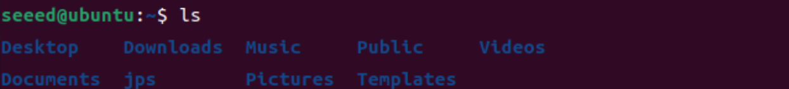
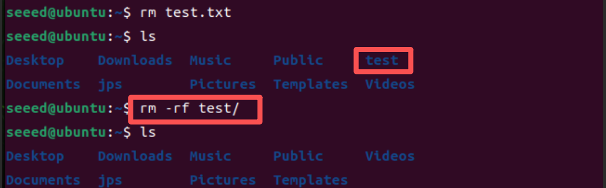
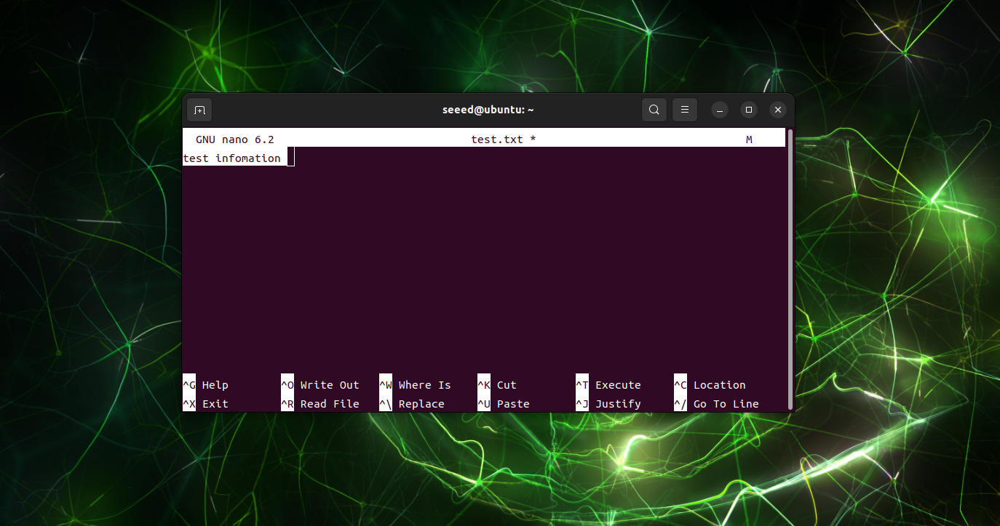

# Linux Terminal and Text Editors

[Back to Module 3](../README.MD) | [Back to Table of Contents](../../Table-of-Contents.md)

## Introduction

The Linux terminal is the fastest way to manage files, install packages, inspect the system, and run development tools on Jetson. This page combines the basic terminal workflow and editor usage that beginners need before moving on to CUDA, Docker, ROS, or AI frameworks.

You can open a terminal on the Jetson desktop with:

```bash
Ctrl + Alt + T
```

You can also open a shell remotely later through [SSH](../3.13-SSH-Remote-Access/README.md).

## Common Linux Commands

| Command | Description |
| --- | --- |
| `ls` | List files in the current directory |
| `pwd` | Print the current working directory |
| `cd <path>` | Enter a directory |
| `cd ..` | Go back to the parent directory |
| `mkdir test` | Create a directory |
| `mkdir -p test/src` | Create nested directories |
| `touch test.txt` | Create an empty file |
| `rm test.txt` | Remove a file |
| `rm -rf test/` | Remove a directory recursively |
| `clear` | Clear terminal output |

Example:

```bash
mkdir -p ~/demo/src
cd ~/demo
touch notes.txt
ls
pwd
```

> Note: `rm -rf` is destructive. Double-check the target path before pressing Enter.

## Useful Terminal Shortcuts

| Shortcut | Description |
| --- | --- |
| `Ctrl + C` | Stop the running command |
| `Ctrl + Z` | Suspend the current process |
| `Tab` | Auto-complete file or directory names |
| `Ctrl + Shift + C` | Copy selected terminal text |
| `Ctrl + Shift + V` | Paste into the terminal |

## Basic Text Editors

### Gedit

`gedit` is a simple graphical editor that is useful for quick text changes on the Jetson desktop.

```bash
gedit test.txt
```

### Nano

`nano` is a lightweight terminal editor and is easier for beginners than Vim.

```bash
sudo apt update
sudo apt install -y nano
nano test.txt
```

### Vim

`vim` is the classic terminal editor used widely on Linux servers and embedded devices.

```bash
vim test.txt
```

Basic Vim workflow:

1. Press `i` to enter insert mode.
2. Edit the file.
3. Press `Esc` to return to normal mode.
4. Type one of the following commands and press Enter:

| Command | Description |
| --- | --- |
| `:w` | Save |
| `:q` | Quit |
| `:wq` | Save and quit |
| `:q!` | Quit without saving |
| `:%d` | Delete all content |
| `/text` | Search for `text` |

Useful normal mode keys:

| Key | Description |
| --- | --- |
| `h` `j` `k` `l` | Move left, down, up, right |
| `dd` | Delete the current line |
| `x` | Delete one character |
| `yy` | Copy the current line |
| `p` | Paste |
| `n` | Jump to the next search result |

## Visual Walkthrough

The merged screenshots for this lesson are included below so the terminal and editor workflow is visible in the chapter itself instead of only existing in the `images/` folder.

<details>
<summary>Terminal and editor screenshots</summary>









</details>

## Suggested Next Steps

- Use [Network and Wi-Fi](../3.12-Network-and-Wi-Fi/README.md) to get Jetson online.
- Use [SSH Remote Access](../3.13-SSH-Remote-Access/README.md) for command-line remote development.
- Use [VS Code](../3.19-VS-Code/README.md) if you prefer a full IDE experience.

[Back to Module 3](../README.MD)
