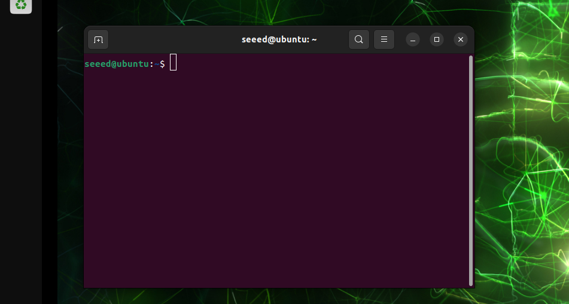
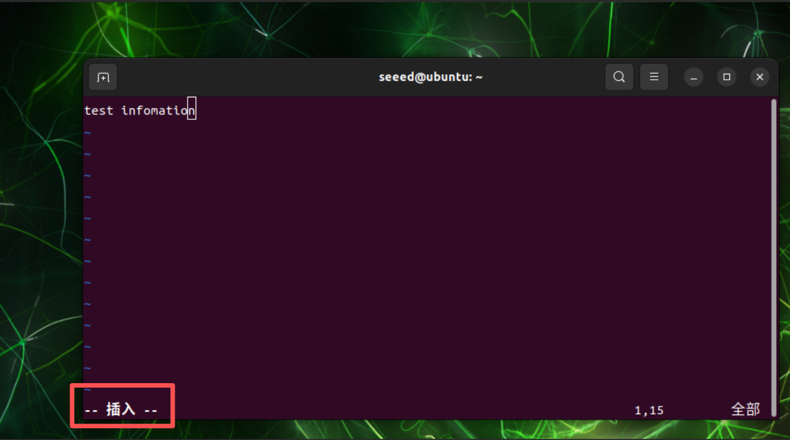
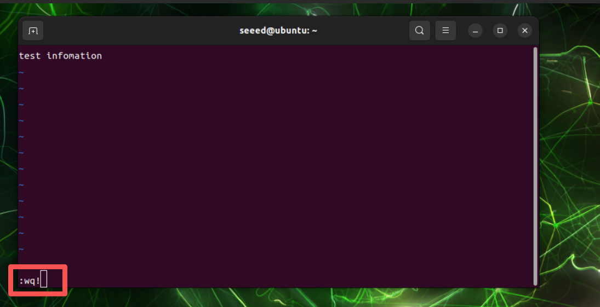
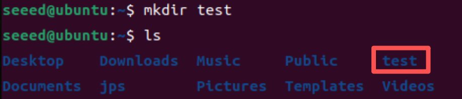
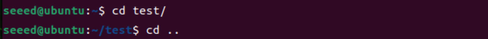
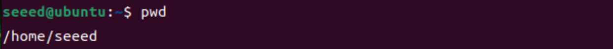
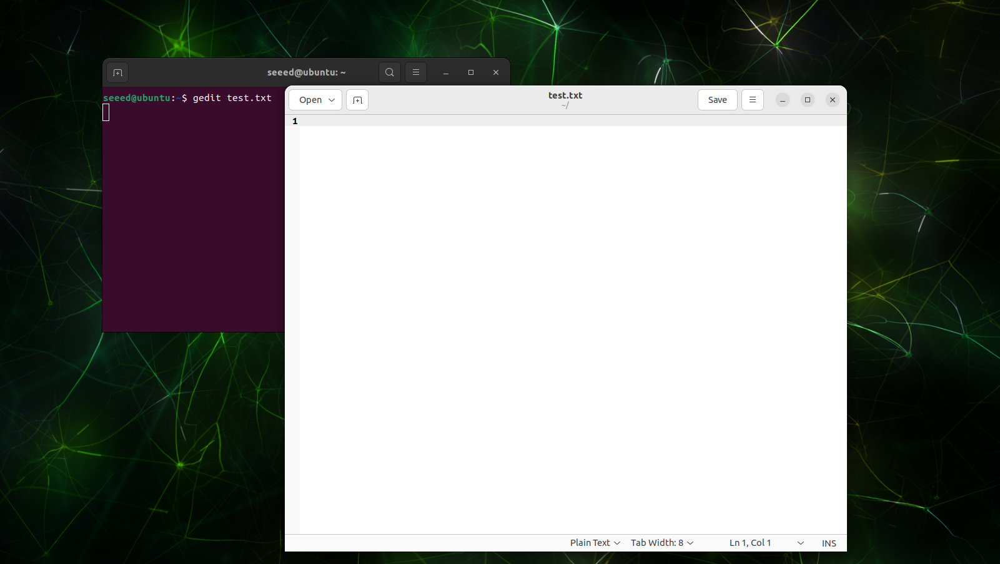

# Assets for Linux Terminal and Editors

These screenshots were extracted from the original xiaobai Chapter 3 Word documents so they can be browsed directly on GitHub.

[Back to Lesson](../README.md)

## 01 基础使用.docx

