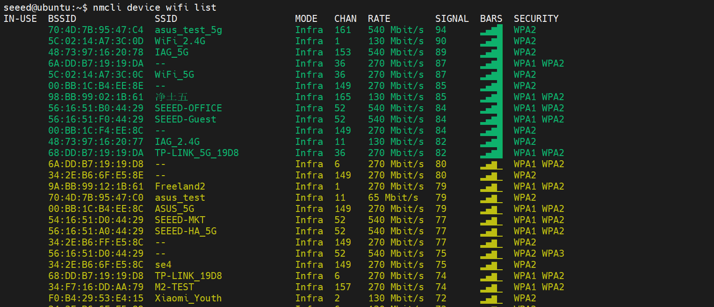
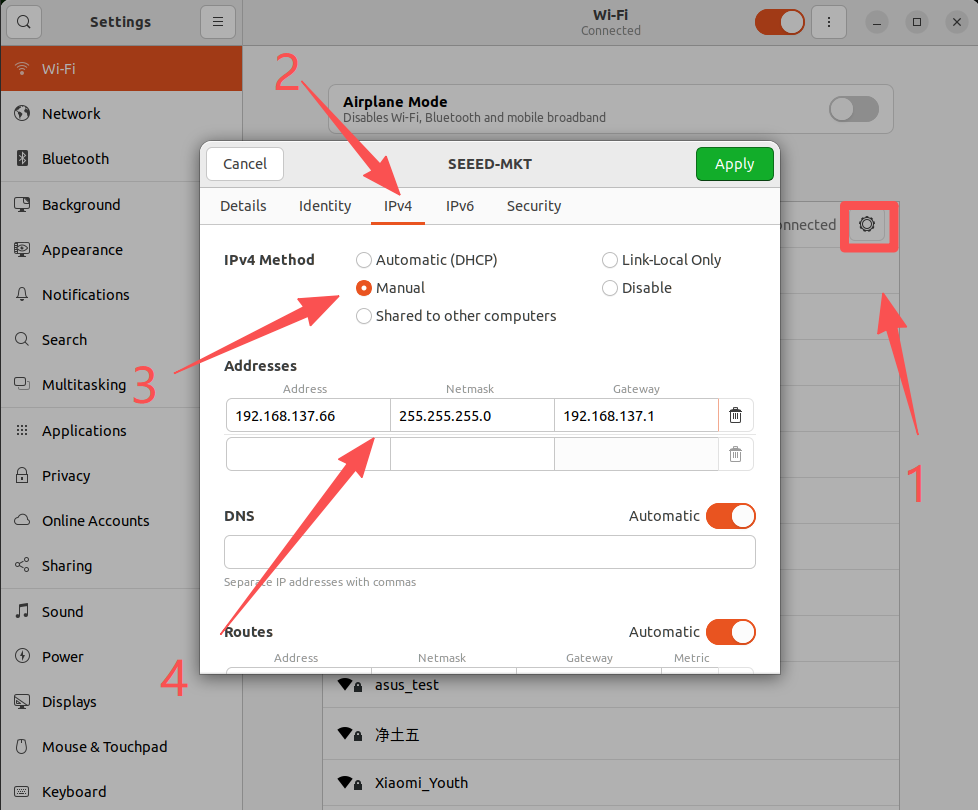
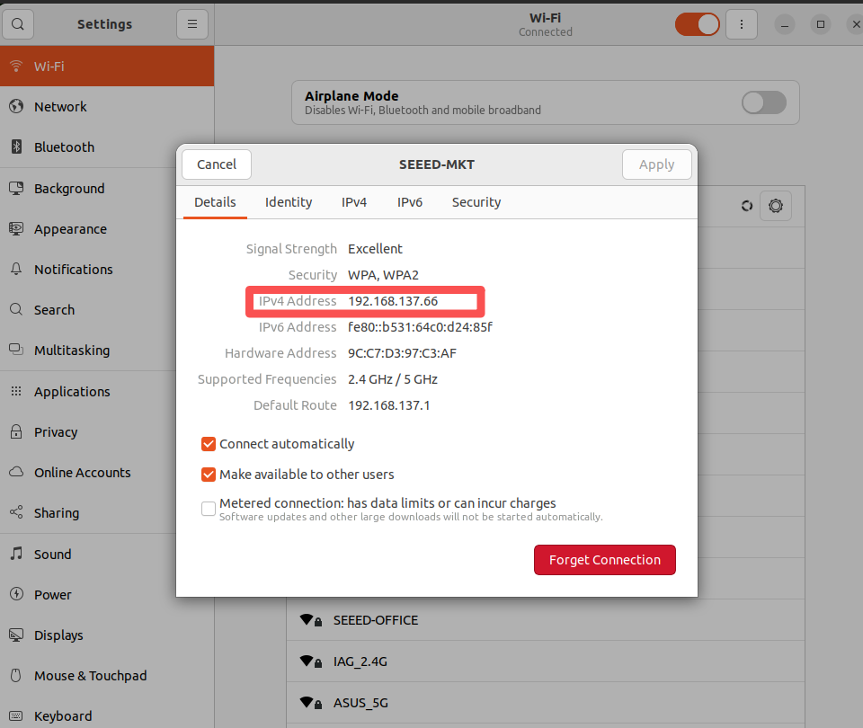
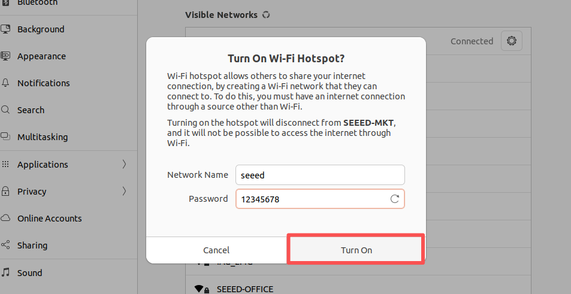

# Network and Wi-Fi on Jetson

[Back to Module 3](../README.MD) | [Back to Table of Contents](../../Table-of-Contents.md)

## Introduction

Before installing packages, using SSH, or opening web services such as JupyterLab, Jetson needs a working network connection. This page covers Wi-Fi, Ethernet, IP checking, and static IP basics.

## Connect to Wi-Fi from the Desktop

On Jetson desktop:

1. Open the status menu in the top-right corner.
2. Select the Wi-Fi icon.
3. Open Wi-Fi settings.
4. Choose your network and enter the password.

If the Wi-Fi signal is very weak, check that the external antenna is installed correctly.

## Connect to Wi-Fi from the Command Line

List visible Wi-Fi networks:

```bash
nmcli device wifi list
```

Connect to a Wi-Fi network:

```bash
nmcli device wifi connect "YOUR_WIFI_NAME" password "YOUR_PASSWORD"
```

## Check IP Addresses

You can inspect network interfaces with either of the following commands:

```bash
ip addr
```

```bash
ifconfig
```

Common interface names:

- `wlan*` or similar: Wi-Fi
- `eno1` or `eth0`: Ethernet
- `l4tbr0`: USB device mode bridge on Jetson

## Set a Static IP

For a desktop-managed Wi-Fi connection:

1. Open Wi-Fi settings.
2. Open the details page for the connected network.
3. Change the IPv4 method to manual.
4. Fill in:
   - Address: an available IP in your LAN
   - Netmask: usually `255.255.255.0`
   - Gateway: your router address
5. Reconnect to the network.

## Hotspot Mode

Jetson can also create a hotspot for debugging or local control, but the Wi-Fi adapter must support AP mode. On most desktop images this can be configured from the network settings page.

## Ethernet Connection

If Wi-Fi is unavailable, connect Jetson directly to a router or PC with an Ethernet cable. After the cable is connected, re-run `ip addr` or `ifconfig` to find the address assigned to the wired interface.

## Visual Walkthrough

This chapter's screenshots are now embedded here so the desktop Wi-Fi flow, hotspot setup, and IP lookup are part of the merged lesson content.

<details>
<summary>Wi-Fi configuration and network screenshots</summary>








</details>

## Suggested Next Steps

- Use [SSH Remote Access](../3.13-SSH-Remote-Access/README.md) once the device has an IP address.
- Use [VNC Remote Desktop](../3.14-VNC-Remote-Desktop/README.md) or [NoMachine](../3.10-Nomachine/README.md) for remote GUI access.

[Back to Module 3](../README.MD)
