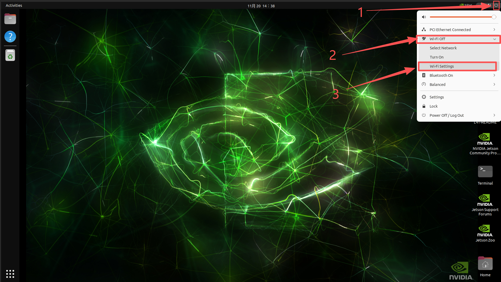
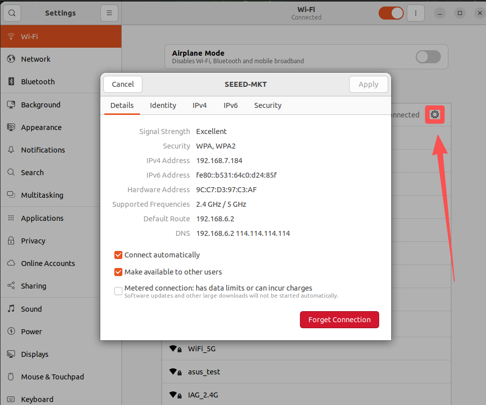
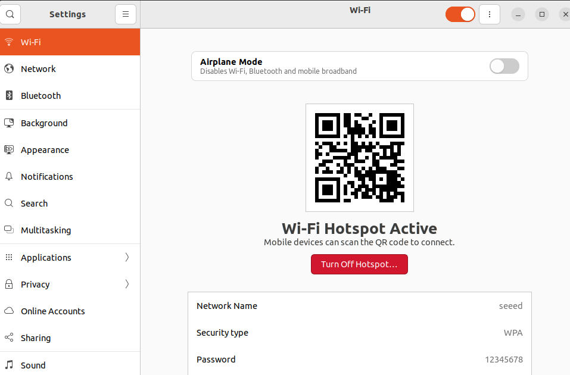
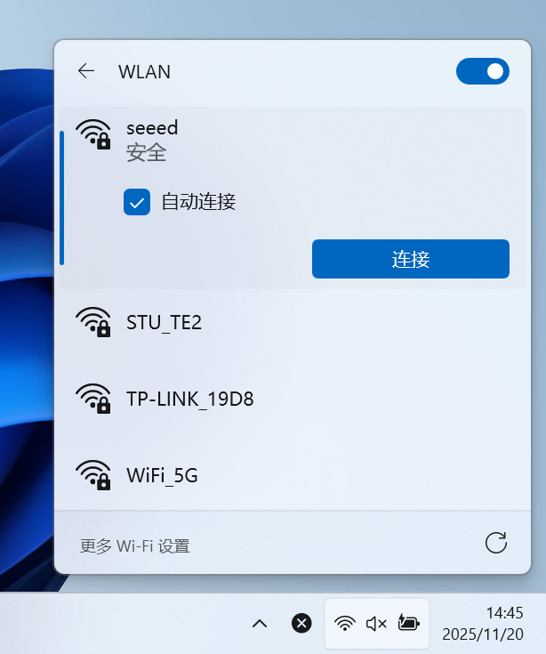

# Network and Wi-Fi on Jetson

[Back to Module 3](../README.MD) | [Back to Table of Contents](../../Table-of-Contents.md)

## 02网络知识（WIFI配置）

### 简介

本篇将介绍如何让Jetson连接上网络以及常规的网络配置。

### Wifi配置

### 连接Wifi

#### 方式1：GUI连接

进入Jeton系统桌面，点击右上角的电源图标—>Wifi图标—>Wi-Fi Setting。



选择想连接的WiFi，如果扫描到的Wifi信号都很差，请检查无线网卡是否安装了天线或天线安装是否正常。


点击已经连接的WiFi设置图标可以查看WiFi的信息。



查看所有网络连接的IP地址，打开终端输入以下命令：

```bash
ifconfig
```


如上图eno1是有线网的接口的IP地址，l4tbr0为Jetson为Type接口分配的IP地址，wlP1p1s0为WiFi接口的IP地址

#### 方式2：命令行连接

打开终端输入下面的命令查询当前环境中的wifi信号：

```bash
nmcli device wifi list
```


使用下面的命令连接WiFi

```bash
nmcli device wifi connect "WiFi名" password "密码"
```

### 设置静态IP

打开Wi-Fi的设置选项


```
Address:填写需要固定的IP地址，需要可分配的IP地址范围
Netmask:填写255.255.255.0 Gateway:填写WiFi默认网关地址
```

重新连接WiFi即可生效。


### Wifi热点

在开发的时候，有时候需要连接Jetson的热点，来控制和调试程序。下面将介绍如何开启热点。

```
请注意，需要无线网卡支持 AP 工作模式！
```

打开Wifi热点


配置热点然后打开




在Window PC上可以正常检测到Jetson打开的热点连接



### 有线网连接

直接将网线连接到Jetson的网口即可


[Back to Module 3](../README.MD)
