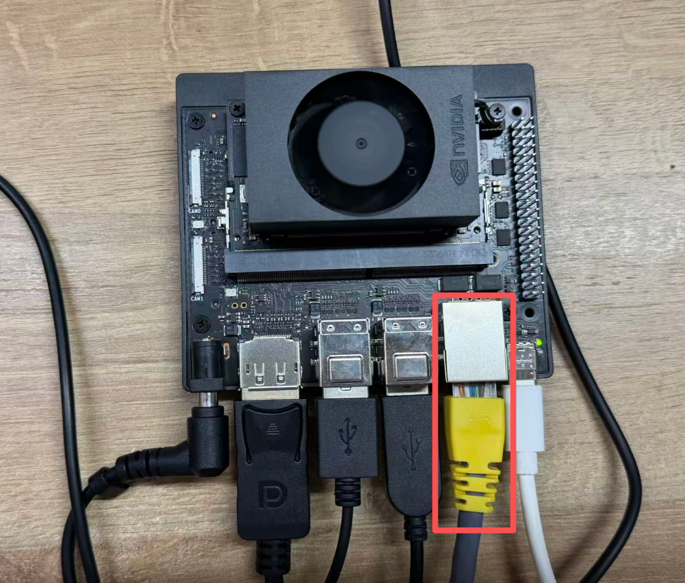
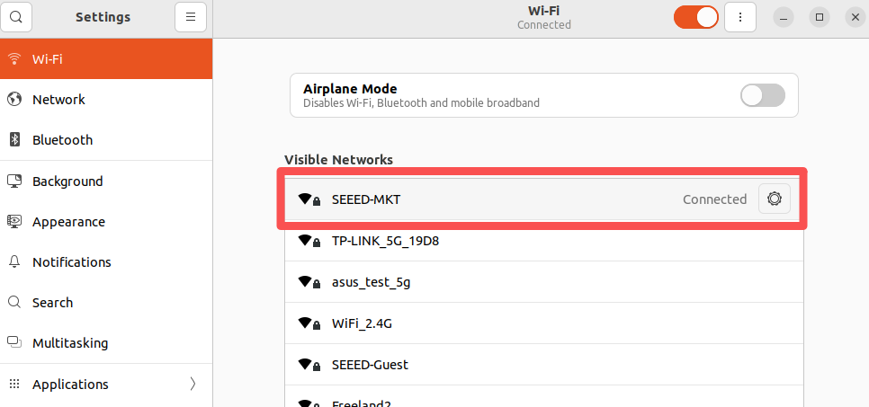
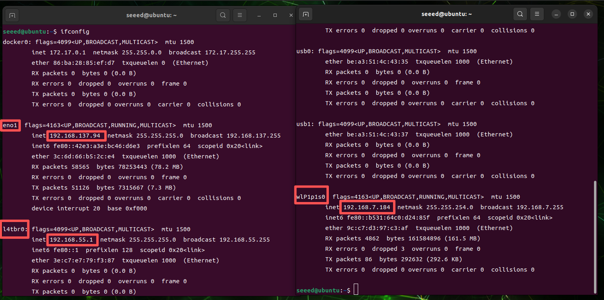
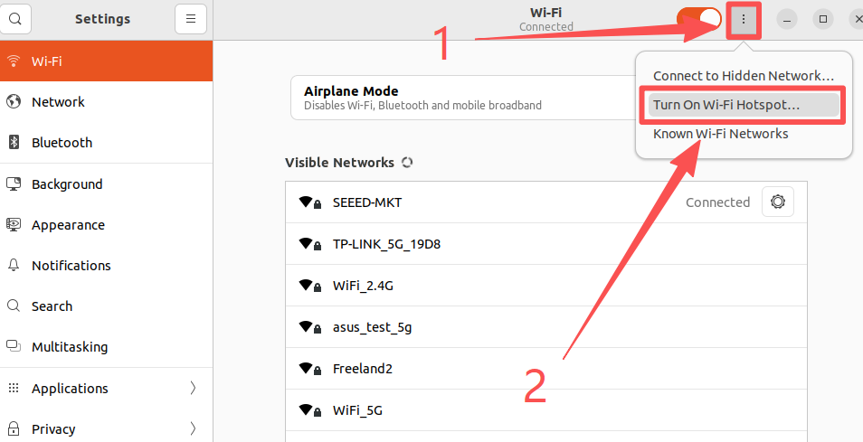

# Assets for Network and Wi Fi

These screenshots were extracted from the original xiaobai Chapter 3 Word documents so they can be browsed directly on GitHub.

[Back to Lesson](../README.md)

## 02 网络知识（WIFI 配置）.docx

