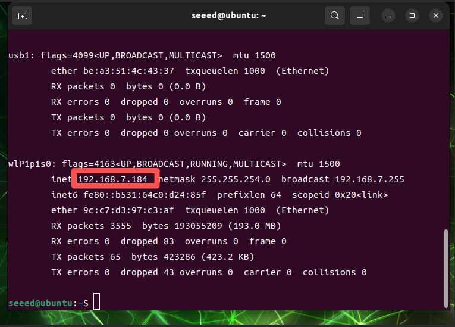
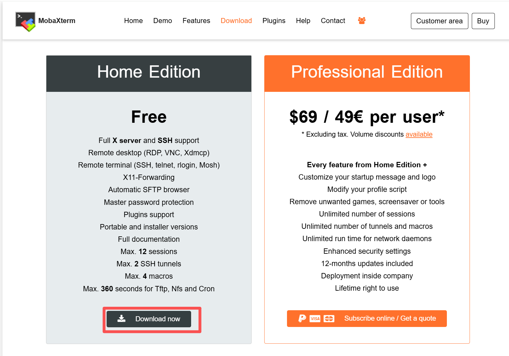
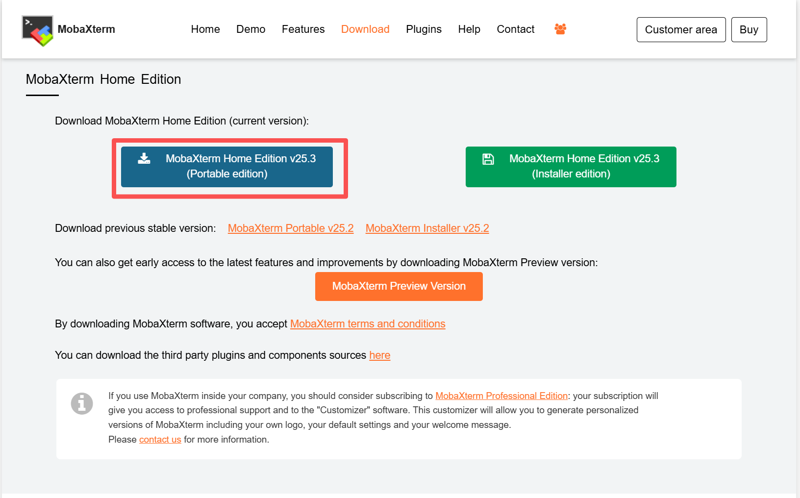
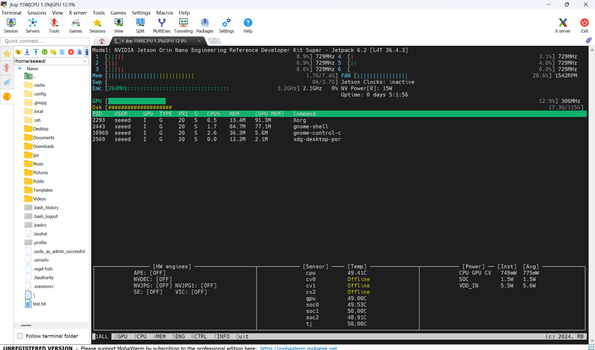
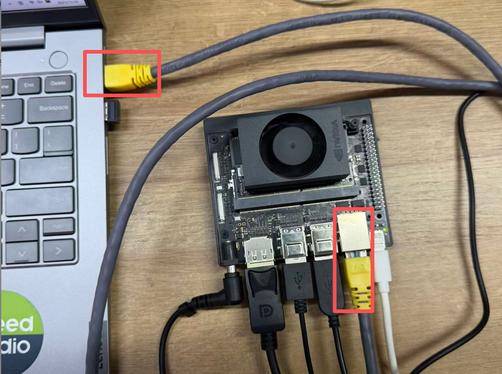
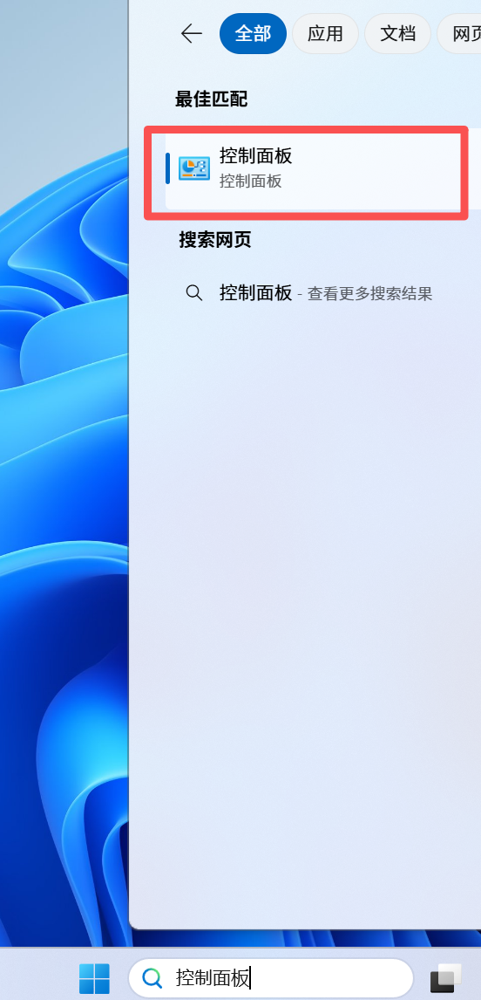
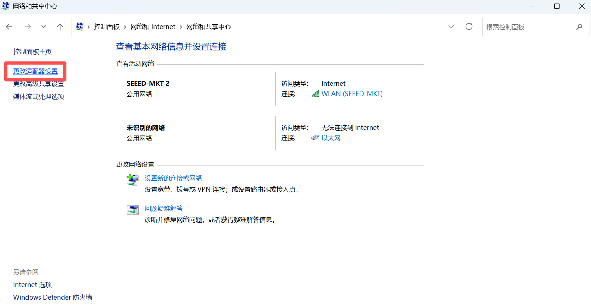
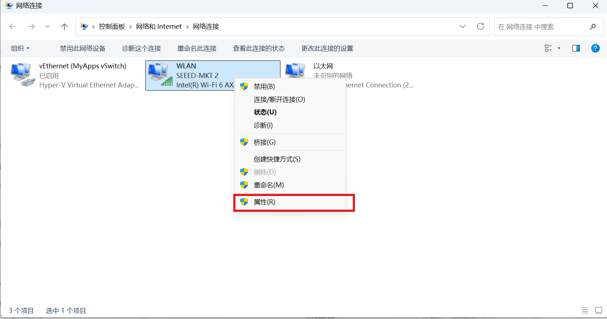
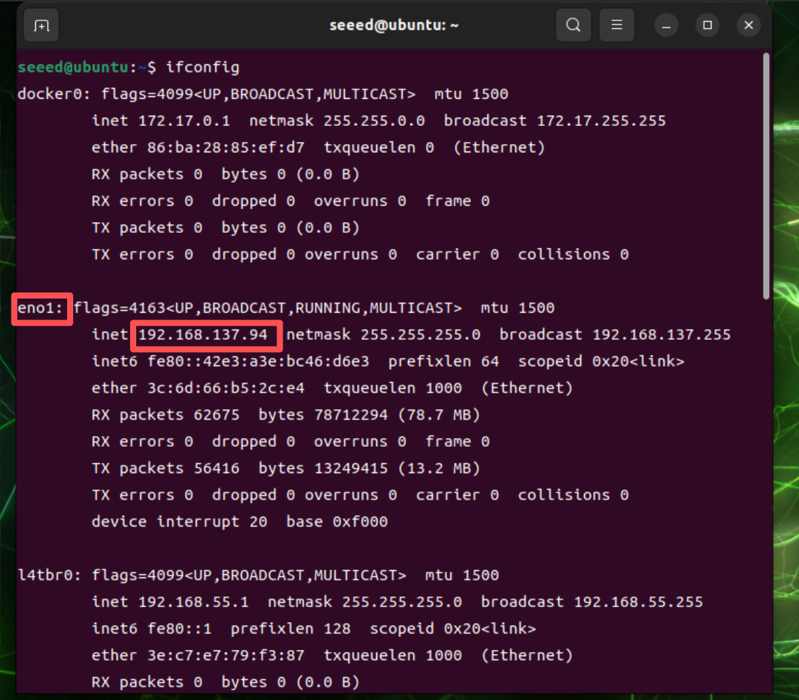
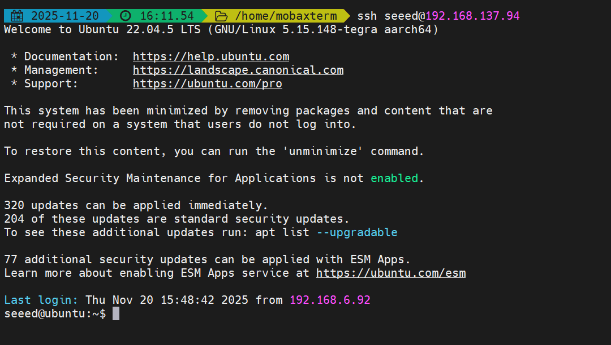

# SSH Remote Access

[Back to Module 3](../README.MD) | [Back to Table of Contents](../../Table-of-Contents.md)

## 03 SSH远程登陆

### 介绍

SSH（Secure Shell）是一种安全的远程连接协议，允许你通过网络登录到另一台电脑、执行命令、传输文件。使用SSH的原因是它加密通信、安全可靠，可以在不接触物理设备的情况下远程管理服务器或嵌入式设备（如Jetson、树莓派）。

### SSH连接的三种方式

### WiFi连接

```
使用ssh远程连接需要两台设备在同一个局域网下，所以，请确保你的PC和Jetson连接的是同一个WiFi！
```

在jetson的终端窗口中输入下面的命令查看Jetson WiFi接口的IP地址，

```bash
ifconfig
```



拿到Jetson设备的IP地址后，我们可以通过局域网中的其他设备远程访问Jetson设备。

PC端SSH连接Jetson的方式有多种，这里演示使用MobaXterm软件。

首先我们需要下载并安装MobaXterm。

https://mobaxterm.mobatek.net/download.html





下载完成后解压，然后双击可执行文件即可启动MobaXterm。


在MobaXterm中打开一个操作终端。


在终端中执行远程连接登陆命令。

```bash
# @符号前面为Jetson的用户名，@后面为Jetson的IP地址
ssh seeed@192.168.7.184
```


回车后首次登录需要输入密码，即可登录Jetson设备。


输入jtop，查看Jetson资源占用情况。

```
如果您的终端打印没有 jtop 命令，则证明你的 jetson 中没有运行 jtop 服务，可以参考 06 jtop 工具手动安装 jtop。
```



### 网线连接

PC连接WiFi，通过网口共享网络给Jeton，这样也可实现在Jetson连接不了WiFi的情况下ssh远程连接Jetson

准备一根网线将PC和Jetson按下图所示连接



PC打开控制面板



选择网络和Internet—>网络和共享中心—>更改设配器设置



点击WLAN右键选择属性——>点击共享——>允许其他网络用户通过此计算机的Internet连接来连接——>选择以太网——>确定




打开Jetson即可看到连接到有线网络了


查看有线网络IP

```bash
ifconfig
```



现在同样使用MobaXterm来连接Jetson

```bash
# 输入有线网卡的IP地址
ssh seeed@192.168.137.94
```



[Back to Module 3](../README.MD)
