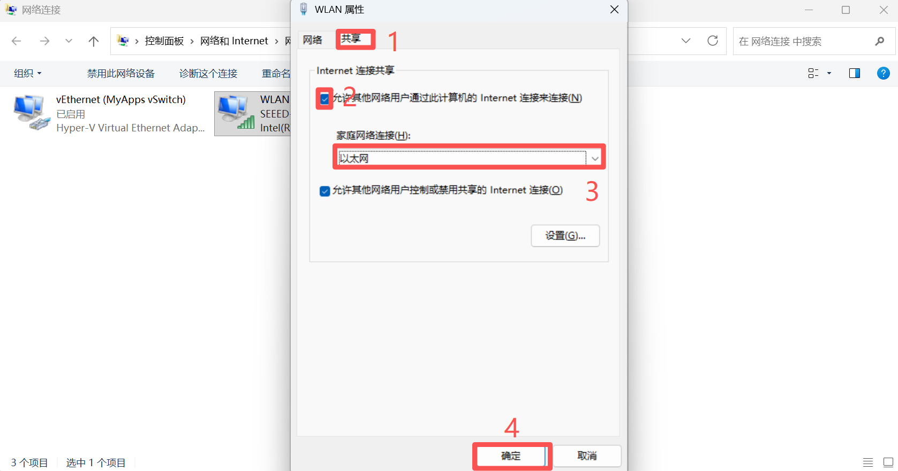
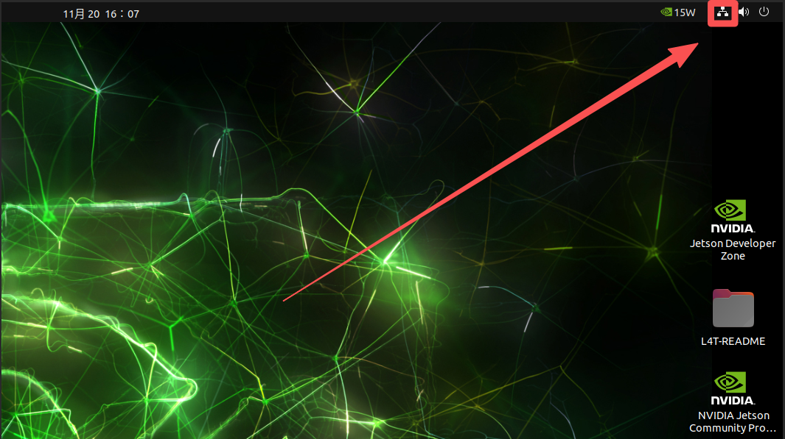
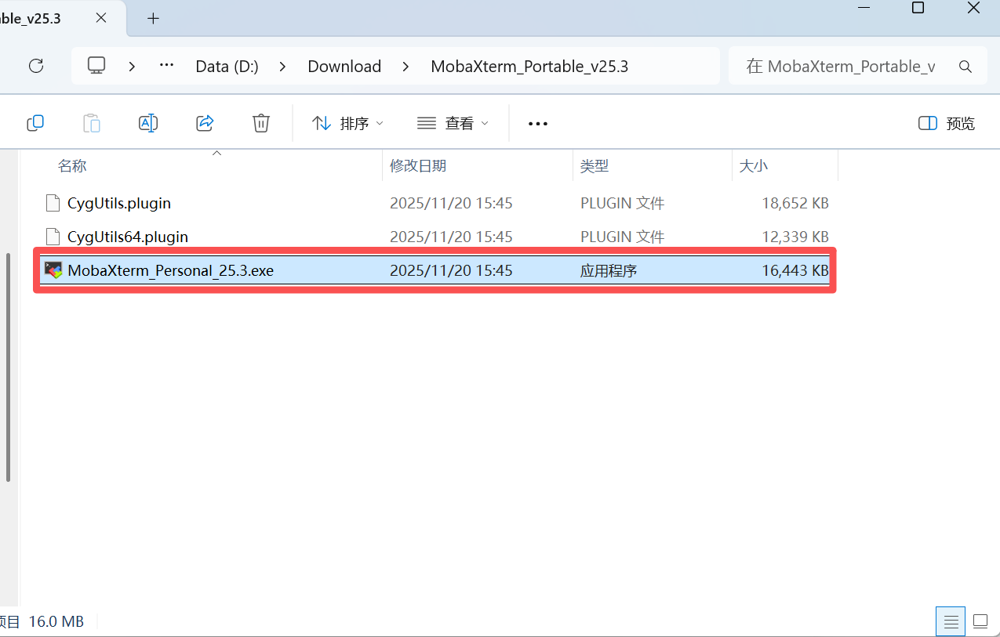
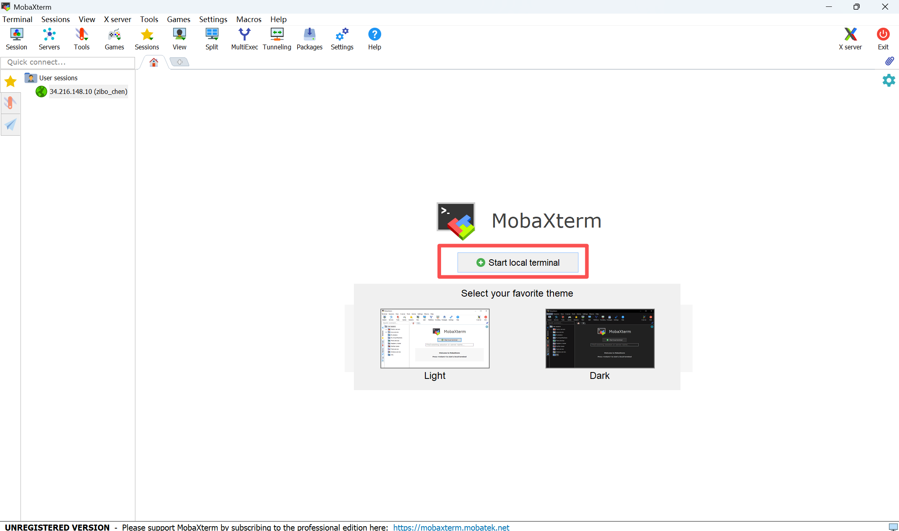
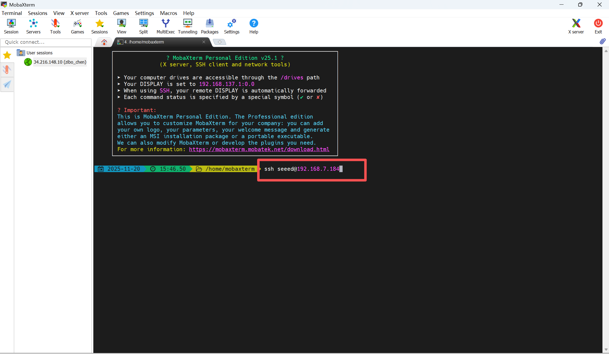
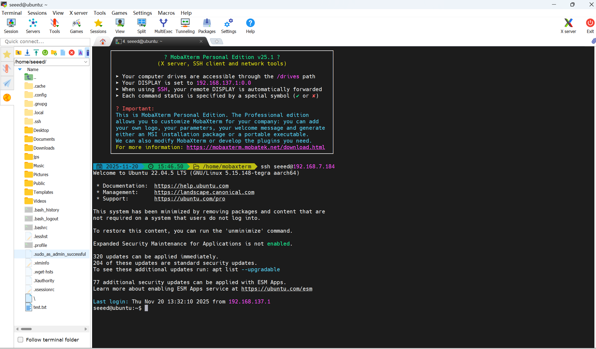

# Assets for SSH Remote Access

These screenshots were extracted from the original xiaobai Chapter 3 Word documents so they can be browsed directly on GitHub.

[Back to Lesson](../README.md)

## 03 SSH 远程登陆.docx

