# VNC Remote Desktop

[Back to Module 3](../README.MD) | [Back to Table of Contents](../../Table-of-Contents.md)

## Introduction

VNC (Virtual Network Computing) lets you control the Jetson desktop remotely from another computer. It is useful when you need a graphical session for browser setup, IDE usage, or desktop debugging.

> Note: VNC is best suited to desktop sessions where Jetson is already logged in. For headless remote desktop scenarios, [NoMachine](../3.10-Nomachine/README.md) is often easier to keep stable.

## Enable Desktop Sharing on Jetson

On the Jetson desktop:

1. Open `Settings`.
2. Open `Sharing`.
3. Enable desktop sharing or remote desktop.
4. Enable remote login if the image provides that option.
5. Set a username and password for remote access.

After changing networks, re-check that sharing is still enabled.

## Install a VNC Client on Your PC

Common clients include:

- RealVNC Viewer
- TigerVNC Viewer

After installation:

1. Enter the Jetson IP address.
2. Confirm the connection.
3. Enter the VNC password.

## Lock-Screen and Headless Notes

On some Jetson desktop images, remote control stops working after the screen locks. In that case:

- disable automatic screen lock for development sessions, or
- use a GNOME extension that allows locked remote desktop sessions, or
- switch to [NoMachine](../3.10-Nomachine/README.md) for headless access

If you use the GNOME extension workflow, the common steps are:

```bash
sudo apt update
sudo apt install -y gnome-shell-extension-manager firefox
gnome-shell --version
```

Then download a version-compatible extension such as `Allow Locked Remote Desktop`, install it, reboot, and enable it from Extension Manager.

## Troubleshooting

- If the connection is black or very slow, lower the image quality in the VNC client.
- If you cannot connect after Wi-Fi changes, verify the current Jetson IP address again.
- If Jetson is fully headless and VNC is unreliable, use [NoMachine](../3.10-Nomachine/README.md).

## Visual Walkthrough

The VNC screenshots extracted during the merge are embedded here so the setup flow can be followed directly from the lesson page.

<details>
<summary>VNC desktop setup screenshots</summary>

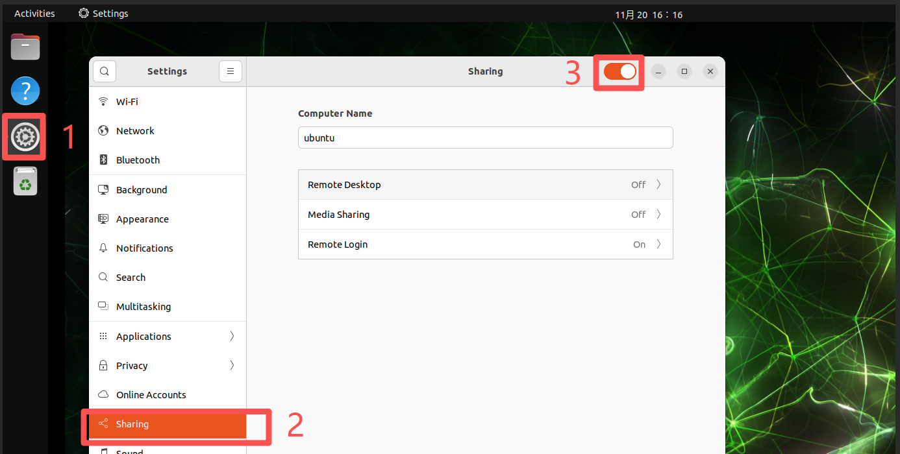

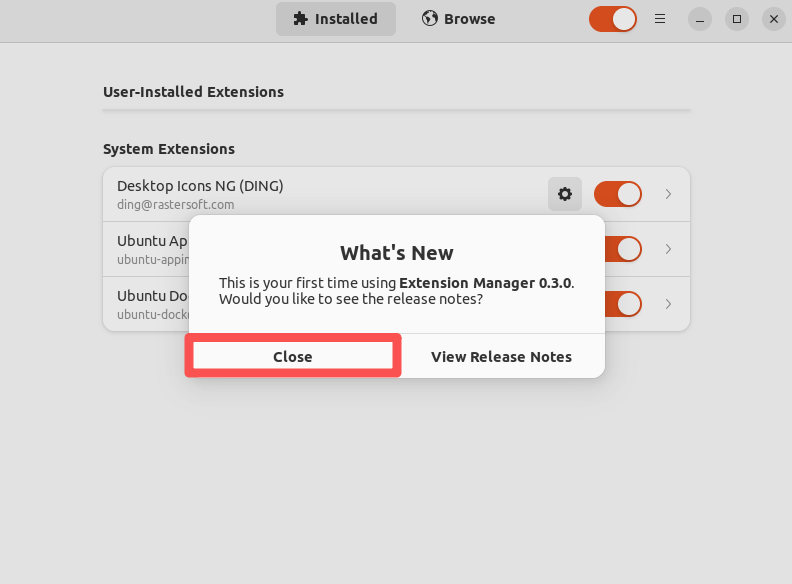

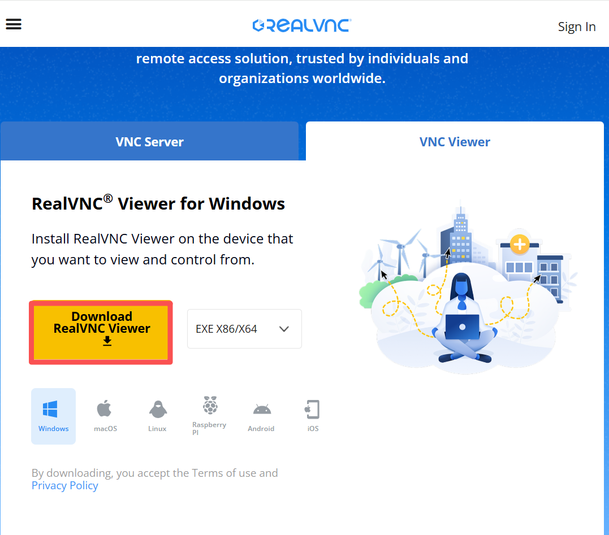
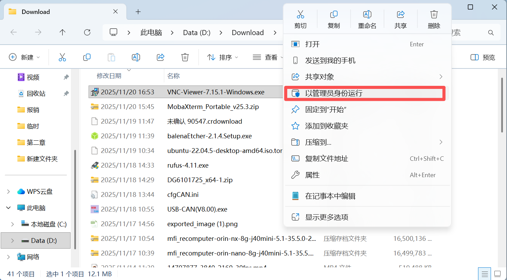
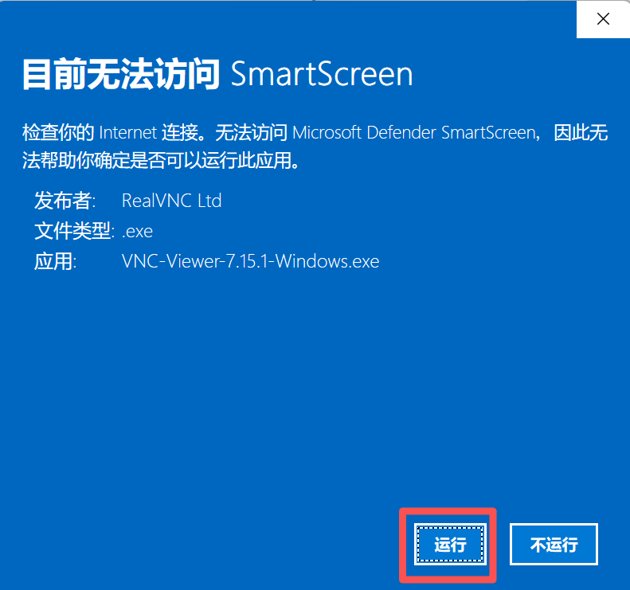


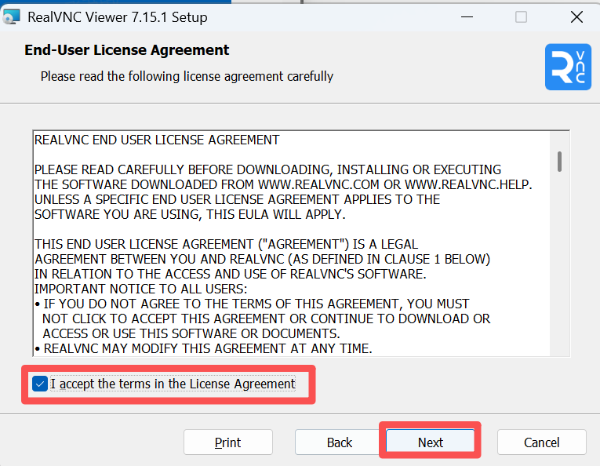
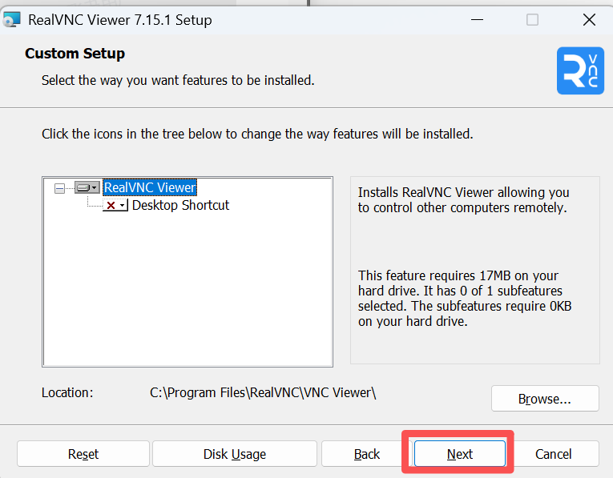

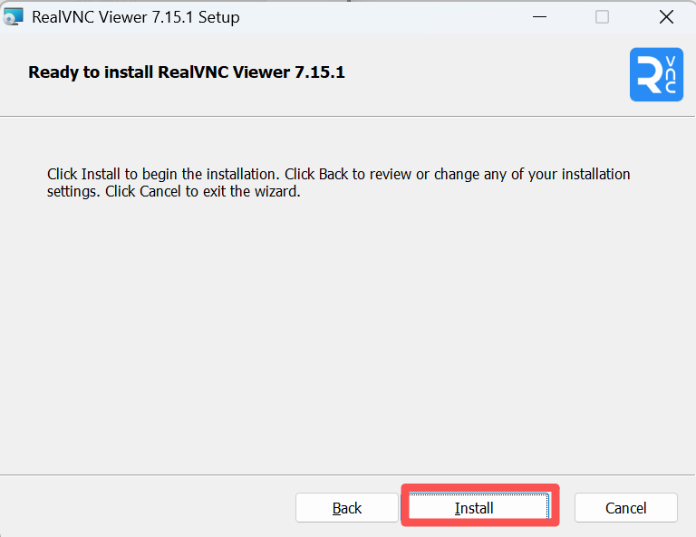


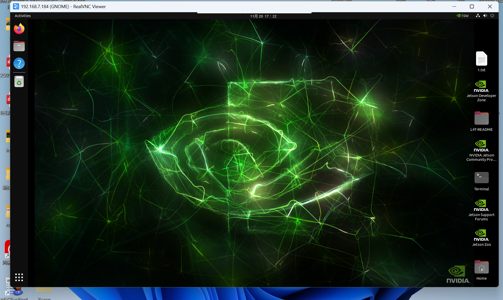

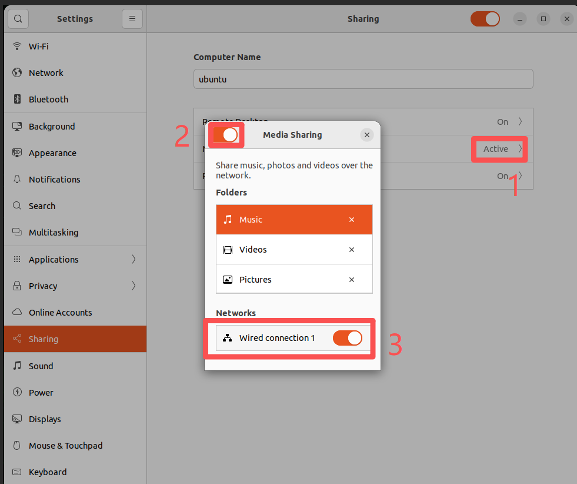
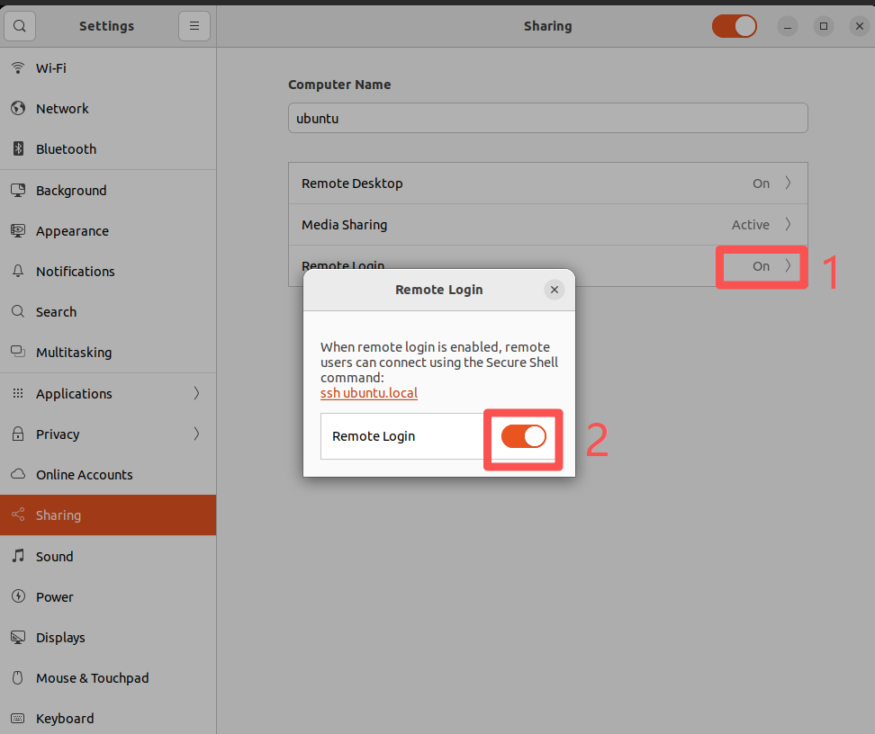


</details>

[Back to Module 3](../README.MD)
