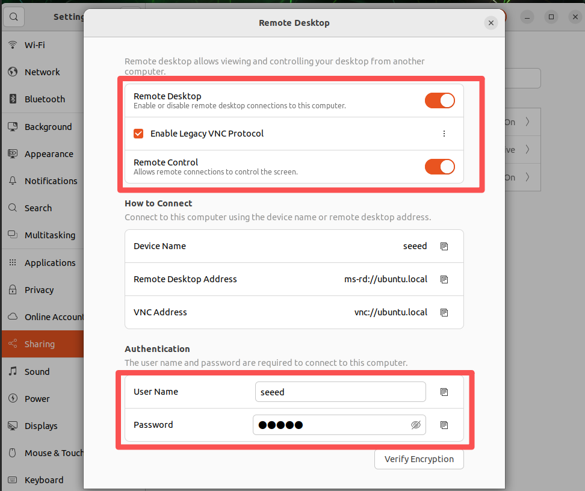
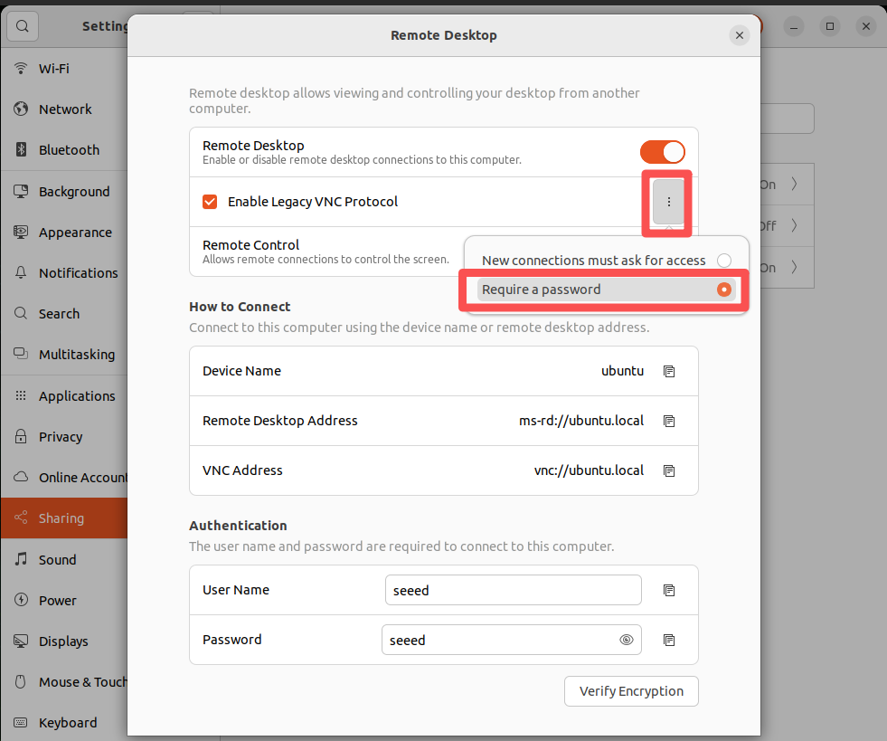
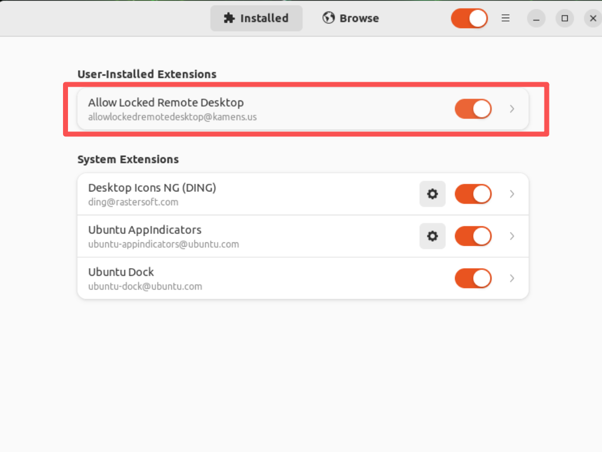
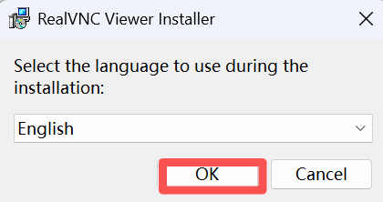
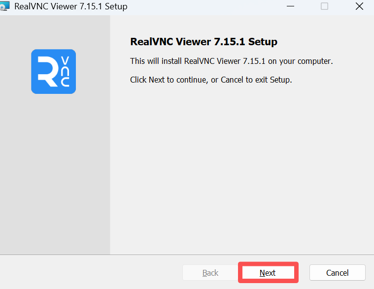
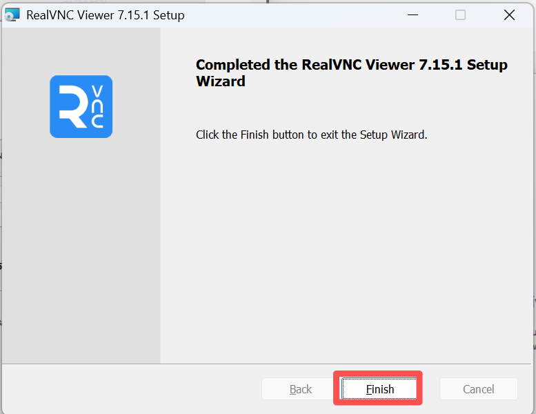
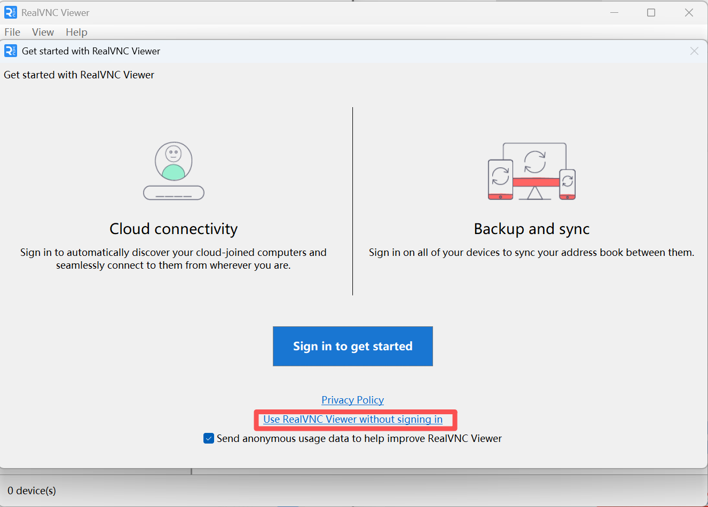
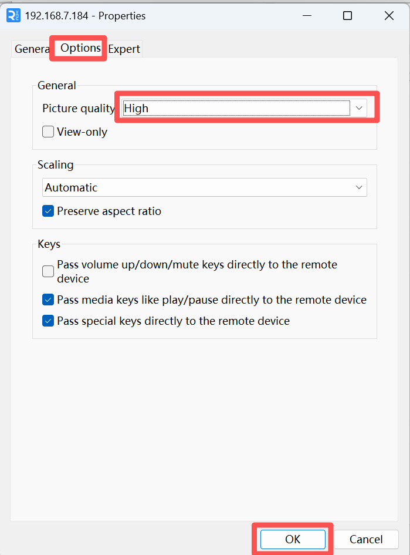

# VNC Remote Desktop

[Back to Module 3](../README.MD) | [Back to Table of Contents](../../Table-of-Contents.md)

## 04 VNC远程控制

### 介绍

VNC（Virtual Network Computing）是一种远程桌面协议，可以让你在自己的电脑上看到另一台设备的图形界面，并像本地一样操作鼠标和键盘。通过VNC，你可以远程打开软件、查看桌面、管理系统，特别适合在没有显示器的服务器、嵌入式设备（如Jetson）或远程电脑上进行图形化操作。

### 配置VNC

### Jetson端

进入Jetson开启桌面远程共享，设置——>Sharing


将远程桌面打开，启用传统VNC协议，设置用户名和密码(建议和系统保持一致)





每次切换网络都要检查Media Sharing是否打开


开启远程登录


开机自启动VNC服务

Jetson主板锁屏后无法进行VNC远程，需要以下额外配置

```bash
# 安装桌面拓展管理
sudo apt install gnome-shell-extension-manager -y
# 获取gnome-shell版本号
gnome-shell --version
```


根据版本号下载允许锁屏下远程的插件：

在Jetson浏览器中打开:

https://extensions.gnome.org/extension/4338/allow-locked-remote-desktop/

如果没有安装浏览器，可以安装火狐浏览器

```bash
# 下载火狐浏览器
sudo apt install firefox
# 版本修复浏览器
cd ~/Downloads/
snap download snapd --revision=24724
sudo snap ack snapd_24724.assert
sudo snap install snapd_24724.snap
sudo snap refresh --hold snapd
```


在浏览器打开上面的链接，选择对应的版本号自动下载


进入插件下载目录安装插件

```bash
gnome-extensions install allowlockedremotedesktopkamens.us.v9.shell-extension.zip
sudo gnome-extensions enable allowlockedremotedesktop@kamens.us
```


重启系统

```bash
sudo reboot
```

重启进入桌面，按win键，搜索Extension Manager。开启对应功能。


打开允许锁屏进行远程桌面控制



### PC端

下载VNC Viewer


以管理员身份允许安装程序









打开VNC Viewer软件



输入Jetson IP地址回车


输入Jetson密码


第一次打开可能会黑屏


设置一下远程桌面的画质即可




至此可以正常远程连接Jetson的图形化界面了


[Back to Module 3](../README.MD)
