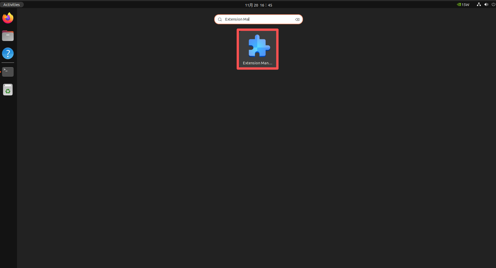
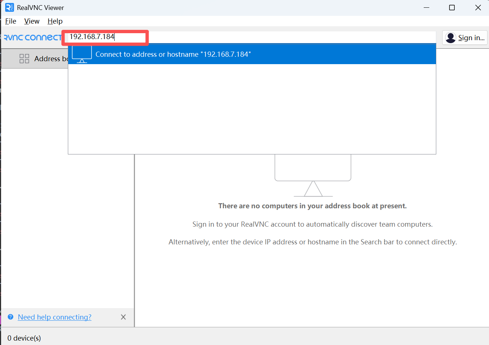
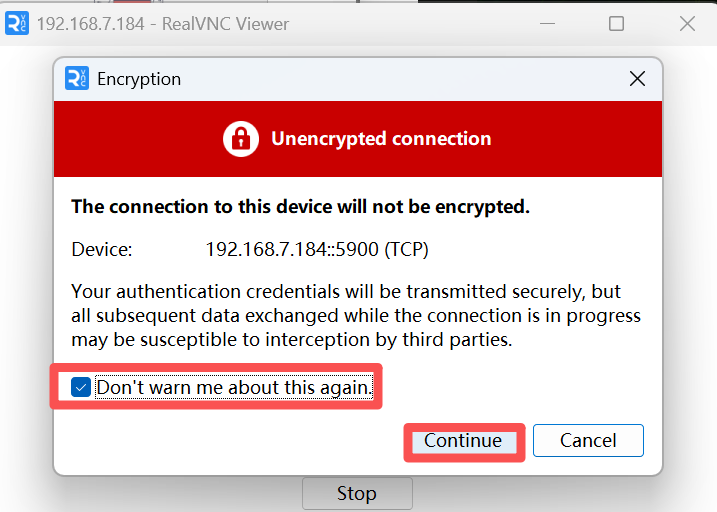
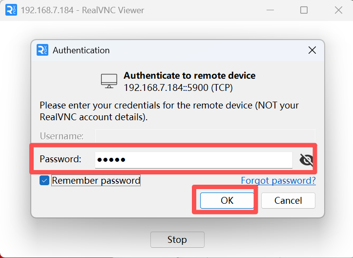
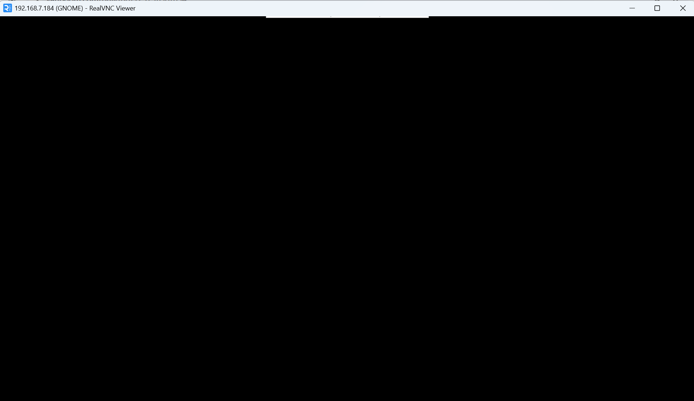
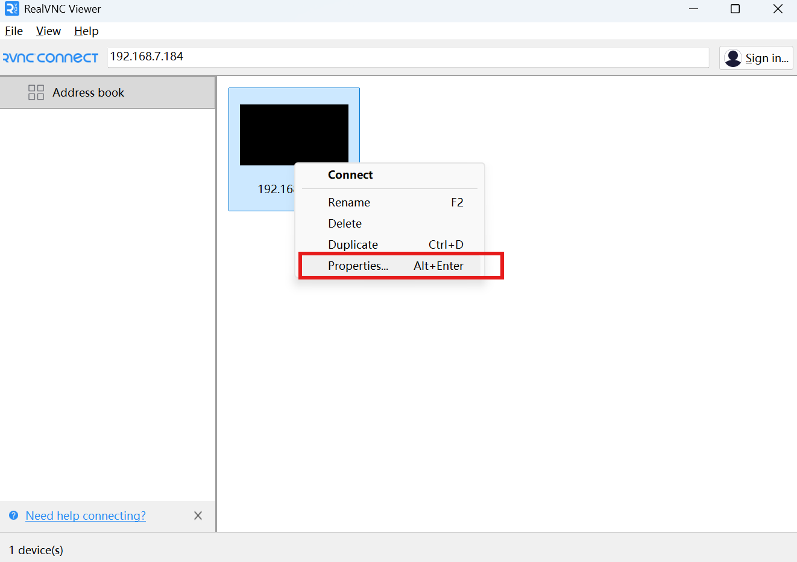
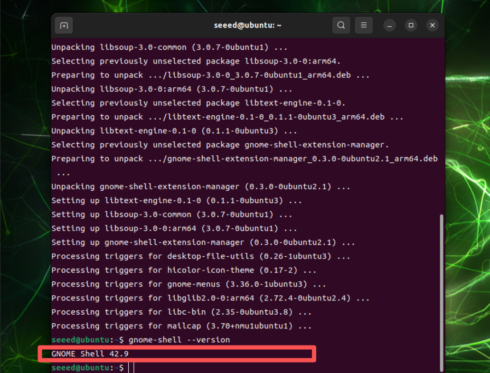
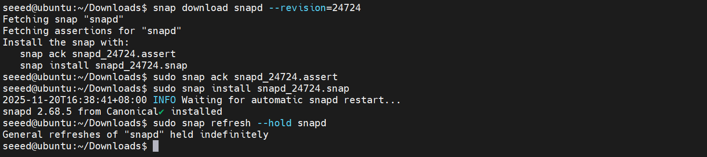
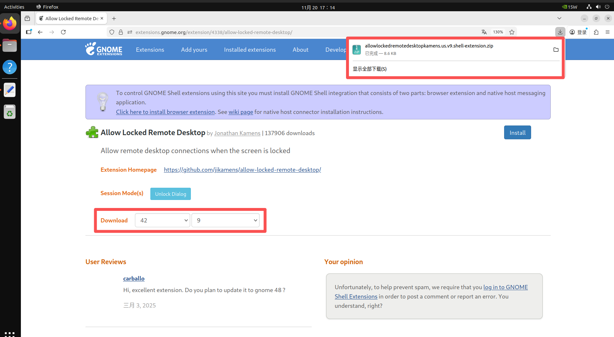
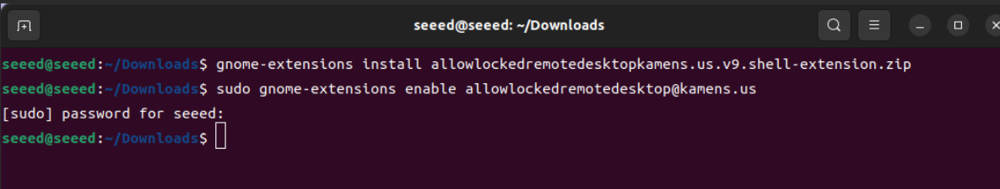

# Assets for VNC Remote Desktop

These screenshots were extracted from the original xiaobai Chapter 3 Word documents so they can be browsed directly on GitHub.

[Back to Lesson](../README.md)

## 04 VNC 远程控制.docx

