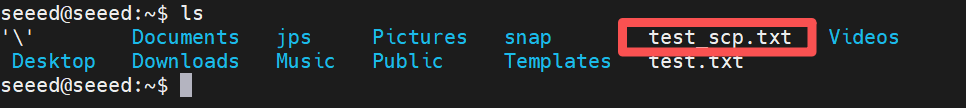
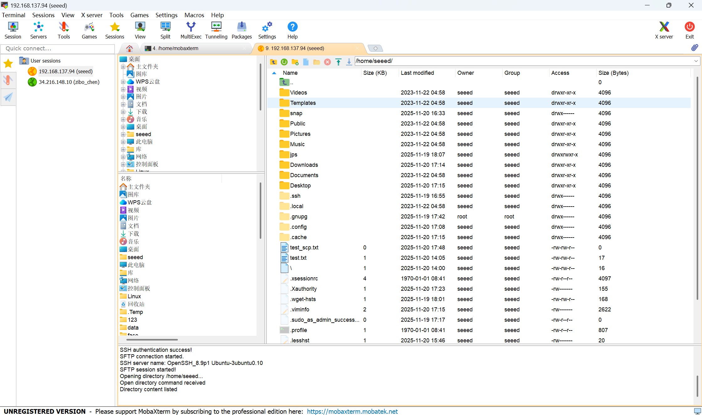

# Remote File Transfer

[Back to Module 3](../README.MD) | [Back to Table of Contents](../../Table-of-Contents.md)

## Introduction

During development you will often move scripts, datasets, models, and logs between your PC and Jetson. The simplest secure approach is to transfer files over SSH.

## Transfer Files with `scp`

Upload a file from your PC to Jetson:

```bash
scp test_scp.txt seeed@192.168.1.50:/home/seeed/
```

Download a file from Jetson to your PC:

```bash
scp seeed@192.168.1.50:/home/seeed/output.log ./
```

Upload a folder recursively:

```bash
scp -r ./dataset seeed@192.168.1.50:/home/seeed/
```

## Transfer Files with `rsync`

`rsync` is more suitable for large folders or repeated synchronization:

```bash
rsync -avP ./dataset/ seeed@192.168.1.50:/home/seeed/dataset/
```

## Transfer Files with Graphical Tools

If you prefer a GUI, any SFTP-capable tool will work once SSH is enabled:

- MobaXterm
- FileZilla
- VS Code Remote - SSH

For example, in MobaXterm you can create an `SFTP` session and provide:

- Jetson IP
- Jetson username
- Jetson password

## Troubleshooting

- If authentication fails, confirm the Jetson username and password.
- If file transfer is slow, prefer Ethernet over Wi-Fi.
- If `scp` cannot connect, verify SSH setup in [SSH Remote Access](../3.13-SSH-Remote-Access/README.md).

## Visual Walkthrough

The following screenshots are now linked directly in the lesson to show both the terminal-based transfer path and the GUI-based SFTP workflow.

<details>
<summary>Remote file transfer screenshots</summary>






</details>

[Back to Module 3](../README.MD)
