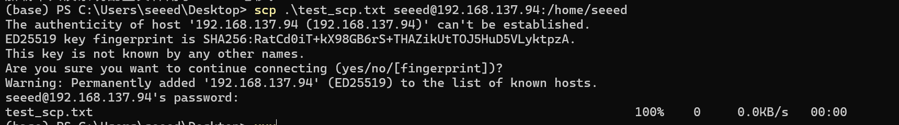
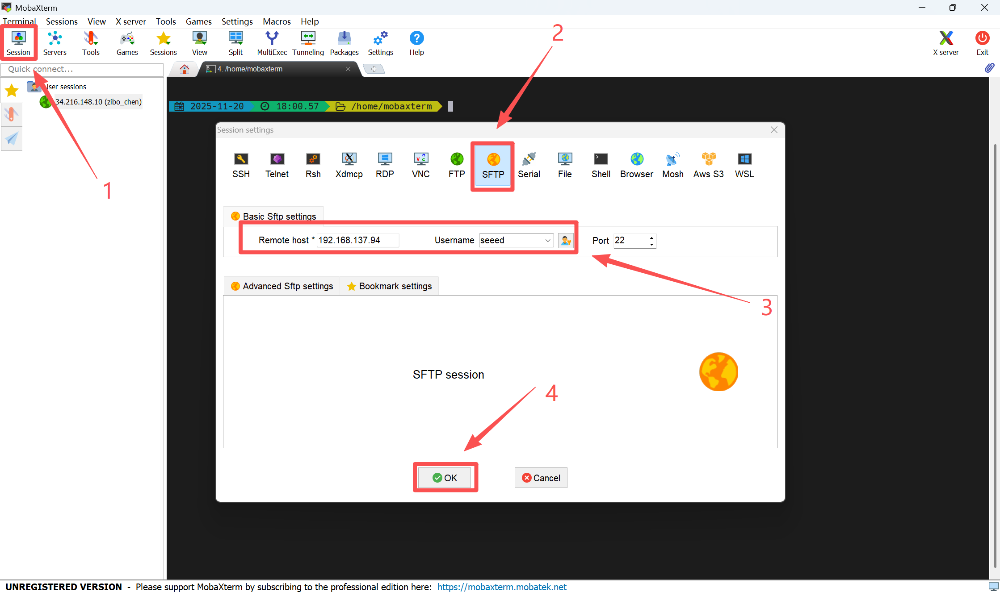

# Remote File Transfer

[Back to Module 3](../README.MD) | [Back to Table of Contents](../../Table-of-Contents.md)

## 05文件远程传输

### 介绍

在开发的过程中经常需要在PC与Jetson之间传输数据，所以本篇将介绍如何在PC与Jetson之间进行文件传输。

### scp方法

SCP（Secure Copy）是一种基于SSH的安全文件传输命令，可用于在本机与远程服务器之间快速、加密地复制文件或文件夹。它操作简单，只需一条命令即可把文件上传到远程设备或从远程设备下载到本地，非常适合在不同设备之间进行安全的数据传输。

#### 传输文件

将PC中的文件传输到Jetson。

在Linux PC的终端窗口中运行下面的命令即可将当前目录下的`test_scp.txt`文件复制到局域网中jetson设备的`/home/seeed`目录中。

```bash
scp test_scp.txt seeed@192.168.137.94:/home/seeed
```

输入Jetson密码



此时，可以看到在Jetson的/home/seeed/目录下多了一个test_scp.txt文件


### 使用MobaXterm

使用03 SSH远程登陆章节介绍的MobaXterm进行文件传输

新建一个Seesion—>SFTP—>输入Jetson IP和用户名—>OK



连接成功后就能传输文件了。


[Back to Module 3](../README.MD)
