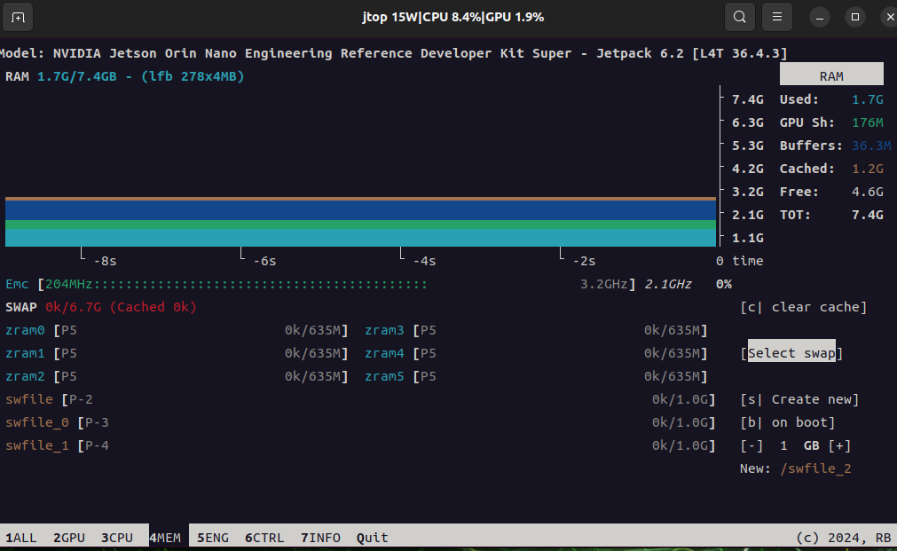

# Jtop and System Monitoring

[Back to Module 3](../README.MD) | [Back to Table of Contents](../../Table-of-Contents.md)

## Introduction

`jtop` is one of the most useful Jetson tools for beginners. It provides a real-time view of CPU, GPU, memory, temperatures, power mode, clocks, fan state, storage, process activity, and JetPack component versions.

## Install `jtop`

```bash
sudo apt update
sudo apt install -y python3-pip
sudo -H pip3 install -U jetson-stats
sudo reboot
```

After reboot, start `jtop`:

```bash
jtop
```

## What You Can Check in `jtop`

- CPU load and frequency
- GPU usage and GPU-running processes
- Memory and swap usage
- Temperature and power consumption
- NVPModel and clock state
- Fan profile and speed
- JetPack, CUDA, cuDNN, TensorRT, and network information

## Common Development Uses

### Confirm Jetson Is Running at the Expected Power State

Open `jtop` before benchmarking or model inference. This helps you verify whether Jetson is limited by power mode or clocks.

### Watch Memory Pressure During AI Workloads

When running PyTorch, TensorRT, or OpenCV pipelines, keep an eye on:

- system memory
- swap usage
- GPU utilization

### Check Installed Component Versions

`jtop` is a convenient place to verify whether CUDA, TensorRT, OpenCV with CUDA, and JetPack are installed as expected.

## Keyboard Tips Inside `jtop`

- press number keys to switch pages
- press `q` to quit
- on some pages you can toggle performance-related controls directly

## Visual Walkthrough

This lesson's screenshots are now embedded in the markdown so the `jtop` pages mentioned in the text are visible during reading.

<details>
<summary>Jtop monitoring screenshots</summary>





</details>

## Suggested Next Steps

- Use [Performance and Fan Control](../3.17-Performance-and-Fan-Control/README.md) when you need maximum throughput.
- Use [CUDA](../3.3-CUDA/README.md) and [TensorRT](../3.4-TensorRT/README.md) after verifying your runtime environment.

[Back to Module 3](../README.MD)
