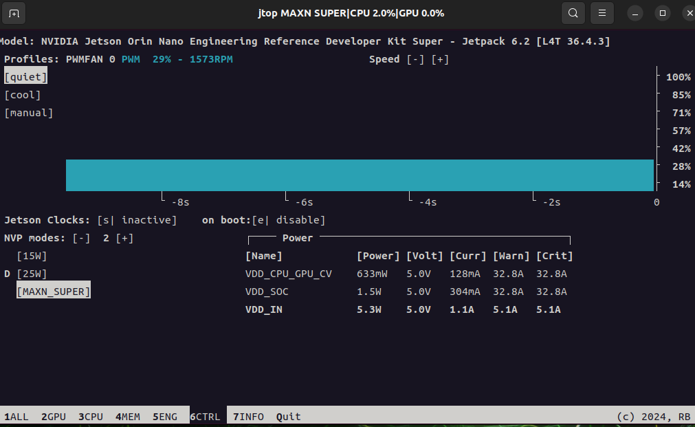
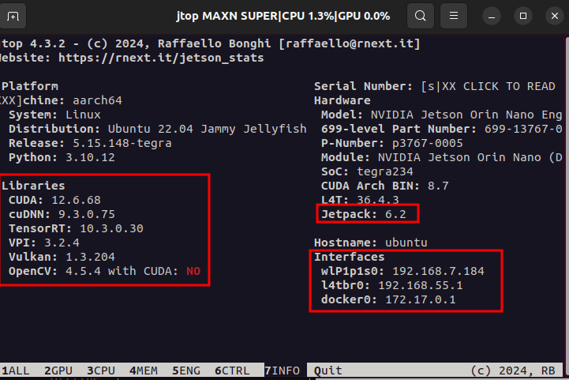

# Jtop and System Monitoring

[Back to Module 3](../README.MD) | [Back to Table of Contents](../../Table-of-Contents.md)

## 06 jtop工具

### 系统资源监控工具——Jtop

### 介绍

Jtop是Jetson专用的系统监控工具，可以像htop一样实时查看CPU/GPU使用率、内存、功耗、温度、NVPModel、电源模式、风扇、进程信息 等。它可以帮助你快速诊断性能瓶颈、监控模型推理时的资源占用，是Jetson开发中最常用的调试工具之一。

#### Step1.安装Jtop

在jetson终端中输入下面的命令。

```bash
sudo apt update
sudo apt-get install python3-pip -y
sudo -H pip install -U jetson_stats
```

首次安装Jtop需要重新启动设备以启动Jtop的系统服务。

```bash
sudo reboot
```

#### Step2.启动最大功率以及Jetson时钟

```bash
# 启动Jetson的MAXN SUPER最大功率模式
sudo nvpmodel -m 2
# 启动jetson时钟,这会让Jetson的CPU和GPU以最大频率运行
sudo jetson_clocks
# 打开Jtop查看系统资源
jtop
```

可以监看系统的硬件资源信息


在Jtop中，可以按数字1、2、3...来切换不同页面的信息

页面2这里监视着GPU的使用情况，以及进程使用GPU的情况


页面3 CPU监视界面


页面4内存管理


可以通过s,b,+,-按键来增加交换区


页面5监看NVIDIA Jetson Orin芯片内部各类“专用硬件加速引擎”的工作状态和频率


页面6控制页面，允许你直接调整Jetson Orin Nano的硬件运行模式、散热策略和时钟频率



页面7可以监看Jetpack版本、各种环境组件的版本以及网络IP等系统信息



最后，按键盘上的q键，即可退出jtop。

[Back to Module 3](../README.MD)
