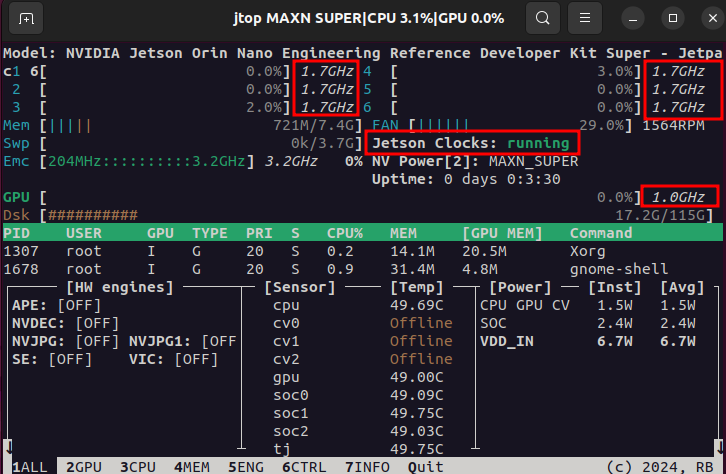
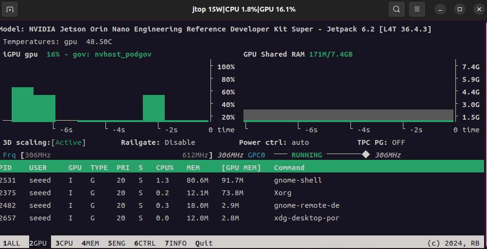
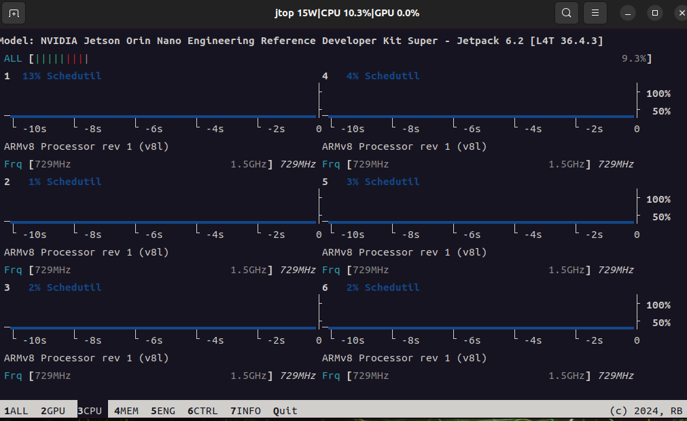
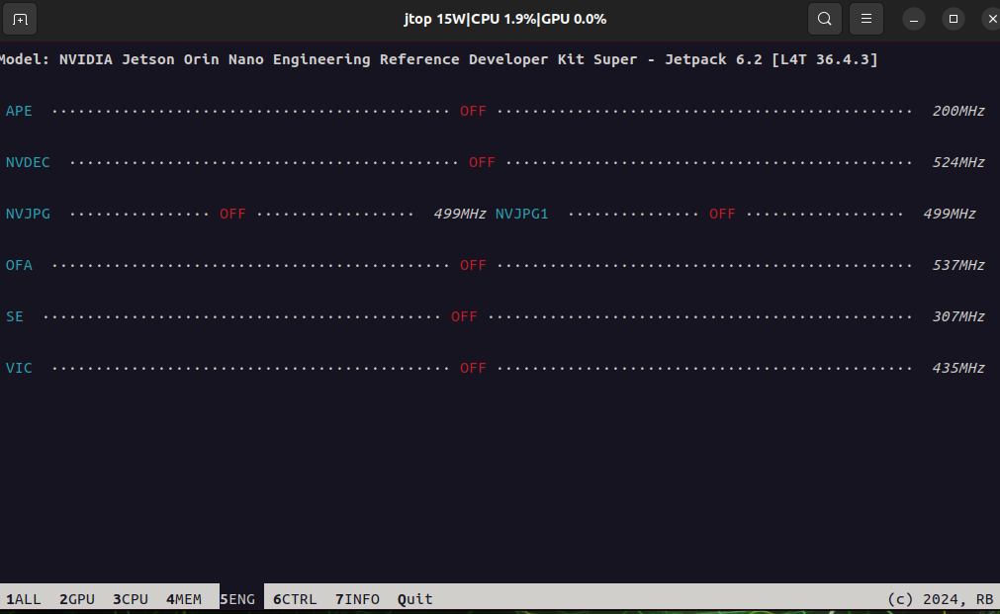

# Assets for Jtop and System Monitoring

These screenshots were extracted from the original xiaobai Chapter 3 Word documents so they can be browsed directly on GitHub.

[Back to Lesson](../README.md)

## 06 jtop 工具.docx

