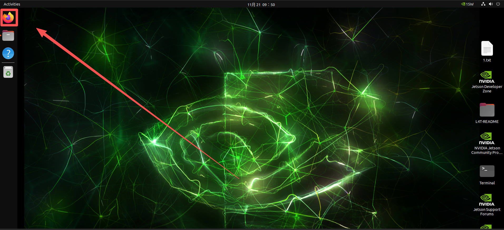
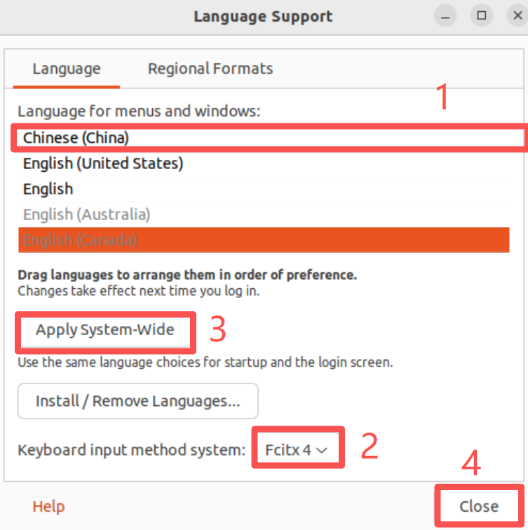

# Browser and Chinese Input Method

[Back to Module 3](../README.MD) | [Back to Table of Contents](../../Table-of-Contents.md)

## Introduction

A browser is useful for downloading packages, opening local web UIs, and reading online documentation. A Chinese input method is helpful when searching Chinese-language resources or entering Chinese text on Jetson.

## Install Firefox

```bash
sudo apt update
sudo apt install -y firefox
```

On some Jetson desktop images, the packaged Firefox may need extra repair steps because of `snapd`. If Firefox installs but does not open correctly, try the workaround below:

```bash
cd ~/Downloads
snap download snapd --revision=24724
sudo snap ack snapd_24724.assert
sudo snap install snapd_24724.snap
sudo snap refresh --hold snapd
```

After installation, Firefox should appear in the application launcher.

## Install Google Pinyin Input Method

Jetson uses an ARM64 architecture, so common x86-only input methods such as Sogou Input Method are not always available. `fcitx-googlepinyin` is a practical choice.

Install the package:

```bash
sudo apt update
sudo apt install -y fcitx-googlepinyin
```

Then configure the desktop:

1. Open `Settings`.
2. Go to `Region & Language`.
3. Open `Manage Installed Languages`.
4. Add `Chinese (China)`.
5. Set the keyboard input method system to `fcitx`.

Reboot:

```bash
sudo reboot
```

After reboot:

1. Open the keyboard or input method icon.
2. Add `Google Pinyin` and `English`.
3. Use `Ctrl + Space` to switch input methods.

## Visual Walkthrough

The browser and input-method screenshots extracted from the source chapter are now part of the merged lesson.

<details>
<summary>Browser installation and Chinese input method screenshots</summary>







</details>

[Back to Module 3](../README.MD)
