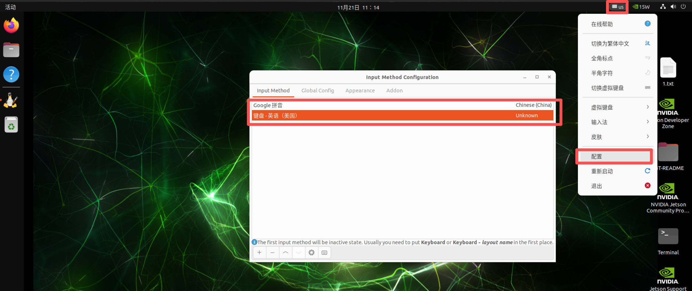

# Browser and Chinese Input Method

[Back to Module 3](../README.MD) | [Back to Table of Contents](../../Table-of-Contents.md)

## 09安装浏览器

### 介绍

在Jetson的原始的系统中，一般默认不自带浏览器，所以需要我们手动安装浏览器。本篇将介绍如何Jetson上安装常用的火狐浏览器

### firefox安装

打开jetson终端，运行以下命令安装火狐浏览器

```bash
sudo apt update
# 下载火狐浏览器
sudo apt install firefox
# apt安装的版本会打不开需要运行以下命令修复
cd ~/Downloads/
# 降级 snap
snap download snapd --revision=24724
sudo snap ack snapd_24724.assert
sudo snap install snapd_24724.snap
sudo snap refresh --hold snapd
```

安装完成后，火狐浏览器图标将出现在桌面。


## 10安装中文输入法

### 介绍

Jetson默认系统语言是英文的，所以输入法也是英文的，这对于我们需要搜索查询一些资料很不方便，所以，本篇将介绍如何在Jetson上安装中文输入法。

```
Jetson是ARM架构的系统，不支持搜狗输入法(只支持amd架构)
```

### 安装中文输入法

进入到Jetson的桌面，打开一个终端，执行以下安装命令：

```bash
# 安装googlepinyin
sudo apt-get install fcitx-googlepinyin -y
```

打开设置—>Region & Language—>Manage Installed Languages


添加Chinese（china语言），键盘输入法系统选择：fcitx4。


重启系统

```bash
sudo reboot
```

点击键盘图标——>配置——>选择Google拼音 和 英语



中英文输入切换可以使用默认快捷键Ctrl +空格切换

[Back to Module 3](../README.MD)
