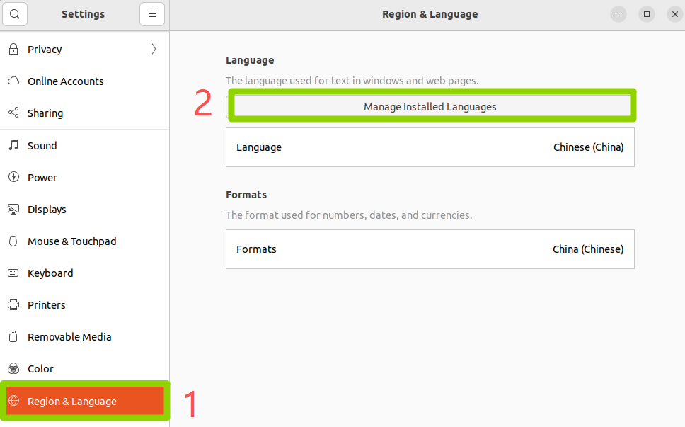
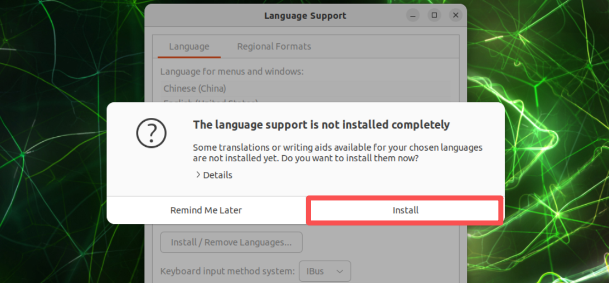

# Assets for Browser and Input Method

These screenshots were extracted from the original xiaobai Chapter 3 Word documents so they can be browsed directly on GitHub.

[Back to Lesson](../README.md)

## 09 安装浏览器.docx

## 10 安装中文输入法.docx

