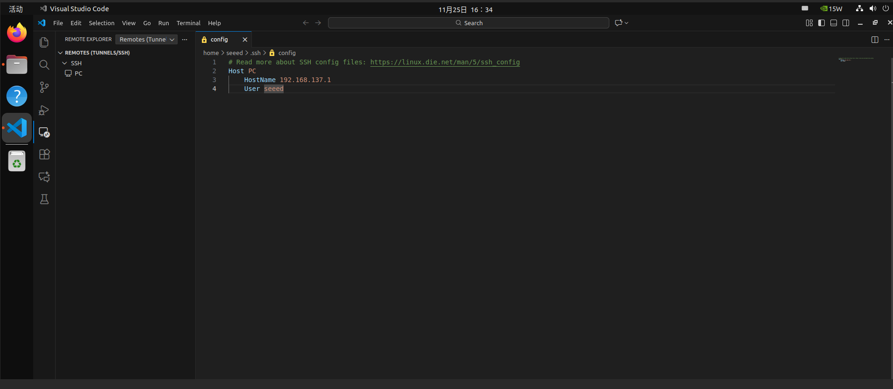
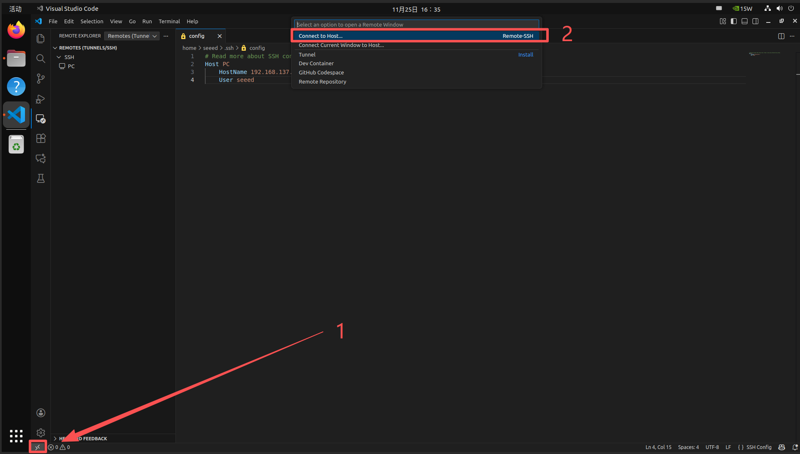
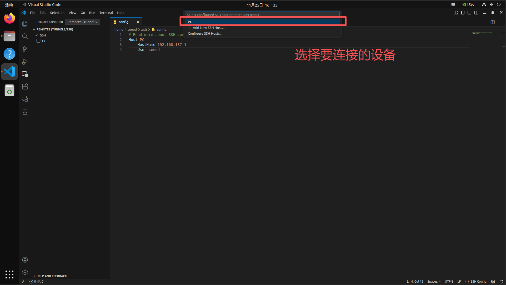
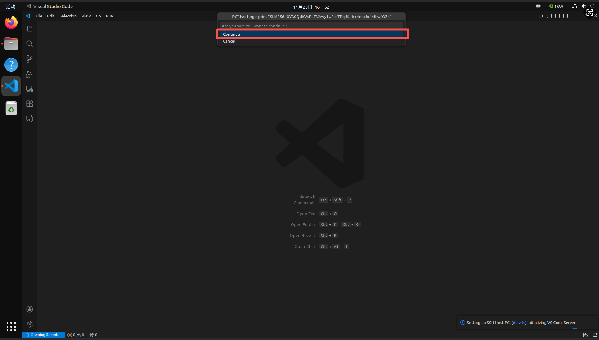
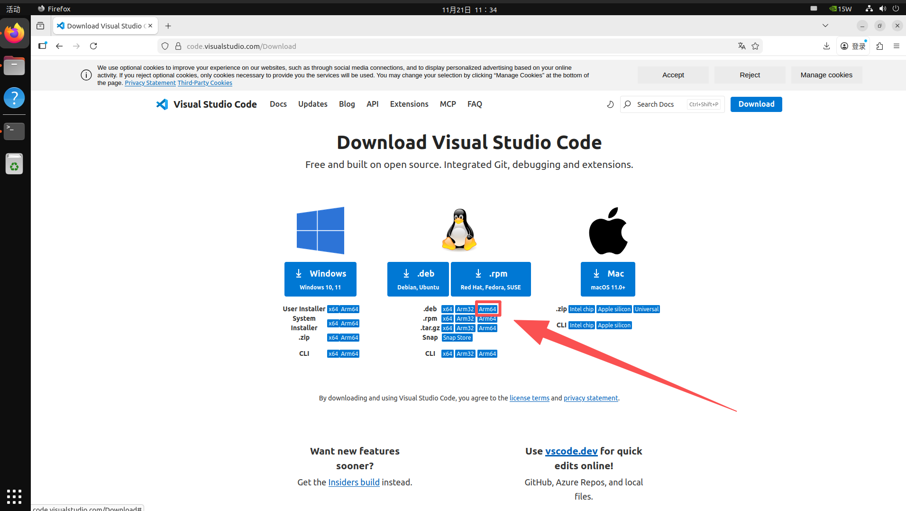
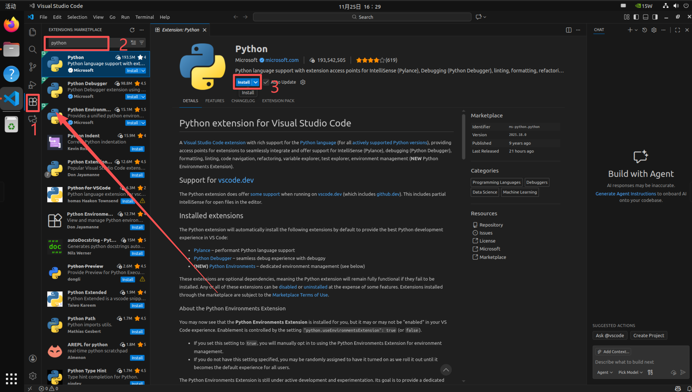
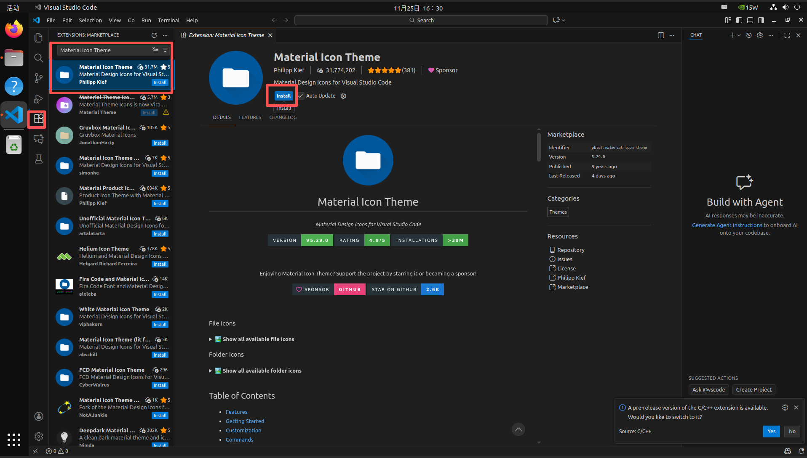
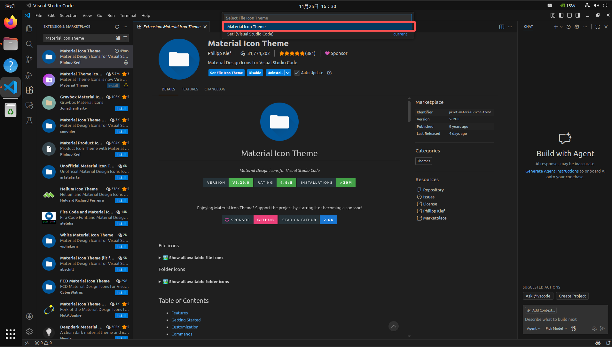
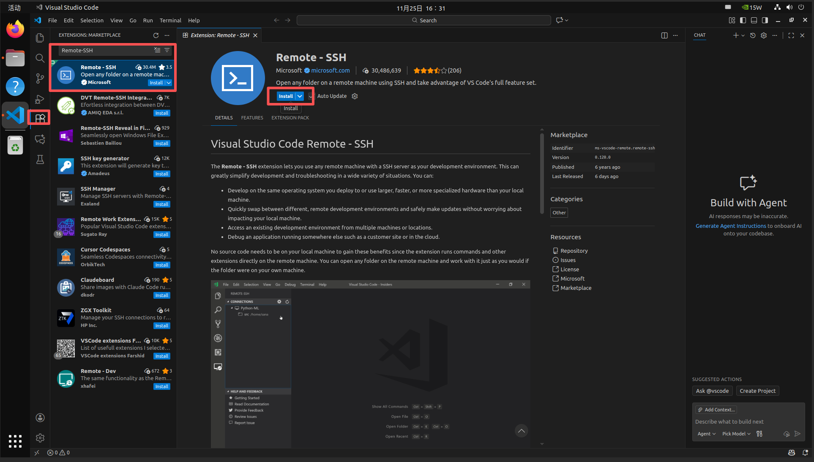

# Install VS Code on Jetson

[Back to Module 3](../README.MD) | [Back to Table of Contents](../../Table-of-Contents.md)

## Introduction

Visual Studio Code is a lightweight editor with a strong extension ecosystem. It is a practical choice for Python, C++, ROS, and remote Jetson development.

## Install the ARM64 Package

1. Open the official VS Code download page in a browser.
2. Choose the `Linux ARM64` `.deb` package.
3. Open a terminal and install it from the downloads folder.

Example:

```bash
cd ~/Downloads
sudo dpkg -i ./code_*_arm64.deb
sudo apt -f install -y
```

After installation, start it with:

```bash
code
```

## Recommended Extensions

- Python
- C/C++
- Material Icon Theme
- Remote - SSH

## Use Remote - SSH

Create or edit `~/.ssh/config` on your PC:

```text
Host jetson-dev
    HostName 192.168.1.50
    User seeed
```

Then in VS Code:

1. Open the command palette.
2. Select `Remote-SSH: Connect to Host`.
3. Choose `jetson-dev`.
4. Enter the password when prompted.

This gives you a full editing environment on Jetson while keeping the IDE on your PC.

## Troubleshooting

- If `dpkg` reports missing dependencies, run `sudo apt -f install -y`.
- If the VS Code package name differs, use `ls ~/Downloads/code*.deb` first.
- If remote connection fails, verify [SSH Remote Access](../3.13-SSH-Remote-Access/README.md).

## Visual Walkthrough

The VS Code installation screenshots from the original lesson are now embedded below to keep the merged chapter self-contained.

<details>
<summary>VS Code installation and Remote - SSH screenshots</summary>
















</details>

[Back to Module 3](../README.MD)
