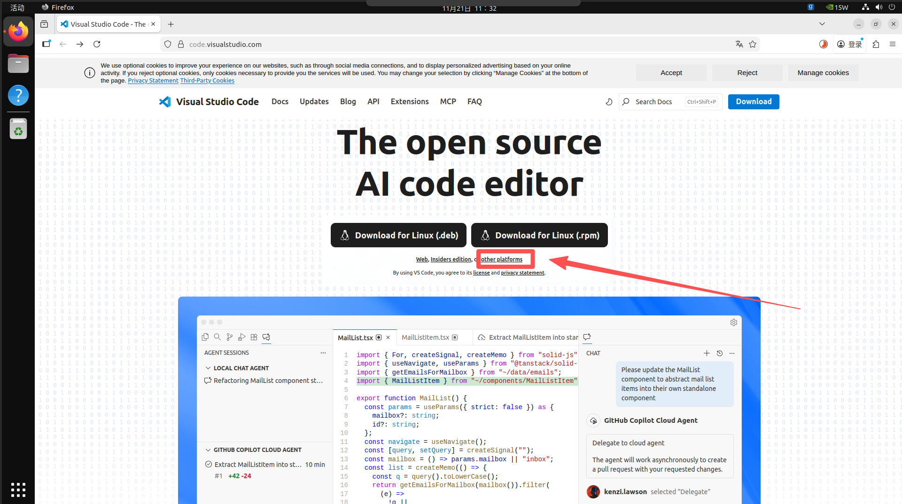
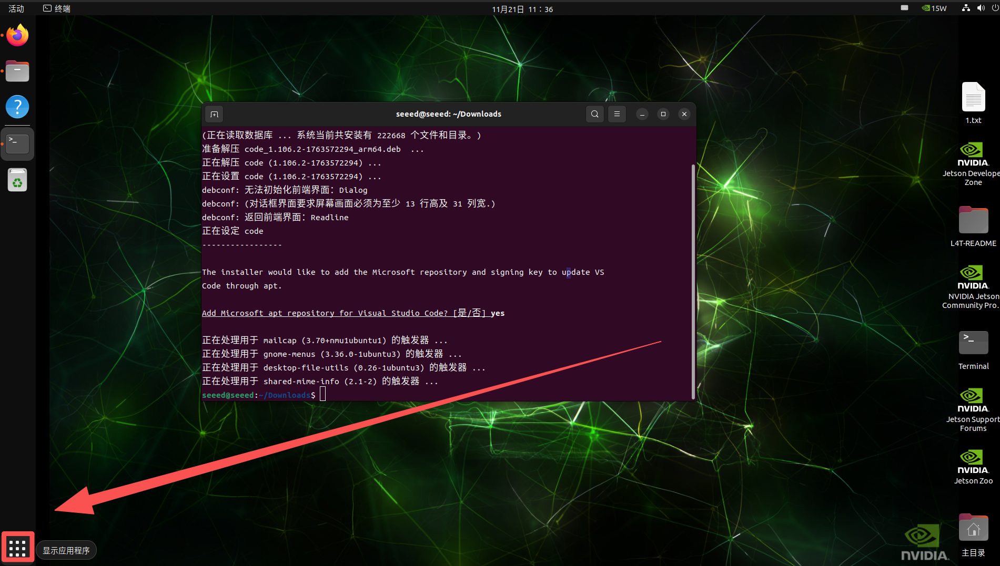

# Install VS Code on Jetson

[Back to Module 3](../README.MD) | [Back to Table of Contents](../../Table-of-Contents.md)

## 11安装VSCode

### 介绍

Visual Studio Code（简称VS Code）是一款由微软推出的轻量级、跨平台代码编辑器，支持Windows、macOS和Linux。它启动快、插件生态丰富，内置智能补全、Git集成、调试器、终端等功能，几乎可以满足从前端到后端、从脚本到嵌入式开发的各种需求。本文将介绍如何在Jetson设备中安装VSCode。

### 安装VSCode

在浏览器中打开VSCode官网。

选择other platform中选择Arm64的版本，并下载对应的deb安装包。




终端进入下载目录，运行安装命令

```bash
# 进入下载目录
cd ~/Downloads
# 执行安装命令；输入code 按Tab补全安装包即可
sudo dpkg -i code_xxxxxxxxxxxx
```

安装完成后，打开应用程序



找到VSCode将其添加到桌面菜单栏


### 安装基础拓展

安装基础的扩展

拓展搜索栏搜索python，选择Python进行安装：


C/C++

安装C与C++拓展


Material Icon Theme

选择Material Icon Theme进行安装


Remote-SSH

选择Remote-SSH进行安装


#### SSH拓展的基本使用

配置远程设备信息


配置远程设备的信息

```bash
Host PC # 远程设备别名
HostName 192.168.137.1 # 远程设备IP
User seeeed # 远程设备用户名
```


选择远程设备进行连接


输入密码回车即可


[Back to Module 3](../README.MD)
