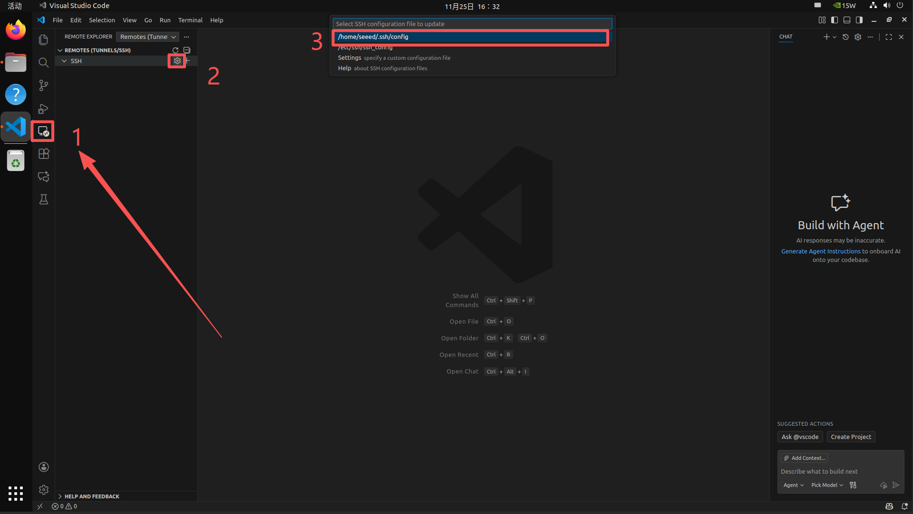
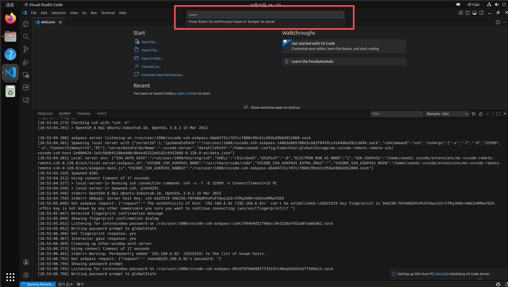
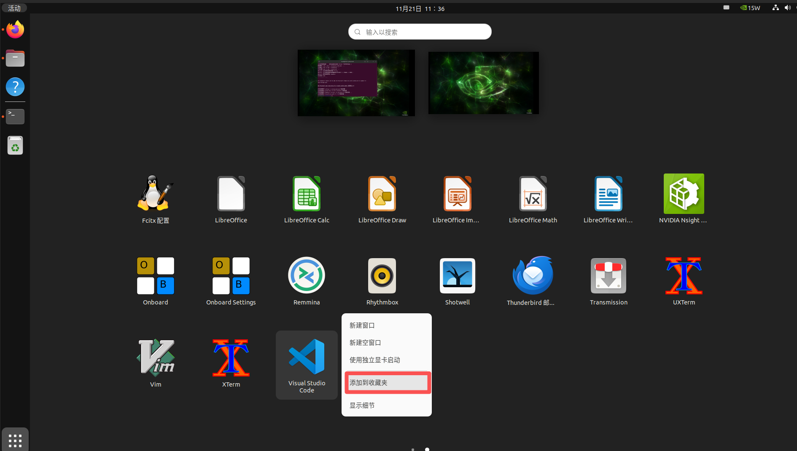
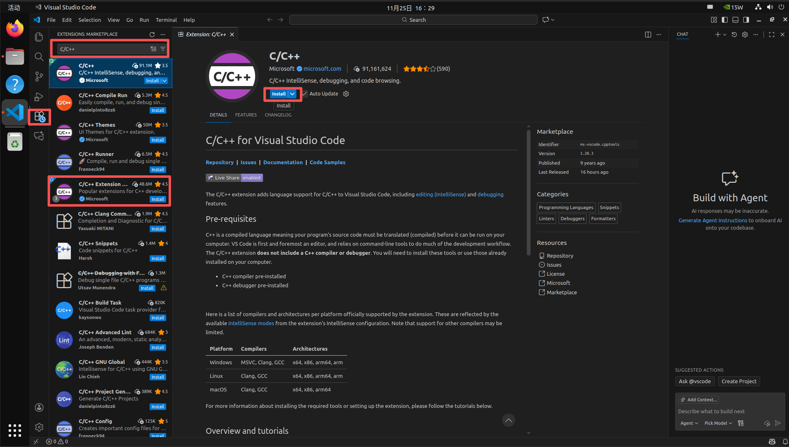

# Assets for VS Code

These screenshots were extracted from the original xiaobai Chapter 3 Word documents so they can be browsed directly on GitHub.

[Back to Lesson](../README.md)

## 11 安装 VSCode.docx

