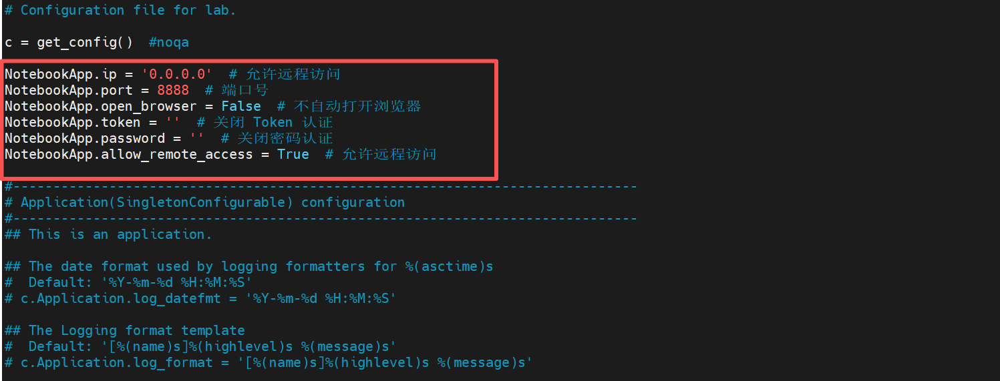
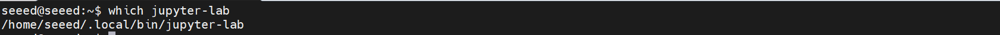

# Install and Run JupyterLab

[Back to Module 3](../README.MD) | [Back to Table of Contents](../../Table-of-Contents.md)

## 12安装Jupyter Lab

### 介绍

JupyterLab是一款现代化的交互式数据科学与开发环境，支持在浏览器中同时运行代码、查看数据、编辑文档与构建交互式可视化。它是Jupyter Notebook的升级版，提供更灵活的多标签布局、更丰富的插件生态以及对多种编程语言的支持，非常适合用于数据分析、机器学习、科研计算和教学等场景。

### Jupyter Lab安装

打开Jetson终端并执行安装命令

```bash
# 更新 pip3 到最新版本
pip3 install --upgrade pip
# 安装或更新 Jupyter Lab
pip3 install jupyter jupyterlab
```

安装完后会在~/.local/bin路径下


将local/bin加入环境变量

```bash
nano ~/.bashrc
# 在最下面添加
export PATH="$HOME/.local/bin:$PATH"
# Ctrl + X 保存
# 更新环境变量
source ~/.bashrc
```


#### 生成配置文件

```bash
# 运行一下命令会在 .jupyter 目录中生成一个 jupter_lab_config.py 文件
jupyter lab --generate-config
```


#### 编辑配置文件

```bash
sudo vim /home/seeed/.jupyter/jupyter_lab_config.py
```

写入以下内容:

```bash
NotebookApp.ip = '0.0.0.0' # 允许远程访问
NotebookApp.port = 8888 # 端口号
NotebookApp.open_browser = False # 不自动打开浏览器
NotebookApp.token = '' # 关闭 Token 认证
NotebookApp.password = '' # 关闭密码认证
NotebookApp.allow_remote_access = True # 允许远程访问
```



按Esc键输入:wq!强制保存退出。

#### 设置开机自启动

在jetson的终端中输入下面的命令来确定jupyter-lab的安装位置

```bash
which jupyter-lab
```



创建jupyter.service文件

```bash
sudo vim /etc/systemd/system/jupyter.service
```

写入以下内容:

```bash
[Unit]
Description=Jupyter Lab
After=network.target
[Service]
Type=simple
User=lrhan
Group=lrhan
WorkingDirectory=/home/lrhan
ExecStart=/home/lrhan/.local/bin/jupyter-lab --ip=0.0.0.0 --port=8888 --no-browser
Restart=always
Environment="PATH=/home/seeed/.local/bin:/usr/bin:/bin"
[Install]
WantedBy=multi-user.target
```


重启Jupyter服务使得新配置生效

```bash
# 关闭 Jupyter 相关进程
pkill -9 -f jupyter
# 重新启动 Jupyter 服务
sudo systemctl restart jupyter
```

在Jetson上打开一个终端运行Jupyter Lab

```bash
jupyter lab
```

运行后会自动打开浏览器运行Jupyter服务


如果想通过其他电脑远程访问Jetson上的Jupyter服务，可以在远程电脑的浏览器打开以下链接

```bash
http://<jetson_ip>:8888/lab
```

```
其中，<jetson_ip> 为 jetson 设备在局域网中的 ip 地址。
```

[Back to Module 3](../README.MD)
