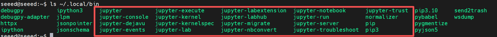

# Install and Run JupyterLab

[Back to Module 3](../README.MD) | [Back to Table of Contents](../../Table-of-Contents.md)

## Introduction

JupyterLab is useful for interactive Python development, quick model experiments, data inspection, and teaching demos on Jetson. It exposes a browser-based workspace that can be accessed locally or from another device on the same network.

## Install JupyterLab

```bash
python3 -m pip install --upgrade pip
python3 -m pip install jupyter jupyterlab
```

If `~/.local/bin` is not in your shell `PATH`, add it:

```bash
echo 'export PATH="$HOME/.local/bin:$PATH"' >> ~/.bashrc
source ~/.bashrc
```

## Generate the Configuration File

```bash
jupyter lab --generate-config
```

This creates:

```bash
~/.jupyter/jupyter_lab_config.py
```

## Enable Remote Access

Edit the config file:

```bash
nano ~/.jupyter/jupyter_lab_config.py
```

Add:

```python
c.ServerApp.ip = "0.0.0.0"
c.ServerApp.port = 8888
c.ServerApp.open_browser = False
c.ServerApp.allow_remote_access = True
```

For trusted local-network testing only, you can also disable token-based login:

```python
c.ServerApp.token = ""
```

> Note: Disabling authentication is convenient on a private LAN, but it is not appropriate on an untrusted network. A safer alternative is to set a password with `jupyter lab password`.

## Start JupyterLab

```bash
jupyter lab
```

From another computer on the same LAN, open:

```text
http://<jetson-ip>:8888/lab
```

## Optional: Run JupyterLab as a System Service

Create a service file:

```bash
sudo nano /etc/systemd/system/jupyter.service
```

Example service:

```ini
[Unit]
Description=JupyterLab
After=network.target

[Service]
Type=simple
User=<your-user>
Group=<your-user>
WorkingDirectory=/home/<your-user>
ExecStart=/home/<your-user>/.local/bin/jupyter-lab --ip=0.0.0.0 --port=8888 --no-browser
Restart=always
Environment=PATH=/home/<your-user>/.local/bin:/usr/bin:/bin

[Install]
WantedBy=multi-user.target
```

Then enable and start it:

```bash
sudo systemctl daemon-reload
sudo systemctl enable --now jupyter
sudo systemctl status jupyter
```

## Visual Walkthrough

The setup screenshots for JupyterLab are now inserted directly into the markdown so the configuration sequence is preserved in the merged lesson.

<details>
<summary>JupyterLab installation screenshots</summary>




</details>

[Back to Module 3](../README.MD)
