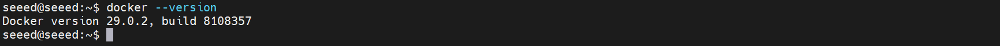
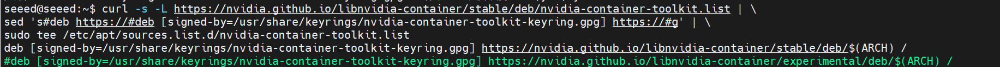

# Assets for Docker

These screenshots were extracted from the original xiaobai Chapter 3 Word documents so they can be browsed directly on GitHub.

[Back to Lesson](../README.md)

## 13 安装 Docker与基础使用.docx

