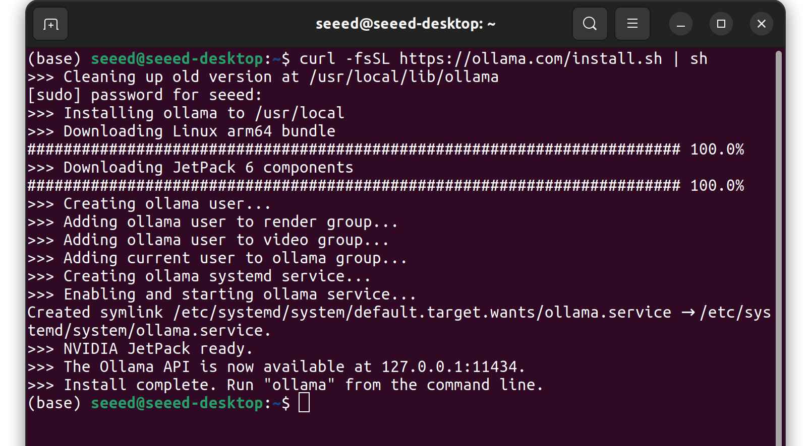
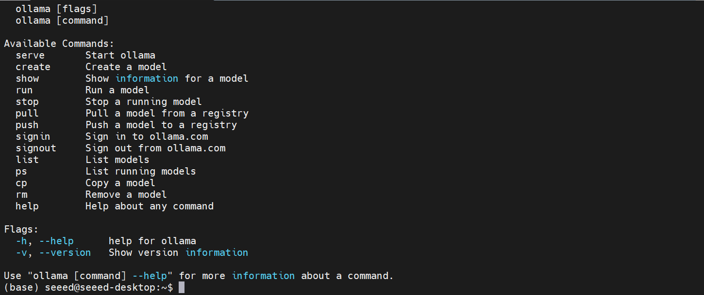
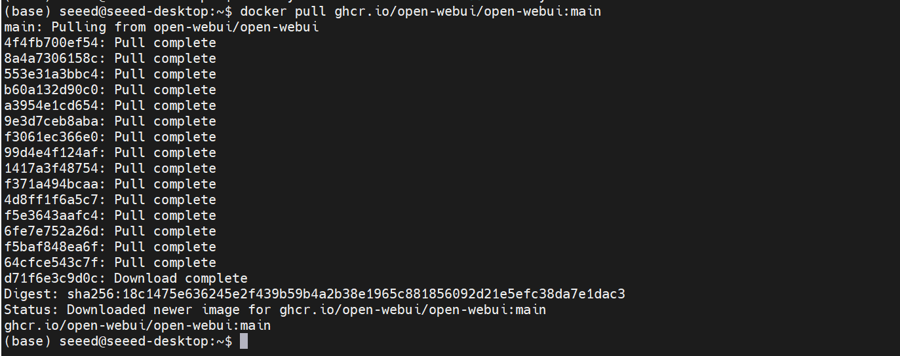
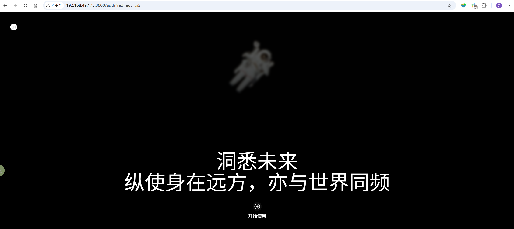

# Environment and Basics with Ollama

## 01环境与基础准备（Ollama）

## 12.01.01 AI大模型环境部署

### 简介

Ollama是一个轻量级、可扩展的开源框架，专门用于在本地运行大型语言模型（LLMs）。它支持多种模型架构，提供了简单的命令行界面和REST API，特别适合在NVIDIA Jetson这类边缘计算设备上部署。

### 主要特性

### 安装Ollama

### 系统要求

```
从 SeeedStudio 购买的 Jetson 设备已经预装了 Ollama，您可以使用 ollama -v 命令查看预装本版。 如果终端窗口中正常打印 ollama 的版本信息，请跳过安装部分。
```

### 安装步骤

在Jetson设备的桌面使用ctrl + alt + T的组合快捷键打开 终端窗口，并输入下面的一键安装命令。

```bash
sudo apt install curl -y
curl -fsSL https://ollama.com/install.sh | sh
```



如果终端中打印安装完成的日志，则证明Jetson设备中已经成功安装了ollama。

### Ollama使用方法

在jetson的终端窗口中输入ollama -h即可查看ollama的使用说明。



| 命令 | 功能 |
| --- | --- |
| ollama serve | 启动 ollama |
| ollama create | 从模型文件创建模型 |
| ollama show | 显示模型信息 |
| ollama run | 运行模型 |
| ollama pull | 从注册表中拉取模型 |
| ollama push | 将模型推送到注册表 |
| ollama list | 列出模型 |
| ollama ps | 列出运行的模型 |
| ollama cp | 复制模型 |
| ollama rm | 删除模型 |
| ollama help | 获取有关任何命令的帮助信息 |

### 参考

https://ollama.com/

## 12.02.02中文输入法切换

请参考 第三章10小节10安装中文输入法配置中文输入法。

## 12.03.03大模型对话平台安装

### Open WebUI简介

Open WebUI（原Ollama WebUI）是一个开源、可自托管的Web界面，专为本地运行的LLMs设计。它提供了类似ChatGPT的用户体验，支持多模型管理、对话历史、插件系统等高级功能，非常适合在Jetson平台上搭建私有化AI助手。

### 核心特性

### 安装Open WebUI

在Jetson设备的终端窗口中运行下面的命令拉取Open WebUI的docker镜像：

```python
# 拉取 Open WebUI 镜像（ARM64 版本）
docker pull ghcr.io/open-webui/open-webui:main
```

```
如果 jetson 设备的 docker 环境异常，请参考 13 安装 Docker与基础使用 配置 docker 环境。
```



### 启动Open WebUI

在Jetson设备的终端中运行下面的命令创建并启动docker容器。

```python
# 创建数据目录
mkdir -p /opt/seeed/development_guide/12_llm_offline/open-webui/data
# 运行容器
docker run -d --restart always --name open-webui \
--network host \
-v /opt/seeed/development_guide/12_llm_offline/open-webui/data:/app/backend/data \
-e OLLAMA_BASE_URL=http://127.0.0.1:11434 \
ghcr.io/open-webui/open-webui:main
# 查看运行状态
docker logs -f open-webui
```

```
第一次启动容器可能会下载一些基础模型，请确保 jetson 设备的网络通畅。
```

容器启动后，可以在浏览器中输入http://localhost:8080/访问WebUI。如果您想通过局域网中的其他设备访问WebUI，需要将url中的localhost替换成Jetson设备的ip地址。


