# Offline Text LLMs

## 02离线文字大模型（单模态）

## 11.02-01 Meta AI：Llama3.2模型

### 简介

MetaLlama 3.2是Meta推出的最新一代大规模语言模型系列，在Llama 3.1的基础上进行了架构升级，并引入了真正的多模态能力：不仅可以处理和生成文本，还能理解图像内容，这让它兼具语言理解与视觉推理能力。

### 模型规模


#### 点击图片可查看完整电子表格

### 性能表现

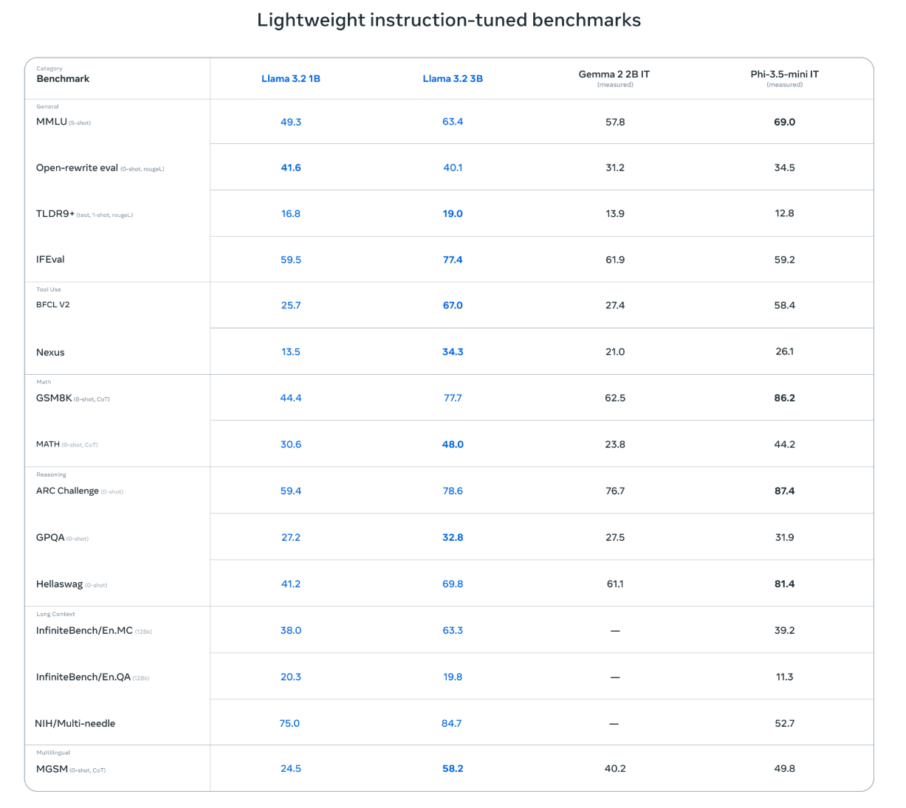

### 使用Llama3.2

使用run命令运行模型，若此前本地未下载，ollama会先下载模型再运行

```bash
ollama run llama3.2:3b
```

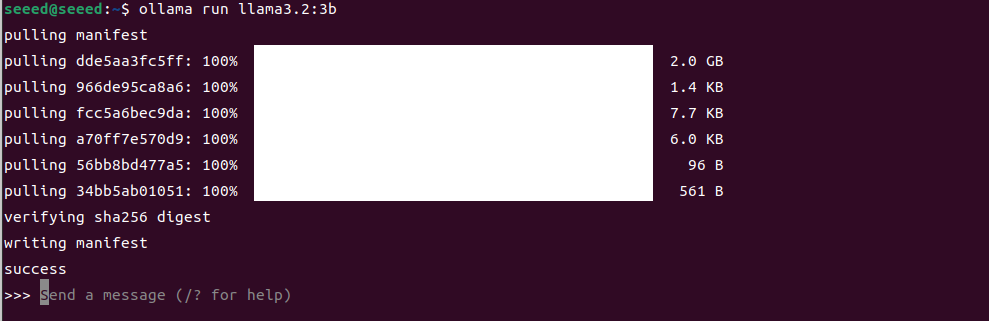

### 对话测试

```bash
who are you?
```

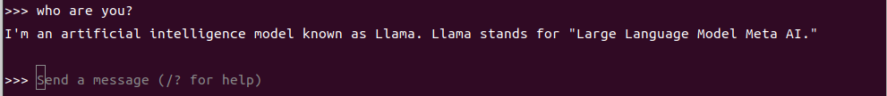

### 结束对话

使用Ctrl+d快捷键或者/bye可以结束对话！

### 参考资料

```
Ollama
```

官网：https://ollama.com/

GitHub：https://github.com/ollama/ollama

```
Llama 3.2
```

官网：https://www.llama.com/docs/model-cards-and-prompt-formats/llama3_2/

Ollama对应模型：https://ollama.com/library/llama3.2

## 11.02-02阿里云：Qwen3模型

### 简介

Qwen3是阿里云通义千问团队在2025年推出的新一代开源大型语言模型家族，代表了该系列在规模、推理能力和多语言表现上的重要升级。Qwen3包括六种密集（Dense）模型和两种混合专家（MoE）模型，从0.6B到235B参数不等，支持长上下文（高达128K tokens），并引入了“混合推理”模式，可以在深度思考（复杂任务）与快速响应（通用任务）之间智能切换，从而在逻辑推理、数学、编码等复杂任务中表现出更强的能力。

### 模型规模

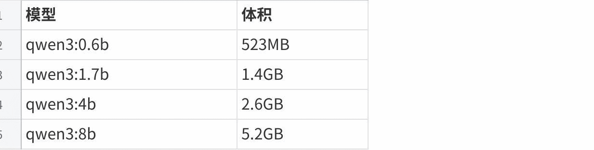

#### 点击图片可查看完整电子表格

### 性能表现

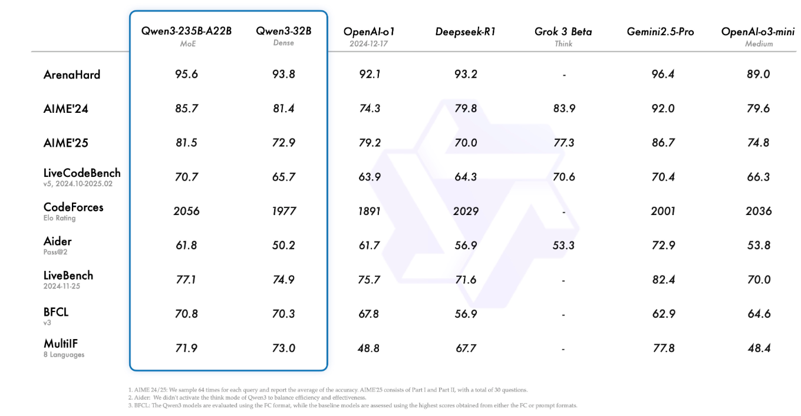

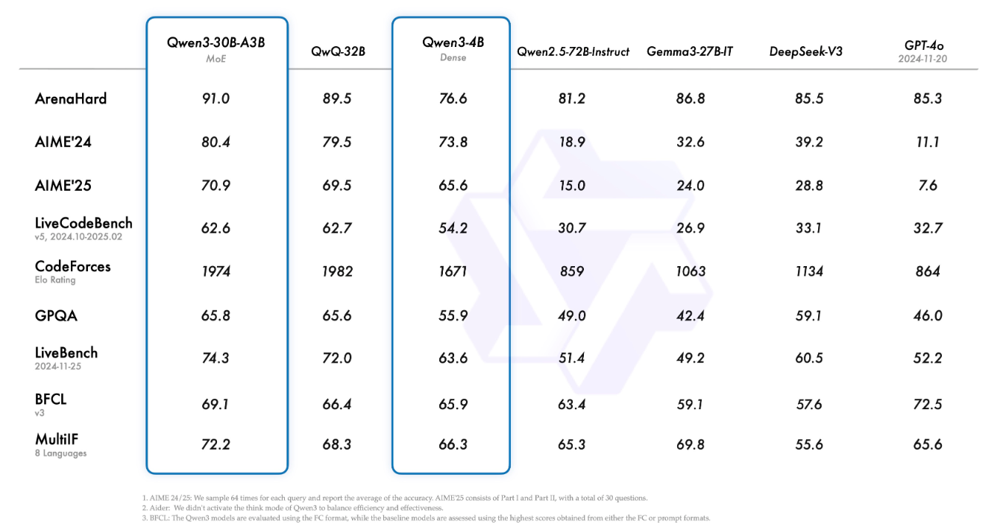

### 使用Qwen3

使用run命令运行模型，若此前本地未下载，ollama会先下载模型再运行

```bash
ollama run qwen3:8b
```

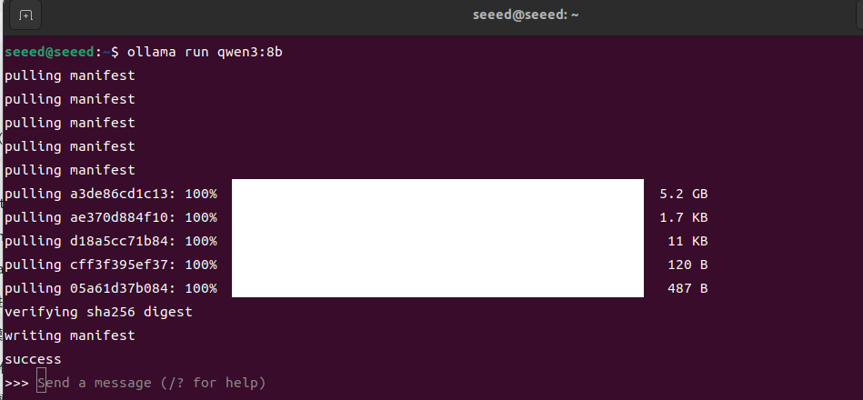

### 对话测试

```bash
please tell me a story.
```

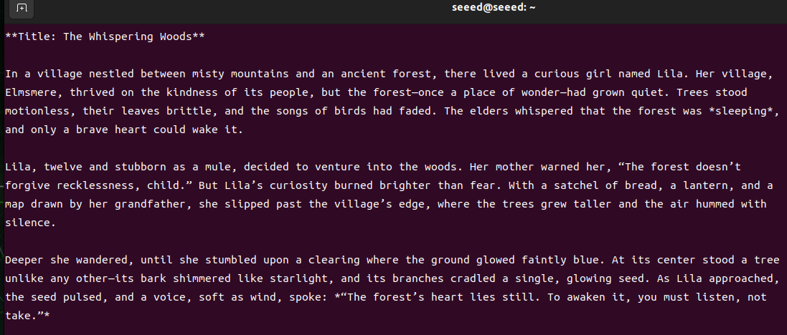

### 结束对话

使用Ctrl+d快捷键或者/bye可以结束对话！

```
Ollama
```

官网：https://ollama.com/

GitHub：https://github.com/ollama/ollama

```
Qwen3
```

GitHub：https://github.com/QwenLM/Qwen3

Ollama对应模型：https://ollama.com/library/qwen3

## 11.02-03微软：Phi-4-mini模型

### 简介

Phi-4-mini是微软Phi模型系列中一个轻量级、高效的小规模语言模型（Small Language Model），属于Phi-4家族的紧凑版本，拥有约3.8 B参数，采用decoder-only Transformer架构，并引入了如200 K词汇表、grouped-query attention和共享输入–输出嵌入等技术设计，使它在计算与内存受限环境中也能高效推理，同时支持超长上下文（可达128 K tokens）。

### 模型规模


#### 点击图片可查看完整电子表格

### 模型性能

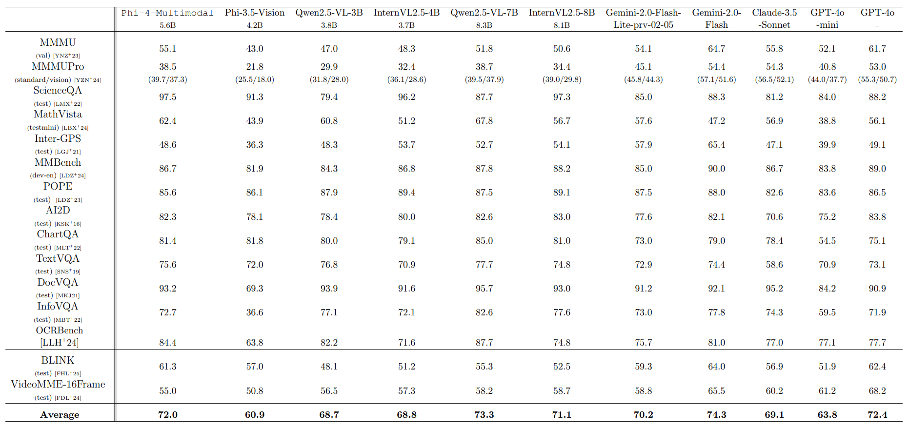

### 使用Phi-4-mini模型

使用run命令运行模型，若此前本地未下载，ollama会先下载模型再运行

```bash
ollama run phi4-mini:3.8b
```

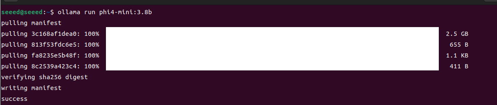

### 对话测试

```bash
who are you?
```

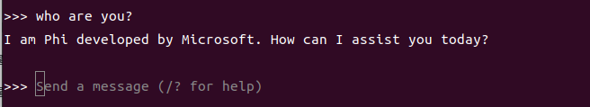

### 结束对话

使用Ctrl+d快捷键或者/bye可以结束对话！

### 参考资料

```
Ollama
```

官网：https://ollama.com/

GitHub：https://github.com/ollama/ollama

```
Phi4-mini
```

Ollama对应模型：https://ollama.com/library/phi4-mini

## 11.02-04 DeepSeek：DeepSeek-R1模型

### 简介

DeepSeek‑R1是由中国AI实验室DeepSeek开发的一款开放推理（reasoning‑first）大型语言模型（LLM），与传统以生成流畅文本为主的模型不同，它专注于逐步思考和解决复杂逻辑、数学、编程等任务，通过强化学习（RL）训练来增强“思考能力”而不是仅仅模仿语言输出。

### 模型规模


#### 点击图片可查看完整电子表格

### 模型性能

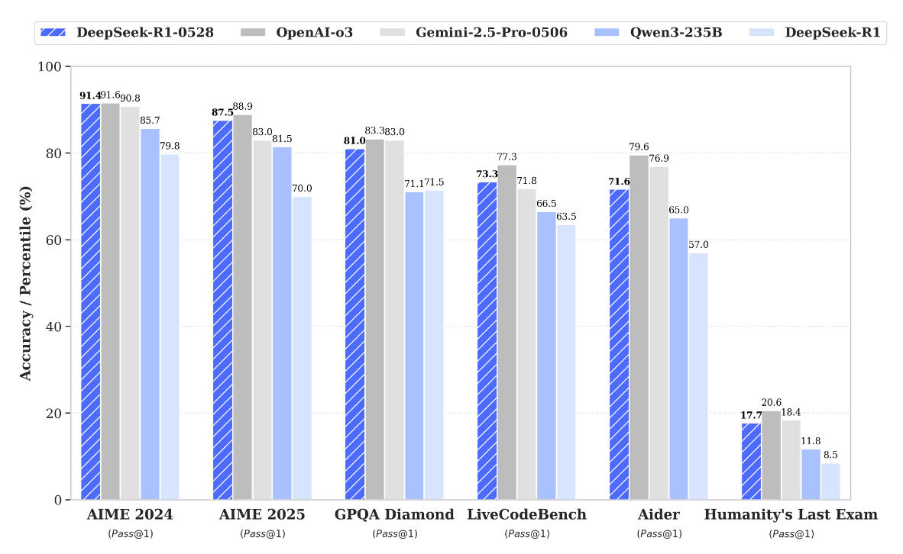

### 使用DeepSeek-R1模型

使用run命令运行模型，若此前本地未下载，ollama会先下载模型再运行

```bash
ollama run deepseek-r1
```

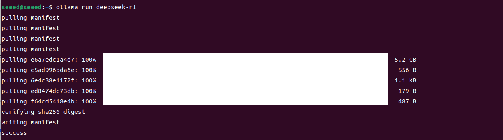

### 对话测试

```bash
who are you?
```

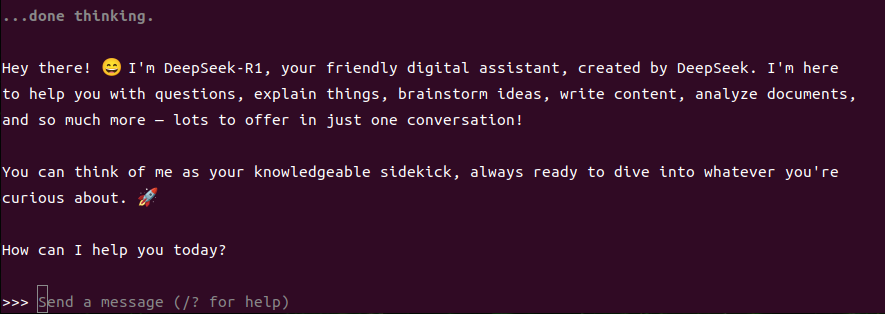

### 结束对话

使用Ctrl+d快捷键或者/bye可以结束对话！

### 参考资料

```
Ollama
```

官网：https://ollama.com/

GitHub：https://github.com/ollama/ollama

```
DeepSeek-R1
```

Ollama对应模型：https://ollama.com/library/deepseek-r1

GitHub：https://github.com/deepseek-ai/DeepSeek-r1
