# Offline Vision-Language Models and Applications

## 03离线视觉多模态大模型与应用

## 11.03-01阿里云：Qwen2.5vl视觉多模态大模型

### 简介

Qwen 2.5 VL是阿里巴巴云（Qwen团队）推出的一款先进的视觉‑语言多模态大模型，它不仅继承了Qwen 2.5在语言理解和生成上的高性能，还加入了强大的图像和视频理解能力，能够同时处理文本、图片甚至长视频输入，实现视觉问答、图像分析、结构化数据提取和事件定位等任务。相比前代，Qwen 2.5 VL在视觉定位、长视频理解和跨模态推理上有明显提升，支持生成带坐标的结构化输出（如JSON框选信息）、解析表格/扫描件，还能作为视觉代理执行工具操作，是当前开源视觉语言模型中的旗舰之一。

### 模型规模


#### 点击图片可查看完整电子表格

### 性能表现

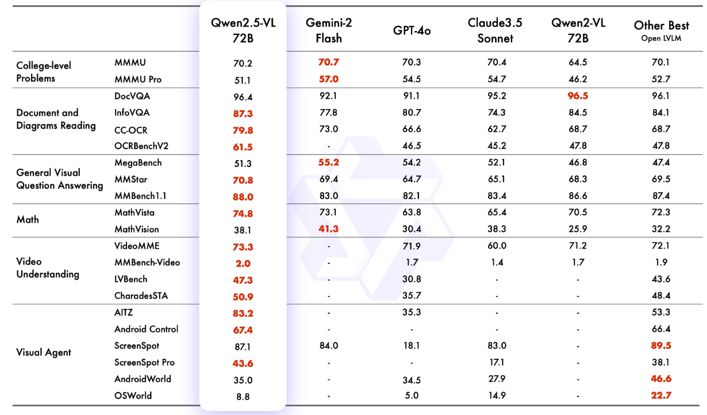

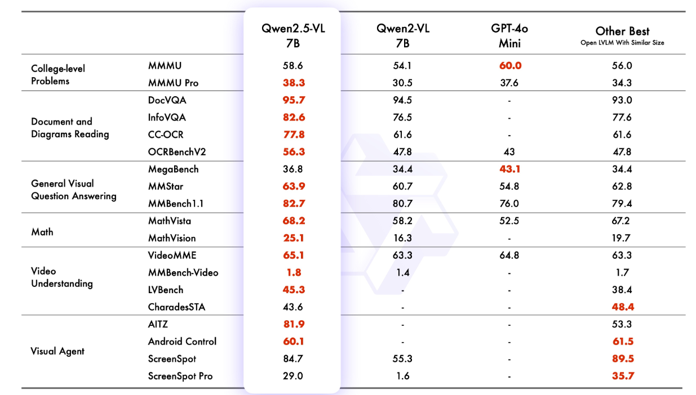

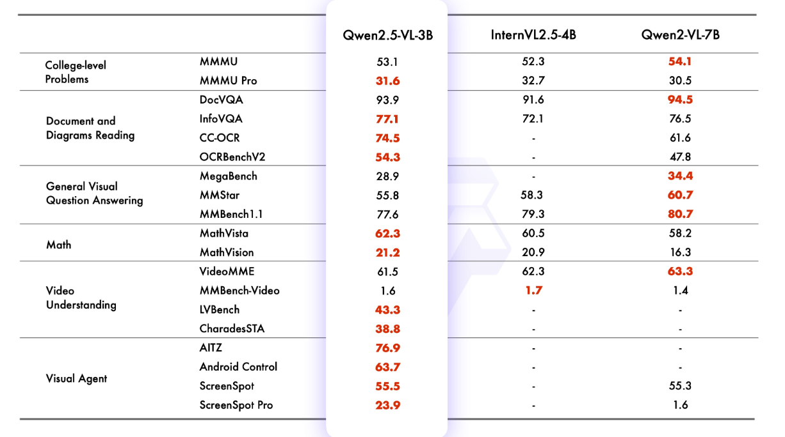

### 使用Qwen2.5VL

使用run命令运行模型，若此前本地未下载，ollama会先下载模型再运行

```bash
ollama run qwen2.5vl:3b
```

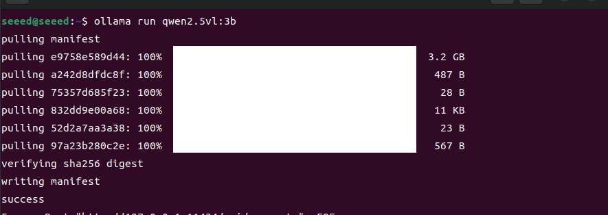

### 对话测试

```bash
who are you?
```

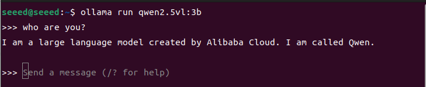

### 视觉功能


```bash
What do you see in this picture? :./test.png
# 在对话中使用 ": + 图片的路径"，就可以让模型使用它的视觉功能，让它解析图片中的信息
```

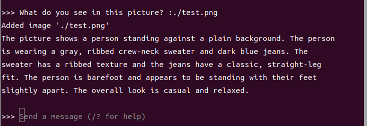

### 结束对话

使用Ctrl+d快捷键或者/bye可以结束对话！

### 参考资料

```
Ollama
```

官网：https://ollama.com/

GitHub：https://github.com/ollama/ollama

```
Qwen2.5VL
```

GitHub：https://github.com/QwenLM/Qwen2.5-VL

Ollama对应模型：https://ollama.com/library/qwen2.5vl

## 11.03-02谷歌：Gemma3视觉多模态大模型

### 简介

Gemma 3是谷歌最新开源的视觉多模态大模型系列，属于Gemma模型家族，提供从约1B到27B不同规模版本，支持同时理解文本与图像输入（多模态），并能处理长达128 K token的上下文信息，覆盖问答、摘要、推理等多种任务。相比前代，它在视觉理解、多语言（140+语种）和长上下文处理上都有显著提升，同时设计上更高效、易于部署，在资源有限的设备上也能运行，是目前开源生态中具备强大视觉–语言理解能力的大模型之一。

### 模型规模


#### 点击图片可查看完整电子表格

### 性能表现

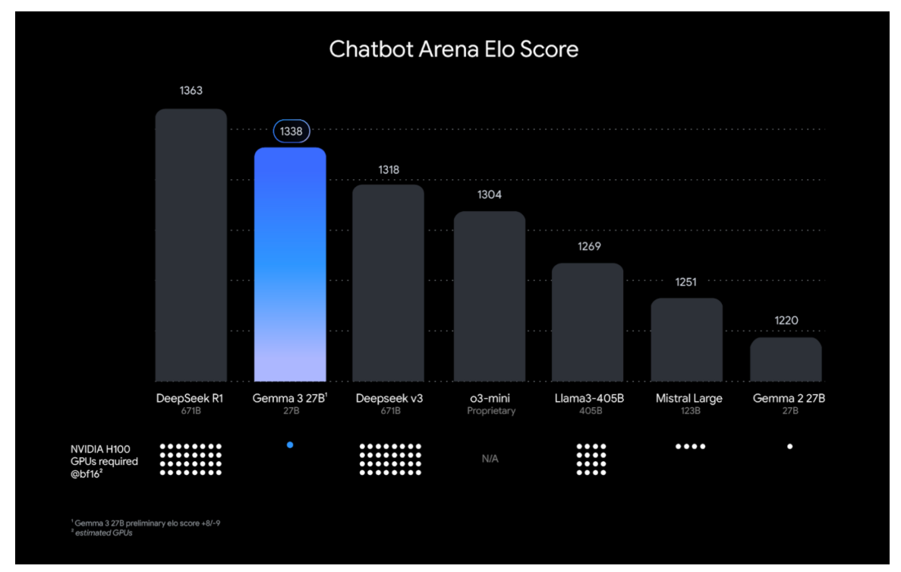

### 使用Gemma3

使用run命令运行模型，若此前本地未下载，ollama会先下载模型再运行

```bash
ollama run gemma3:4b
```

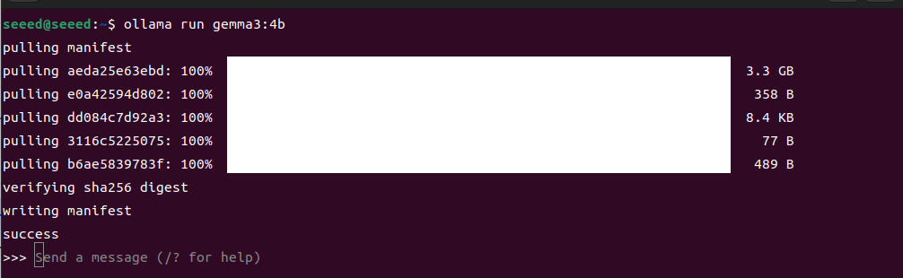

### 对话测试

```bash
who are you?
```

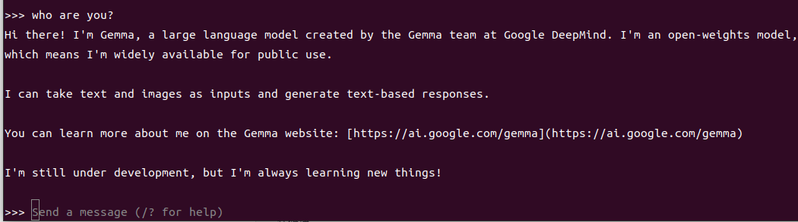

### 视觉功能


```bash
What do you see in this picture? :./test.png
# 在对话中使用 ": + 图片的路径"，就可以让模型使用它的视觉功能，让它解析图片中的信息
```

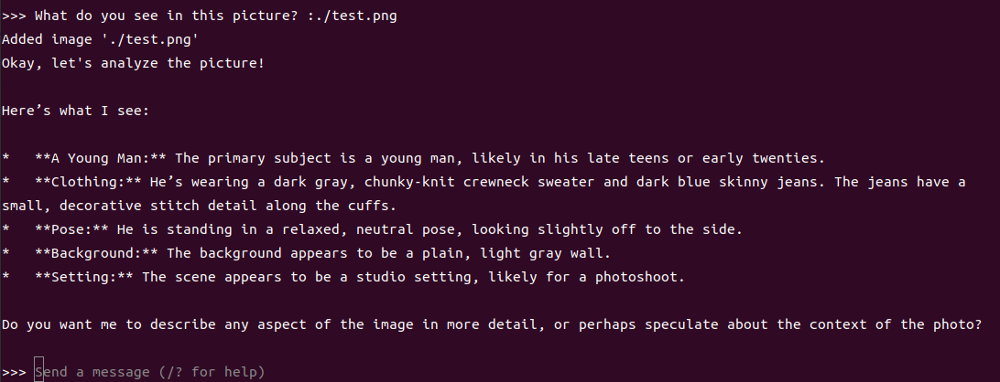

### 结束对话

使用Ctrl+d快捷键或者/bye可以结束对话！

### 参考资料

```
Ollama
```

官网：https://ollama.com/

GitHub：https://github.com/ollama/ollama

```
Gemma3
```

Ollama对应模型：https://ollama.com/library/gemma3

## 11.03-03 Llava视觉多模态大模型

### 简介

LLaVA（全称Large Language and Vision Assistant）是一类开源视觉‑语言多模态大模型，它通过把一个预训练的视觉编码器与一个强大的大型语言模型结合起来，实现了同时理解图像与文本的能力。LLaVA能接受图像+文本输入，进行视觉问答、图像描述、场景理解等任务，并以自然语言形式输出高质量回答，通过“视觉指令调优”（visual instruction tuning）提升模型对视觉场景理解与推理的效果，是当前开源视觉‑语言模型研究与应用的重要基础之一。

### 模型规模


#### 点击图片可查看完整电子表格

### 性能表现

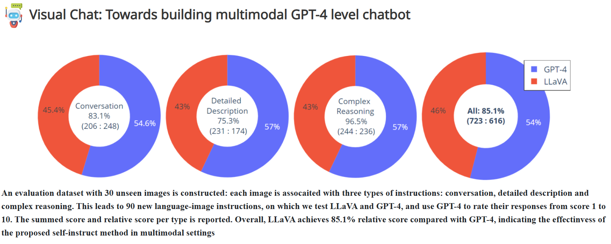

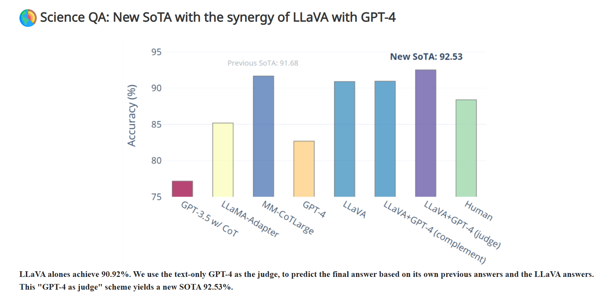

### 使用Llava

使用run命令运行模型，若此前本地未下载，ollama会先下载模型再运行

```bash
ollama run llava:7b
```

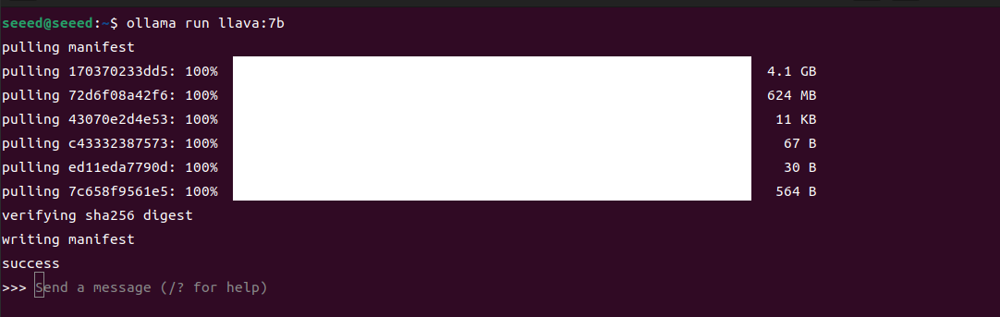

### 对话测试

```bash
who are you?
```

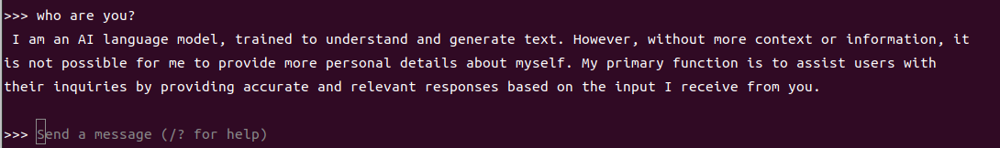

### 视觉功能


```bash
What do you see in this picture? :./test.png
# 在对话中使用 ": + 图片的路径"，就可以让模型使用它的视觉功能，让它解析图片中的信息
```

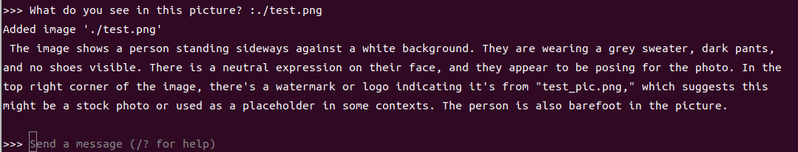

### 结束对话

使用Ctrl+d快捷键或者/bye可以结束对话！

### 参考资料

```
Ollama
```

官网：https://ollama.com/

GitHub：https://github.com/ollama/ollama

```
Llava
```

Ollama对应模型：https://ollama.com/library/llava

## 11.03-04 MiniCPM-V视觉多模态大模型

### 简介

MiniCPM‑V是一个高效的视觉‑语言多模态大模型系列，由OpenBMB/清华等团队开发，参数量约8 B级别，但在视觉理解、图像与视频分析等任务上表现强劲，甚至在多个公开基准上超越了GPT‑4 V、Gemini Pro等大模型。它采用了高效的视觉编码与压缩策略，可处理高分辨率图像、强OCR识别、多语言交互（30 +语种）以及动态视频内容，同时优化了低幻觉率与端侧部署效率，支持在手机等边缘设备上运行，是目前开源社区中兼具性能与实用性的视觉多模态模型之一。

### 模型规模


#### 点击图片可查看完整电子表格

### 性能表现

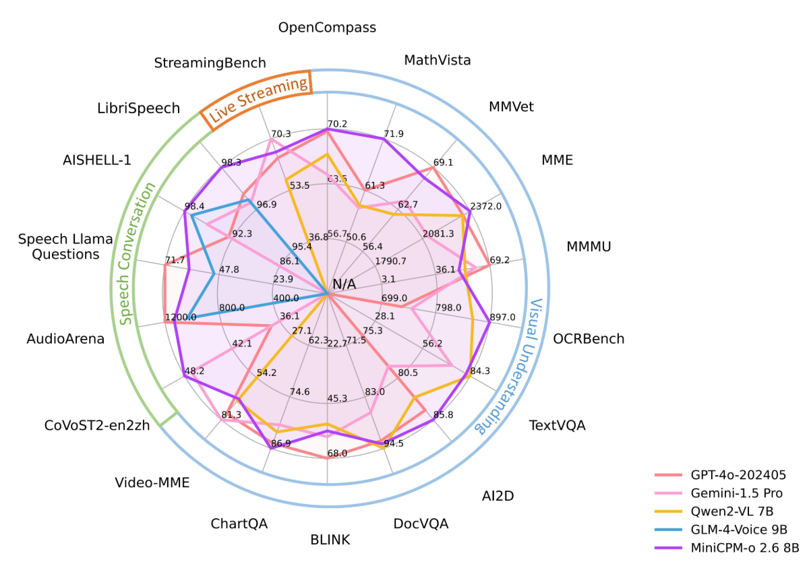

### 使用MiniCPM-V

使用run命令运行模型，若此前本地未下载，ollama会先下载模型再运行

```bash
ollama run minicpm-v:8b
```

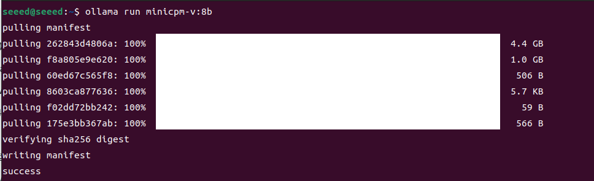

### 对话测试

```bash
who are you?
```

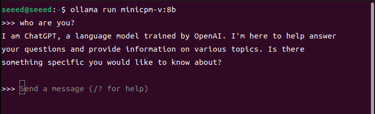

### 视觉功能


```bash
What do you see in this picture? :./test.png
# 在对话中使用 ": + 图片的路径"，就可以让模型使用它的视觉功能，让它解析图片中的信息
```

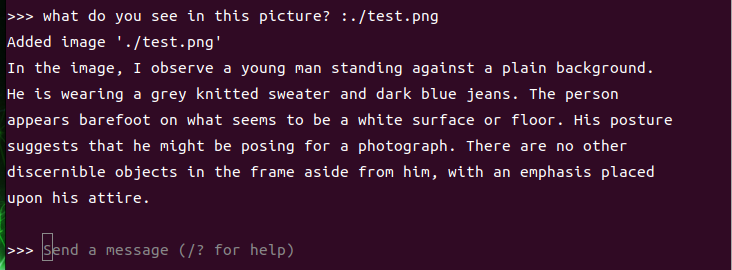

### 结束对话

使用Ctrl+d快捷键或者/bye可以结束对话！

### 参考资料

```
Ollama
```

官网：https://ollama.com/

GitHub：https://github.com/ollama/ollama

```
MiniCPM-V
```

GitHub：https://github.com/OpenBMB/MiniCPM-o

Ollama对应模型：https://ollama.com/library/minicpm-v

## 11.03-05多模态视觉理解应用

### 概念介绍

### 视觉理解是什么？

视觉理解是指赋予计算机像人类一样理解图像或视频内容的能力，使其不仅能够识别画面中出现的对象和场景，还能进一步理解这些对象之间的关系、所处状态以及正在发生的行为或事件。它关注的是视觉信息背后的语义和逻辑，而不仅是简单的分类或检测。通过将视觉信息与语言信息相结合，模型可以对图像进行描述、回答问题、进行推理甚至辅助决策，因此视觉理解已成为多模态大模型、自动驾驶、智能监控以及人机交互等领域中的关键技术能力之一。

### 实现原理

视觉理解的实现主要依赖将视觉信息与语言信息输入多模态大模型进行处理，其过程可以分为以下几个步骤：

### 代码解析

### 关键代码

#### 工具层入口(largemodel/utils/tools_manager.py)

此文件中的seewhat函数定义了该工具的执行流程。

```bash
# From largemodel/utils/tools_manager.py
class ToolsManager:
# ...
def seewhat(self):
"""
Capture camera frame and analyze environment with AI model.
捕获摄像头画面并使用AI模型分析环境。
:return: Dictionary with scene description and image path, or None if failed.
"""
self.node.get_logger().info("Executing seewhat() tool")
image_path = self.capture_frame()
if image_path:
# Use isolated context for image analysis. / 使用隔离的上下文进行图像分析。
analysis_text = self._get_actual_scene_description(image_path)
# Return structured data for the tool chain. / 为工具链返回结构化数据。
return {
"description": analysis_text,
"image_path": image_path
}
else:
# ... (Error handling)
return None
def _get_actual_scene_description(self, image_path, message_context=None):
"""
Get AI-generated scene description for captured image.
获取捕获图像的AI生成场景描述。
:param image_path: Path to captured image file.
:return: Plain text description of scene.
"""
try:
# ... (构建Prompt)
result = self.node.model_client.infer_with_image(image_path, scene_prompt, message=simple_context)
# ... (处理结果)
return description
except Exception as e:
# ...
```

#### 模型接口层(largemodel/utils/large_model_interface.py)

此文件中的infer_with_image函数是所有图像理解任务的统一入口，它负责根据配置调用具体的模型实现。

```bash
# From largemodel/utils/large_model_interface.py
class model_interface:
# ...
def infer_with_image(self, image_path, text=None, message=None):
"""Unified image inference interface. / 统一的图像推理接口。"""
# ... (准备消息)
try:
# 根据 self.llm_platform 的值，决定调用哪个具体实现
if self.llm_platform == 'ollama':
response_content = self.ollama_infer(self.messages, image_path=image_path)
elif self.llm_platform == 'tongyi':
# ... 调用通义模型的逻辑
pass
# ... (其他平台的逻辑)
# ...
return {'response': response_content, 'messages': self.messages.copy()}
```

### 代码解析

该功能的实现采用了分层架构设计，主要由工具层与模型接口层两部分构成。两者职责清晰、相互解耦，是平台具备通用性与可扩展性的核心基础。

工具层负责承载业务逻辑，其中seewhat函数是整个视觉理解流程的核心实现。

通过这种方式，工具层专注于业务流程本身，而不被模型实现细节所干扰。

模型接口层承担着模型适配与调度的职责，其核心函数为infer_with_image。

正因如此，工具层代码无需任何修改，即可在不同的大模型后端之间自由切换，从而显著提升系统的可移植性与扩展能力。

seewhat工具的执行流程体现了一种典型的职责分离（Separation of Concerns）设计模式：

这种架构使得核心业务逻辑在在线或离线模式下保持完全一致，仅需切换模型配置即可适配不同运行环境，极大提升了教程与代码的通用性和复用价值。

### 配置离线大模型

#### 配置LLM平台(seeed.yaml)

此文件决定了model_service节点加载哪个大模型平台作为其主要的语言模型。

#### 在终端打开文件:

```bash
代码块
vim /opt/seeed/development_guide/12_llm_offline/seeed_ws/src/largemodel/config/seeed.yaml
```

#### 修改/确认llm_platform:

```bash
model_service: # 模型服务器节点参数
ros__parameters:
language: 'zh' # 大模型接口语言
useolinetts: True # 文字模式下此项无效，可忽略
# 大模型配置
llm_platform: 'ollama' # 关键: 确保这里是 'ollama'
regional_setting : "China"
```

#### 配置模型接口(large_model_interface.yaml)

此文件定义了当平台被选为ollama时，具体使用哪个视觉模型。

在终端打开文件

```bash
vim /opt/seeed/development_guide/12_llm_offline/seeed_ws/src/largemodel/config/large_model_interface.yaml
```

找到ollama相关的配置

```bash
# .....
# 离线大模型 (Offline Large Language Models)
# Ollama配置
ollama_host: "http://127.0.0.1:11434" # Ollama服务器地址
ollama_model: "qwen2.5vl:3b" # 关键: 将这里改为你已下载的多模态模型
# .....
```

```
注意: 请确保配置参数中指定的模型（如qwen2.5vl）能够处理多模态输入。
```

### 启动并测试功能(文本输入模式)

连接上USB摄像头然后启动largemodel主程序(文字模式):打开一个终端，然后运行下面的指令：

```bash
cd /opt/seeed/development_guide/12_llm_offline/seeed_ws
source install/setup.bash
ros2 launch largemodel largemodel_control.launch.py text_chat_mode:=true
```

```
如果报错显示 numpy 的版本不匹配，您可以通过 pip install numpy==2.0.0 命令更新版本。
```

发送文本指令:再次打开另一个终端，运行下面的指令，

```bash
cd /opt/seeed/development_guide/12_llm_offline/seeed_ws
source install/setup.bash
ros2 run text_chat text_chat
```

然后开始输入文本：你看到了什么。

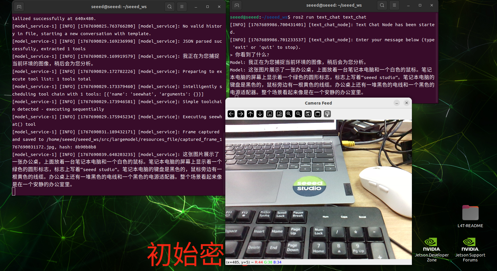

观察结果:在第一个运行主程序的终端中，你将看到日志输出，显示系统接收到文本指令，并打印出由qwen2.5vl模型生成的对摄像头捕捉到的画面的文字描述。

### 常见问题与解决方案

#### 问题1：日志显示"Failed to call ollama vision model"或连接被拒绝。

#### 解决方案:

#### 问题2：seewhat工具返回"无法打开摄像头"或拍照失败。

#### 解决方案:

## 11.03-06多模态文生图应用

### 概念介绍

### 什么是文生图（Text-to-Image）？

文生图（Text-to-Image）是一种人工智能生成技术，指的是模型根据用户输入的自然语言描述，自动生成与文字语义相匹配的图像。它不仅能理解“画面里有什么”，还能理解风格、场景、情绪和细节要求，例如“在草地上晒太阳的蓝色猫，卡通风格，柔和光线”。文生图技术通常基于大规模视觉-语言模型和扩散模型，通过学习海量图文对应关系，将抽象的文字转化为具体、可视化的画面，已广泛应用于艺术创作、内容生成、产品设计和教育科普等领域。

#### 核心原理

```
ollama框架不支持文生图的功能，本章我们其他工具来实现本地文生图功能。
```

### 什么是FastSDCPU？

FastSD CPU是一个在CPU上运行的轻量级Stable Diffusion推理框架，旨在无需GPU也能生成高质量图像。它通过优化模型加载、推理流程和多线程计算，实现文本到图像（Text-to-Image）的快速生成，同时支持LoRA、ControlNet等扩展模块。FastSD CPU特别适合硬件资源有限的环境，如普通PC或嵌入式设备，让更多用户在无需高性能显卡的情况下体验AI图像生成。

#### 核心特点

#### 适用场景

### 项目部署

### 部署环境

```
注意：如果使用我们的出厂镜像，无需部署环境，可直接跳过部署步骤。直接参考最下面的 【2.4 部署成功后启动方法】，直接启动即可。
```

打开一个终端，然后执行以下代码：

```bash
# 如果之前没安装git，就先运行
sudo apt update
sudo apt install git -y
sudo apt install python3.10-venv -y
# 添加环境变量
echo 'export PATH="$HOME/.local/bin:$PATH"' >> ~/.bashrc
source ~/.bashrc
```

克隆项目

```bash
git clone https://github.com/rupeshs/fastsdcpu.git
cd fastsdcpu
```

创建虚拟环境并安装依赖

```bash
python -m venv venv
source venv/bin/activate
# 安装uv
curl -Ls https://astral.sh/uv/install.sh | sh
```

```
这一步如果在中国没有挂代理可能会无法成功，如果不超过可以跳过这一步，执行以下命令
```

```bash
wget https://mirrors.huaweicloud.com/astral/uv/0.8.4/uv-aarch64-unknown-linux-gnu -O ~/.local/bin/uv
chmod +x ~/.local/bin/uv
```

安装环境

```bash
chmod +x install.sh start-webui.sh
# 安装
./install.sh --disable-gui
```

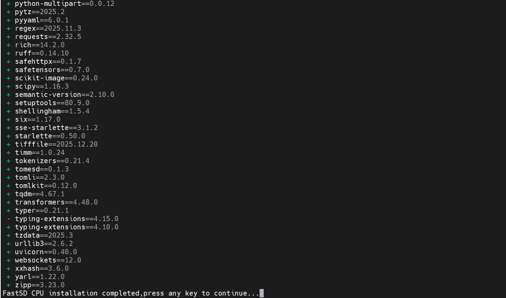

安装成功，按任意键退出：

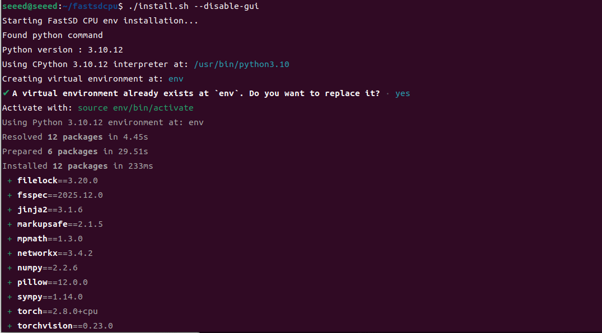

### 局域网访问

启动之前，需要修改一个文件，用于支持局域网的访问，否则只能本地访问webui：

```bash
vim /opt/seeed/development_guide/12_llm_offline/fastsdcpu/src/frontend/webui/ui.py
```

打开ui.py文件之后，翻到最后一行，找到webui.launch(share=share)这句代码，修改成webui.launch(server_name="0.0.0.0",share=share)

然后保存

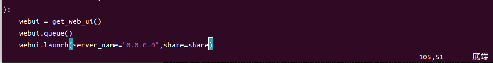

启动：

```bash
./start-webui.sh
```

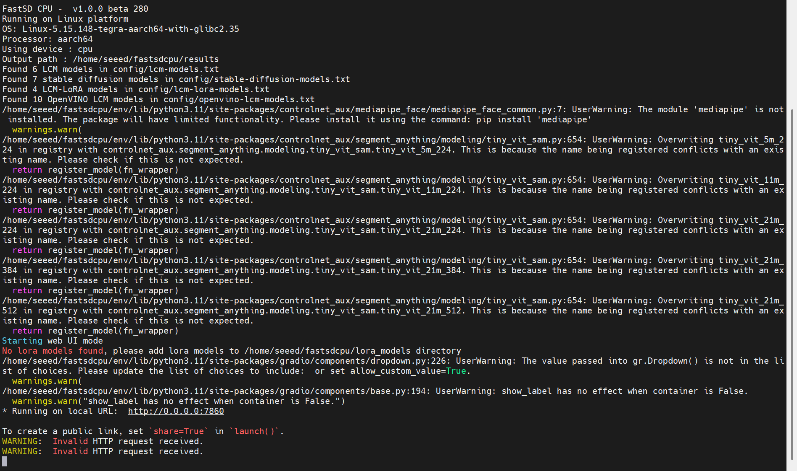

然后就可以在浏览器上面输入你的主板IP:7860来访问这个webui了。

### 使用文生图功能

在终端使用ifconfig命令查看Jetson的IP，例如我的是192.168.137.47。

然后我们就打开浏览器，输入你的主板ip:7860。例如我，就输入192.168.137.47:7860，然后就能进入webui了。

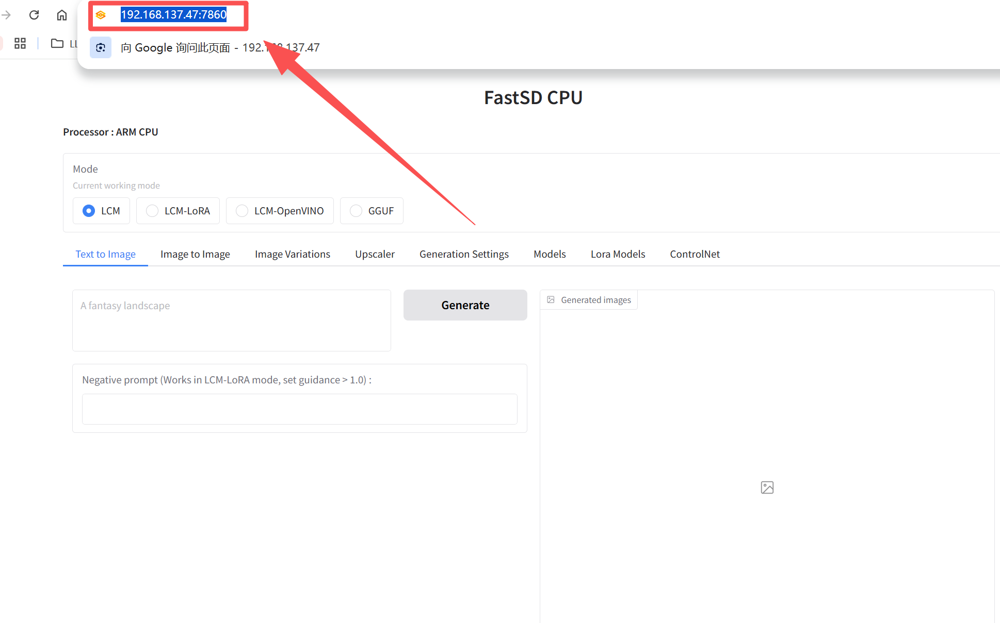

接着我们点击LCM-LoRA，这个模型对内存的占用比较小，如果想使用其他模型，可以自行研究。

然后再点击Models，可以看到LCM LoRA的模型设置，可以自己更改自己想要的模型，也可以和我一样选择默认的就可以了。

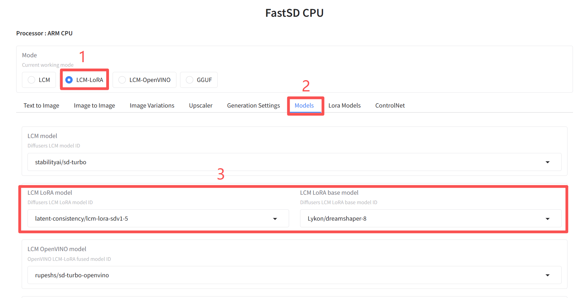

接着点击Generation Settings，将里面的Inference Steps拉高，可以提高生成图片的质量，我这里拉到5.

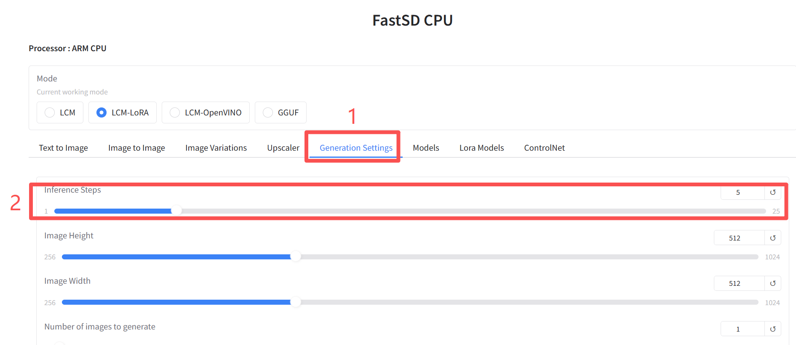

接着继续回到我们的Text to Image中，在对话框里输入我们想生成的内容，接着按Generate，就可以开始生成图片了。

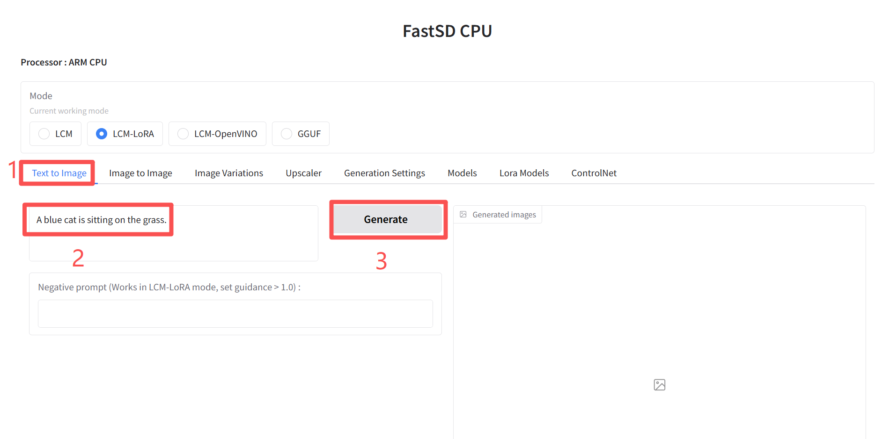

首次使用的话，需要下载模型，可以在终端看到刚才默认选择的模型正在被下载中，等它下载完毕之后，就会开始执行文生图的功能。

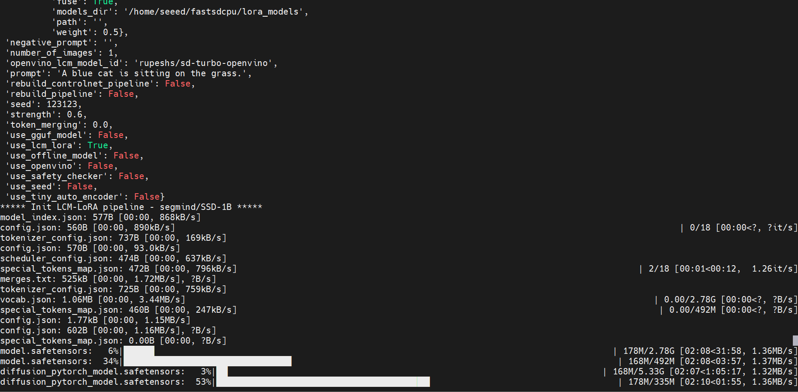

生成的结果：

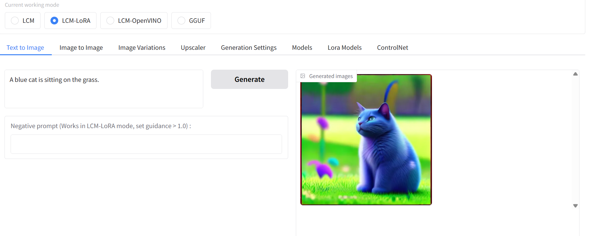

```
注：英文的提示词支持会更好，生成的图片会更贴合描述。建议使用英文描述来生成图片。
```

### 部署成功后启动方法

```bash
cd fastsdcpu # 进入fastsdcpu的目录
source venv/bin/activate # 进入虚拟环境
./start-webui.sh # 启动webui
```

webui启动成功后，就在浏览器上输入你的主板IP:7860，就可以开始文生图功能了。

## 11.03-07多模态视频分析应用

### 概念介绍

### 视频分析是什么？

视频分析是指利用计算机视觉与人工智能技术，对视频流中的图像序列进行自动理解与处理的过程。它通过对视频中每一帧及其时间关系进行分析，实现对目标的检测、识别、跟踪以及行为和事件的理解，从而将原始的视频数据转化为可解释、可决策的信息，广泛应用于安防监控、智能交通、工业检测和智能交互等场景。

### 实现原理简述

离线视频分析的核心在于高效处理大量帧，同时保留视频的关键内容和时序信息，其实现流程可以分为以下几个步骤：

总结：可以理解为，视频被“浓缩”为几张关键图片及其顺序，模型像看连环画一样理解故事内容，再用语言生成答案或描述。

### 代码解析

### 关键代码

#### 工具层入口(largemodel/utils/tools_manager.py)

此文件中的analyze_video函数定义了该工具的执行流程。

```bash
# From largemodel/utils/tools_manager.py
class ToolsManager:
# ...
def analyze_video(self, args):
"""
Analyze video file and provide content description.
分析视频文件并提供内容描述。
:param args: Arguments containing video path.
:return: Dictionary with video description and path.
"""
self.node.get_logger().info(f"Executing analyze_video() tool with args: {args}")
try:
video_path = args.get("video_path")
# ... (智能路径回退机制)
if video_path and os.path.exists(video_path):
# ... (构建Prompt)
# Use a fully isolated, one-time context for video analysis to ensure a plain text description. / 使用完全隔离的一次性上下文进行视频分析，以确保获得纯文本描述。
simple_context = [{
"role": "system",
"content": "You are a video description assistant. ..."
}]
result = self.node.model_client.infer_with_video(video_path, prompt, message=simple_context)
# ... (处理结果)
return {
"description": description,
"video_path": video_path
}
# ... (错误处理)
```

#### 模型接口层与帧提取(largemodel/utils/large_model_interface.py)

此文件中的函数负责处理视频文件，并将其传递给底层模型。

```bash
# From largemodel/utils/large_model_interface.py
class model_interface:
# ...
def infer_with_video(self, video_path, text=None, message=None):
"""Unified video inference interface. / 统一的视频推理接口。"""
# ... (准备消息)
try:
# 根据 self.llm_platform 决定调用哪个具体实现
if self.llm_platform == 'ollama':
response_content = self.ollama_infer(self.messages, video_path=video_path)
# ... (其他在线平台的逻辑)
# ...
return {'response': response_content, 'messages': self.messages.copy()}
def _extract_video_frames(self, video_path, max_frames=5):
"""Extract keyframes from a video for analysis. / 从视频中提取关键帧用于分析。"""
try:
import cv2
# ... (视频读取和帧间隔计算)
while extracted_count < max_frames:
# ... (循环读取视频帧)
if frame_count % frame_interval == 0:
# ... (将帧保存为临时图片)
frame_base64 = self.encode_file_to_base64(temp_path)
frame_images.append(frame_base64)
# ...
return frame_images
# ... (异常处理)
```

### 代码解析

相较于单张图像分析，视频分析在实现上多了一层关键处理步骤——视频帧提取。该逻辑被有意放置在模型接口层中，从而保证上层业务代码的简洁与通用性。

#### 工具层（tools_manager.py）

工具层负责承载视频分析的业务入口，其核心函数为analyze_video。

这种设计使工具层始终专注于“业务意图的表达”，而非“技术细节的实现”。

#### 模型接口层（large_model_interface.py）

模型接口层是视频分析的核心处理模块，承担着任务调度与数据预处理的职责。

整体来看，视频分析的通用执行流程可以概括为：

ToolsManager发起分析请求 →model_interface接管请求并通过_extract_video_frames将视频拆解为关键帧 →model_interface根据配置将帧数据与分析指令发送至对应模型平台 → 模型返回对视频内容的综合描述 → 结果交由ToolsManager向上层应用返回。

这种分层设计有效隔离了视频处理细节与业务逻辑，确保了上层应用接口的稳定性，同时也为后续扩展不同模型或平台提供了良好的通用基础。

### 实践操作

### 配置离线大模型

#### 配置LLM平台(seeed.yaml)

此文件决定了model_service节点加载哪个大模型平台作为其主要的语言模型。

#### 在终端打开文件:

```bash
代码块
vim /opt/seeed/development_guide/12_llm_offline/seeed_ws/src/largemodel/config/seeed.yaml
```

#### 修改/确认llm_platform:

```bash
model_service: # 模型服务器节点参数
ros__parameters:
language: 'zh' # 大模型接口语言
useolinetts: True # 文字模式下此项无效，可忽略
# 大模型配置
llm_platform: 'ollama' # 关键: 确保这里是 'ollama'
regional_setting : "China"
```

#### 配置模型接口(large_model_interface.yaml)

此文件定义了当平台被选为ollama时，具体使用哪个视觉模型。

在终端打开文件

```bash
vim /opt/seeed/development_guide/12_llm_offline/seeed_ws/src/largemodel/config/large_model_interface.yaml
```

找到ollama相关的配置

```bash
# .....
离线大模型 (Offline Large Language Models)
Ollama配置
ollama_host: "http://127.0.0.1:11434" # Ollama服务器地址
ollama_model: "qwen2.5vl:3b" # 关键: 将这里改为你已下载的多模态模型，如 "llava"
# .....
```

```
注意: 请确保配置参数中指定的模型（如 qwen2.5vl）能够处理多模态输入。
```

### 启动并测试功能(文本输入模式)

```bash
ros2 launch largemodel largemodel_control.launch.py text_chat_mode:=true
```

发送文本指令:再次打开另一个终端，运行下面的指令，

```bash
ros2 run text_chat text_chat
```

然后开始输入文本：分析一下这个视频。

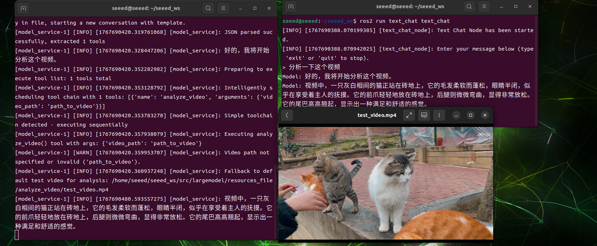

观察结果:在第一个运行主程序的终端中，你将看到日志输出，显示系统接收到指令，调用analyze_video工具，提取关键帧，并最终打印出AI对视频内容的摘要。

### 常见问题与解决方案

#### 问题1：提示"找不到视频文件"或"无法从视频中提取关键帧"。

#### 解决方案:

#### 问题2：分析一个较长的视频非常耗时。

#### 解决方案:

## 11.03-08多模态视觉定位应用

### 概念介绍

### 多模态视觉定位是什么？

多模态视觉定位是指融合来自不同传感器或不同信息模态的数据（如RGB图像、深度信息、激光雷达、IMU或语义信息等），通过统一建模与协同推理，实现对设备或目标在空间中位置与姿态的精确估计。相比单一视觉定位方式，多模态视觉定位能够充分利用各模态的互补优势，在光照变化、纹理稀疏或动态环境等复杂场景下显著提升定位的稳定性、鲁棒性和精度，常用于机器人导航、自动驾驶和增强现实等领域。

### 实现原理简述

### 代码解析

### 关键代码

#### 工具层入口(largemodel/utils/tools_manager.py)

此文件中的visual_positioning函数定义了该工具的执行流程，特别是它如何构建一个包含目标物体名称和格式要求的Prompt。

```bash
# From largemodel/utils/tools_manager.py
class ToolsManager:
# ...
def visual_positioning(self, args):
"""
Locate object coordinates in image and save results to MD file.
定位图像中物体坐标并将结果保存为MD文件。
:param args: Arguments containing image path and object name.
:return: Dictionary with file path and coordinate data.
"""
self.node.get_logger().info(f"Executing visual_positioning() tool with args: {args}")
try:
image_path = args.get("image_path")
object_name = args.get("object_name")
# ... (路径回退机制和参数检查)
# Construct a prompt asking the large model to identify the coordinates of the specified object. / 构造提示，要求大模型识别指定物品的坐标。
if self.node.language == 'zh':
prompt = f"请仔细分析这张图片，用一个个框定位图像每一个{object_name}的位置..."
else:
prompt = f"Please carefully analyze this image and find the position of all {object_name}..."
# ... (构建独立的message上下文)
result = self.node.model_client.infer_with_image(image_path, prompt, message=message_to_use)
# ... (处理和解析返回的坐标文本)
return {
"file_path": md_file_path,
"coordinates_content": coordinates_content,
"explanation_content": explanation_content
}
# ... (错误处理)
```

#### 模型接口层(largemodel/utils/large_model_interface.py)

此文件中的infer_with_image函数是所有图像相关任务的统一入口。

```bash
# From largemodel/utils/large_model_interface.py
class model_interface:
# ...
def infer_with_image(self, image_path, text=None, message=None):
"""Unified image inference interface. / 统一的图像推理接口。"""
# ... (准备消息)
try:
# 根据 self.llm_platform 的值，决定调用哪个具体实现
if self.llm_platform == 'ollama':
response_content = self.ollama_infer(self.messages, image_path=image_path)
elif self.llm_platform == 'tongyi':
# ... 调用通义模型的逻辑
pass
# ... (其他平台的逻辑)
# ...
return {'response': response_content, 'messages': self.messages.copy()}
```

### 代码解析

视觉定位功能的核心思想在于通过精确的指令设计，引导大语言模型输出可解析的结构化结果。在整体架构上，该功能同样遵循工具层与模型接口层解耦的分层设计原则。

#### 工具层（tools_manager.py）

在工具层中，visual_positioning函数承担了视觉定位任务的主要业务逻辑。

通过这种方式，工具层既负责任务定义，也负责结果的结构化落地。

#### 模型接口层（large_model_interface.py）

模型接口层中的infer_with_image函数在视觉定位场景下依旧扮演着“调度中心”的角色。

视觉定位功能的通用执行流程可以概括为：

ToolsManager接收目标物体名称并构建精确的、要求返回坐标信息的Prompt → ToolsManager调用模型接口 →model_interface将图像与Prompt打包，并根据配置发送至相应模型平台 → 模型返回包含位置信息的文本结果 →model_interface将结果返回给ToolsManager → ToolsManager对文本进行解析，提取结构化坐标数据并返回给上层应用。

该流程充分展示了如何借助Prompt Engineering技术，使通用的视觉大模型完成更具体、更可控、且结构化输出的视觉定位任务。

### 实践操作

### 配置离线大模型

#### 配置LLM平台(seeed.yaml)

此文件决定了model_service节点加载哪个大模型平台作为其主要的语言模型。

#### 在终端打开文件:

```bash
代码块
vim /opt/seeed/development_guide/12_llm_offline/seeed_ws/src/largemodel/config/seeed.yaml
```

#### 修改/确认llm_platform:

```bash
model_service: # 模型服务器节点参数
ros__parameters:
language: 'zh' # 大模型接口语言
useolinetts: True # 文字模式下此项无效，可忽略
# 大模型配置
llm_platform: 'ollama' # 关键: 确保这里是 'ollama'
regional_setting : "China"
```

#### 配置模型接口(large_model_interface.yaml)

此文件定义了当平台被选为ollama时，具体使用哪个视觉模型。

在终端打开文件

```bash
vim /opt/seeed/development_guide/12_llm_offline/seeed_ws/src/largemodel/config/large_model_interface.yaml
```

找到ollama相关的配置

```bash
# .....
离线大模型 (Offline Large Language Models)
Ollama配置
ollama_host: "http://127.0.0.1:11434" # Ollama服务器地址
ollama_model: "qwen2.5vl:3b" # 关键: 将这里改为你已下载的多模态模型
# .....
```

```
注意: 请确保配置参数中指定的模型（如qwen2.5vl）能够处理多模态输入。
```

### 3.2启动并测试功能(文字模式)

#### 准备图片文件:

```bash
ros2 launch largemodel largemodel_control.launch.py text_chat_mode:=true
```

发送文本指令:再次打开另一个终端，运行下面的指令，

```bash
ros2 run text_chat text_chat
```

然后开始输入文本：“分析一下图片中xiaomao的位置”。

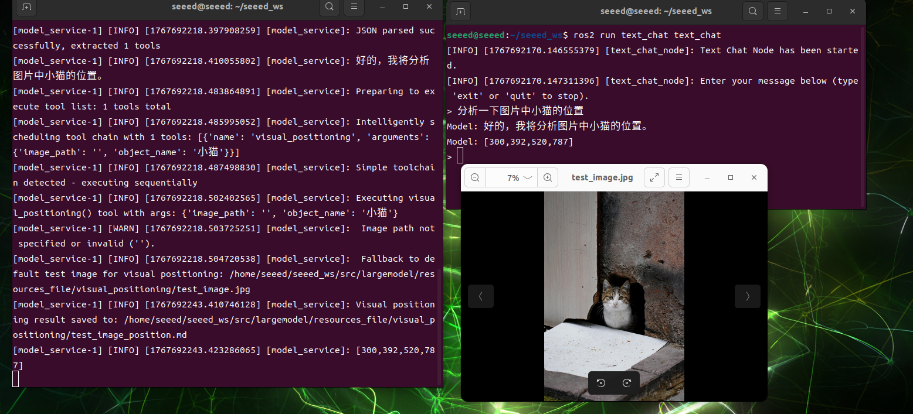

观察结果:在第一个运行主程序的终端中，你将看到日志输出，显示系统接收到指令，调用visual_positioning工具，提示visual_positioning执行完成，并且将坐标保存到了文档。

我们可以到/opt/seeed/development_guide/12_llm_offline/seeed_ws/src/largemodel/resources_file/visual_positioning路径下找到这个文档。

### 1.常见问题与解决方案

#### 问题1：提示"找不到图片文件"

#### 解决方案:

## 11.03-09多模态表格扫描应用

### 概念介绍

### 多模态表格扫描是什么？

多模态表格扫描是指结合图像、文本等多种信息模态，对纸质或电子文档中的表格内容进行自动识别、理解与结构化重建的技术。它不仅能够从图像中检测表格区域、识别单元格结构和文字内容，还会融合语义上下文对表头、字段含义及数据关系进行理解，从而将非结构化或半结构化的表格信息转换为可编辑、可计算的结构化数据，广泛应用于文档数字化、财务报表处理和智能办公等场景。

### 实现原理

1.表格定位与信息识别首先，系统通过计算机视觉方法在文档中自动检测表格区域，并结合OCR技术对表格内的文字内容进行识别与转写。随后，借助深度学习模型对表格结构进行解析，包括行列划分、单元格边界以及合并关系等，从而将原始表格转化为具有明确结构的数字化表示。

2.多模态信息融合与理解在获得表格的视觉结构与文本内容后，系统会进一步融合多种模态信息，如表格布局特征、OCR结果以及相关元数据，构建统一的多模态输入表示。通过引入专门面向文档理解的多模态模型（如LayoutLM），对不同模态信息进行联合建模，从而更准确地理解表格数据的语义含义及其上下文关系，提高表格解析与结构还原的整体准确性。

### 代码解析

### 关键代码

#### 工具层入口(largemodel/utils/tools_manager.py)

此文件中的scan_table函数定义了该工具的执行流程，特别是它如何构建一个要求返回Markdown格式的Prompt。

```bash
# From largemodel/utils/tools_manager.py
class ToolsManager:
# ...
def scan_table(self, args):
"""
Scan a table from an image and save the content as a Markdown file.
从图像中扫描表格，并将内容保存为Markdown文件。
:param args: Arguments containing the image path.
:return: Dictionary with file path and content.
"""
self.node.get_logger().info(f"Executing scan_table() tool with args: {args}")
try:
image_path = args.get("image_path")
# ... (路径检查和回退)
# Construct a prompt asking the large model to recognize the table and return it in Markdown format.
# 构造提示，要求大模型识别表格并以Markdown格式返回。
if self.node.language == 'zh':
prompt = "请仔细分析这张图片，识别其中的表格，并将其内容以Markdown格式返回。"
else:
prompt = "Please carefully analyze this image, identify the table within it, and return its content in Markdown format."
result = self.node.model_client.infer_with_image(image_path, prompt)
# ... (从结果中提取Markdown文本)
# Save the recognized content to a Markdown file. / 将识别出的内容保存到Markdown文件。
md_file_path = os.path.join(self.node.pkg_path, "resources_file", "scanned_tables", f"table_{timestamp}.md")
with open(md_file_path, 'w', encoding='utf-8') as f:
f.write(table_content)
return {
"file_path": md_file_path,
"table_content": table_content
}
# ... (错误处理)
```

#### 模型接口层(largemodel/utils/large_model_interface.py)

此文件中的infer_with_image函数是所有图像相关任务的统一入口。

```bash
# From largemodel/utils/large_model_interface.py
class model_interface:
# ...
def infer_with_image(self, image_path, text=None, message=None):
"""Unified image inference interface. / 统一的图像推理接口。"""
# ... (准备消息)
try:
# 根据 self.llm_platform 的值，决定调用哪个具体实现
if self.llm_platform == 'ollama':
response_content = self.ollama_infer(self.messages, image_path=image_path)
elif self.llm_platform == 'tongyi':
# ... 调用通义模型的逻辑
pass
# ... (其他平台的逻辑)
# ...
return {'response': response_content, 'messages': self.messages.copy()}
```

### 代码解析

表格扫描功能是将非结构化的图像数据转换为结构化文本数据的典型应用。其核心技术依然是通过Prompt Engineering引导模型行为。

总结来说，表格扫描的通用流程是：ToolsManager接收图像并构建一个“将此图中的表格转为Markdown”的指令->ToolsManager调用模型接口->model_interface将图像和该指令打包，并根据配置发送给相应的模型平台->模型返回Markdown格式的文本->model_interface将文本返回给ToolsManager->ToolsManager将文本保存为.md文件并返回结果。这个流程展示了如何利用大模型的格式遵循能力，将其用作一个强大的OCR（光学字符识别）及数据结构化工具。

### 实践操作

### 配置离线大模型

#### 配置LLM平台(seeed.yaml)

此文件决定了model_service节点加载哪个大模型平台作为其主要的语言模型。

#### 在终端打开文件:

```bash
代码块
vim /opt/seeed/development_guide/12_llm_offline/seeed_ws/src/largemodel/config/seeed.yaml
```

#### 修改/确认llm_platform:

```bash
model_service: # 模型服务器节点参数
ros__parameters:
language: 'zh' # 大模型接口语言
useolinetts: True # 文字模式下此项无效，可忽略
# 大模型配置
llm_platform: 'ollama' # 关键: 确保这里是 'ollama'
regional_setting : "China"
```

#### 配置模型接口(large_model_interface.yaml)

此文件定义了当平台被选为ollama时，具体使用哪个视觉模型。

在终端打开文件

```bash
vim /opt/seeed/development_guide/12_llm_offline/seeed_ws/src/largemodel/config/large_model_interface.yaml
```

找到ollama相关的配置

```bash
# .....
离线大模型 (Offline Large Language Models)
Ollama配置
ollama_host: "http://127.0.0.1:11434" # Ollama服务器地址
ollama_model: "qwen2.5vl:3b" # 关键: 将这里改为你已下载的多模态模型，如 "llava"
# .....
```

```
注意: 请确保配置参数中指定的模型（如qwen2.5vl）能够处理多模态输入。
```

### 启动并测试功能(文字模式)

```bash
ros2 launch largemodel largemodel_control.launch.py text_chat_mode:=true
```

发送文本指令:再次打开另一个终端，运行下面的指令，

```bash
ros2 run text_chat text_chat
```

然后开始输入文本：“分析一下表格”。

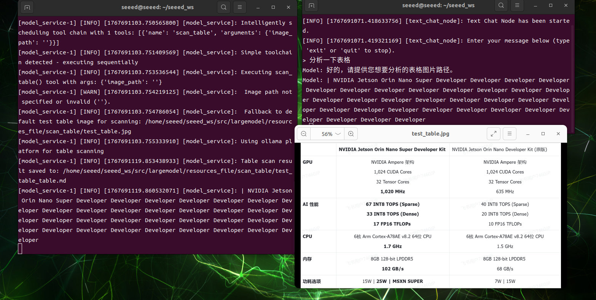

观察结果:在第一个运行主程序的终端中，你将看到日志输出，显示系统接收到指令，调用scan_table工具，提示scan_table执行完成，将扫描到的信息保存到了文档。

我们可以到/opt/seeed/development_guide/12_llm_offline/seeed_ws/src/largemodel/resources_file/scan_table路径下找到这个文档。

### 常见问题与解决方案

#### 问题1：表格内容识别不全或出现错别字。

#### 解决方案:

#### 问题2：提示"找不到表格文件"

#### 解决方案:

## 11.03-10多模态自主代理应用

### 概念介绍

### 自主代理是什么？

多模态自主代理是指能够同时感知、理解并融合多种信息模态（如文本、图像、语音、视频、传感器数据等），并在此基础上自主进行决策与行动的智能系统。它通常以大语言模型为认知核心，结合视觉、听觉和环境感知能力，在较少人工干预的情况下完成目标规划、任务分解、工具调用与持续反馈，从而实现对复杂真实世界场景的自主理解与协同执行，广泛应用于智能助手、机器人系统和自动化决策等领域。

### 实现原理简述

largemodel中的自主代理实现遵循业界主流的ReAct（Reason + Act）范式，其核心思想是模拟人类在解决问题时“思考-行动-观察”的循环过程，通过多轮迭代完成复杂任务。

#### 思考（Reason）

#### 行动（Act）

#### 观察（Observe）

#### 再次思考（Reason）

#### 循环迭代直至目标完成

这种设计使自主代理能够在多模态环境下连续决策、自我修正、动态调整，实现对复杂任务的自主规划和执行。

### 代码解析

### 关键代码

#### Agent核心工作流(largemodel/utils/ai_agent.py)

_execute_agent_workflow函数是Agent的执行主循环，它定义了“规划->执行”的核心流程。

```bash
# From largemodel/utils/ai_agent.py
class AIAgent:
# ...
def _execute_agent_workflow(self, task_description: str) -> Dict[str, Any]:
"""
Executes the agent workflow: Plan -> Execute. / 执行Agent工作流：规划 -> 执行。
"""
try:
# 第一步：任务规划
self.node.get_logger().info("AI Agent starting task planning phase")
plan_result = self._plan_task(task_description)
# ... (规划失败则提前返回)
self.task_steps = plan_result["steps"]
# 第二步：按顺序执行所有步骤
execution_results = []
tool_outputs = []
for i, step in enumerate(self.task_steps):
# 2.1. 在执行前，处理参数中的数据引用
processed_parameters = self._process_step_parameters(step.get("parameters", {}), tool_outputs)
step["parameters"] = processed_parameters
# 2.2. 执行单个步骤
step_result = self._execute_step(step, tool_outputs)
execution_results.append(step_result)
# 2.3. 如果步骤成功，保存其输出以供后续步骤引用
if step_result.get("success") and step_result.get("tool_output"):
tool_outputs.append(step_result["tool_output"])
else:
# 如果任一步骤失败，中止整个任务
return { "success": False, "message": f"Task terminated because step '{step['description']}' failed." }
# ... 总结并返回最终结果
summary = self._summarize_execution(task_description, execution_results)
return { "success": True, "message": summary, "results": execution_results }
# ... (异常处理)
```

#### 任务规划与LLM交互(largemodel/utils/ai_agent.py)

_plan_task函数的核心是构建一个精密的Prompt，利用大模型自身的推理能力来生成结构化的执行计划。

```bash
# From largemodel/utils/ai_agent.py
class AIAgent:
# ...
def _plan_task(self, task_description: str) -> Dict[str, Any]:
"""
Uses the large model for task planning and decomposition. / 使用大模型进行任务规划和分解。
"""
# 动态生成可用工具列表及其描述
tool_descriptions = []
for name, adapter in self.tools_manager.tool_chain_manager.tools.items():
# ... (从adapter.input_schema获取工具描述)
tool_descriptions.append(f"- {name}({params}): {description}")
available_tools_str = "\\n".join(tool_descriptions)
# 构建高度结构化的规划Prompt
planning_prompt = f"""
作为一个专业的任务规划Agent，请将用户任务分解为一系列具体的、可执行的JSON步骤。
# 可用工具:
{available_tools_str}
# 核心规则:
数据传递: 当后续步骤需要使用之前步骤的输出时，必须使用 {{{{steps.N.outputs.KEY}}}} 格式进行引用。
N 是步骤的ID（从1开始）。
KEY 是之前步骤输出数据中的具体字段名。
JSON格式: 必须严格返回JSON对象。
# 用户任务:
{task_description}
"""
# 调用大模型进行规划
messages_to_use = [{"role": "user", "content": planning_prompt}]
# 注意这里调用的是通用的文本推理接口
result = self.node.model_client.infer_with_text("", message=messages_to_use)
# ... (解析JSON响应并返回步骤列表)
```

#### 参数处理与数据流实现(largemodel/utils/ai_agent.py)

_process_step_parameters函数负责解析占位符，实现步骤间的数据流动。

```bash
# From largemodel/utils/ai_agent.py
class AIAgent:
# ...
def _process_step_parameters(self, parameters: Dict[str, Any], previous_outputs: List[Any]) -> Dict[str, Any]:
"""
Parses parameter dictionary, finds and replaces all {{...}} references.
"""
processed_params = parameters.copy()
# 正则表达式用于匹配 {{steps.N.outputs.KEY}} 格式的占位符
pattern = re.compile(r"\\{\\{steps\\.(\\d+)\\.outputs\\.(.+?)\\}\\}")
for key, value in processed_params.items():
if isinstance(value, str) and pattern.search(value):
# 使用 re.sub 和一个替换函数来处理所有找到的占位符
# 替换函数会从 previous_outputs 列表中查找并返回值
processed_params[key] = pattern.sub(replacer_function, value)
return processed_params
```

### 代码解析

AI Agent是系统的“中枢大脑”，它将用户提出的高级、有时甚至是模糊的任务，转化为一系列精确、有序的工具调用。其实现不依赖于任何特定的模型平台，而是建立在通用的、可扩展的架构之上。

总结来说，AI Agent的通用实现展示了一种先进的软件架构：它不直接解决问题，而是构建一个框架，让一个外部的、通用的推理引擎（大模型）来解决问题。通过“动态规划”和“数据流管理”这两个核心机制，Agent能够将一系列独立的工具编排成复杂的、能够完成高级任务的工作流。

### 实践操作

### 配置离线大模型

#### 配置LLM平台(seeed.yaml)

此文件决定了model_service节点加载哪个大模型平台作为其主要的语言模型。

#### 在终端打开文件:

```bash
代码块
vim /opt/seeed/development_guide/12_llm_offline/seeed_ws/src/largemodel/config/seeed.yaml
```

#### 修改/确认llm_platform:

```bash
model_service: # 模型服务器节点参数
ros__parameters:
language: 'zh' # 大模型接口语言
useolinetts: True # 文字模式下此项无效，可忽略
# 大模型配置
llm_platform: 'ollama' # 关键: 确保这里是 'ollama'
regional_setting : "China"
```

#### 配置模型接口(large_model_interface.yaml)

此文件定义了当平台被选为ollama时，具体使用哪个视觉模型。

在终端打开文件

```bash
vim /opt/seeed/development_guide/12_llm_offline/seeed_ws/src/largemodel/config/large_model_interface.yaml
```

找到ollama相关的配置

```bash
# .....
离线大模型 (Offline Large Language Models)
Ollama配置
ollama_host: "http://127.0.0.1:11434" # Ollama服务器地址
ollama_model: "qwen2.5vl:3b" # 关键: 将这里改为你已下载的多模态模型，如 "llava"
# .....
```

```
注意: 请确保配置参数中指定的模型（如qwen2.5vl）能够处理多模态输入。
```

### 启动并测试功能

```bash
ros2 launch largemodel largemodel_control.launch.py
```

初始化成功之后，说出唤醒词，然后开始提问：根据当前的环境，并把生成的环境描述保存成txt文档

观察结果:在第一个运行主程序的终端中，你将看到日志输出，显示系统接收到文本指令，调用aiagent工具，然后提供prompt给LLM，LLM会分析详细的调用工具的步骤。比如现在这个提问，就会调用seewhat工具获取画面，然后将画面提供给LLM解析，解析出来的文本解析出来的文本会保存在/opt/seeed/development_guide/12_llm_offline/seeed_ws/src/largemodel/resources_file/documents文件夹下。
