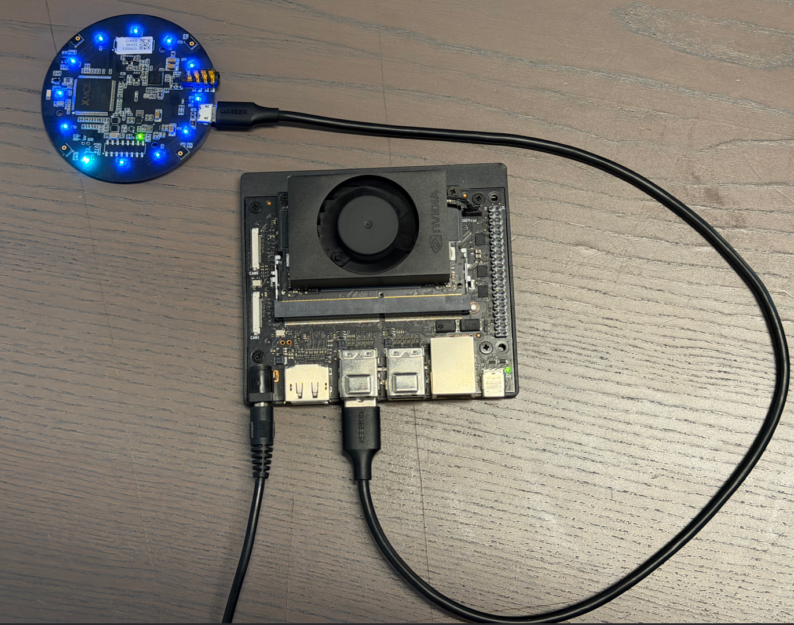
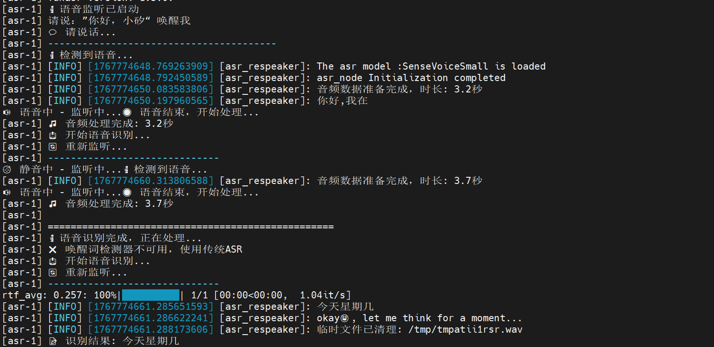
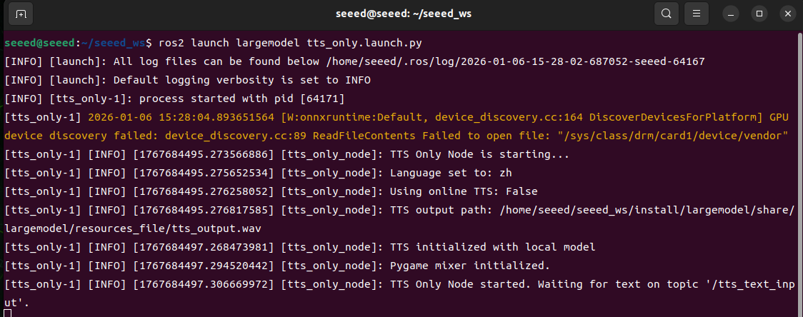
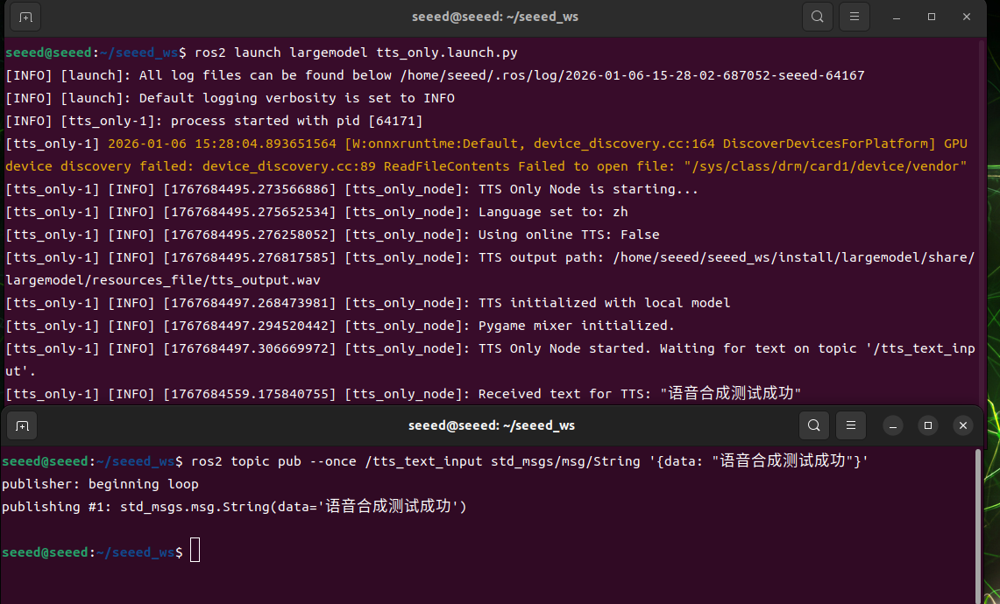
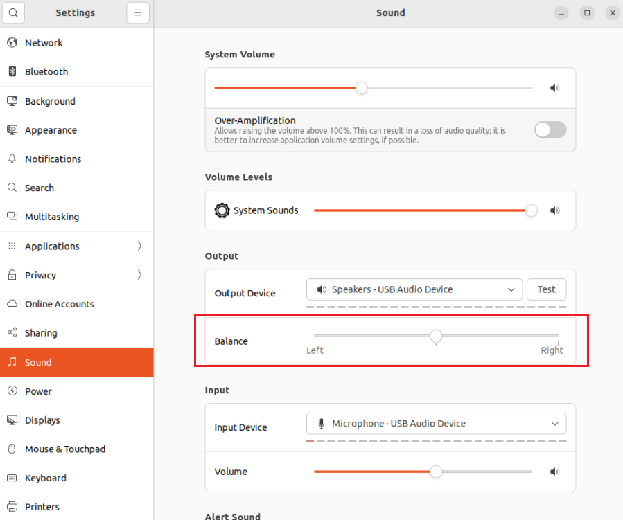
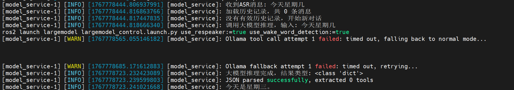

# Offline Speech Pipeline Basics

## 04离线语音链路基础（ASR/TTS/对话）

## 11.04-01语音交互硬件连接

```
注意：下面涉及到语音交互的内容将搭配我们的麦克风阵列 ReSpeaker Mic Array v3.0 进行音频识别!
```



## 11.04-02离线语音转文字（ASR）

### 概念介绍

### “ASR”是什么？

ASR（Automatic Speech Recognition，自动语音识别）是一种将人类语音信号转换为可编辑、可处理的文本的技术。它通过声学模型、语言模型和信号处理算法，将连续的语音波形分析、解码并映射成对应的文字内容，使计算机能够“听懂”语音。ASR技术广泛应用于语音助手、电话客服、实时字幕、会议记录以及人机交互等场景。

### ASR系统实现原理

现代自动语音识别（ASR）系统的实现主要依赖以下几个关键组件：

总之，现代ASR系统通过声学建模、语言建模、发音规则和解码策略的协同，结合大规模训练数据和强大算力，实现了高效、准确的人类语音到文本的转换。随着算法和计算能力的提升，ASR的识别精度不断提高，应用场景也越来越广泛，包括语音助手、实时字幕、会议记录和智能客服等。

### 代码解析

### 关键代码

```bash
cd /opt/seeed/development_guide/12_llm_offline/seeed_ws/src/largemodel/MODELS/asr/wake_word_detect/porcupine/binding/python && python setup.py install --user
```

#### 语音处理与识别核心(largemodel/largemodel/asr.py)

```bash
# From largemodel/largemodel/asr.py
def kws_handler(self)->None:
if self.stop_event.is_set():
return
if self.listen_for_speech(self.mic_index):
asr_text = self.ASR_conversion(self.user_speechdir) # 进行 ASR 转换 / Perform ASR conversion
if asr_text =='error': # 检查 ASR 结果长度是否小于4个字符 / Check if ASR result length is less than 4 characters
self.get_logger().warn("I still don't understand what you mean. Please try again")
playsound(self.audio_dict[self.error_response]) # 错误响应 / Error response
else:
self.get_logger().info(asr_text)
self.get_logger().info("okay😀, let me think for a moment...")
self.asr_pub_result(asr_text) # 发布 ASR结果 / Publish ASR result
else:
return
def ASR_conversion(self, input_file:str)->str:
if self.use_oline_asr:
result=self.modelinterface.oline_asr(input_file)
if result[0] == 'ok' and len(result[1]) > 4:
return result[1]
else:
self.get_logger().error(f'ASR Error:{result[1]}') # ASR error.
return 'error'
else:
result=self.modelinterface.SenseVoiceSmall_ASR(input_file)
if result[0] == 'ok' and len(result[1]) > 4:
return result[1]
else:
self.get_logger().error(f'ASR Error:{result[1]}') # ASR error.
return 'error'
```

#### VAD智能录音(largemodel/largemodel/asr.py)

```bash
# From largemodel/largemodel/asr.py
def listen_for_speech(self,mic_index=0):
p = pyaudio.PyAudio() # Create PyAudio instance. / 创建PyAudio实例。
audio_buffer = [] # Store audio data. / 存储音频数据。
silence_counter = 0 # Silence counter. / 静音计数器。
MAX_SILENCE_FRAMES = 90 # 30帧*30ms=900ms静音后停止 / Stop after 900ms of silence (30 frames * 30ms)
speaking = False # Flag indicating speech activity. / 语音活动标志。
frame_counter = 0 # Frame counter. / 计数器。
stream_kwargs = {
'format': pyaudio.paInt16,
'channels': 1,
'rate': self.sample_rate,
'input': True,
'frames_per_buffer': self.frame_bytes,
}
if mic_index != 0:
stream_kwargs['input_device_index'] = mic_index
# Prompt the user to speak via the buzzer. / 通过蜂鸣器提示用户讲话。
self.pub_beep.publish(UInt16(data = 1))
time.sleep(0.5)
self.pub_beep.publish(UInt16(data = 0))
try:
# Open audio stream. / 打开音频流。
stream = p.open(**stream_kwargs)
while True:
if self.stop_event.is_set():
return False
frame = stream.read(self.frame_bytes, exception_on_overflow=False) # Read audio data. / 读取音频数据。
is_speech = self.vad.is_speech(frame, self.sample_rate) # VAD detection. / VAD检测。
if is_speech:
# Detected speech activity. / 检测到语音活动。
speaking = True
audio_buffer.append(frame)
silence_counter = 0
else:
if speaking:
# Detect silence after speech activity. / 在语音活动后检测静音。
silence_counter += 1
audio_buffer.append(frame) # Continue recording buffer. / 持续记录缓冲。
# End recording when silence duration meets the threshold. / 静音持续时间达标时结束录音。
if silence_counter >= MAX_SILENCE_FRAMES:
break
frame_counter += 1
if frame_counter % 2 == 0:
self.get_logger().info('1' if is_speech else '-')
# Real-time status display.
finally:
stream.stop_stream()
stream.close()
p.terminate()
# Save valid recording (remove trailing silence). / 保存有效录音（去除尾部静音）。
if speaking and len(audio_buffer) > 0:
# Trim the last silent part. / 裁剪最后静音部分。
clean_buffer = audio_buffer[:-MAX_SILENCE_FRAMES] if len(audio_buffer) > MAX_SILENCE_FRAMES else audio_buffer
with wave.open(self.user_speechdir, 'wb') as wf:
wf.setnchannels(1)
wf.setsampwidth(p.get_sample_size(pyaudio.paInt16))
wf.setframerate(self.sample_rate)
wf.writeframes(b''.join(clean_buffer))
return True
```

### 代码解析

ASR（语音转文字）功能由ASRNode节点(asr.py)提供。该节点负责音频的录制、转换和发布。

### 实践操作

### 配置离线ASR功能

要启用离线ASR，需要正确配置seeed.yaml文件，并确保本地模型正确放置。

```bash
vim /opt/seeed/development_guide/12_llm_offline/seeed_ws/src/largemodel/config/seeed.yaml
```

#### 修改/确认以下关键配置:

```bash
asr: # 语音节点参数
ros__parameters:
# ...
use_oline_asr: False # 关键: 必须设置为 False 来启用离线ASR
mic_serial_port: "/dev/ttyUSB0" # 麦克风串口别名
mic_index: 0 # 麦克风设备索引
language: 'zh' # asr语言, 'zh' 或 'en'
regional_setting : "China"
```

```bash
vim /opt/seeed/development_guide/12_llm_offline/seeed_ws/src/largemodel/config/large_model_interface.yaml
```

找到local_asr_model相关的配置

```bash
# large_model_interface.yaml
## 离线语音识别 (Offline ASR)
local_asr_model: "/opt/seeed/development_guide/12_llm_offline/seeed_ws/src/largemodel/MODELS/asr/SenseVoiceSmall" # 本地ASR模型路径
```

### 启动并测试功能

```bash
ros2 launch largemodel asr_respeaker.launch.py use_respeaker:=true use_wake_word_detection:=true
```



## 11.04-03离线文字转语音（TTS）

### 概念介绍

### “TTS”是什么？

TTS（Text-to-Speech，文本转语音）是一种将文字信息转换为自然可听语音的技术。它通过语音合成模型，将输入的文本内容分析为语音单元，并生成带有韵律、语调和语速的语音信号，使计算机能够“说话”。TTS技术广泛应用于语音助手、导航播报、阅读软件、客服系统及无障碍辅助等场景，为文字信息提供了听觉呈现方式。

### TTS系统实现原理

文本转语音（TTS）系统的实现主要包括以下几个核心步骤：

随着人工智能和深度学习的发展，现代TTS系统在发音准确性、自然度和情感表达上都有了显著提升，使机器生成的语音越来越接近真实人声。

### 代码解析

### 关键代码

#### TTS初始化与调用(largemodel/largemodel/model_service.py)

```bash
# From largemodel/largemodel/model_service.py
class LargeModelService(Node):
def init(self):
# ...
self.system_sound_init()
# ...
def init_param_config(self):
# ...
self.declare_parameter('useolinetts', False)
self.useolinetts = self.get_parameter('useolinetts').get_parameter_value().bool_value
if self.useolinetts:
self.tts_out_path = os.path.join(self.pkg_path, "resources_file", "tts_output.mp3")
else:
self.tts_out_path = os.path.join(self.pkg_path, "resources_file", "tts_output.wav")
def system_sound_init(self):
"""Initialize TTS system"""
model_type = "oline" if self.useolinetts else "local"
self.model_client.tts_model_init(model_type, self.language)
self.get_logger().info(f'TTS initialized with {model_type} model')
def _safe_play_audio(self, text_to_speak: str):
"""
Synthesizes and plays all non-empty messages only in non-text chat mode.
"""
if not self.text_chat_mode and text_to_speak:
try:
self.model_client.voice_synthesis(text_to_speak, self.tts_out_path)
self.play_audio_async(self.tts_out_path)
except Exception as e:
self.get_logger().error(f"Safe audio playback failed: {e}")
```

#### TTS后端实现(largemodel/utils/large_model_interface.py)

```bash
# From largemodel/utils/large_model_interface.py
class model_interface:
# ...
def tts_model_init(self,model_type='oline',language='zh'):
if model_type=='oline':
if self.tts_supplier=='baidu':
self.token=self.fetch_token()
self.model_type='oline'
elif model_type=='local':
self.model_type='local'
if language=='zh':
tts_model=self.zh_tts_model
tts_json=self.zh_tts_json
elif language=='en':
tts_model=self.en_tts_model
tts_json=self.en_tts_json
self.synthesizer = piper.PiperVoice.load(tts_model, config_path=tts_json, use_cuda=False)
def voice_synthesis(self,text,path):
if self.model_type=='oline':
if self.tts_supplier=='baidu':
# ... (Baidu TTS implementation)
pass
elif self.tts_supplier=='aliyun':
# ... (Aliyun TTS implementation)
pass
elif self.model_type=='local':
with wave.open(path, 'wb') as wav_file:
wav_file.setnchannels(1)
wav_file.setsampwidth(2)
wav_file.setframerate(self.synthesizer.config.sample_rate)
self.synthesizer.synthesize(text, wav_file)
```

### 代码解析

文字转语音（TTS）功能由LargeModelService节点发起调用，由model_interface类提供具体实现。其设计通过参数配置来切换不同的后端服务。

### 实践操作

### 配置离线TTS功能

要启用离线TTS，需要正确配置seeed.yaml和large_model_interface.yaml，并确保本地模型正确放置。

```bash
vim /opt/seeed/development_guide/12_llm_offline/seeed_ws/src/largemodel/config/seeed.yaml
```

```bash
model_service: # 模型服务器节点参数
ros__parameters:
language: 'zh' # 大模型接口语言
useolinetts: False # 是否使用在线语音合成（True使用在线，False使用离线）
regional_setting : "China"
```

useolinetts这里要确保是False才能使用本地模型。

语言选择zh是中文，en是英语。

#### 打开模型接口配置文件:

```bash
vim /opt/seeed/development_guide/12_llm_offline/seeed_ws/src/largemodel/config/large_model_interface.yaml
```

#### 确认离线模型路径:

```bash
# large_model_interface.yaml
# 离线语音合成 (Offline TTS)
# 中文TTS模型
zh_tts_model: "/opt/seeed/development_guide/12_llm_offline/seeed_ws/src/largemodel/MODELS/tts/zh/zh_CN-huayan-medium.onnx"
zh_tts_json: "/opt/seeed/development_guide/12_llm_offline/seeed_ws/src/largemodel/MODELS/tts/zh/zh_CN-huayan-medium.onnx.json"
# 英文TTS模型
en_tts_model: "/opt/seeed/development_guide/12_llm_offline/seeed_ws/src/largemodel/MODELS/tts/en/en_US-libritts-high.onnx"
en_tts_json: "/opt/seeed/development_guide/12_llm_offline/seeed_ws/src/largemodel/MODELS/tts/en/en_US-libritts-high.onnx.json"
```

### 启动并测试功能

```bash
pip install ollama dashscope pygame openai piper-tts funasr
ros2 launch largemodel tts_only.launch.py
```



```bash
ros2 topic pub --once /tts_text_input std_msgs/msg/String '{data: "语音合成测试成功"}'
```



### 常见问题与解决方案

### 播放问题

#### 问题1：程序运行正常，没有报错，但听不到任何声音。

#### 解决方案:



## 11.04-04 AI大模型语音交互

### 概念介绍

### “AI大模型语音交互”是什么？

AI大模型语音交互是指将大语言模型（LLM）与语音识别（ASR）和语音合成（TTS）技术结合，使用户能够通过自然语音与智能系统进行交流。系统先将用户的语音输入转换为文本（ASR），再由大模型理解意图并生成响应内容，最后通过语音合成（TTS）将文字转化为可听语音输出。通过这种方式，AI大模型不仅能进行对话，还能理解多轮上下文，实现更自然、流畅、类人化的人机语音交互体验。

### 实现原理

AI大模型语音交互功能的实现本质上是一个经典的数据流管道（Pipeline），包括以下步骤：

### 代码解析

### 关键代码

#### 语音输入节点(largemodel/largemodel/asr.py)

```bash
# From largemodel/largemodel/asr.py
class ASRNode(Node):
def init(self):
# ...
self.asr_pub = self.create_publisher(String, "asr", 5)
# ...
def kws_handler(self)->None:
if self.listen_for_speech(self.mic_index):
asr_text = self.ASR_conversion(self.user_speechdir)
if asr_text != 'error':
self.asr_pub_result(asr_text)
def asr_pub_result(self,asr_result:str)->None:
msg=String(data=asr_result)
self.asr_pub.publish(msg)
```

#### AI服务与语音输出节点(largemodel/largemodel/model_service.py)

```bash
# From largemodel/largemodel/model_service.py
class LargeModelService(Node):
def init(self):
# ...
self.asrsub = self.create_subscription(String,'asr', self.asr_callback,1)
# ...
def asr_callback(self,msg):
"""Callback function for handling ASR messages. / 处理ASR消息的回调函数。"""
# ...
result = self.model_client.infer_with_text(msg.data, message=messages_to_use)
self.process_model_result(result)
def process_model_result(self, result, from_seewhat=False):
"""Process the result returned by the model. / 处理模型返回的结果。"""
# ...
user_friendly_response = response_json.get("response", "我正在处理...")
# ...
self._safe_play_audio(user_friendly_response)
# ...
self.execute_tools(tools_list)
def _safe_play_audio(self, text_to_speak: str):
"""
Synthesizes and plays all non-empty messages only in non-text chat mode.
"""
if not self.text_chat_mode and text_to_speak:
try:
self.model_client.voice_synthesis(text_to_speak, self.tts_out_path)
self.play_audio_async(self.tts_out_path)
except Exception as e:
self.get_logger().error(f"Safe audio playback failed: {e}")
```

### 代码解析

AI大模型的语音交互功能由asr.py和model_service.py两个独立的ROS节点协同完成，它们之间通过ROS话题/asr进行通信，形成一个完整的处理回路。

### 实践操作

### 配置离线语音交互

要实现一个完全离线的语音交互系统，你需要确保ASR、TTS和LLM三个部分都配置为离线模式。

```bash
gedit /opt/seeed/development_guide/12_llm_offline/seeed_ws/src/largemodel/config/seeed.yaml
```

```bash
asr:
ros__parameters:
use_oline_asr: False # 关键: 设为False，启用离线ASR
regional_setting : "China"
model_service:
ros__parameters:
useolinetts: False # 关键: 设为False，启用离线TTS
llm_platform: 'ollama' # 关键: 设为'ollama'，启用离线LLM
regional_setting : "China"
```

```bash
gedit /opt/seeed/development_guide/12_llm_offline/seeed_ws/src/largemodel/config/large_model_interface.yaml
```

```bash
# large_model_interface.yaml
# 离线大模型
ollama_model: "qwen2.5:3b" # 确保这个模型已通过ollama pull下载
# 离线语音识别
local_asr_model: "/path/to/your/SenseVoiceSmall" # 确保ASR模型路径正确
# 离线语音合成
zh_tts_model: "/path/to/your/zh_CN-huayan-medium.onnx" # 确保TTS模型路径正确
# ...
```

### 启动并测试功能

```
注：Jetson Orin Nano 4GB 由于性能限制，无法运行此案例。如需体验此功能，请参考<在线大模型（语音交互）>对应章节
```

```bash
ros2 launch largemodel largemodel_control.launch.py use_respeaker:=true use_wake_word_detection:=true
```


