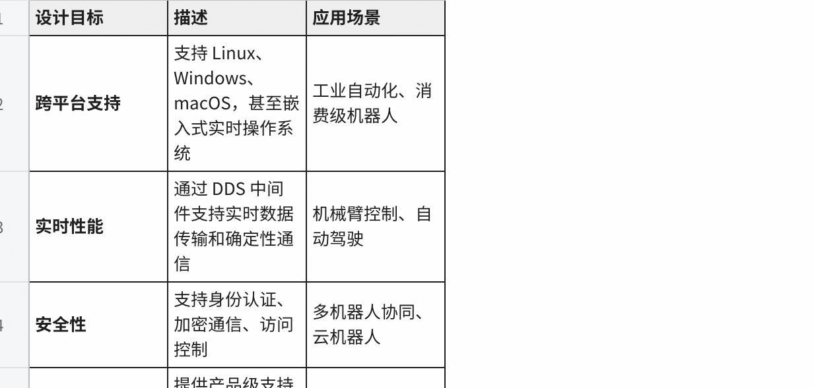
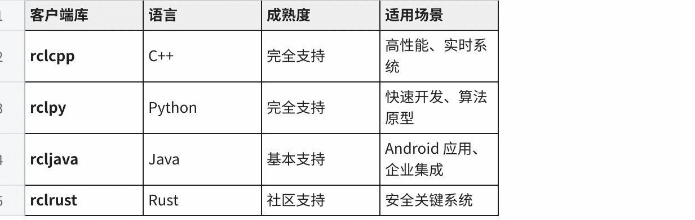
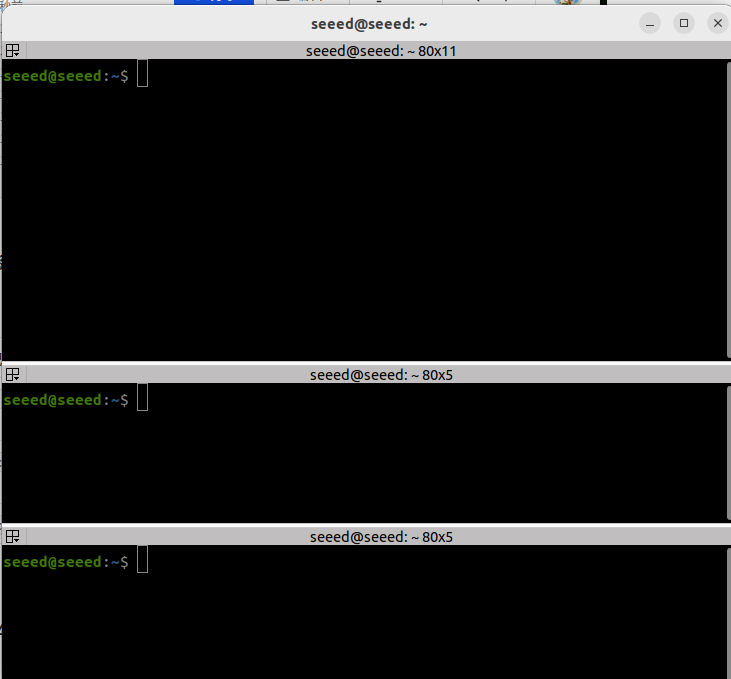
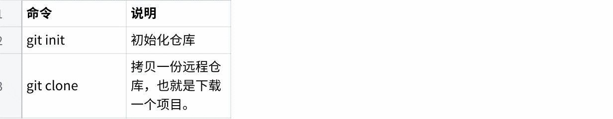
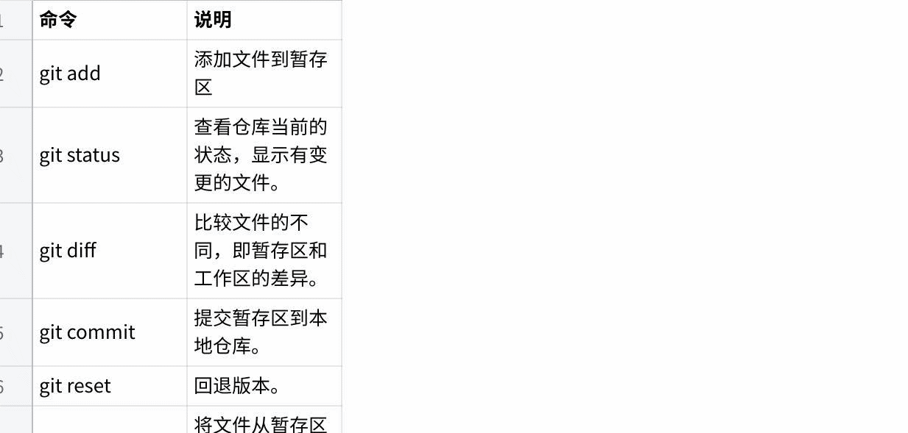
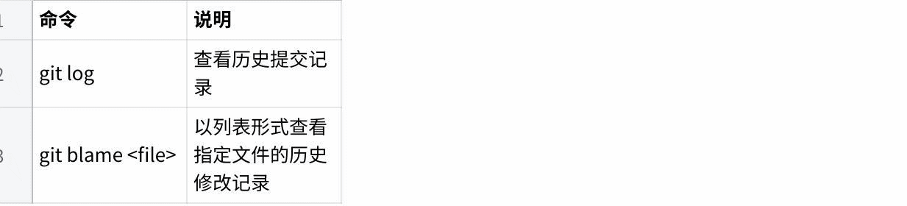
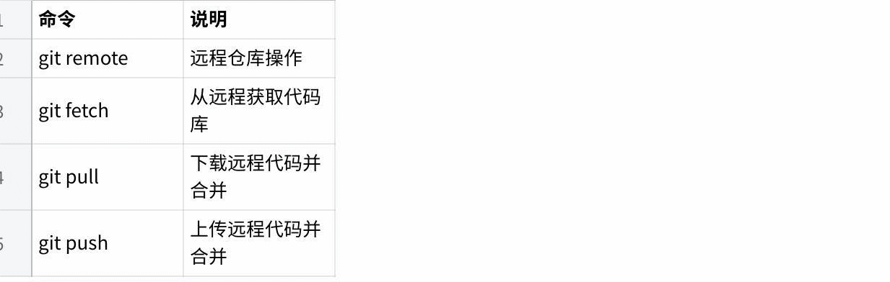

# ROS2 Foundations and Setup

## 01 ROS2简介

### 01 ROS2简介(Introduction)

### 1.1什么是ROS 2

ROS 2 (Robot Operating System 2)是一个用于编写机器人软件的开源中间件框架。尽管名称中包含"操作系统"，但ROS 2实际上不是传统的操作系统，而是一套软件库和工具，用于帮助开发者创建机器人应用程序。

### 1.1.1 ROS 2的定义

ROS 2提供了操作系统通常在进程间传递消息及执行包管理的服务。它是一种分布式框架，使应用程序能够控制机器人硬件、处理传感器数据、执行算法，并与其他应用程序或系统进行通信。

```
Plain Text
┌─────────────────────────────────────┐
│ ROS 2 中间件框架 │
├─────────────────────────────────────┤
│ • 话题通信 (Topics) │
│ • 服务通信 (Services) │
│ • 动作通信 (Actions) │
│ • 参数服务 (Parameters) │
│ • 坐标变换 (TF2) │
└─────────────────────────────────────┘
▲
┌────────────────┼────────────────┐
│ │ │
┌────────┴─────┐ ┌───────┴──────┐ ┌─────┴──────┐
│ 硬件驱动 │ │ 算法模块 │ │ 应用程序 │
│ (传感器/执行器)│ │ (导航/视觉) │ │ (用户界面) │
└──────────────┘ └──────────────┘ └────────────┘
```

### 1.1.2 ROS 2的设计目标

ROS 2的设计基于现代机器人应用的需求，主要目标包括：



#### 点击图片可查看完整电子表格

### 1.1.3 ROS 2的核心价值

1.模块化设计：代码组织成独立的包（Packages），易于维护、重用和分发

2.分布式通信：支持多进程、多机器的分布式计算架构

3.丰富的生态系统：包含大量的开源功能包和开发工具

4.活跃的社区：全球开发者持续贡献，商业公司积极支持

### 1.2 ROS 2核心概念

### 1.2.1节点(Nodes)

节点是ROS 2中最基本的计算单元。一个节点是一个使用ROS 2 API与其他节点通信的进程。

```
Plain Text
┌──────────────────────────────────────────────────────────────┐
│ ROS 2 系统 │
│ │
│ ┌──────────┐ ┌──────────┐ ┌──────────┐ │
│ │ 摄像头节点 │─数据流─►│ 处理节点 │─控制──►│ 电机节点 │ │
│ │CameraNode│ │ProcessNode│ │MotorNode │ │
│ └──────────┘ └──────────┘ └──────────┘ │
│ │
│ ┌──────────┐ ┌──────────┐ │
│ │ 激光雷达 │─数据流─►│ 导航节点 │ │
│ │LidarNode │ │ NavNode │ │
│ └──────────┘ └──────────┘ │
└──────────────────────────────────────────────────────────────┘
```

#### 节点设计原则：

#### -单一职责：每个节点专注于特定功能

#### -低耦合：节点间通过接口通信，减少直接依赖

#### -可组合：多个节点可以组合实现复杂功能

#### 节点的生命周期：

```
Plain Text
创建节点
│
▼
配置参数 ─────┐
│ │
▼ │
初始化通信 │
│ │ 可循环：重新配置
▼ │
执行回调 │
│ │
▼ ◄─┘
关闭节点
```

### 1.2.2话题(Topics)

话题是节点间进行异步流式通信的机制，采用发布/订阅（Pub/Sub）模式。

```
Plain Text
话题: /camera/image_raw
│
┌───────────────┼───────────────┐
│ │ │
[发布者1] [发布者2] [订阅者1]
Camera_Raw Camera_L2P DisplayGUI
│ │ │
└───────────────┴───────────────┘
│
[订阅者2]
ImageRecorder
```

#### 话题通信特点：


#### 点击图片可查看完整电子表格

#### 典型话题示例：

| 话题名称 | 消息类型 | 用途 |
| --- | --- | --- |
| /cmd_vel | geometry_msgs/msg/Twist | 速度控制指令 |
| /odom | nav_msgs/msg/Odometry | 里程计数据 |
| /scan | sensor_msgs/msg/LaserScan | 激光雷达数据 |
| /camera/image_raw | sensor_msgs/msg/Image | 原始图像数据 |

### 1.2.3服务(Services)

服务是节点间进行同步通信的机制，采用客户端/服务器（Client/Server）模式。

```
Plain Text
客户端A 服务端 客户端B
ClientA Server ClientB
│ │ │
│ ────请求(Request)────►│ │
│ │◄───请求(Request)───────│
│ │ │
│ ◄───响应(Response)───┘ │
│ │
│ │ ────响应(Response)───►│
│ │ │
```

#### 服务通信特点：


#### 点击图片可查看完整电子表格

#### 服务类型定义示例：

```
Plain Text
# 示例：添加两个整数的服务
# 文件: example_interfaces/srv/AddTwoInts.srv
int64 a
int64 b
int64 sum
```

#### 典型服务示例：

| 服务名称 | 服务类型 | 用途 |
| --- | --- | --- |
| /spawn | turtlesim/srv/Spawn | 生成新的海龟 |
| /teleport_absolute | turtlesim/srv/TeleportAbsolute | 移动海龟到指定位置 |
| /reset | std_srvs/srv/Empty | 重置仿真环境 |

### 1.2.4动作(Actions)

动作是用于处理长时间任务的通信机制，支持任务执行过程中的反馈和取消操作。

```
Plain Text
┌────────────────── 动作通信时序图 ──────────────────┐
│ │
│ 目标发送 ──┐ │
│ ├──► 服务端开始执行任务 │
│ 反馈接收 ◄─┘ │
│ ▲ │
│ │ 循环发送执行状态 │
│ │ │
│ │ │
│ 取消操作 ──┴──► 中断任务执行 │
│ │
│ 结果接收 ◄──────── 任务完成 ───────────────────────►│
└─────────────────────────────────────────────────────┘
```

#### 动作通信的三种消息流：


#### 点击图片可查看完整电子表格

#### 动作类型定义示例：

```
Plain Text
# 示例：旋转指定角度的动作
# 文件: action_interfaces/action/Rotate.action
float32 target_angle
float32 duration
float32 final_angle
bool success
float32 current_angle
float32 remaining_time
```

#### 典型动作示例：

| 动作名称 | 动作类型 | 用途 |
| --- | --- | --- |
| /navigate_to_pose | nav2_msgs/action/NavigateToPose | 导航到目标位姿 |
| /rotate | ros2_control/action/FollowJointTrajectory | 关节轨迹跟踪 |
| /spin | turtlesim/action/RotateAbsolute | 旋转指定角度 |

### 1.2.5参数(Parameters)

参数是节点的配置值，可以在节点启动时设置，也可以在运行时动态修改。

```
Plain Text
节点: camera_node
├── 参数: frame_id = "camera_link"
├── 参数: width = 640
├── 参数: height = 480
├── 参数: fps = 30
└── 参数: exposure_mode = "auto"
动态修改示例:
$ ros2 param set camera_node exposure_mode "manual"
```

#### 参数类型：

| 类型 | 说明 | 示例值 |
| --- | --- | --- |
| bool | 布尔值 | true , false |
| int | 整数 | 42 , -10 |
| float / double | 浮点数 | 3.14 , -0.001 |
| string | 字符串 | "hello_world" |
| byte_array | 字节数组 | [0x01, 0x02, 0x03] |
| bool_array | 布尔数组 | [true, false, true] |
| int_array | 整数数组 | [1, 2, 3, 4, 5] |
| float_array | 浮点数组 | [1.0, 2.0, 3.0] |
| string_array | 字符串数组 | ["a", "b", "c"] |

### 1.3 ROS 2架构

### 1.3.1分层架构

ROS 2采用清晰的分层架构设计，从底层操作系统到上层应用：

```
Plain Text
╔═════════════════════════════════════════════════════════════════╗
║ 应用层 (Application Layer) ║
║ ┌────────┐ ┌────────┐ ┌────────┐ ┌────────┐ ║
║ │ 导航节点 │ │感知节点 │ │ 控制节点 │ │ 可视化 │ ║
║ └────────┘ └────────┘ └────────┘ └────────┘
║
╠═════════════════════════════════════════════════════════════════╣
║ 客户端库层 (Client Library Layer) ║
║ ┌──────────────────┐ ┌──────────────────┐ ║
║ │ rclcpp (C++) │ │ rclpy (Python) │ ║
║ │ rcljava │ │ rclrust │ ║
║ └──────────────────┘ └──────────────────┘
║
╠═════════════════════════════════════════════════════════════════╣
║ RMW 层 (ROS Middleware Interface) ║
║ ┌─────────────────────────────────────────────────┐ ║
║ │ RMW (ROS Middleware Interface) │ ║
║ │ • 节点发现 • 发布/订阅 • 服务调用 • 参数 │ ║
║ └─────────────────────────────────────────────────┘
║
╠═════════════════════════════════════════════════════════════════╣
║ DDS 层 (DDS Implementation) ║
║ ┌──────────┐ ┌──────────┐ ┌──────────────────┐ ║
║ │CycloneDDS│ │ FastDDS │ │ RTI Connext DDS │ ║
║ │(默认) │ │ │ │ (商业版) │ ║
║ └──────────┘ └──────────┘ └──────────────────┘
║
╠═════════════════════════════════════════════════════════════════╣
║ 操作系统层 (Operating System) ║
║ ┌────────┐ ┌────────┐ ┌────────┐ ┌────────┐ ║
║ │ Linux │ │Windows │ │ macOS │ │ RTOS │ ║
║ └────────┘ └────────┘ └────────┘ └────────┘
║
╚═════════════════════════════════════════════════════════════════╝
```

### 1.3.2客户端库(Client Libraries)

ROS 2提供多种语言的客户端库，开发者可以选择熟悉的语言编写节点：



#### 点击图片可查看完整电子表格

#### rclcpp和rclpy对比：

```
C++
// C++ 发布者示例 (rclcpp)
# include "rclcpp/rclcpp.hpp"
# include "std_msgs/msg/string.hpp"
class Publisher : public rclcpp::Node {
public:
Publisher() : Node("publisher") {
publisher_ = this->create_publisher<std_msgs::msg::String>("topic", 10);
timer_ = this->create_wall_timer(
std::chrono::milliseconds(500),
[this]() { this->timer_callback(); });
}
private:
void timer_callback() {
auto msg = std_msgs::msg::String();
msg.data = "Hello ROS 2";
publisher_->publish(msg);
}
rclcpp::TimerBase::SharedPtr timer_;
rclcpp::Publisher<std_msgs::msg::String>::SharedPtr publisher_;
};
```

```python
# Python 发布者示例 (rclpy)
import rclpy
from rclpy.node import Node
from std_msgs.msg import String
class Publisher(Node):
def __init__(self):
super().__init__('publisher')
self.publisher_ = self.create_publisher(String, 'topic', 10)
self.timer = self.create_timer(0.5, self.timer_callback)
def timer_callback(self):
msg = String()
msg.data = 'Hello ROS 2'
self.publisher_.publish(msg)
```

### 1.3.3 RMW和DDS

RMW (ROS Middleware Interface)是ROS 2中间件的抽象接口层，允许ROS 2使用不同的DDS实现：

```
Plain Text
┌────────────────────────────────────────────────────────────┐
│ ROS 2 用户代码 │
│ (rclcpp/rclpy) │
└────────────────────────────────────────────────────────────┘
│
▼
┌────────────────────────────────────────────────────────────┐
│ RMW 接口层 │
│ (统一的 ROS 2 中间件接口)
│
└────────────────────────────────────────────────────────────┘
│
┌─────────────────┼─────────────────┐
▼ ▼ ▼
┌──────────────┐ ┌──────────────┐ ┌──────────────┐
│rmw_cyclonedds│ │rmw_fastrtps │ │rmw_connext │
│ _cpp │ │ _cpp │ │ _cpp │
└──────────────┘ └──────────────┘ └──────────────┘
│ │ │
▼ ▼ ▼
┌──────────────┐ ┌──────────────┐ ┌──────────────┐
│ CycloneDDS │ │ FastDDS │ │ RTI Connext │
└──────────────┘ └──────────────┘ └──────────────┘
```

#### DDS实现对比：

| RMW 实现 | DDS 后端 | 开源 / 商业 | 特点 |
| --- | --- | --- | --- |
| rmw_cyclonedds_cpp | CycloneDDS | 开源 | 默认选择，轻量高效 |
| rmw_fastrtps_cpp | FastDDS | 开源 | 功能丰富，性能优秀 |
| rmw_connext_cpp | RTI Connext | 商业 | 工业级支持，功能最全面 |

#### DDS提供的核心功能：

1.发现机制(Discovery)：节点自动发现网络上的其他ROS 2节点

2.零拷贝传输(Zero-copy)：高效数据传输，减少内存复制

3.QoS策略(Quality of Service)：控制通信可靠性、延迟、持久性等

#### 4.类型系统：强类型消息定义和序列化

### 1.4 ROS 1与ROS 2的主要区别

### 1.4.1架构对比

```
Plain Text
ROS 1 架构 ROS 2 架构
┌─────────┐ ┌─────────┐
│ 节点A │ │ 节点A │
└────┬────┘ └────┬────┘
│ │
▼ ▼
┌─────────┐ ┌─────────────────┐
│ ROS │ │ DDS 发现机制 │
│ Master │ │ (无中心化) │
└────┬────┘ └────────┬────────┘
│ │
▼ ▼
┌─────────┐ ┌─────────┐
│ 节点B │◄─────────────────►│ 节点B │
└─────────┘ 通信 └─────────┘
▲ ▲
│ │
┌─────────┐ ┌─────────┐
│ 节点C │ │ 节点C │
└─────────┘ └─────────┘
```

### 1.4.2详细对比表

| 对比维度 | ROS 1 | ROS 2 |
| --- | --- | --- |
| 通信中间件 | TCP/UDP 自定义协议 | DDS 标准协议 |
| 发现机制 | ROS Master ( 中心化 ) | DDS 发现 ( 去中心化 ) |
| 构建系统 | Catkin | Colcon / Ament |
| Python 版本 | Python 2/3 | 仅 Python 3 |
| 支持的操作系统 | 主要 Linux | Linux / Windows / macOS / RTOS |
| 实时性支持 | 无实时保证 | 支持硬实时 |
| 多机器人通信 | 需要额外配置 | 原生支持 (ROS_DOMAIN_ID) |
| 安全性 | 无加密或认证 | 支持加密、认证、访问控制 |
| 发布版本 | Noetic ( 最后版本 ) | Humble, Iron, Jazzy... |

### 1.4.3关键改进详解

#### 1.去中心化架构

-ROS 1问题：依赖ROS Master，Master故障导致整个系统崩溃

-ROS 2改进：使用DDS发现机制，节点间直接通信，无单点故障

#### 2.实时性能

#### -ROS 1问题：非实时，无法满足工业机器人需求

-ROS 2改进：支持优先级调度、确定性通信，可用于硬实时系统

#### 3.多机器人协同

-ROS 1问题：同一网络上的多机器人容易互相干扰

-ROS 2改进：通过ROS_DOMAIN_ID隔离不同机器人的通信域

#### 4.跨平台支持

#### -ROS 1：主要支持Linux

-ROS 2：原生支持Windows、macOS、Linux，可移植到RTOS

### 1.5 ROS 2发行版本

### 1.5.1版本历史

ROS 2按字母顺序命名发行版本，每个版本都有代号：

```
Plain Text
┌─────────────────────────────────────────────────────┐
│ ROS 2 版本时间线 │
│ │
│ Ardent Bouncy Crystal Dashing Eloquent │
│ ▼ ▼ ▼ ▼ ▼ │
│ 2017.12 2018.06 2018.12 2019.05 2019.11 │
│ │
│ Foxy Galactic Humble LTS Iron Jazzy LTS│
│ ▼ ▼ ▼ ▼ ▼ │
│ 2020.06 2021.05 2022.05 2023.05 2024.05 │
│ │
└─────────────────────────────────────────────────────┘
```

| 版本代号 | 发布时间 | 支持系统 | 支持状态 | 截止日期 |
| --- | --- | --- | --- | --- |
| Ardent | 2017.12 | Ubuntu 16.04 | 已终止 | 2019.04 |
| Bouncy | 2018.06 | Ubuntu 16.04/18.04 | 已终止 | 2019.09 |
| Crystal | 2018.12 | Ubuntu 16.04/18.04 | 已终止 | 2020.12 |
| Dashing | 2019.05 | Ubuntu 16.04/18.04 | 已终止 | 2021.05 |
| Eloquent | 2019.11 | Ubuntu 18.04 | 已终止 | 2021.11 |
| Foxy | 2020.06 | Ubuntu 18.04/20.04 | 已终止 | 2023.05 |
| Galactic | 2021.05 | Ubuntu 20.04 | 已终止 | 2022.11 |
| Humble | 2022.05 | Ubuntu 22.04 | LTS | 2027.05 |
| Iron | 2023.05 | Ubuntu 22.04 | 已终止 | 2024.11 |
| Jazzy | 2024.05 | Ubuntu 24.04 | LTS | 2029.05 |

1.5.2 LTS (Long Term Support)版本

ROS 2提供LTS版本，获得更长时间的支持和安全更新：

Humble Hawksbill(首个LTS版本)

#### Jazzy Jalisco(第二个LTS版本)

### 1.5.3版本选择建议

| 使用场景 | 推荐版本 | 原因 |
| --- | --- | --- |
| 生产环境 | Humble | 稳定、长期支持 |
| 新项目开发 | Jazzy | 最新 LTS ，长期支持 |
| 学习 / 实验 | 最新滚动版 | 最新功能 |
| 旧系统维护 | Humble | 兼容性好 |

### 1.6 ROS 2应用领域

### 1.6.1工业机器人

```
Plain Text
┌────────────────────────────────────────────────────┐
│ 工业机器人应用场景
│
├────────────────────────────────────────────────────┤
│ │
│ ┌────────────┐ ┌────────────┐ │
│ │ 机械臂 │ │ AGV/AMR │ │
│ │ 抓取/组装 │ │ 物料搬运 │ │
│ └────────────┘ └────────────┘ │
│ │
│ ┌────────────┐ ┌────────────┐ │
│ │ 协作机器人│ │ 质量检测 │ │
│ │ 安全协作 │ │ 视觉检测 │ │
│ └────────────┘ └────────────┘ │
│ │
└────────────────────────────────────────────────────┘
```

-机械臂控制：Pick & Place、装配、焊接

-移动机器人(AGV/AMR)：物流搬运、仓储自动化

#### -协作机器人：人机协作、安全交互

#### -质量检测：视觉检测、尺寸测量

### 1.6.2服务机器人

```
Plain Text
┌────────────────────────────────────────────────────┐
│ 服务机器人应用场景
│
├────────────────────────────────────────────────────┤
│ │
│ 餐厅配送 │ 商场导览 │ 家庭清洁 │
│ │ │ │ │ │ │
│ ┌───┴───┐ ┌───┴───┐ ┌───┴───┐ │
│ │送餐机器人│ │导览机器人│ │清洁机器人│ │
│ └───────┘ └───────┘ └───────┘ │
│
│
└────────────────────────────────────────────────────┘
```

#### -送餐机器人：餐厅配送、酒店服务

#### -清洁机器人：地面清洁、窗户清洁

#### -导览机器人：商场导览、博物馆讲解

#### -陪伴机器人：老年人陪护、儿童教育

### 1.6.3自动驾驶

```
Plain Text
┌────────────────────────────────────────────────────┐
│ 自动驾驶系统架构
│
├────────────────────────────────────────────────────┤
│ │
│ ┌────────────────────────────────────────────┐ │
│ │ 感知层 (Perception) │ │
│ │ 激光雷达 │ 摄像头 │ 雷达 │ IMU │ GPS │ │
│ └────────────────────────────────────────────┘ │
│ ▼ │
│ ┌────────────────────────────────────────────┐ │
│ │ 定位层 (Localization) │ │
│ │ SLAM │ 状态估计 │ 传感器融合 │ │
│ └────────────────────────────────────────────┘ │
│ ▼ │
│ ┌────────────────────────────────────────────┐ │
│ │ 规划层 (Planning) │ │
│ │ 路径规划 │ 行为决策 │ 运动规划 │ │
│ └────────────────────────────────────────────┘ │
│ ▼ │
│ ┌────────────────────────────────────────────┐ │
│ │ 控制层 (Control) │ │
│ │ PID 控制 │ MPC │ 执行器控制 │ │
│ └────────────────────────────────────────────┘ │
│ │
└────────────────────────────────────────────────────┘
```

#### -感知：激光雷达、摄像头、雷达数据处理

#### -定位：SLAM、状态估计、传感器融合

#### -规划：路径规划、行为决策、运动规划

#### -控制：车辆控制、执行器驱动

### 1.6.4无人机

```
Plain Text
▲────▲
╱ ╱ ROS 2 无人机系统
╱ ____╱
╱ ╱ ╱
╱ ╱____╱
╱________╱
│ │
│ └─── 飞行控制 (mavros)
│
└────── 视觉处理
(图像识别、避障)
```

#### -飞行控制：姿态控制、高度控制、路径跟踪

#### -视觉避障：实时障碍物检测和规避

#### -任务执行：自主飞行、航点导航

#### -图传处理：视频传输和图像处理

### 1.6.5科研教育

```
Plain Text
┌────────────────────────────────────────────────────┐
│ 科研教育场景
│
├────────────────────────────────────────────────────┤
│ │
│ ┌────────────┐ ┌────────────┐ │
│ │ 算法验证 │ │ 教学演示 │ │
│ │ SLAM研究 │ │ 课程实验 │ │
│ └────────────┘ └────────────┘ │
│ │
│ ┌────────────┐ ┌────────────┐ │
│ │ 竞赛平台 │ │ 原型开发 │ │
│ │ RoboCup │ │ 概念验证 │ │
│ └────────────┘ └────────────┘ │
│ │
└────────────────────────────────────────────────────┘
```

#### -算法研究：SLAM、路径规划、强化学习

#### -教学培训：机器人课程、实验演示

#### -学科竞赛：RoboCup、RoboMaster

#### -原型开发：快速验证新想法

### 1.7学习路径建议

### 1.7.1基础知识准备

```
Plain Text
┌────────────────────────────────────┐
│ 入门前准备 │
├────────────────────────────────────┤
│ • Linux 基础操作 │
│ • Python 或 C++ 编程基础 │
│ • 终端命令使用 │
│ • 基本的软件工程概念 │
└────────────────────────────────────┘
▼
┌────────────────────────────────────┐
│ ROS 2 核心概念学习 │
├────────────────────────────────────┤
│ • 安装和环境配置 │
│ • 节点、话题、服务 │
│ • 工作空间和包管理 │
│ • 基本命令行工具 │
└────────────────────────────────────┘
```

#### 必备知识清单：

| 知识领域 | 具体内容 | 重要程度 |
| --- | --- | --- |
| Linux 操作 | 文件系统、终端命令、权限管理 | 必需 |
| 编程语言 | Python 或 C++ | 必需 |
| 版本控制 | Git 基本操作 | 推荐 |
| 网络基础 | TCP/UDP 、端口、 IP 地址 | 推荐 |
| 数学基础 | 线性代数、概率统计 | 进阶 |

### 1.7.2分阶段学习计划

#### 阶段一：基础入门(1-2个月)

```
Plain Text
周次 学习内容 实践项目
────────────────────────────────────────────────
第1周 ROS 2 安装与环境配置 安装 Humble
第2周 工作空间与功能包 创建第一个包
第3周 节点与话题通信 Pub/Sub 示例
第4周 服务与参数 Server/Client 示例
第5周 Launch 文件 启动多节点系统
第6周 RViz2 与 Rqt 可视化数据
第7周 录制与回放 (Rosbag2) 数据记录
第8周 综合项目 小型机器人仿真
```

#### 阶段二：进阶学习(2-3个月)

```
Plain Text
周次 学习内容 实践项目
────────────────────────────────────────────────
第9周 自定义消息/服务/动作 定义接口
第10周 TF2 坐标变换 多坐标系管理
第11周 动作通信 长任务处理
第12周 QoS 策略 通信质量配置
第13周 参数服务器 动态参数配置
第14周 分布式通信 多机通信
第15周 DDS 配置 切换 DDS 实现
第16周 时间 API 定时与速率控制
```

#### 阶段三：高级应用(3-4个月)

```
Plain Text
周次 学习内容 实践项目
────────────────────────────────────────────────
第17周 URDF 机器人建模 创建机器人模型
第18周 Gazebo 仿真 物理仿真环境
第19周 导航功能包 自主导航
第20周 视觉处理 OpenCV 集成
第21周 传感器驱动 相机/激光雷达
第22周 机器人控制 ros2_control
第23周 性能优化 调试与性能分析
第24周 综合项目 完整机器人系统
```

### 1.7.3推荐学习资源

#### 官方资源：

| 资源名称 | URL | 描述 |
| --- | --- | --- |
| ROS 2 官方文档 | https://docs.ros.org/en/humble/ | 权威的完整文档 |
| ROS 2 教程 | https://docs.ros.org/en/humble/Tutorials.html | 官方教程集合 |
| ROS 2 设计文档 | https://design.ros2.org/ | 架构设计说明 |
| ROS 2 源码 | https://github.com/ros2 | GitHub 仓库 |

#### 社区资源：

| 资源名称 | 描述 |
| --- | --- |
| ROS Answers | 官方问答社区 |
| Discourse Forum | ROS 2 讨论论坛 |
| ROS 2 YouTube 官方频道 | 视频教程 |
| 各类 ROS 2 博客和教程 | 社区贡献内容 |

#### 书籍推荐：

### 1.8参考资源汇总

### 1.8.1官方文档索引

```
Plain Text
docs.ros.org
│
├── /en/humble/
│ ├── /Concepts/ # 核心概念
│ ├── /Tutorials/ # 教程集合
│ ├── /How-To-Guides/ # 操作指南
│ ├── /Installation/ # 安装指南
│ ├── /Releases/ # 版本信息
│ └── /API/ # API 文档
│
└── /en/rolling/ # 滚动版本文档
```

### 1.8.2关键文档章节

| 章节名称 | 路径 | 内容概述 |
| --- | --- | --- |
| 核心概念 | Concepts/Basic | ROS 2 基本概念详解 |
| 教程集合 | Tutorials/ | 循序渐进的教程 |
| 安装指南 | Installation/ | 各平台安装方法 |
| 迁移指南 | How-To-Guides/Migrating-from-ROS1 | ROS 1 到 ROS 2 迁移 |

### 1.8.3社区支持渠道

```
Plain Text
┌──────────────────────────────────────────────┐
│ ROS 2 社区支持
│
├──────────────────────────────────────────────┤
│ │
│ • ROS Answers: answers.ros.org │
│ • Discourse: discourse.ros.org │
│ • GitHub: github.com/ros2 │
│ • Slack: ROS Devroom Slack │
│ • Stack Overflow: 标签 ros2 │
│ • Reddit: r/ROS │
│ │
└──────────────────────────────────────────────┘
```

## 03集成开发环境

### 03集成开发环境(IDE Setup)

### 3.1概述

良好的开发环境配置可以显著提高ROS 2开发效率。本章将详细介绍如何配置Visual Studio Code (VS Code)作为ROS 2的主要开发环境，包括插件安装、智能代码补全、调试配置等。

### 3.1.1开发环境选择

| IDE | 优点 | 缺点 | 推荐度 |
| --- | --- | --- | --- |
| VS Code | 轻量、插件丰富、免费 | C++ 支持需额外配置 | ⭐⭐⭐⭐⭐ |
| CLion | 强大的 C++ 支持、内置调试 | 付费、较重 | ⭐⭐⭐⭐ |
| Qt Creator | 跨平台、 CMake 支持好 | ROS 2 支持需手动配置 | ⭐⭐⭐ |
| Vim/Neovim | 轻量、高度可定制 | 学习曲线陡峭 | ⭐⭐ |

### 3.1.2推荐配置

#### 本文推荐使用VS Code+ROS扩展的组合：

### 3.2 Visual Studio Code安装

### 3.2.1安装VS Code

#### Ubuntu 22.04通过APT安装：

```bash
# 下载并安装 VS Code
wget -qO- https://packages.microsoft.com/keys/microsoft.asc | gpg --dearmor > packages.microsoft.gpg
sudo install -o root -g root -m 644 packages.microsoft.gpg /etc/apt/trusted.gpg.d/
sudo sh -c 'echo "deb [arch=amd64,arm64,armhf signed-by=/etc/apt/trusted.gpg.d/packages.microsoft.gpg] https://packages.microsoft.com/repos/code stable main" > /etc/apt/sources.list.d/vscode.list'
sudo apt update
sudo apt install -y code
```

#### 通过Snap安装：

```bash
sudo snap install --classic code
```

#### 验证安装：

```bash
code --version
```

### 3.2.2 VS Code基本配置

启动VS Code：

```bash
code
# 或者打开特定目录
code ~/ros2_ws
```

### 3.3必装插件

### 3.3.1 ROS 2核心插件

| 插件名称 | 发布者 | 用途 | 安装命令 |
| --- | --- | --- | --- |
| ROS | Microsoft | ROS 支持 | ext install ms-iot.vscode-ros |
| C/C++ | Microsoft | C++ 语言支持 | ext install ms-vscode.cpptools |
| Python | Microsoft | Python 语言支持 | ext install ms-python.python |
| CMake Tools | Microsoft | CMake 支持 | ext install ms-vscode.cmake-tools |

### 3.3.2推荐插件

| 插件名称 | 发布者 | 用途 |
| --- | --- | --- |
| YAML | Red Hat | YAML 文件支持 |
| XML | Red Hat | XML 文件支持 |
| Better Comments | Aaron Petheram | 更好的注释显示 |
| GitLens | GitKraken | Git 增强工具 |
| TODO Highlight | Wayou Liu | 高亮 TODO 注释 |
| Bracket Pair Colorizer | CoenraadS | 括号配对着色 |
| Thunder Client | Ranga Vadhineni | REST API 测试（替代 Postman ） |

### 3.3.3安装插件的方法

#### 方法1：通过命令面板安装

```
Plain Text
1. 按 Ctrl+Shift+P 打开命令面板
2. 输入 "Extensions: Install Extensions"
3. 搜索插件名称
4. 点击 Install 按钮
```

#### 方法2：通过命令行安装

```bash
# 安装 ROS 插件
code --install-extension ms-iot.vscode-ros
# 安装 C/C++ 插件
code --install-extension ms-vscode.cpptools
# 安装 Python 插件
code --install-extension ms-python.python
# 安装 CMake Tools
code --install-extension ms-vscode.cmake-tools
```

#### 方法3：通过界面安装

```
Plain Text
1. 点击左侧扩展图标 (或 Ctrl+Shift+X)
2. 搜索插件名称
3. 点击 Install
```

### 3.4 ROS 2工作空间配置

### 3.4.1打开ROS 2工作空间

```bash
# 打开工作空间
code ~/ros2_ws
```

### 3.4.2配置C/C++智能提示

VS Code需要知道ROS 2的头文件路径才能提供准确的代码补全。

创建.vscode/c_cpp_properties.json：

```
JSON
{
"configurations": [
{
"name": "Linux",
"includePath": [
"${workspaceFolder}/**",
"/opt/ros/humble/include/**",
"/usr/include/**"
],
"defines": [],
"compilerPath": "/usr/bin/gcc",
"cStandard": "c17",
"cppStandard": "c++17",
"intelliSenseMode": "linux-gcc-x64",
"compileCommands": "${workspaceFolder}/build/compile_commands.json"
}
],
"version": 4
}
```

#### 关键配置说明：

| 配置项 | 说明 |
| --- | --- |
| includePath | 头文件搜索路径，必须包含 ROS 2 路径 |
| compileCommands | 编译命令数据库，用于精确的代码分析 |
| cppStandard | C++ 标准， ROS 2 使用 C++17 |

### 4.4.3生成compile_commands.json

配置colcon生成编译命令数据库：

```bash
# 在工作空间根目录
cd ~/ros2_ws
# 编译时生成 compile_commands.json
colcon build --cmake-args -DCMAKE_EXPORT_COMPILE_COMMANDS=ON
# 创建符号链接到 src 目录（可选，方便某些工具访问）
ln -s build/compile_commands.json
```

#### 验证生成：

```bash
cat build/compile_commands.json | jq '.[] | .directory' | head -5
```

### 3.4.4配置Python环境

#### 创建.vscode/settings.json：

```
JSON
{
"python.autoComplete.extraPaths": [
"${workspaceFolder}/install/*/lib/python3.10/site-packages",
"/opt/ros/humble/lib/python3.10/site-packages"
],
"python.analysis.extraPaths": [
"${workspaceFolder}/install/*/lib/python3.10/site-packages",
"/opt/ros/humble/lib/python3.10/site-packages"
],
"python.formatting.provider": "black",
"python.linting.enabled": true,
"python.linting.pylintEnabled": true,
"python.linting.pylintArgs": [
"--rcfile=${workspaceFolder}/.pylintrc"
]
}
```

### 3.5 VS Code任务配置

### 3.5.1配置构建任务

#### 创建.vscode/tasks.json：

```
JSON
{
"version": "2.0.0",
"tasks": [
{
"label": "colcon build",
"type": "shell",
"command": "colcon build --symlink-install",
"group": {
"kind": "build",
"isDefault": true
},
"problemMatcher": [],
"presentation": {
"reveal": "always",
"panel": "new"
}
},
{
"label": "colcon build (selected package)",
"type": "shell",
"command": "colcon build --symlink-install --packages-select ${input:packageName}",
"group": "build",
"problemMatcher": []
},
{
"label": "source workspace",
"type": "shell",
"command": "source install/setup.bash && echo 'Workspace sourced'",
"problemMatcher": []
},
{
"label": "clean build",
"type": "shell",
"command": "rm -rf build install log && colcon build --symlink-install",
"group": "build",
"problemMatcher": []
}
],
"inputs": [
{
"id": "packageName",
"type": "promptString",
"description": "Enter package name to build"
}
]
}
```

#### 使用任务：

```
Plain Text
Ctrl+Shift+B # 运行默认构建任务
Ctrl+Shift+P -> Tasks: Run Task # 选择其他任务
```

### 3.5.2配置测试任务

在tasks.json中添加：

```
JSON
{
"label": "colcon test",
"type": "shell",
"command": "colcon test --packages-select ${input:testPackage}",
"group": "test",
"problemMatcher": []
},
{
"label": "colcon test --event-handlers",
"type": "shell",
"command": "colcon test --packages-select ${input:testPackage} --event-handlers console_direct+",
"group": "test",
"problemMatcher": []
},
{
"label": "show test results",
"type": "shell",
"command": "colcon test-result --all --verbose",
"group": "test",
"problemMatcher": []
}
```

### 3.6调试配置

### 3.6.1 C++节点调试

#### 创建.vscode/launch.json：

```
JSON
{
"version": "0.2.0",
"configurations": [
{
"name": "ROS2: C++ Node",
"type": "cppdbg",
"request": "launch",
"program": "${workspaceFolder}/install/${input:packageName}/lib/${input:packageName}/${input:executableName}",
"args": [],
"stopAtEntry": false,
"cwd": "${workspaceFolder}",
"environment": [
{
"name": "ROS_DOMAIN_ID",
"value": "0"
},
{
"name": "RMW_IMPLEMENTATION",
"value": "rmw_cyclonedds_cpp"
}
],
"externalConsole": false,
"MIMode": "gdb",
"setupCommands": [
{
"description": "Enable pretty-printing",
"text": "-enable-pretty-printing",
"ignoreFailures": true
}
]
}
],
"inputs": [
{
"id": "packageName",
"type": "promptString",
"description": "Package name"
},
{
"id": "executableName",
"type": "promptString",
"description": "Executable name"
}
]
}
```

### 3.6.2 Python节点调试

```
JSON
{
"name": "ROS2: Python Node",
"type": "python",
"request": "launch",
"module": "rclpy.executors",
"args": [
"${workspaceFolder}/install/${input:packageName}/lib/${input:packageName}/${input:moduleName}"
],
"console": "integratedTerminal",
"env": {
"ROS_DOMAIN_ID": "0",
"PYTHONPATH": "${workspaceFolder}/install/${input:packageName}/lib/python3.10/site-packages:${env:PYTHONPATH}"
}
}
```

### 3.6.3调试操作

#### 调试快捷键：

| 快捷键 | 功能 |
| --- | --- |
| F5 | 开始调试 |
| Ctrl+Shift+F5 | 重启调试 |
| Shift+F5 | 停止调试 |
| F9 | 设置 / 取消断点 |
| F10 | 单步跳过 |
| F11 | 单步进入 |
| Shift+F11 | 单步跳出 |

### 3.7 ROS 2专用功能配置

### 3.7.1 ROS扩展配置

创建.vscode/settings.json（ROS相关）：

```
JSON
{
"ros.distro": "humble",
"ros.pythonPath": "/usr/bin/python3",
"ros.defaultWorkspace": "${workspaceFolder}",
"ros.rosSetupScript": "/opt/ros/humble/setup.bash",
"ros.rosWorkspace": "${workspaceFolder}",
"files.associations": {
"*.world": "xml",
"*.urdf": "xml",
"*.xacro": "xml",
"*.rviz": "yaml",
"*.launch.py": "python"
}
}
```

### 3.7.2代码片段（Snippets）

创建.vscode/ros2.code-snippets：

```
JSON
{
"ROS2 C++ Node Minimal": {
"prefix": "ros2_cpp_node",
"description": "Minimal ROS2 C++ node template",
"body": [
"# include \"rclcpp/rclcpp.hpp\"",
"",
"class ${1:NodeName} : public rclcpp::Node {",
"public:",
" ${1:NodeName}() : Node(\"${1:NodeName}\") {",
" RCLCPP_INFO(this->get_logger(), \"${1:NodeName} has been started.\");",
" }",
"};",
"",
"int main(int argc, char** argv) {",
" rclcpp::init(argc, argv);",
" auto node = std::make_shared<${1:NodeName}>();",
" rclcpp::spin(node);",
" rclcpp::shutdown();",
" return 0;",
"}"
]
},
"ROS2 Python Node Minimal": {
"prefix": "ros2_py_node",
"description": "Minimal ROS2 Python node template",
"body": [
"import rclpy",
"from rclpy.node import Node",
"",
"",
"class ${1:NodeName}(Node):",
" def __init__(self):",
" super().__init__('${1:NodeName}')",
" self.get_logger().info('${1:NodeName} has been started.')",
"",
"",
"def main(args=None):",
" rclpy.init(args=args)",
" node = ${1:NodeName}()",
" rclpy.spin(node)",
" node.destroy_node()",
" rclpy.shutdown()",
"",
"",
"if __name__ == '__main__':",
" main()"
]
},
"ROS2 Publisher C++": {
"prefix": "ros2_cpp_pub",
"description": "ROS2 C++ publisher template",
"body": [
"auto publisher_ = this->create_publisher<${1:std_msgs::msg::String}>(\"${2:topic_name}\", 10);",
"auto timer_ = this->create_wall_timer(",
" std::chrono::milliseconds(500),",
" [this]() {",
" auto message = ${1:std_msgs::msg::String}();",
" message.data = \"Hello, ROS 2!\";",
" publisher_->publish(message);",
" });"
]
},
"ROS2 Subscriber C++": {
"prefix": "ros2_cpp_sub",
"description": "ROS2 C++ subscriber template",
"body": [
"auto subscription_ = this->create_subscription<${1:std_msgs::msg::String}>(",
" \"${2:topic_name}\", 10,",
" [this](const ${1:std_msgs::msg::String}::SharedPtr msg) {",
" RCLCPP_INFO(this->get_logger(), \"Received: '%s'\", msg->data.c_str());",
" });"
]
}
}
```

### 3.7.3预定义变量

VS Code中可用的预定义变量：

| 变量 | 说明 |
| --- | --- |
| ${workspaceFolder} | 工作空间根目录 |
| ${workspaceFolderBasename} | 工作空间文件夹名 |
| ${file} | 当前打开的文件 |
| ${fileBasename} | 当前文件名 |
| ${fileDirname} | 当前文件所在目录 |
| ${env:ENV_VAR} | 环境变量 |

### 3.8推荐的工作流

### 3.8.1标准开发流程

```
Plain Text
1. 打开工作空间
code ~/ros2_ws
2. Source ROS 2 环境（在集成终端中）
source /opt/ros/humble/setup.bash
3. 构建工作空间
Ctrl+Shift+B
4. 开发代码
- 使用代码片段快速编写模板
- 使用智能提示和自动补全
- 保存后自动格式化
5. 运行节点进行测试
Ctrl+Shift+` 打开新终端
ros2 run package_name node_name
6. 如需调试
设置断点 -> F5 开始调试
```

### 3.8.2常用快捷键

| 快捷键 | 功能 |
| --- | --- |
| Ctrl+Shift+P | 命令面板 |
| Ctrl+P | 快速打开文件 |
| `Ctrl+\`` | 切换集成终端 |
| Ctrl+B | 切换侧边栏 |
| Ctrl+Shift+E | 显示资源管理器 |
| Ctrl+Shift+F | 全局搜索 |
| Alt+↑/↓ | 移动行 |
| Ctrl+/ | 注释 / 取消注释 |
| F2 | 重命名符号 |
| Ctrl+Space | 触发建议 |

### 3.9常见问题

### 3.9.1 C++智能提示不工作

#### 问题：无法找到ROS 2头文件

#### 解决方案：

```bash
# 重新生成 compile_commands.json
cd ~/ros2_ws
colcon build --cmake-args -DCMAKE_EXPORT_COMPILE_COMMANDS=ON
```

### 3.9.2 Python导入错误

#### 问题：Python节点无法导入ROS 2模块

#### 解决方案：

检查.vscode/settings.json中的Python路径配置：

```
JSON
{
"python.autoComplete.extraPaths": [
"/opt/ros/humble/lib/python3.10/site-packages",
"${workspaceFolder}/install/*/lib/python3.10/site-packages"
]
}
```

### 3.9.3调试时找不到节点

#### 问题：启动调试时提示找不到可执行文件

#### 解决方案：

确保已经构建了包，并且可执行文件路径正确：

```bash
# 构建包
colcon build --packages-select <package_name>
# 查看可执行文件位置
find install -name <executable_name> -type f
```

### 3.9.4 ROS扩展无法识别工作空间

#### 问题：ROS扩展显示无法识别工作空间

#### 解决方案：

### 3.10完整配置示例

### 3.10.1 .vscode/settings.json（完整版）

```
JSON
{
// C/C++ 配置
"C_Cpp.default.configurationProvider": "ms-vscode.cmake-tools",
"C_Cpp.default.cppStandard": "c++17",
"C_Cpp.default.cStandard": "c11",
// Python 配置
"python.defaultInterpreterPath": "/usr/bin/python3",
"python.autoComplete.extraPaths": [
"${workspaceFolder}/install/*/lib/python3.10/site-packages",
"/opt/ros/humble/lib/python3.10/site-packages"
],
// ROS 配置
"ros.distro": "humble",
"ros.rosSetupScript": "/opt/ros/humble/setup.bash",
// 文件关联
"files.associations": {
"*.urdf": "xml",
"*.xacro": "xml",
"*.rviz": "yaml",
"*.world": "xml",
"*.launch.py": "python",
"*.action": "yaml"
},
// 编辑器配置
"editor.formatOnSave": true,
"editor.tabSize": 4,
"editor.insertSpaces": true,
// CMake Tools 配置
"cmake.sourceDirectory": "${workspaceFolder}/src",
"cmake.buildDirectory": "${workspaceFolder}/build",
"cmake.configureArgs": [
"-DCMAKE_EXPORT_COMPILE_COMMANDS=ON"
]
}
```

### 3.10.2 .vscode/tasks.json（完整版）

```
JSON
{
"version": "2.0.0",
"tasks": [
{
"label": "colcon build",
"type": "shell",
"command": "colcon build --symlink-install --cmake-args -DCMAKE_EXPORT_COMPILE_COMMANDS=ON",
"group": {
"kind": "build",
"isDefault": true
},
"problemMatcher": []
},
{
"label": "colcon build --packages-select",
"type": "shell",
"command": "colcon build --symlink-install --packages-select ${input:packageName}",
"group": "build",
"problemMatcher": []
},
{
"label": "colcon test",
"type": "shell",
"command": "colcon test --packages-select ${input:testPackage} --event-handlers console_direct+",
"group": "test",
"problemMatcher": []
}
],
"inputs": [
{
"id": "packageName",
"type": "promptString",
"description": "Package name to build"
},
{
"id": "testPackage",
"type": "promptString",
"description": "Package name to test"
}
]
}
```

### 3.11安裝Terminator

```bash
sudo apt install terminator
```

### 3.11.1启动

快捷键Ctrl+Alt+T启动



### 3.11.2 Terminator常用快捷键

```bash
关于在同一个标签内的操作：
Alt+Up //移动到上面的终端
Alt+Down //移动到下面的终端
Alt+Left //移动到左边的终端
Alt+Right //移动到右边的终端
Ctrl+Shift+O //水平分割终端
Ctrl+Shift+E //垂直分割终端
Ctrl+Shift+Right //在垂直分割的终端中将分割条向右移动
Ctrl+Shift+Left //在垂直分割的终端中将分割条向左移动
Ctrl+Shift+Up //在水平分割的终端中将分割条向上移动
Ctrl+Shift+Down //在水平分割的终端中将分割条向下移动
Ctrl+Shift+S //隐藏/显示滚动条
Ctrl+Shift+F //搜索
Ctrl+Shift+C //复制选中的内容到剪贴板
Ctrl+Shift+V //粘贴剪贴板的内容到此处
Ctrl+Shift+W //关闭当前终端
Ctrl+Shift+Q //退出当前窗口，当前窗口的所有终端都将被关闭
Ctrl+Shift+X //最大化显示当前终端
Ctrl+Shift+Z //最大化显示当前终端并使字体放大
Ctrl+Shift+N or Ctrl+Tab //移动到下一个终端
Ctrl+Shift+P or Ctrl+Shift+Tab //Crtl+Shift+Tab 移动到之前的一个终端
关于各个标签之间的操作：
F11 //全屏开关
Ctrl+Shift+T //打开一个新的标签
Ctrl+PageDown //移动到下一个标签
Ctrl+PageUp //移动到上一个标签
Ctrl+Shift+PageDown //将当前标签与其后一个标签交换位置
Ctrl+Shift+PageUp //将当前标签与其前一个标签交换位置
Ctrl+Plus (+) //增大字体
Ctrl+Minus (-) //减小字体
Ctrl+Zero (0) //恢复字体到原始大小
Ctrl+Shift+R //重置终端状态
Ctrl+Shift+G //重置终端状态并clear屏幕
Super+g //绑定所有的终端，以便向一个输入能够输入到所有的终端
Super+Shift+G //解除绑定
Super+t
//绑定当前标签的所有终端，向一个终端输入的内容会自动输入到其他终端
Super+Shift+T //解除绑定
Ctrl+Shift+I //打开一个窗口，新窗口与原来的窗口使用同一个进程
Super+i //打开一个新窗口，新窗口与原来的窗口使用不同的进程
```

### 3.12使用git

### 3.12.1安装

日常工作中，因为都是团队协作，且涉及版本管理，所以git是绕不开的技能。git是一个免费和开源的分布式版本控制系统，在Ubuntu下安装git：

sudo apt install git

### 3.12.2 Git基本操作

Git的工作就是创建和保存你项目的快照及与之后的快照进行对比。

本章将对有关创建与提交你的项目快照的命令作介绍。

Git常用的是以下6个命令：git clone、git push、git add、git commit、git checkout、git pull，后面我们会详细介绍。


#### 说明：

一个简单的操作步骤：

```bash
git init
git add .
git commit
```

### 3.12.3创建仓库命令

下表列出了git创建仓库的命令：



#### 点击图片可查看完整电子表格

### 3.12.4提交与修改

Git的工作就是创建和保存你的项目的快照及与之后的快照进行对比。

下表列出了有关创建与提交你的项目的快照的命令：



#### 点击图片可查看完整电子表格

#### 3.12.5提交日志



#### 点击图片可查看完整电子表格

### 3.12.6远程操作



#### 点击图片可查看完整电子表格

关于更多git工具的使用可以在终端下输入：git --help查看帮助文档

### 3.13下一步

开发环境配置完成后，您将可以：

## 04工作区

### 04工作区(Workspace)

### 4.1工作区概述

### 4.1.1什么是工作区

工作区(Workspace)是ROS 2中用于组织和管理功能包的目录结构。它是一个包含源码、编译产物和安装文件的根目录，是进行ROS 2开发的基础环境。

```
Plain Text
工作空间概念图：
┌────────────────────────────────────────────────────┐
│ ROS 2 工作空间 │
│ │
│ ┌─────────┐ ┌─────────┐ ┌─────────┐ │
│ │ Package │ │ Package │ │ Package │ │
│ │ A │ │ B │ │ C │ │
│ └─────────┘ └─────────┘ └─────────┘ │
│ │ │ │ │
│ └────────────┴────────────┘ │
│ │ │
│ Colcon 编译系统 │
│ │ │
│ ┌────────────┴────────────┐ │
│ ▼ ▼ │
│ ┌─────────┐ ┌─────────┐ │
│ │ build │ │ install │ │
│ └─────────┘ └─────────┘
│
└────────────────────────────────────────────────────┘
```

### 4.1.2工作区的目录结构

一个标准的ROS 2工作空间包含以下目录：

```
Plain Text
~/ros2_ws/
├── build/ # 编译中间文件目录
│ ├── package_1/
│ ├── package_2/
│ └── ...
├── install/ # 安装文件目录（可执行文件、库、脚本）
│ ├── package_1/
│ ├── package_2/
│ ├── setup.bash # 环境设置脚本（重要）
│ ├── setup.zsh
│ └── local_setup.bash
├── log/ # 编译和测试日志
│ ├── build_/
│ ├── test_/
│ └── ...
└── src/ # 源码目录（功能包放这里）
├── package_1/
├── package_2/
└── ...
```

#### 目录说明：

| 目录 | 用途 | 是否版本控制 |
| --- | --- | --- |
| src/ | 存放功能包源码 | 是 |
| build/ | 编译中间产物 | 否 |
| install/ | 最终安装文件 | 否 |
| log/ | 编译和测试日志 | 否 |

### 4.1.3工作区类型

| 类型 | 路径示例 | 用途 |
| --- | --- | --- |
| 系统工作区 | /opt/ros/humble/ | 安装的 ROS 2 软件 |
| 用户工作区 | ~/ros2_ws/ | 个人开发工作空间 |
| 覆盖工作区 | ~/overlay_ws/ | 扩展或覆盖已有包 |

### 4.2创建工作空间

### 4.2.1创建基础工作空间

```bash
# 创建工作空间目录
mkdir -p ~/ros2_ws/src
cd ~/ros2_ws
# 查看目录结构
tree -L 2
```

#### 预期输出：

```
Plain Text
~/ros2_ws/
└── src/
```

### 4.2.2初始化工作空间

工作空间无需显式初始化。当您在src/目录中添加包并编译时，colcon会自动识别和构建工作空间。

```bash
# 添加一个示例包到 src/ 目录
cd ~/ros2_ws/src
# 这里可以克隆或创建功能包
# 返回工作空间根目录
cd ~/ros2_ws
```

### 4.3 Colcon编译系统

### 4.3.1 Colcon简介

Colcon(Command Line COmpiler for CONstituents)是ROS 2的推荐构建工具，替代了ROS 1的Catkin。

#### Colcon特点：

| 特性 | 描述 |
| --- | --- |
| 并行构建 | 支持多包并行编译 |
| 增量编译 | 只重新编译修改过的包 |
| 扩展性 | 通过插件扩展功能 |
| 无中心构建 | 每个包独立构建，减少依赖 |

### 4.3.2安装Colcon

```bash
# 安装 colcon 和常用扩展
sudo apt install -y python3-colcon-common-extensions
# 验证安装
colcon --help
```

### 4.3.3 Colcon基本用法

#### 编译整个工作空间：

```bash
cd ~/ros2_ws
colcon build
```

#### 编译单个包：

```bash
colcon build --packages-select <package_name>
```

#### 编译多个包：

```bash
colcon build --packages-select <pkg1> <pkg2> <pkg3>
```

#### 编译时跳过某些包：

```bash
colcon build --packages-skip <package_name>
```

### 4.3.4常用编译选项

| 选项 | 说明 | 示例 |
| --- | --- | --- |
| --symlink-install | 使用符号链接，便于开发调试 | colcon build --symlink-install |
| --cmake-args | 传递 CMake 参数 | --cmake-args -DCMAKE_BUILD_TYPE=Debug |
| --parallel-workers | 设置并行工作数 | --parallel-workers 4 |
| --event-handlers | 事件处理器 | --event-handlers console_direct+ |
| --cmake-force-configure | 强制重新配置 | 每次都重新运行 CMake |

#### 常用组合命令：

```bash
# 开发调试配置（推荐）
colcon build --symlink-install --cmake-args -DCMAKE_BUILD_TYPE=Debug
# 发布版本配置
colcon build --cmake-args -DCMAKE_BUILD_TYPE=Release
# 生成编译命令数据库（配合 VS Code）
colcon build --symlink-install --cmake-args -DCMAKE_EXPORT_COMPILE_COMMANDS=ON
# 详细输出（调试编译问题）
colcon build --event-handlers console_direct+
```

### 4.3.5查看编译结果

```bash
# 查看编译摘要
cat log/latest_build/build_summary.csv
# 查看详细日志
cat log/latest_build/<package_name>/build_stdout.log
```

### 4.4工作空间覆盖(Overlaying)

### 4.4.1覆盖机制

ROS 2工作空间支持层层覆盖，上层工作空间会覆盖下层工作空间中的同名包。

```
Plain Text
┌────────────────────────────────────────────────────────┐
│ 覆盖机制示意图
│
├────────────────────────────────────────────────────────┤
│ │
│ ┌──────────────────────────────────────────────┐ │
│ │ /opt/ros/humble (系统层) │ │
│ │ ├── nav2_bringup │ │
│ │ ├── navigation2 │ │
│ │ └── ... │ │
│ └──────────────────────────────────────────────┘ │
│ ▲ │
│ │ Source 顺序 │
│ ┌──────────────────────────────────────────────┐ │
│ │ ~/ros2_ws (基础工作空间) │ │
│ │ ├── my_package │ │
│ │ └── ... │ │
│ └──────────────────────────────────────────────┘ │
│ ▲ │
│ │ │
│ ┌──────────────────────────────────────────────┐ │
│ │ ~/overlay_ws (覆盖工作空间) │ │
│ │ └── nav2_bringup (修改后的版本) │ │
│ └──────────────────────────────────────────────┘ │
│ │
│ 结果：overlay_ws 中的 nav2_bringup 会覆盖系统版本 │
│
│
└────────────────────────────────────────────────────────┘
```

### 4.4.2设置覆盖工作空间

#### 创建覆盖工作空间：

```bash
# 创建主工作空间
mkdir -p ~/ros2_ws/src
cd ~/ros2_ws
# ... 添加包并编译 ...
# 创建覆盖工作空间
mkdir -p ~/overlay_ws/src
cd ~/overlay_ws/src
# ... 克隆要修改的包 ...
```

#### 设置环境变量（Source顺序很重要）：

```bash
# 正确的 source 顺序（从下到上）
source /opt/ros/humble/setup.bash
source ~/ros2_ws/install/setup.bash
source ~/overlay_ws/install/setup.bash
```

#### 添加到~/.bashrc：

```bash
# 编辑 bashrc
nano ~/.bashrc
# 添加以下内容（注意顺序）
source /opt/ros/humble/setup.bash
source ~/ros2_ws/install/setup.bash
source ~/overlay_ws/install/setup.bash
```

### 4.4.3查看工作空间优先级

```bash
# 查看当前工作空间栈
ros2 pkg prefix --all
# 或者使用 ros2 doctor 检查
ros2 doctor --report
```

### 4.5环境设置详解

### 4.5.1 setup.bash脚本

编译完成后，必须source环境设置脚本才能使用新编译的包：

```bash
# Source 工作空间环境
source install/setup.bash
# 验证环境变量
echo $ROS_DOMAIN_ID
echo $AMENT_PREFIX_PATH
echo $LD_LIBRARY_PATH
```

#### setup.bash做了什么：

### 4.5.2 setup.bash vs local_setup.bash

| 脚本 | 用途 |
| --- | --- |
| setup.bash | 设置当前环境并扩展上游工作空间 |
| local_setup.bash | 仅设置当前工作空间，不扩展上游 |

#### 使用场景：

```bash
# 开发时使用（推荐）
source install/setup.bash
# 仅测试本地包（避免干扰）
source install/local_setup.bash
```

### 4.5.3永久设置环境

#### 方法1：修改~/.bashrc

```bash
echo "source ~/ros2_ws/install/setup.bash" >> ~/.bashrc
source ~/.bashrc
```

#### 方法2：创建独立的启动脚本

```bash
# 创建 ~/ros2_env.sh
cat > ~/ros2_env.sh << 'EOF'
# !/bin/bash
# ROS 2 环境设置脚本
# Source ROS 2 基础环境
source /opt/ros/humble/setup.bash
# Source 主工作空间
source ~/ros2_ws/install/setup.bash
# Source 覆盖工作空间（如果有）
# source ~/overlay_ws/install/setup.bash
# 显示当前配置
echo "ROS 2 Environment Loaded"
echo "ROS_DISTRO: $ROS_DISTRO"
echo "RMW: $RMW_IMPLEMENTATION"
EOF
chmod +x ~/ros2_env.sh
```

### 4.6包管理

### 4.6.1列出工作空间中的包

```bash
# 列出所有可用包
ros2 pkg list
# 列出特定包的路径
ros2 pkg prefix <package_name>
# 列出工作空间 src 目录中的包
find src -maxdepth 2 -name package.xml -exec dirname {} \;
```

### 4.6.2查看包信息

```bash
# 查看包的描述信息
ros2 pkg xml <package_name>
# 查看包的依赖
ros2 pkg dependencies <package_name>
# 导出包列表
ros2 pkg list > packages_list.txt
```

### 4.6.3包的依赖关系

```
Plain Text
依赖关系示例：
my_robot_package
├── 依赖 (depend)
│ ├── rclcpp
│ ├── std_msgs
│ └── sensor_msgs
├── 构建依赖 (build_depend)
│ ├── ament_cmake
│ └── geometry_msgs
└── 测试依赖 (test_depend)
└── ament_lint_auto
```

### 4.7增量编译

### 4.7.1理解增量编译

Colcon会检测哪些包被修改，只重新编译必要的包：

```bash
# 首次完整编译
colcon build
# 修改某个包的代码后
# 只重新编译该包及其依赖者
colcon build --packages-select <modified_package>
```

### 4.7.2强制重新编译

```bash
# 清理并重新编译单个包
colcon build --packages-select <package_name> --cmake-force-configure
# 清理整个工作空间重新编译
rm -rf build install log
colcon build
```

### 4.7.3编译加速技巧

```bash
# 使用更多并行任务
colcon build --parallel-workers 8
# 只编译修改过的包（默认行为）
colcon build
# 使用 symlink-install 减少复制
colcon build --symlink-install
# 使用 ccache 加速 C++ 编译
sudo apt install ccache
export CC="ccache gcc"
export CXX="ccache g++"
```

### 4.8测试与验证

### 4.8.1运行单元测试

```bash
# 编译并运行所有测试
colcon test
# 运行特定包的测试
colcon test --packages-select <package_name>
# 显示详细测试输出
colcon test --packages-select <package_name> --event-handlers console_direct+
# 查看测试结果
colcon test-result --all
colcon test-result --verbose
```

### 4.8.2验证工作空间

```bash
# 验证包是否正确安装
ros2 pkg list | grep <package_name>
# 验证可执行文件是否可用
ros2 run <package_name> <executable_name> --ros-args --remap __node:=test_node
# 使用 ros2 doctor 检查环境
ros2 doctor --report
```

### 4.9常用工作空间操作

### 4.9.1清理工作空间

```bash
# 清理编译产物
rm -rf build/ install/ log/
# 或者使用 colcon 的清理功能
colcon clean --all
# 清理特定包
colcon clean --packages-select <package_name>
```

### 4.9.2克隆包到工作空间

```bash
cd ~/ros2_ws/src
# 从 GitHub 克隆包
git clone https://github.com/username/package.git
# 从另一个工作空间复制包
cp -r ~/other_ws/src/package .
# 返回根目录并编译
cd ..
colcon build --packages-select <package_name>
```

### 4.9.3查看工作空间状态

```bash
# 查看编译历史
colcon build-summary --all
# 查看包的构建信息
colcon list
# 查看包的依赖图
colcon graph --all
```

### 4.10最佳实践

### 4.10.1工作空间组织

```
Plain Text
推荐的目录结构：
~/
├── ros2_ws/ # 主开发工作空间
│ ├── src/
│ ├── build/
│ ├── install/
│ └── log/
│
├── overlay_ws/ # 覆盖工作空间（用于修改第三方包）
│ └── src/
│
├── ros2_test_ws/ # 测试/实验工作空间
│ └── src/
│
└── projects/ # 项目专用工作空间
├── project_a_ws/
└── project_b_ws/
```

### 4.10.2开发工作流

```
Plain Text
标准开发流程：
1. 创建/打开工作空间
cd ~/ros2_ws
2. Source ROS 2 环境
source /opt/ros/humble/setup.bash
3. 编译修改的包
colcon build --packages-select <pkg> --symlink-install
4. Source 工作空间环境
source install/setup.bash
5. 运行测试
ros2 run <pkg> <node>
6. 如果需要，运行单元测试
colcon test --packages-select <pkg>
```

### 4.10.3 .colcon隐藏目录

在工作空间根目录创建.colcon隐藏目录可以存放colcon配置：

```bash
# 创建 .colcon 目录
mkdir -p ~/.colcon
# 创建默认配置文件
cat > ~/.colcon/default.yaml << 'EOF'
# Colcon 默认配置
build:
symlink-install: true
cmake-args:
- -DCMAKE_BUILD_TYPE=Debug
- -DCMAKE_EXPORT_COMPILE_COMMANDS=ON
EOF
```

### 4.11常见问题

### 4.11.1找不到包

问题：`ros2 run`或`ros2 launch`找不到包

#### 解决方法：

```bash
# 1. 确保已 source 环境
source install/setup.bash
# 2. 检查包是否存在
ros2 pkg list | grep <package_name>
# 3. 重新编译
colcon build --packages-select <package_name>
# 4. 检查 package.xml 中的包名是否正确
cat src/<package_name>/package.xml | grep "<name>"
```

### 4.11.2库找不到

#### 问题：运行节点时报错找不到共享库

#### 解决方法：

```bash
# 检查 LD_LIBRARY_PATH
echo $LD_LIBRARY_PATH | tr ':' '\n' | grep install
# 重新 source 环境
source install/setup.bash
# 清理并重新编译
rm -rf build install
colcon build
```

### 4.11.3 Python模块导入错误

#### 问题：Python节点无法导入自定义模块

#### 解决方法：

```bash
# 检查 PYTHONPATH
echo $PYTHONPATH | tr ':' '\n' | grep install
# 确保使用 symlink-install 编译
colcon build --symlink-install
# 手动添加到 PYTHONPATH（临时）
export PYTHONPATH=$PYTHONPATH:~/ros2_ws/install/<pkg>/lib/python3.10/site-packages
```

### 4.12下一步

完成工作空间学习后，您可以：

1.05功能包-学习创建和管理功能包

2.06节点-编写第一个节点

## 05功能包

### 05功能包(Packages)

### 5.1功能包概述

### 5.1.1什么是功能包

功能包(Package)是ROS 2中组织代码的基本单元。它包含用于实现特定功能的源代码、配置文件、数据文件、构建脚本和文档。功能包可以被其他包依赖、使用和共享。

```
Plain Text
功能包概念图：
┌────────────────────────────────────────────────────┐
│ 功能包 (Package) │
│ │
│ ┌────────────────────────────────────────────┐ │
│ │ package.xml │ │ 元信息
│ │ (包描述文件、依赖声明) │ │
│ └────────────────────────────────────────────┘ │
│ │
│ ┌────────────┐ ┌────────────┐ ┌────────────┐ │
│ │CMakeLists │ │ setup.py │ │ 源代码 │ │
│ │ .txt │ │ │ │ │ │
│ │(C++ 构建配置)│ │(Python配置)│ │ │ │
│ └────────────┘ └────────────┘ └────────────┘ │
│ │
│ ┌────────────┐ ┌────────────┐ ┌────────────┐ │
│ │ 配置文件 │ │ 启动文件 │ │ 资源 │ │
│ │ .yaml │ │ .launch │ │ (urdf/ │ │
│ │ │ │ │ │ meshes) │ │
│ └────────────┘ └────────────┘ └────────────┘ │
│
│
└────────────────────────────────────────────────────┘
```

### 5.1.2功能包的命名规则

#### 有效名称示例：

| 名称 | 状态 | 说明 |
| --- | --- | --- |
| my_robot_controller | 有效 | 推荐格式 |
| camera_driver | 有效 | 简洁描述性 |
| 2d_navigation | 无效 | 不能以数字开头 |
| my-package | 无效 | 不能使用连字符 |
| MyPackage | 无效 | 不能使用大写字母 |

### 5.1.3功能包类型

| 类型 | 构建系统 | 主要语言 | 用途 |
| --- | --- | --- | --- |
| ament_cmake | CMake | C++ | C++ 节点、混合项目 |
| ament_python | setuptools | Python | 纯 Python 项目 |
| ament_cmake_python | CMake + Python | 混合 | C++ 和 Python 混合项目 |

### 5.2创建功能包

### 5.2.1创建C++功能包

使用ros2 pkg create命令创建C++功能包：

```bash
cd ~/ros2_ws/src
# 创建基本 C++ 包
ros2 pkg create --build-type ament_cmake my_cpp_pkg
# 创建带有依赖的 C++ 包
ros2 pkg create --build-type ament_cmake \
--dependencies rclcpp std_msgs \
my_robot_controller
# 创建完整的 C++ 包结构
ros2 pkg create --build-type ament_cmake \
--dependencies rclcpp std_msgs geometry_msgs \
--node-name my_node \
--library-name my_library \
my_cpp_pkg
```

#### 常用参数：

| 参数 | 说明 |
| --- | --- |
| --build-type | 构建类型 (ament_cmake/ament_python) |
| --dependencies | 包依赖列表 |
| --node-name | 创建示例节点 |
| --library-name | 创建库目标 |
| --description | 包描述信息 |

### 5.2.2创建Python功能包

```bash
cd ~/ros2_ws/src
# 创建基本 Python 包
ros2 pkg create --build-type ament_python my_py_pkg
# 创建带有依赖的 Python 包
ros2 pkg create --build-type ament_python \
--dependencies rclpy std_msgs \
my_python_package
# 创建包含节点的 Python 包
ros2 pkg create --build-type ament_python \
--dependencies rclpy \
--node-name my_node \
my_py_pkg
```

### 5.2.3功能包目录结构

#### C++包结构：

```
Plain Text
my_cpp_pkg/
├── CMakeLists.txt # CMake 构建配置
├── package.xml # 包元信息
├── src/ # C++ 源代码
│ └── my_node.cpp
├── include/ # 头文件
│ └── my_cpp_pkg/
│ └── my_header.hpp
├── launch/ # Launch 文件
│ └── my_launch.py
├── config/ # 配置文件
│ └── params.yaml
├── resource/ # 资源文件
└── test/ # 测试代码
```

#### Python包结构：

```
Plain Text
my_py_pkg/
├── setup.py # Python 构建配置
├── setup.cfg # Python 配置
├── package.xml # 包元信息
├── my_py_pkg/ # Python 包目录
│ ├── __init__.py
│ └── my_node.py
├── launch/ # Launch 文件
│ └── my_launch.py
├── config/ # 配置文件
│ └── params.yaml
├── resource/ # 资源文件
└── test/ # 测试代码
└── test_copyright.py
└── test_flake8.py
└── test_pep257.py
```

### 5.3 package.xml配置

### 5.3.1 package.xml基本结构

package.xml是功能包的元数据文件，定义了包的基本信息和依赖关系：

```
XML
<?xml version="1.0"?>
<?xml-model href="http://download.ros.org/schema/package_format3.xsd" schematypens="http://www.w3.org/2001/XMLSchema"?>
<package format="3">
<!-- 基本信息 -->
<name>my_package</name>
<version>1.0.0</version>
<description>My ROS 2 package description</description>
<maintainer email="user@example.com">Your Name</maintainer>
<license>Apache-2.0</license>
<!-- 构建工具 -->
<buildtool_depend>ament_cmake</buildtool_depend>
<!-- 依赖项 -->
<depend>rclcpp</depend>
<depend>std_msgs</depend>
<!-- 测试依赖 -->
<test_depend>ament_lint_auto</test_depend>
<test_depend>ament_lint_common</test_depend>
<!-- 导出信息 -->
<export>
<build_type>ament_cmake</build_type>
</export>
</package>
```

### 5.3.2依赖类型详解

| 依赖类型 | 说明 | 示例 |
| --- | --- | --- |
| <depend> | 编译、运行、测试都依赖 | <depend>rclcpp</depend> |
| <build_depend> | 仅编译时依赖 | <build_depend>message_generation</build_depend> |
| <build_export_depend> | 编译和导出依赖 | <build_export_depend>some_msg_pkg</build_export_depend> |
| <exec_depend> | 仅运行时依赖 | <exec_depend>python3-numpy</exec_depend> |
| <test_depend> | 仅测试时依赖 | <test_depend>ament_cmake_gtest</test_depend> |
| <buildtool_depend> | 构建工具依赖 | <buildtool_depend>ament_cmake</buildtool_depend> |

### 5.3.3常用依赖项

#### 核心依赖：

```
XML
<!-- C++ 支持 -->
<depend>rclcpp</depend>
<!-- Python 支持 -->
<depend>rclpy</depend>
<!-- 标准消息 -->
<depend>std_msgs</depend>
<!-- 几何消息 -->
<depend>geometry_msgs</depend>
<!-- 传感器消息 -->
<depend>sensor_msgs</depend>
<!-- 导航消息 -->
<depend>nav_msgs</depend>
<!-- TF2 变换 -->
<depend>tf2</depend>
<depend>tf2_ros</depend>
<depend>tf2_geometry_msgs</depend>
```

### 5.3.4完整package.xml示例

```
XML
<?xml version="1.0"?>
<?xml-model href="http://download.ros.org/schema/package_format3.xsd" schematypens="http://www.w3.org/2001/XMLSchema"?>
<package format="3">
<name>my_robot_package</name>
<version>1.0.0</version>
<description>My robot control package with advanced features</description>
<maintainer email="developer@example.com">Developer Name</maintainer>
<license>Apache-2.0</license>
<url type="website">https://github.com/username/my_robot_package</url>
<url type="bugtracker">https://github.com/username/my_robot_package/issues</url>
<url type="repository">https://github.com/username/my_robot_package</url>
<author email="contributor@example.com">Contributor Name</author>
<!-- Build tool -->
<buildtool_depend>ament_cmake</buildtool_depend>
<!-- Core dependencies -->
<depend>rclcpp</depend>
<depend>rclpy</depend>
<depend>std_msgs</depend>
<depend>geometry_msgs</depend>
<depend>sensor_msgs</depend>
<!-- Additional dependencies -->
<exec_depend>tf2_ros</exec_depend>
<exec_depend>tf2_geometry_msgs</exec_depend>
<!-- Test dependencies -->
<test_depend>ament_lint_auto</test_depend>
<test_depend>ament_lint_common</test_depend>
<test_depend>ament_cmake_gtest</test_depend>
<export>
<build_type>ament_cmake</build_type>
</export>
</package>
```

### 5.4 CMakeLists.txt配置(C++)

### 5.4.1基本结构

```
CMake
cmake_minimum_required(VERSION 3.8)
project(my_cpp_pkg)
# 默认为 C++17
if(NOT CMAKE_CXX_STANDARD)
set(CMAKE_CXX_STANDARD 17)
set(CMAKE_CXX_STANDARD_REQUIRED ON)
endif()
# 查找依赖
find_package(ament_cmake REQUIRED)
find_package(rclcpp REQUIRED)
find_package(std_msgs REQUIRED)
# 包含目录
include_directories(include)
# 可执行文件
add_executable(my_node src/my_node.cpp)
# 依赖项
ament_target_dependencies(my_node
rclcpp
std_msgs
)
# 安装目标
install(TARGETS
my_node
DESTINATION lib/${PROJECT_NAME}
)
# 安装 Python 模块
ament_package()
```

### 5.4.2添加可执行文件

```
CMake
# 创建可执行文件
add_executable(talker src/talker.cpp)
add_executable(listener src/listener.cpp)
# 链接依赖
ament_target_dependencies(talker
rclcpp
std_msgs
)
ament_target_dependencies(listener
rclcpp
std_msgs
)
# 安装可执行文件
install(TARGETS
talker
listener
DESTINATION lib/${PROJECT_NAME}
)
```

### 5.4.3添加库

```
CMake
# 创建库
add_library(my_library
src/my_library.cpp
)
# 库可见性
target_include_directories(my_library PUBLIC
$<BUILD_INTERFACE:${CMAKE_CURRENT_SOURCE_DIR}/include>
$<INSTALL_INTERFACE:include>)
ament_target_dependencies(my_library
rclcpp
)
# 安装库
install(TARGETS my_library
ARCHIVE DESTINATION lib
LIBRARY DESTINATION lib
RUNTIME DESTINATION bin
)
# 安装头文件
install(DIRECTORY include/
DESTINATION include/
)
```

### 5.4.4安装额外文件

```
CMake
# 安装 Launch 文件
install(DIRECTORY launch/
DESTINATION share/${PROJECT_NAME}/launch/
)
# 安装配置文件
install(DIRECTORY config/
DESTINATION share/${PROJECT_NAME}/config/
)
# 安装 URDF/Mesh 文件
install(DIRECTORY urdf meshes
DESTINATION share/${PROJECT_NAME}/
)
```

### 5.4.5测试配置

```
CMake
# 启用测试
if(BUILD_TESTING)
find_package(ament_lint_auto REQUIRED)
find_package(ament_cmake_gtest REQUIRED)
# GTest 测试
ament_add_gtest(test_my_library test/test_my_library.cpp)
target_link_libraries(test_my_library my_library)
# Lint 检查
ament_lint_auto_find_test_dependencies()
endif()
```

### 5.5 setup.py配置(Python)

### 5.5.1基本结构

```python
from setuptools import setup
package_name = 'my_py_pkg'
setup(
name=package_name,
version='1.0.0',
packages=[package_name],
data_files=[
('share/ament_index/resource_index/packages',
['resource/' + package_name]),
('share/' + package_name, ['package.xml']),
('share/' + package_name + '/launch', ['launch/my_launch.py']),
('share/' + package_name + '/config', ['config/params.yaml']),
],
install_requires=['setuptools'],
zip_safe=True,
maintainer='Your Name',
maintainer_email='user@example.com',
description='My ROS 2 Python package',
license='Apache-2.0',
tests_require=['pytest'],
entry_points={
'console_scripts': [
'my_node = my_py_pkg.my_node:main',
],
},
)
```

### 5.5.2 setup.cfg配置

```
TOML
[develop]
script-dir=$base/lib/my_py_pkg
[install]
install-scripts=$base/lib/my_py_pkg
```

### 5.5.3添加可执行节点

在setup.py中使用entry_points：

```python
entry_points={
'console_scripts': [
# 节点名 = 模块路径:函数名
'talker = my_py_pkg.talker:main',
'listener = my_py_pkg.listener:main',
'camera_node = my_py_pkg.camera:main',
],
}
```

### 5.6包的编译与安装

### 5.6.1编译单个包

```bash
cd ~/ros2_ws
# 编译指定包
colcon build --packages-select my_cpp_pkg
# 编译并显示详细输出
colcon build --packages-select my_cpp_pkg --event-handlers console_direct+
```

### 5.6.2编译多个包

```bash
# 编译多个指定包
colcon build --packages-select pkg1 pkg2 pkg3
# 编译除了某些包之外的所有包
colcon build --packages-skip pkg_to_skip
```

### 5.6.3常用编译选项

```bash
# 使用符号链接安装（开发时推荐）
colcon build --symlink-install
# Debug 模式编译
colcon build --cmake-args -DCMAKE_BUILD_TYPE=Debug
# Release 模式编译
colcon build --cmake-args -DCMAKE_BUILD_TYPE=Release
# 生成编译命令数据库
colcon build --cmake-args -DCMAKE_EXPORT_COMPILE_COMMANDS=ON
```

### 5.7依赖管理

### 5.7.1查看包依赖

```bash
# 查看包的直接依赖
ros2 pkg dependencies my_package
# 查看依赖的所有包（递归）
ros2 pkg dependencies my_package --all
# 查看哪些包依赖于此包
ros2 pkg dependents my_package
# 查看包的元信息
ros2 pkg xml my_package
```

### 5.7.2使用rosdep管理系统依赖

```bash
# 安装包的所有系统依赖
cd ~/ros2_ws
rosdep install -r --from-paths src --ignore-src -y
# 仅安装特定包的依赖
rosdep install --from-paths src/my_package --ignore-src -y
```

### 5.7.3依赖关系图

```
Plain Text
依赖关系示例：
my_robot_app (顶层应用)
├── 依赖
│ ├── my_robot_controller (控制器)
│ │ ├── 依赖 rclcpp
│ │ ├── 依赖 std_msgs
│ │ └── 依赖 geometry_msgs
│ ├── my_sensor_driver (传感器驱动)
│ │ └── 依赖 sensor_msgs
│ └── navigation2 (导航)
│ └── 依赖 tf2
└── 构建依赖
└── ament_cmake
```

### 5.8包的发布与共享

### 5.8.1准备发布

确保包包含以下文件：

```
Plain Text
my_package/
├── README.md # 项目说明
├── LICENSE # 许可证文件
├── package.xml # 包元信息
├── CMakeLists.txt / setup.py
├── src/ # 源代码
├── include/ # 头文件（C++）
├── launch/ # Launch 文件
├── config/ # 配置文件
└── test/ # 测试代码
```

### 5.8.2创建README.md

```
Markdown
# My ROS 2 Package
## Description
Brief description of what this package does.
## Features
- Feature 1
- Feature 2
- Feature 3
## Dependencies
- ROS 2 Humble
- rclcpp
- std_msgs
- geometry_msgs
## Building
```bash
cd ~/ros2_ws
colcon build --packages-select my_package
```
## Usage
```bash
source install/setup.bash
ros2 run my_package my_node
```
## License
Apache-2.0
```
### 5.8.3 发布到 GitHub
```bash
# 初始化 git 仓库
cd ~/ros2_ws/src/my_package
git init
# 添加 .gitignore
cat > .gitignore << 'EOF'
build/
install/
log/
*.pyc
__pycache__/
.vscode/
.idea/
EOF
# 提交代码
git add .
git commit -m "Initial commit"
# 推送到 GitHub
git remote add origin https://github.com/username/my_package.git
git push -u origin main
```

### 5.9最佳实践

### 5.9.1包设计原则

| 原则 | 说明 | 示例 |
| --- | --- | --- |
| 单一职责 | 每个包专注于一个功能 | 传感器驱动和控制逻辑分开 |
| 低耦合 | 最小化包间依赖 | 使用消息接口通信 |
| 高内聚 | 相关功能放在同一包 | TF 转换工具放一起 |
| 可重用 | 设计为可被其他包使用 | 通用工具库 |

### 5.9.2命名约定

#### 包名约定：

```
Plain Text
好的命名：
- camera_driver (清晰描述功能)
- robot_controller (描述功能域)
- path_planning (描述算法)
不好的命名：
- my_package (不够描述性)
- stuff (完全不描述)
- pkg1 (无意义)
```

#### 节点命名：

```
Plain Text
推荐格式: <function>_<type>_node
camera_driver_node
lidar_processor_node
path_planner_node
robot_state_publisher
```

### 5.9.3目录组织最佳实践

```
Plain Text
大型项目组织示例：
my_robot_project/
├── my_robot_msgs/ # 自定义消息
├── my_robot_driver/ # 硬件驱动
├── my_robot_controller/ # 控制器
├── my_robot_navigation/ # 导航配置
├── my_robot_viz/ # 可视化配置
└── my_robot_bringup/ # 启动配置
```

### 5.10常见问题

### 5.10.1找不到包

问题：`ros2 pkg list`看不到新创建的包

#### 解决方法：

```bash
# 1. 检查 package.xml 语法
xmllint --noout package.xml
# 2. 确保在工作空间的 src 目录中
ls ~/ros2_ws/src/
# 3. 重新编译
cd ~/ros2_ws
colcon build --packages-select <package_name>
# 4. Source 环境
source install/setup.bash
```

### 5.10.2依赖问题

#### 问题：编译时提示找不到依赖

#### 解决方法：

```bash
# 1. 确保依赖已安装
ros2 pkg list | grep <dependency_name>
# 2. 如果是系统依赖，使用 rosdep
rosdep install --from-paths src --ignore-src -y
# 3. 检查 package.xml 中的依赖声明是否正确
cat package.xml | grep <dependency_name>
```

### 5.10.3 CMake配置问题

#### 问题：CMake找不到包

#### 解决方法：

```bash
# 1. 确保 source 了 ROS 2 环境
source /opt/ros/humble/setup.bash
# 2. 检查 CMakeLists.txt 中的 find_package
find_package(rclcpp REQUIRED)
# 3. 清理并重新编译
rm -rf build install
colcon build
```

### 5.11下一步

学习功能包后，您可以：

1.06节点-编写节点代码

2.07话题通讯-学习话题通信
