# ROS2 Core Communication

## 06节点

### 06节点(Nodes)

### 6.1节点概述

### 6.1.1什么是节点

节点(Node)是ROS 2中最基本的计算单元。一个节点是一个使用ROS 2 API与其他节点通信的进程。每个节点通常负责特定的功能，如读取传感器数据、处理数据、控制执行器等。

```
Plain Text
ROS 2 节点架构图：
┌────────────────────────────────────────────────────────────┐
│ ROS 2 系统 │
│ │
│ ┌──────────┐ ┌──────────┐ ┌──────────┐ │
│ │ 传感器 │ │ 处理器 │ │ 执行器 │ │
│ │ 节点 │ │ 节点 │ │ 节点 │ │
│ │ │ │ │ │ │ │
│ │ • 读取 │─数据───▶│ • 分析 │─控制───▶│ • 执行 │ │
│ │ 数据 │ │ • 决策 │ │ 动作 │ │
│ └──────────┘ └──────────┘ └──────────┘ │
│ │
│ ┌──────────┐ ┌──────────┐ │
│ │ 日志 │ │ 可视化 │ │
│ │ 节点 │ │ 节点 │ │
│ └──────────┘ └──────────┘ │
│
│
└────────────────────────────────────────────────────────────┘
```

### 6.1.2节点的特点

| 特点 | 说明 |
| --- | --- |
| 轻量级 | 一个可执行文件可以包含多个节点 |
| 分布式 | 节点可以运行在不同机器上 |
| 解耦 | 节点间通过接口通信，不直接依赖 |
| 可组合 | 多个节点组合实现复杂功能 |
| 独立生命周期 | 每个节点独立启动和关闭 |

### 6.1.3节点命名规则

#### 命名示例：

| 节点名 | 评价 |
| --- | --- |
| camera_driver | 优秀 |
| path_planner | 优秀 |
| node1 | 不推荐（不描述性） |
| my-node | 无效（含连字符） |

### 6.2 Hello World节点案例

### 6.2.1创建python功能包

```bash
cd workspace/src
ros2 pkg create pkg_helloworld_py --build-type ament_python --dependencies rclpy --node-name helloworld
```

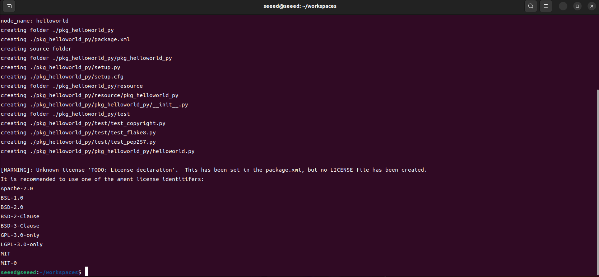

### 6.2.2编写代码

执行上面命令后会创建pkg_helloworld_py，同时会创建helloworld.py文件来编写节点：


删除原本helloworld.py的代码，编写如下代码：

```bash
import rclpy # ROS2 Python接口库
from rclpy.node import Node # ROS2 节点类
import time
"""
创建一个HelloWorld节点, 初始化时输出“hello world”日志
"""
class HelloWorldNode(Node):
def __init__(self, name):
super().__init__(name) # ROS2节点父类初始化
while rclpy.ok(): # ROS2系统是否正常运行
self.get_logger().info("Hello World") # ROS2日志输出
time.sleep(0.5) # 休眠控制循环时间
def main(args=None): # ROS2节点主入口main函数
rclpy.init(args=args) # ROS2 Python接口初始化
node = HelloWorldNode("helloworld") # 创建ROS2节点对象并进行初始化
rclpy.spin(node) # 循环等待ROS2退出
node.destroy_node() # 销毁节点对象
rclpy.shutdown() # 关闭ROS2 Python接口
```

回退到工作目录编译节点

```bash
colcon build --packages-select pkg_helloworld_py
# 在工作空间下刷新环境变量
source install/setup.bash
```

运行节点

```bash
ros2 run pkg_helloworld_py helloworld
```

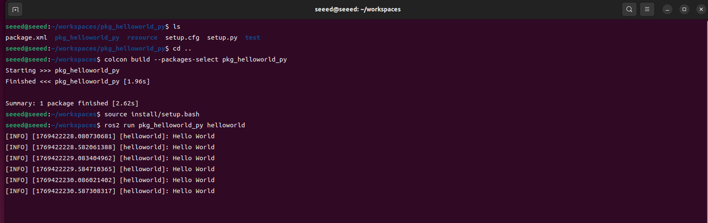

### 6.3下一步

学习节点后，您可以：

1.07话题通讯-深入学习话题通信

2.08服务通讯-学习服务通信

## 07话题通讯

### 07话题通讯(Topics)

### 7.1话题通信概述

### 7.1.1什么是话题通信

话题(Topic)是ROS 2中节点间进行异步流式通信的机制，采用发布/订阅（Pub/Sub）模式。发布者节点向话题发布消息，订阅者节点从话题接收消息，两者无需知道对方的存在。

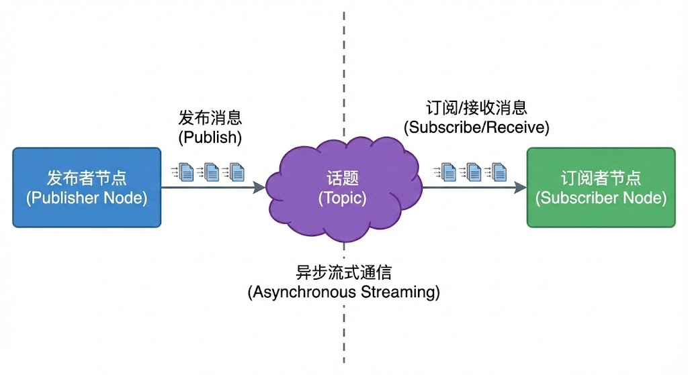

### 7.1.2话题通信特点

| 特点 | 描述 | 适用场景 |
| --- | --- | --- |
| 异步通信 | 发布者不等待订阅者响应 | 传感器数据流 |
| 多对多 | 多个发布者和订阅者 | 数据广播 |
| 弱耦合 | 发布者与订阅者独立 | 模块化设计 |
| 流式传输 | 持续的数据流 | 持续监控 |

### 7.1.3话题命名规则

| 规则 | 说明 |
| --- | --- |
| 必须以 / 开头（全局命名空间）或相对名称 |  |
| 使用小写字母、数字和下划线 |  |
| 使用 / 分隔命名空间层级 |  |
| 避免使用保留名称 |  |

#### 命名示例：

| 话题名 | 评价 |
| --- | --- |
| /cmd_vel | 标准，推荐 |
| /camera/image_raw | 层级清晰，推荐 |
| /sensor/front_camera/image | 带命名空间，推荐 |
| /MyTopic | 不推荐（大写） |
| cmd_vel | 相对名称（会被加上节点命名空间） |

### 7.2通讯案例

### 7.2.1新建功能包

```bash
cd ~/workspaces/src
ros2 pkg create pkg_topic --build-type ament_python --dependencies rclpy --node-name publisher_demo
```

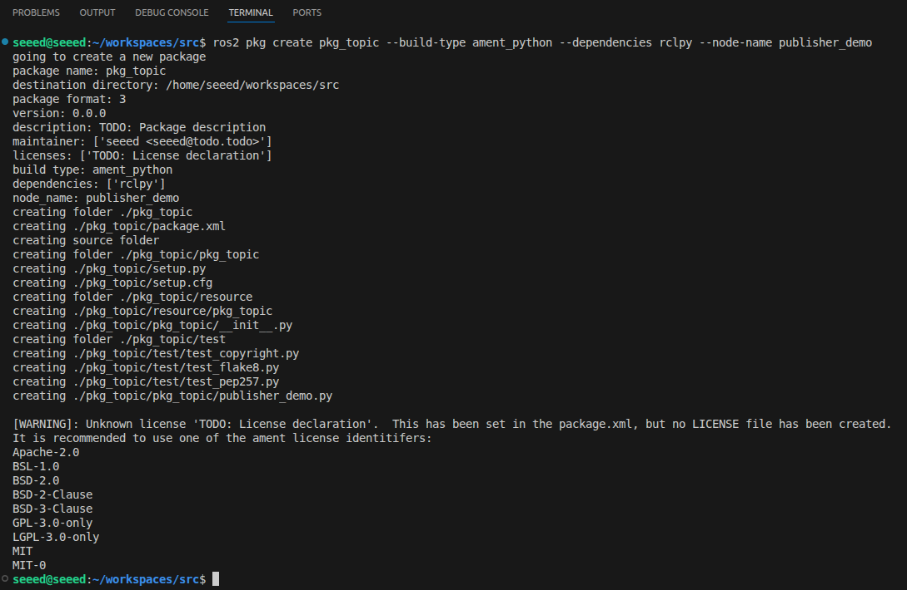

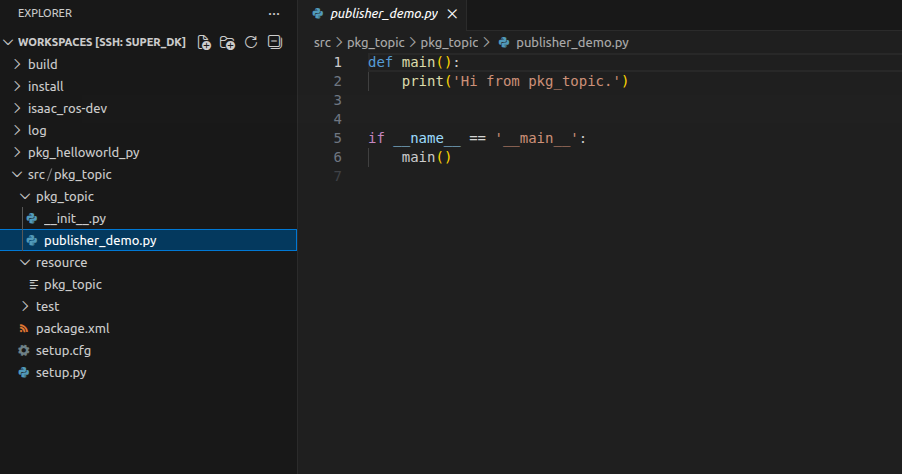

执行完上述命令，会创建pkg_topic功能包，同时会创建一个publisher_demo的节点，并且已经配置好相关的配置文件

### 7.2.2发布方实现

将publisher_demo.py中的代码删除，拷贝如下代码:

```bash
# 导入rclpy库
import rclpy
from rclpy.node import Node
# 导入String字符串消息
from std_msgs.msg import String
# 创建一个继承于Node基类的Topic_Pub节点子类 传入一个参数name
class Topic_Pub(Node):
def __init__(self,name):
super().__init__(name)
# 创建一个发布者，使用create_publisher的函数，传入的参数分别是：
# 话题数据类型、话题名称、保存消息的队列长度
self.pub = self.create_publisher(String,"/topic_demo",1)
# 创建一个定时器，间隔1s进入中断处理函数，传入的参数分别是：
# 中断函数执行的间隔时间，中断处理函数
self.timer = self.create_timer(1,self.pub_msg)
# 定义中断处理函数
def pub_msg(self):
msg = String() # 创建一个String类型的变量msg
msg.data = "Hi,I send a message." # 给msg里边的data赋值
self.pub.publish(msg) # 发布话题数据
# 主函数
def main():
rclpy.init() # 初始化
pub_demo = Topic_Pub("publisher_node") # 创建Topic_Pub类对象，传入的参数就是节点的名字
rclpy.spin(pub_demo) # 执行rclpy.spin函数，里边传入一个参数，参数是刚才创建好的Topic_Pub类对象
pub_demo.destroy_node() # 销毁节点对象
rclpy.shutdown() # 关闭ROS2 Python接口
```

### 7.2.3编辑配置文件

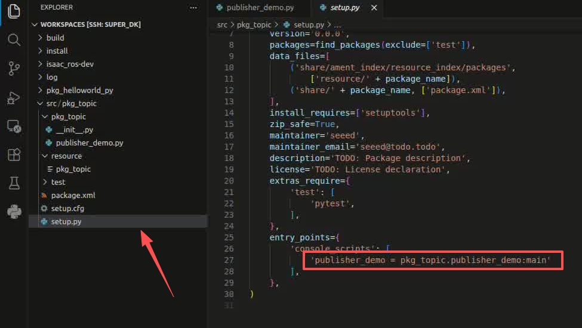

### 7.2.4编译功能包

```bash
cd ~/workspace
# 编译
colcon build --packages-select pkg_topic
# 刷新环境变量
source install/setup.bash
```

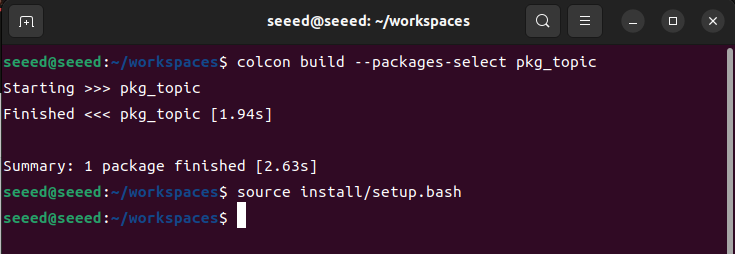

### 7.2.5运行发布节点

```bash
ros2 run pkg_topic publisher_demo
# 打开另一个终端通过ros2 topic 工具来查看数据
ros2 topic list
```

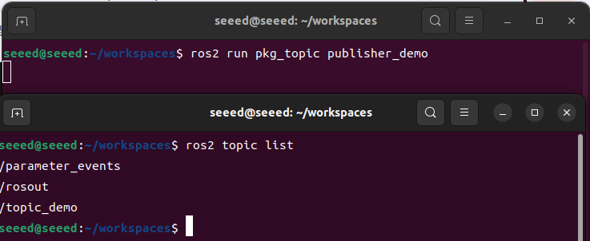

```bash
# 用ros2 topic echo来打印下这个数据
ros2 topic echo /topic_demo
```

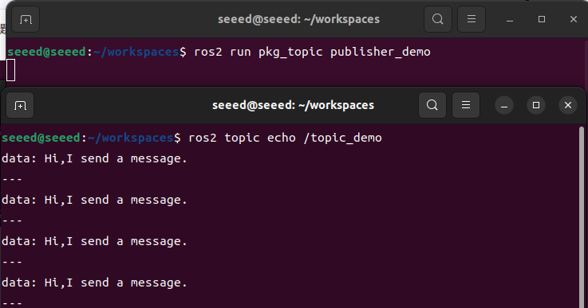

终端打印的"Hi,I send a message."与我们代码里边的msg.data = "Hi,I send a message."一致。

### 7.2.6创建订阅方

在publisher_demo.py同级目录下新建文件subscriber_demo.py。将以下代码粘贴到subscriber_demo.py文件:

```bash
# 导入相关的库
import rclpy
from rclpy.node import Node
from std_msgs.msg import String
class Topic_Sub(Node):
def __init__(self,name):
super().__init__(name)
# 创建订阅者使用的是create_subscription，传入的参数分别是：话题数据类型，话题名称，回调函数名称，队列长度
self.sub = self.create_subscription(String,"/topic_demo",self.sub_callback,1)
# 回调函数执行程序：打印接收的到信息
def sub_callback(self,msg):
# print(msg.data,flush=True)
self.get_logger().info(msg.data)
def main():
rclpy.init() # ROS2 Python接口初始化
sub_demo = Topic_Sub("subscriber_node") # 创建对象并进行初始化
rclpy.spin(sub_demo)
sub_demo.destroy_node() # 销毁节点对象
rclpy.shutdown() # 关闭ROS2 Python接口
```

### 7.2.7编辑配置文件

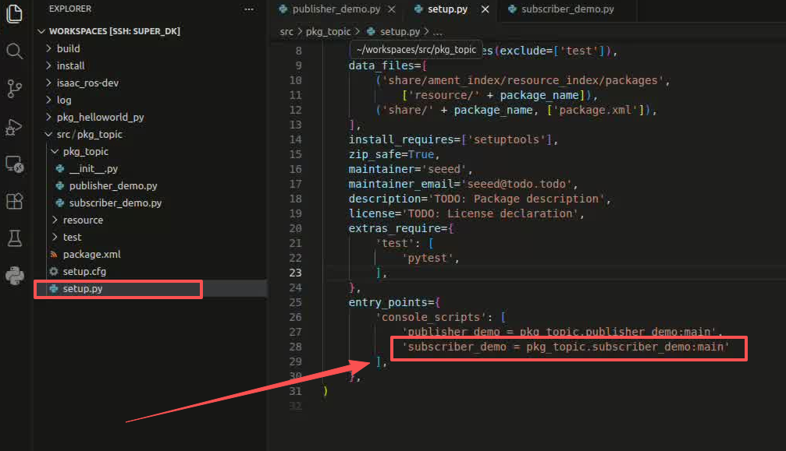

### 7.2.8编译功能包

```bash
cd ~/workspace
colcon build --packages-select pkg_topic
# 刷新环境变量
source install/setup.bash
```

### 7.2.9运行节点

打开两个终端分别运行两个节点:

```bash
# 启动发布者节点
ros2 run pkg_topic publisher_demo
# 启动订阅者节点
ros2 run pkg_topic subscriber_demo
```

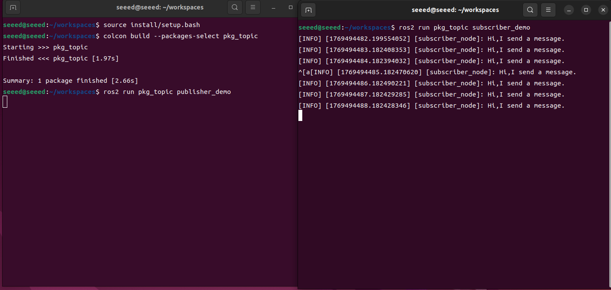

如上图所示，运行订阅者这点的终端会打印发布者发布的/topic_demo的信息。

### 7.3下一步

学习话题通信后，您可以：

1.08服务通讯-学习服务通信

2.09动作通讯-学习动作通信

## 08服务通讯

### 08服务通讯(Services)

### 8.1服务通信概述

### 8.1.1什么是服务通信

服务(Service)是ROS 2中节点间进行同步通信的机制，采用客户端/服务器（Client/Server）模式。客户端发送请求，服务端处理并返回响应。

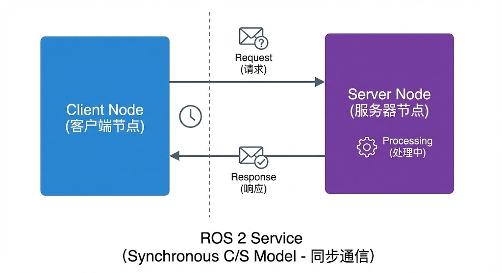

### 8.1.2服务vs话题

| 特性 | 服务 (Services) | 话题 (Topics) |
| --- | --- | --- |
| 通信模式 | 同步（请求 - 响应） | 异步（发布 - 订阅） |
| 连接方式 | 一对一 | 多对多 |
| 适用场景 | 短暂操作、查询 | 持续数据流 |
| 阻塞 | 客户端阻塞等待 | 不阻塞 |
| 返回值 | 必须返回响应 | 无响应 |

### 8.1.3服务类型定义

服务类型使用.srv文件定义，包含请求和响应两部分：

```
Plain Text
# 数据类型定义
# 文件: example_interfaces/srv/AddTwoInts.srv
# 请求部分（--- 上方）
int64 a
int64 b
# 响应部分（--- 下方）
int64 sum
```

### 8.2服务通讯示例

### 8.2.1新建功能包

在~/workspace/src目录下

```bash
ros2 pkg create pkg_service --build-type ament_python --dependencies rclpy --node-name server_demo
```

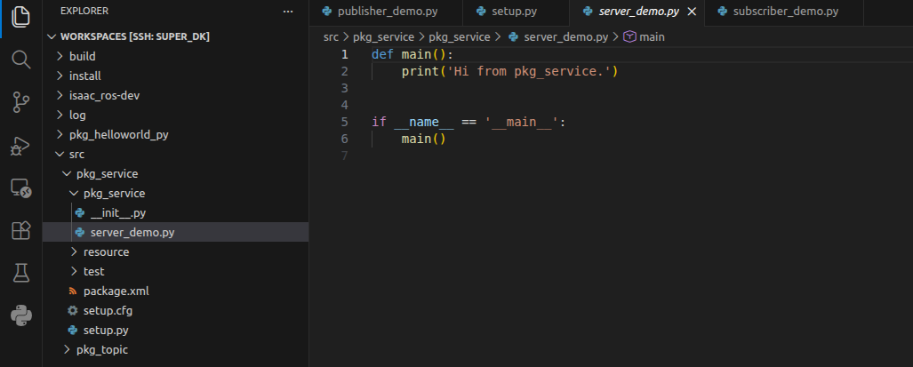

### 8.2.2创建服务端

将server_demo.py代码修改成如下：

```bash
# 导入相关的库文件
import rclpy
from rclpy.node import Node
from example_interfaces.srv import AddTwoInts
class Service_Server(Node):
def __init__(self,name):
super().__init__(name)
# 创建一个服务端，使用的是create_service函数，传入的参数分别是：
# 服务数据的数据类型、服务的名称，服务回调函数（也就是服务的内容）
self.srv = self.create_service(AddTwoInts, '/add_two_ints', self.Add2Ints_callback)
# 这里的服务回调函数的内容是把两个整型数相加，然后返回相加的结果
def Add2Ints_callback(self,request,response):
response.sum = request.a + request.b
print("response.sum = ",response.sum)
return response
def main():
rclpy.init()
server_demo = Service_Server("publisher_node")
rclpy.spin(server_demo)
server_demo.destroy_node() # 销毁节点对象
rclpy.shutdown() # 关闭ROS2 Python接口
```

重点看下服务回调函数，Add2Ints_callback，这里需要传入的参数除了self，还有就是request和response，request是服务需要的参数，response是服务的反馈结果。request.a和request.b是request部分的内容，response.sum是response部分的内容，这里首先看看下AddTwoInts这个类型的数据是怎么样的。

```bash
ros2 interface show example_interfaces/srv/AddTwoInts
```

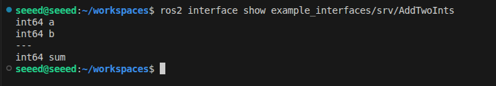

---把该类型的数据划分成了两个部分，上边代表的是request，下边代表的是response。然后各自的领域中又各自的变量，比如int64 a、int64 b，所有在再传入参数的是，需要指定a、b的值是是多少。同样，反馈的结果也需要指定sum的值是多少。

### 8.2.3编辑配置文件

```bash
'server_demo = pkg_service.server_demo:main',
```

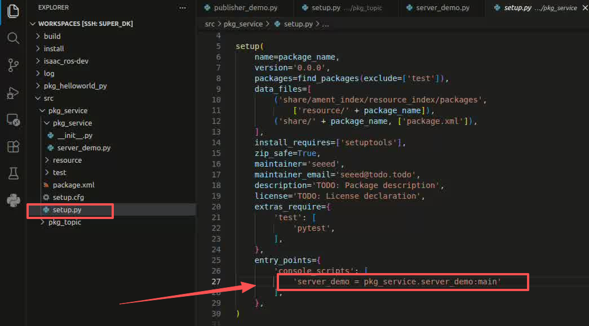

### 8.2.4编译功能包

```bash
colcon build --packages-select pkg_service
# 刷新环境变量
source install/setup.bash
# 运行节点
ros2 run pkg_service server_demo
```

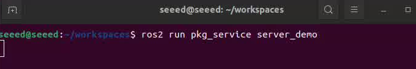

运行后，由于没有调用该服务，所以没有反馈数据，可以通过命令行方式调用该服务，首先查询当前有哪些服务，另一个终端输入：

```bash
ros2 service list
```

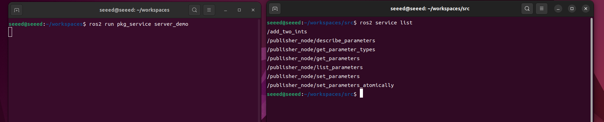

/add_two_ints就是我们需要调用的服务，通过以下命令进行调用，终端输入：

```bash
ros2 service call /add_two_ints example_interfaces/srv/AddTwoInts "{a: 1,b: 4}"
```

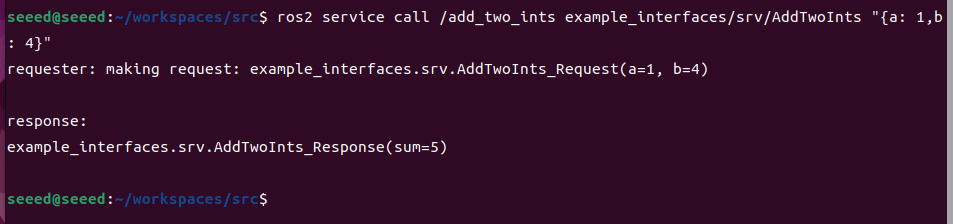

这里我们把a的值赋值成1，b的值赋值成4，也就是调用服务计算1和4的和。由上图可以看出，调用了服务后，反馈回来的结果是5，运行服务端的终端也打印了反馈的值。

### 8.2.5创建客户端

在server_demo.py同级目录下新建文件client_demo.py

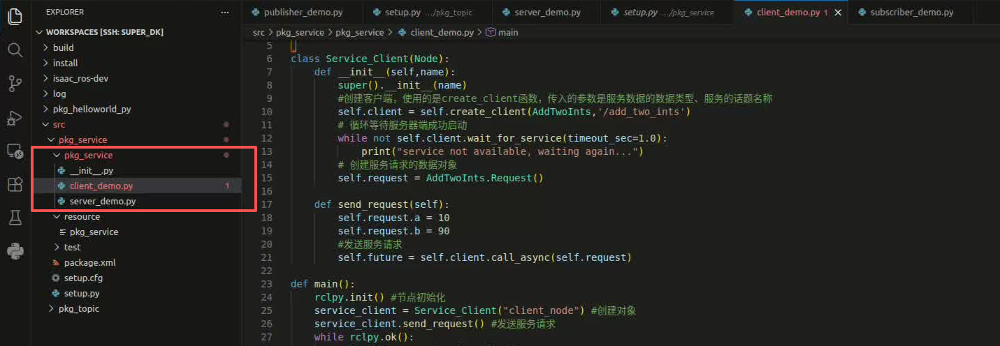

将以下代码写入client_demo.py：

```bash
# 导入相关的库
import rclpy
from rclpy.node import Node
from example_interfaces.srv import AddTwoInts
class Service_Client(Node):
def __init__(self,name):
super().__init__(name)
# 创建客户端，使用的是create_client函数，传入的参数是服务数据的数据类型、服务的话题名称
self.client = self.create_client(AddTwoInts,'/add_two_ints')
# 循环等待服务器端成功启动
while not self.client.wait_for_service(timeout_sec=1.0):
print("service not available, waiting again...")
# 创建服务请求的数据对象
self.request = AddTwoInts.Request()
def send_request(self):
self.request.a = 10
self.request.b = 90
# 发送服务请求
self.future = self.client.call_async(self.request)
def main():
rclpy.init() # 节点初始化
service_client = Service_Client("client_node") # 创建对象
service_client.send_request() # 发送服务请求
while rclpy.ok():
rclpy.spin_once(service_client)
# 判断数据是否处理完成
if service_client.future.done():
try:
# 获得服务反馈的信息并且打印
response = service_client.future.result()
print("service_client.request.a = ",service_client.request.a)
print("service_client.request.b = ",service_client.request.b)
print("Result = ",response.sum)
except Exception as e:
service_client.get_logger().info('Service call failed %r' % (e,))
break
service_client.destroy_node()
rclpy.shutdown()
```

### 8.2.6编辑配置文件

```bash
'client_demo = pkg_service.client_demo:main'
```

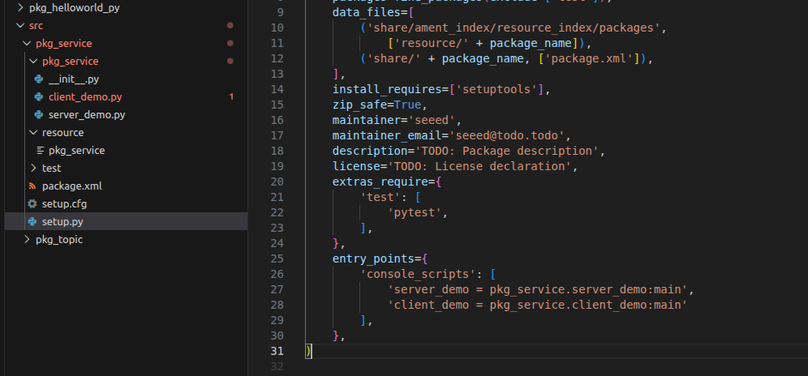

### 8.2.7编译功能包

```bash
cd ~/workspace
colcon build --packages-select pkg_service
# 刷新环境变量
source install/setup.bash
# 启动服务端节点
ros2 run pkg_service server_demo
```

打开另一个终端运行:

```bash
# 刷新环境变量
source install/setup.bash
# 启动客户端节点
ros2 run pkg_service client_demo
```

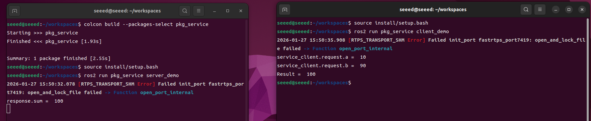

客户端提供a=10，b=90，服务端进行求和，得到结果是100，结果在两者终端打印。

### 8.3下一步

学习服务通信后，您可以：

1.09动作通讯-学习动作通信（长任务）

2.10 TF2坐标变换-创建自定义服务类型

## 09动作通讯

### 09动作通讯(Actions)

### 9.1动作通信概述

### 9.1.1什么是动作通信

动作(Action)是ROS 2中用于处理长时间任务的通信机制。与服务类似，动作也是客户端-服务端模式，但支持：

#### -任务执行过程中的实时反馈

#### -客户端可以取消正在执行的任务

#### -适合处理可能耗时数秒到数分钟的操作

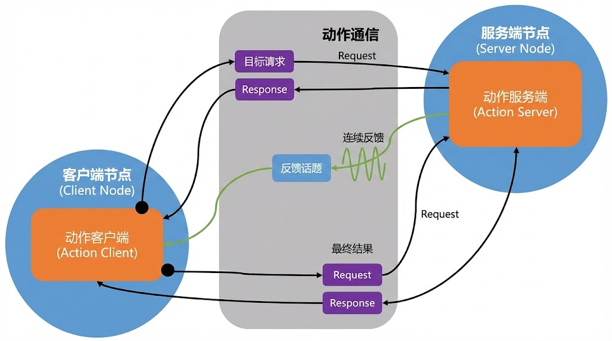

### 9.1.2动作vs服务

| 特性 | 服务 (Service) | 动作 (Action) |
| --- | --- | --- |
| 适用时长 | 短暂操作（毫秒 - 秒） | 长任务（秒 - 分钟） |
| 反馈 | 无实时反馈 | 持续发送反馈 |
| 取消 | 不支持 | 可中途取消 |
| 阻塞 | 客户端阻塞 | 可异步执行 |
| 应用场景 | 查询、简单操作 | 导航、抓取 |

### 9.2动作通讯案例

动作客户端提交一个整型数据N，动作服务端接收请求数据并累加1-N之间的所有整数，将最终结果返回给动作客户端，且每累加一次都计算当前运算进度并反馈给动作客户端。

### 9.2.1新建功能包

```bash
ros2 pkg create --build-type ament_cmake pkg_interfaces
```

接着在pkg_interfaces功能包下面创建一个action的文件夹，并在action文件夹内新建Progress.action文件，文件内容如下：

```bash
int64 num
---
int64 sum
---
float64 progress
```

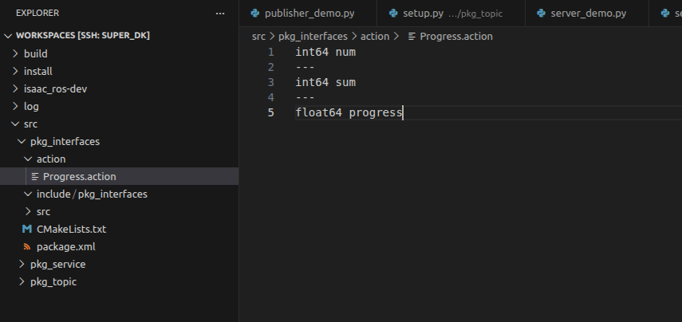

在package.xml中需要添加一些依赖包，具体内容如下：

```bash
<buildtool_depend>rosidl_default_generators</buildtool_depend>
<exec_depend>rosidl_default_runtime</exec_depend>
<depend>action_msgs</depend>
<member_of_group>rosidl_interface_packages</member_of_group>
```

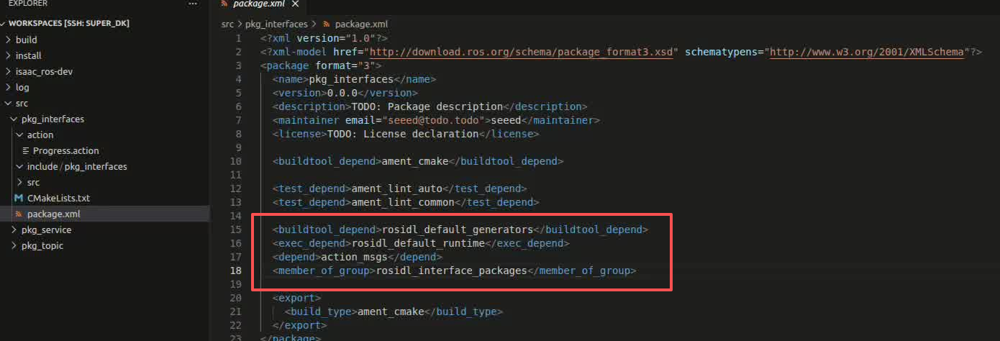

4、在CMakeLists.txt中添加如下配置：

```bash
find_package(rosidl_default_generators REQUIRED)
rosidl_generate_interfaces(${PROJECT_NAME}
"action/Progress.action")
```

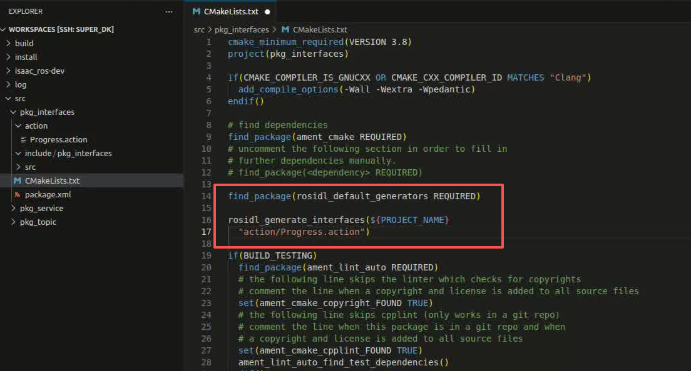

5、编译功能包：

```bash
cd ~/workspace
colcon build --packages-select pkg_interfaces
```

6、编译完成之后，在工作空间下的install目录下将生成Progress.action文件对应的C++和Python文件，我们也可以在终端下进入工作空间，通过如下命令查看文件定义以及编译是否正常：

```bash
source install/setup.bash
ros2 interface show pkg_interfaces/action/Progress
```

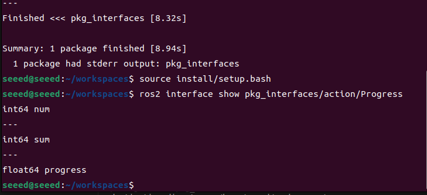

正常情况下，终端将会输出与Progress.action文件一致的内容

3.2、创建动作通讯功能包

```bash
ros2 pkg create pkg_action --build-type ament_python --dependencies rclpy pkg_interfaces --node-name action_server_demo
```

执行完上述命令，会创建pkg_action功能包，同时会创建一个action_server_demo的节点，并且已经配置好相关的配置文件

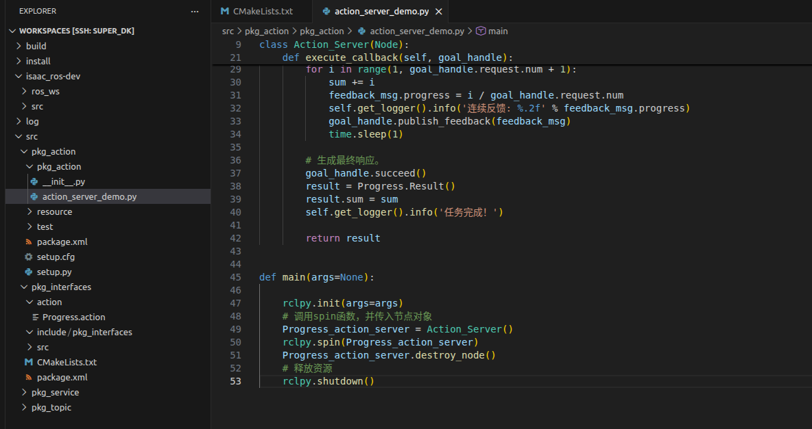

### 4、服务端实现

### 4.1创建服务端

接下来编辑action_server_demo.py实现服务端的功能，添加如下代码：

```bash
import time
import rclpy
from rclpy.action import ActionServer
from rclpy.node import Node
from pkg_interfaces.action import Progress
class Action_Server(Node):
def __init__(self):
super().__init__('progress_action_server')
# 创建动作服务端
self._action_server = ActionServer(
self,
Progress,
'get_sum',
self.execute_callback)
self.get_logger().info('动作服务已经启动！')
def execute_callback(self, goal_handle):
self.get_logger().info('开始执行任务....')
# 生成连续反馈；
feedback_msg = Progress.Feedback()
total = 0
for i in range(1, goal_handle.request.num + 1):
total += i
feedback_msg.progress = i / goal_handle.request.num
self.get_logger().info('连续反馈: %.2f' % feedback_msg.progress)
goal_handle.publish_feedback(feedback_msg)
time.sleep(1)
# 生成最终响应。
goal_handle.succeed()
result = Progress.Result()
result.sum = total
self.get_logger().info('任务完成！')
return result
def main(args=None):
rclpy.init(args=args)
# 调用spin函数，并传入节点对象
Progress_action_server = Action_Server()
rclpy.spin(Progress_action_server)
Progress_action_server.destroy_node()
# 释放资源
rclpy.shutdown()
```

### 4.2编辑配置文件

```bash
'action_server_demo = pkg_action.action_server_demo:main',
```

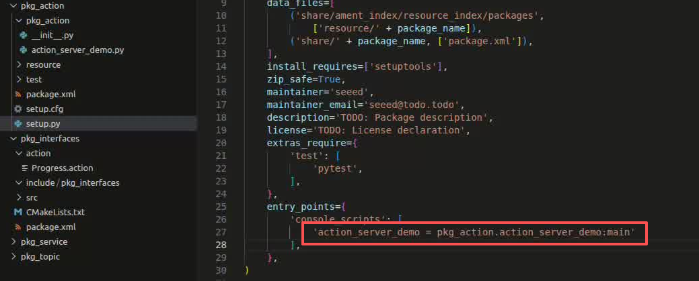

### 4.3编译功能包

```bash
cd ~/workspace
colcon build --packages-select pkg_action
# 刷新环境变量
source install/setup.bash
# 运行动作服务节点
ros2 run pkg_action action_server_demo
```

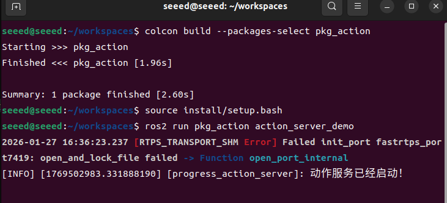

另一个终端输入：

```bash
ros2 action list
```

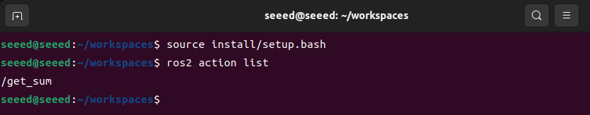

/get_sum就是我们需要调用的动作，通过以下命令进行调用，终端输入：

```bash
ros2 action send_goal /get_sum pkg_interfaces/action/Progress "{num: 10}"
```

这里我们求1到10的和：

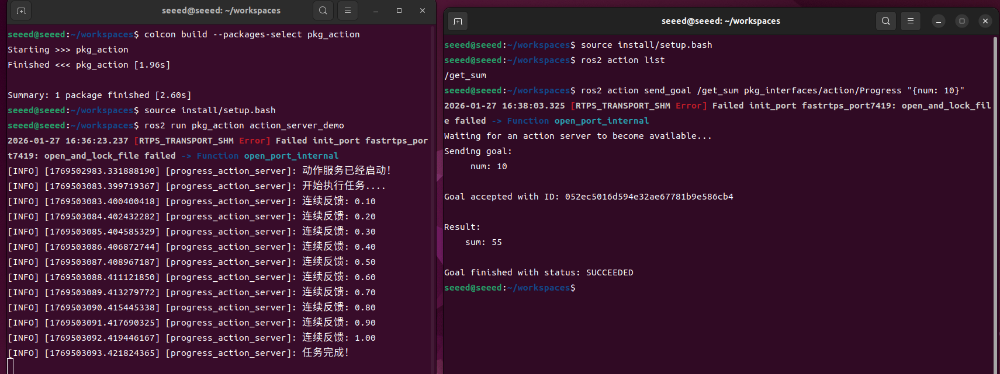

上图上面是服务端，下面是客户端。可以看到1到10的和计算的过程中有服务端一直在反馈计算的进度，最后显示任务完成，客户端也收到了反馈的和为55

### 5、客户端实现

### 5.1创建客户端

在action_server_demo.py同级目录下新建文件action_client_demo.py

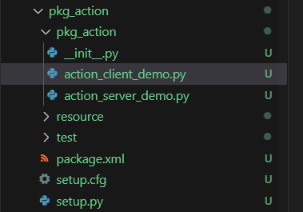

接下来编辑action_client_demo.py实现服务端的功能，添加如下代码：

```bash
import rclpy
from rclpy.action import ActionClient
from rclpy.node import Node
from pkg_interfaces.action import Progress
class Action_Client(Node):
def __init__(self):
super().__init__('progress_action_client')
# 创建动作客户端；
self._action_client = ActionClient(self, Progress, 'get_sum')
def send_goal(self, num):
# 发送请求；
goal_msg = Progress.Goal()
goal_msg.num = num
self._action_client.wait_for_server()
self._send_goal_future = self._action_client.send_goal_async(goal_msg, feedback_callback=self.feedback_callback)
self._send_goal_future.add_done_callback(self.goal_response_callback)
def goal_response_callback(self, future):
# 处理目标发送后的反馈；
goal_handle = future.result()
if not goal_handle.accepted:
self.get_logger().info('请求被拒绝')
return
self.get_logger().info('请求被接收，开始执行任务！')
self._get_result_future = goal_handle.get_result_async()
self._get_result_future.add_done_callback(self.get_result_callback)
# 处理最终响应。
def get_result_callback(self, future):
result = future.result().result
self.get_logger().info('最终计算结果:sum = %d' % result.sum)
# 5.释放资源。
rclpy.shutdown()
# 处理连续反馈；
def feedback_callback(self, feedback_msg):
feedback = (int)(feedback_msg.feedback.progress * 100)
self.get_logger().info('当前进度: %d%%' % feedback)
def main(args=None):
rclpy.init(args=args)
action_client = Action_Client()
action_client.send_goal(10)
rclpy.spin(action_client)
```

### 5.2编辑配置文件

```bash
'action_client_demo = pkg_action.action_client_demo:main'
```

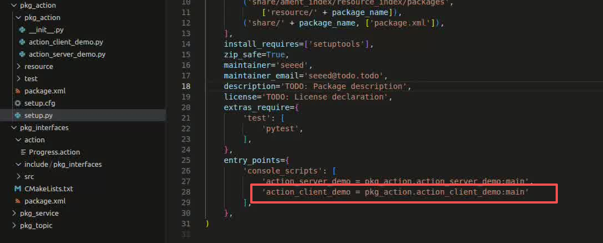

### 5.3编译功能包

```bash
cd ~/workspace
colcon build --packages-select pkg_action
# 刷新环境变量
source install/setup.bash
```

### 5.4运行程序

分终端执行如下：

```bash
# 启动服务端节点
ros2 run pkg_action action_server_demo
# 启动客户端节点
ros2 run pkg_action action_client_demo
```

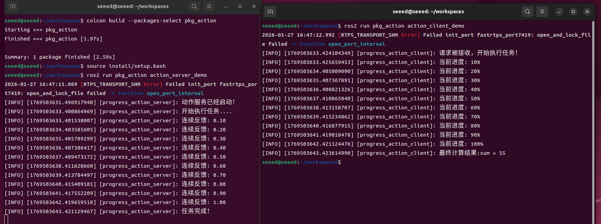

上图上面是服务端，下面是客户端。这里我们求1到10的和，可以看到1到10的和计算的过程中有服务端一直在反馈计算的进度，最后显示任务完成，客户端也收到了反馈的和为55
