# ROS2 Advanced Interfaces and Middleware

## 10 TF2坐标变换

### 10 TF2坐标变换(TF2 Transform)

### 10.1 TF2概述

### 10.1.1什么是TF2

TF2 (Transform 2)是ROS 2中用于管理坐标变换的库。它跟踪多个坐标系之间的关系，允许开发者在不同坐标系之间转换数据（如点、向量、姿态）。

```
Plain Text
TF2 坐标系树示例：
map (世界坐标系)
|
| (2D 平面变换)
|
odom (里程计坐标系)
|
| (Z轴平移)
|
base_link (机器人基座)
|
┌────────┼────────┐
| | |
camera laser base_footprint
(相机) (激光) (底盘)
```

### 10.1.2 TF2的用途

| 应用 | 说明 |
| --- | --- |
| 传感器融合 | 将不同传感器的数据转换到统一坐标系 |
| 导航 | 将地图坐标系的目标转换为机器人坐标系 |
| 机械臂 | 计算末端执行器相对于基座的姿态 |
| 可视化 | 在 RViz2 中正确显示机器人状态 |

### 10.1.3坐标系命名规范

| 命名 | 用途 |
| --- | --- |
| map | 全局 / 世界坐标系，固定不变 |
| odom | 里程计坐标系，用于定位 |
| base_link | 机器人基座坐标系 |
| base_footprint | 机器人底盘投影到地面 |
| camera_link | 相机坐标系 |
| laser_link | 激光雷达坐标系 |

### 23、ROS2 TF2坐标变换

### 1、TF2简介

坐标系是我们非常熟悉的一个概念，也是机器人学中的重要基础，在一个完整的机器人系统中，会存在很多坐标系，这些坐标系之间的位置关系该如何管理？ROS给我们提供了一个坐标系的管理神器：TF2

TF系统参考文献：tf: The transform library | IEEE Conference Publication | IEEE Xplore

### 2、机器人中的坐标系

在移动机器人系统中，坐标系一样至关重要，比如一个移动机器人的中心点是基坐标系Base Link，雷达所在的位置叫做雷达坐标系laser link，机器人要移动，里程计会累积位置，这个位置的参考系叫做里程计坐标系odom，里程计又会有累积误差和漂移，绝对位置的参考系叫做地图坐标系map。

一层一层坐标系之间关系复杂，有一些是相对固定的，也有一些是不断变化的，看似简单的坐标系也在空间范围内变得复杂，良好的坐标系管理系统就显得格外重要。


关于坐标系变换关系的基本理论，在每一本机器人学的教材中都会有讲解，可以分解为平移和旋转两个部分，通过一个四乘四的矩阵进行描述，在空间中画出坐标系，那两者之间的变换关系，其实就是向量的数学描述。

ROS中TF功能的底层原理，就是对这些数学变换进行了封装，详细的理论知识大家可以参考机器人学的教材，我们主要讲解TF坐标管理系统的使用方法。

### 3、TF命令行操作

我们先通过两只小海龟的示例，了解下基于坐标系的一种机器人跟随算法。为方便演示，本节课程最好选择在虚拟机中操作

### 3.1、安装相关工具

这个示例需要我们先安装相应的功能包、tf海龟模拟器案例、tf树可视化工具

```bash
sudo apt install ros-${ROS_DISTRO}-turtle-tf2-py ros-humble-tf2-tools
sudo pip3 install transforms3d
sudo apt install ros-${ROS_DISTRO}-rqt-tf-tree
```

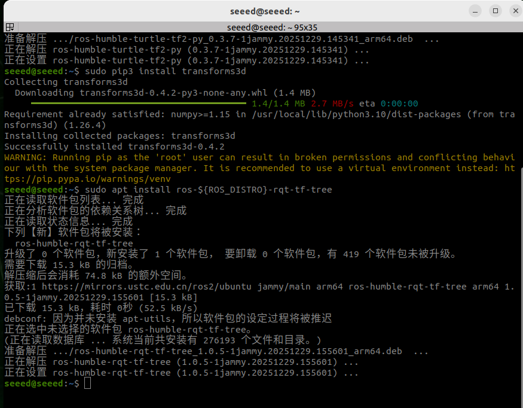

### 3.2、启动

然后就可以通过一个launch文件启动，之后我们可以控制其中的一只小海龟，另外一只小海龟会自动跟随运动。打开两个终端分别运行如下命令:

```bash
ros2 launch turtle_tf2_py turtle_tf2_demo.launch.py
ros2 run turtlesim turtle_teleop_key
```

当我们控制一只海龟运动时，另外一只海龟也会跟随运动。

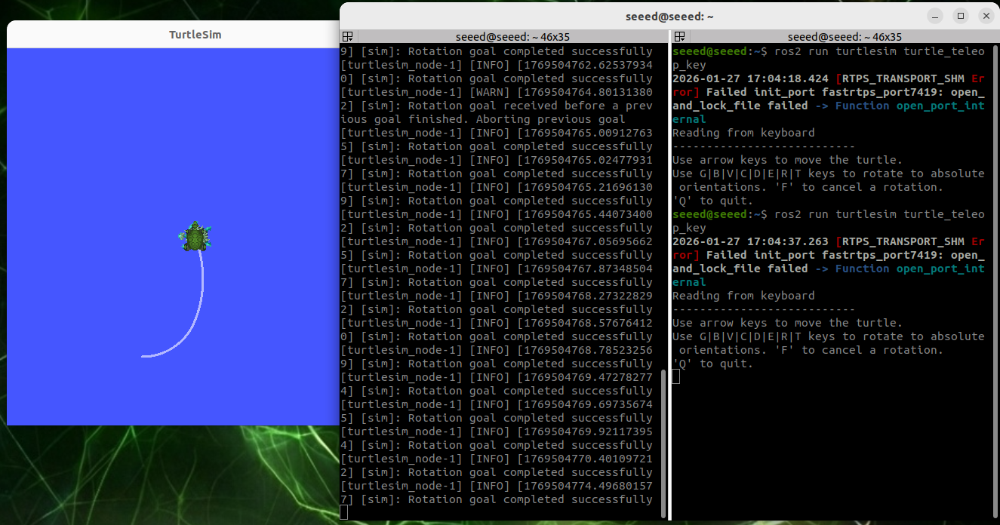

### 3.3、查看TF树

```bash
ros2 run rqt_tf_tree rqt_tf_tree
```

可以在rqt窗口中看到TF变换树

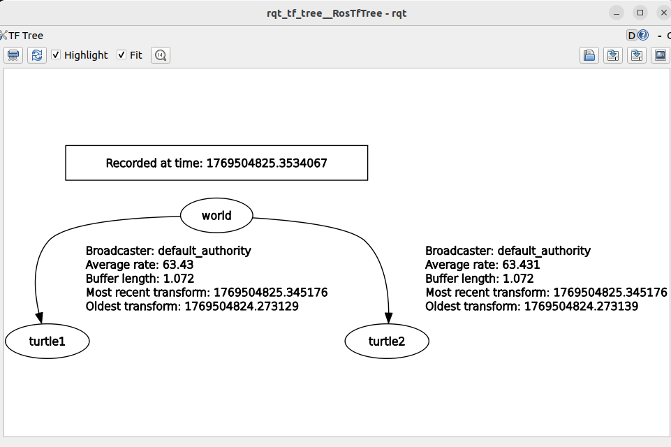

### 3.4、查询坐标变换信息

只看到坐标系的结构还不行，如果我们想要知道某两个坐标系之间的具体关系，可以通过tf2_echo这个工具查看：

```bash
ros2 run tf2_ros tf2_echo turtle2 turtle1
```

运行成功后，终端中就会循环打印坐标系的变换数值了

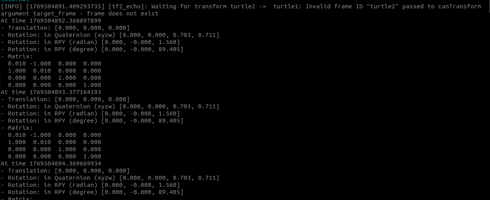

### 3.5、坐标系可视化

```bash
rviz2
```

rivz2中设置参考坐标系为：world，添加TF显示，再让小海龟动起来，Rviz中的坐标轴就会开始运动，这样是不是更加直观了呢！

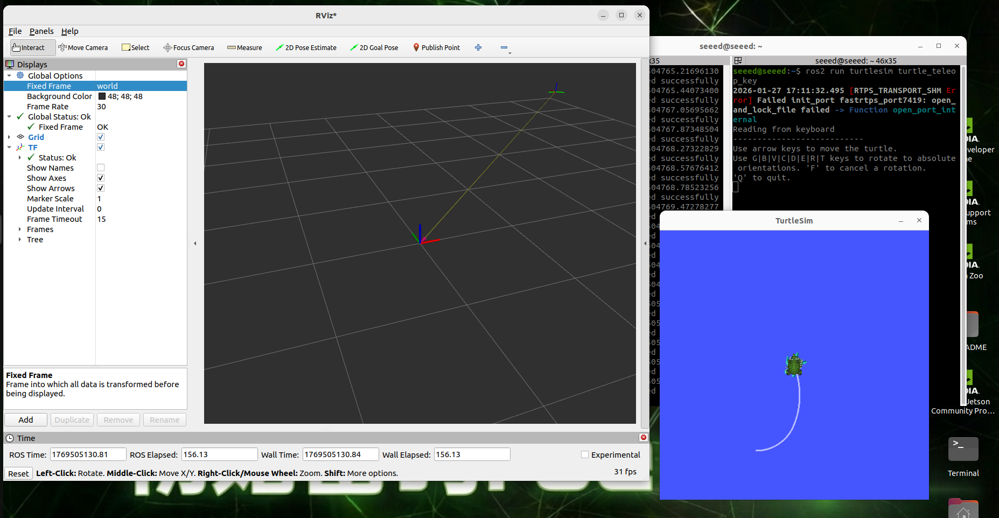

### 4、静态坐标变换

所谓静态坐标变换，是指两个坐标系之间的相对位置是固定的。如雷达和base_link之间的位置是固定的。

#### 示例：为方便演示，本节课程最好选择在虚拟机中操作

### 4.1、发布A到B的位姿

```bash
ros2 run tf2_ros static_transform_publisher 0 0 3 0 0 3.14 A B
```

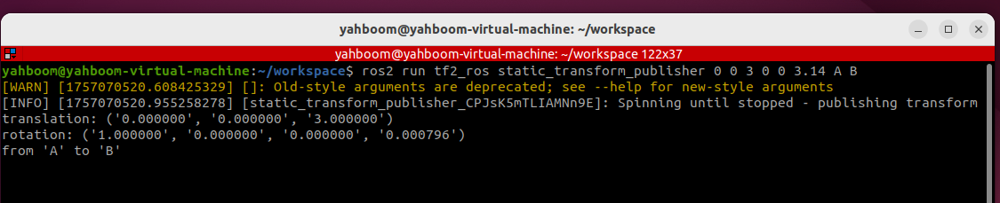

### 4.2、监听/获取TF关系

```bash
ros2 run tf2_ros tf2_echo A B
```

### 4.3、rivz可视化

```bash
rviz2
```

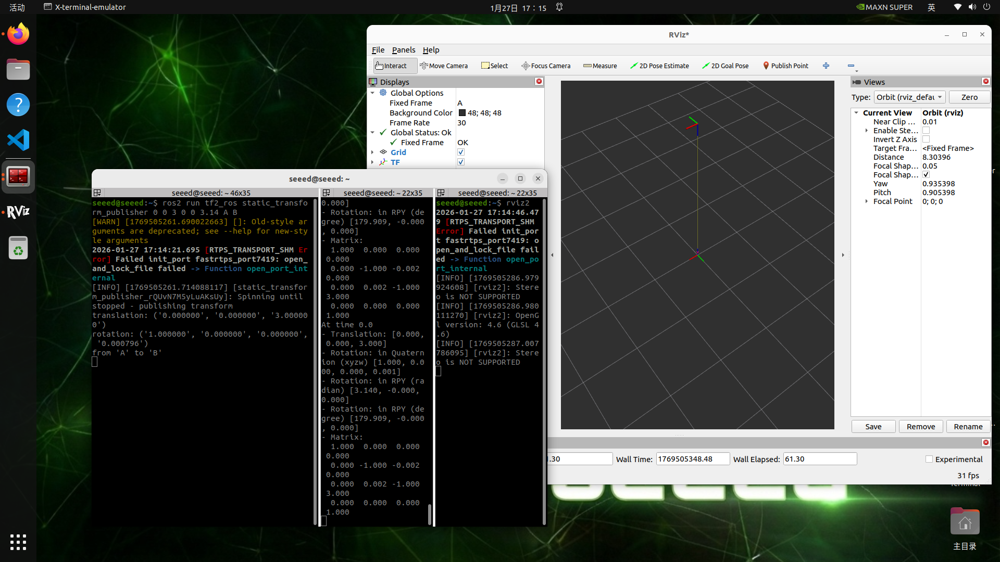

### 5、案例介绍

上节课程中讲解了系统提供的小海龟跟随案例中的TF关系，这节课我们自己实现该功能。

课程内容：

进阶内容：

### 6、海龟跟随案例实现原理分析

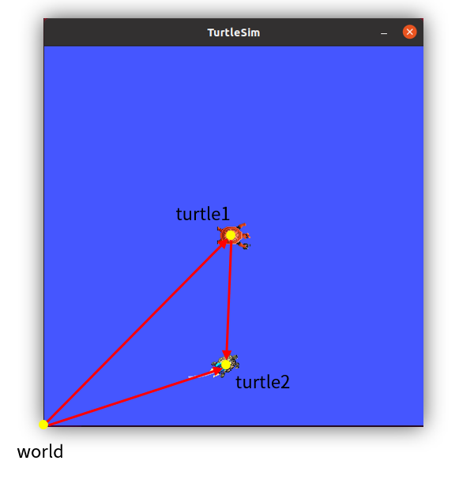

在两只海龟的仿真器中，我们可以定义三个坐标系，比如仿真器的全局参考系叫做world，turtle1和turtle2坐标系在两只海龟的中心点，这样，turtle1和world坐标系的相对位置，就可以表示海龟1的位置，海龟2也同理。

要实现海龟2向海龟1运动，我们在两者中间做一个连线，再加一个箭头，怎么样，是不是有想起高中时学习的向量计算？我们说坐标变换的描述方法就是向量，所以在这个跟随例程中，用TF就可以很好的解决。

向量的长度表示距离，方向表示角度，有了距离和角度，我们随便设置一个时间，不就可以计算得到速度了么，然后就是速度话题的封装和发布，海龟2也就可以动起来了。

所以这个例程的核心就是通过坐标系实现向量的计算，两只海龟还会不断运动，这个向量也得按照某一个周期计算，这就得用上TF的动态广播与监听了。

### 7、新建功能包

```bash
ros2 pkg create pkg_tf --build-type ament_python --dependencies rclpy --node-name turtle_tf_broadcaster
```

执行完上述命令，会创建pkg_tf功能包，同时会创建一个turtle_tf_broadcaster的节点，并且已经配置好相关的配置文件，在turtle_tf_broadcaster.py文件中添加如下代码：

```bash
import math
import rclpy # ROS2 Python接口库
from rclpy.node import Node # ROS2 节点类
from geometry_msgs.msg import TransformStamped # 坐标变换消息
from tf2_ros import TransformBroadcaster # TF坐标变换广播器
from turtlesim.msg import Pose # turtlesim小海龟位置消息
def quaternion_from_euler(roll, pitch, yaw):
"""Return quaternion from Euler angles (roll, pitch, yaw)."""
cy = math.cos(yaw * 0.5)
sy = math.sin(yaw * 0.5)
cp = math.cos(pitch * 0.5)
sp = math.sin(pitch * 0.5)
cr = math.cos(roll * 0.5)
sr = math.sin(roll * 0.5)
w = cr * cp * cy + sr * sp * sy
x = sr * cp * cy - cr * sp * sy
y = cr * sp * cy + sr * cp * sy
z = cr * cp * sy - sr * sp * cy
return (x, y, z, w)
class TurtleTFBroadcaster(Node):
def __init__(self, name):
super().__init__(name) # ROS2节点父类初始化
# 创建一个海龟名称的参数（若外部未提供则使用默认'turtle'）
self.turtlename = self.declare_parameter('turtlename', 'turtle').value
self.tf_broadcaster = TransformBroadcaster(self) # 创建一个TF坐标变换的广播对象并初始化
self.subscription = self.create_subscription( # 创建一个订阅者，订阅海龟的位置消息
Pose,
f'/{self.turtlename}/pose', # 使用参数中获取到的海龟名称
self.turtle_pose_callback, 1)
def turtle_pose_callback(self, msg): # 创建一个处理海龟位置消息的回调函数，将位置消息转变成坐标变换
transform = TransformStamped() # 创建一个坐标变换的消息对象
transform.header.stamp = self.get_clock().now().to_msg() # 设置坐标变换消息的时间戳
transform.header.frame_id = 'world' # 设置一个坐标变换的源坐标系
transform.child_frame_id = self.turtlename # 设置一个坐标变换的目标坐标系
transform.transform.translation.x = msg.x # 设置坐标变换中的X、Y、Z向的平移
transform.transform.translation.y = msg.y
transform.transform.translation.z = 0.0
q = quaternion_from_euler(0, 0, msg.theta) # 将欧拉角转换为四元数（roll, pitch, yaw）
transform.transform.rotation.x = q[0] # 设置坐标变换中的X、Y、Z向的旋转（四元数）
transform.transform.rotation.y = q[1]
transform.transform.rotation.z = q[2]
transform.transform.rotation.w = q[3]
# Send the transformation
self.tf_broadcaster.sendTransform(transform) # 广播坐标变换，海龟位置变化后，将及时更新坐标变换信息
def main(args=None):
rclpy.init(args=args) # ROS2 Python接口初始化
node = TurtleTFBroadcaster("turtle_tf_broadcaster") # 创建ROS2节点对象并进行初始化
rclpy.spin(node) # 循环等待ROS2退出
node.destroy_node() # 销毁节点对象
rclpy.shutdown() # 关闭ROS2 Python接口
```

2、接下来在turtle_tf_broadcaster.py同级目录下新建turtle_following.py文件，添加如下代码：

```python
import math
import rclpy # ROS2 Python接口库
from rclpy.node import Node # ROS2 节点类
import tf_transformations # TF坐标变换库
from tf2_ros import TransformException # TF左边变换的异常类
from tf2_ros.buffer import Buffer # 存储坐标变换信息的缓冲类
from tf2_ros.transform_listener import TransformListener # 监听坐标变换的监听器类
from geometry_msgs.msg import Twist # ROS2 速度控制消息
from turtlesim.srv import Spawn # 海龟生成的服务接口
class TurtleFollowing(Node):
def init(self, name):
super().init(name) # ROS2节点父类初始化
self.declare_parameter('source_frame', 'turtle1') # 创建一个源坐标系名的参数
self.source_frame = self.get_parameter( # 优先使用外部设置的参数值，否则用默认值
'source_frame').get_parameter_value().string_value
self.tf_buffer = Buffer() # 创建保存坐标变换信息的缓冲区
self.tf_listener = TransformListener(self.tf_buffer, self) # 创建坐标变换的监听器
self.spawner = self.create_client(Spawn, 'spawn') # 创建一个请求产生海龟的客户端
self.turtle_spawning_service_ready = False # 是否已经请求海龟生成服务的标志位
self.turtle_spawned = False # 海龟是否产生成功的标志位
self.publisher = self.create_publisher(Twist, 'turtle2/cmd_vel', 1) # 创建跟随运动海龟的速度话题
self.timer = self.create_timer(1.0, self.on_timer) # 创建一个固定周期的定时器，控制跟随海龟的运动
def on_timer(self):
from_frame_rel = self.source_frame # 源坐标系
to_frame_rel = 'turtle2' # 目标坐标系
if self.turtle_spawning_service_ready: # 如果已经请求海龟生成服务
if self.turtle_spawned: # 如果跟随海龟已经生成
try:
now = rclpy.time.Time() # 获取ROS系统的当前时间
trans = self.tf_buffer.lookup_transform( # 监听当前时刻源坐标系到目标坐标系的坐标变换
to_frame_rel,
from_frame_rel,
now)
except TransformException as ex: # 如果坐标变换获取失败，进入异常报告
self.get_logger().info(
f'Could not transform {to_frame_rel} to {from_frame_rel}: {ex}')
return
msg = Twist() # 创建速度控制消息
scale_rotation_rate = 1.0 # 根据海龟角度，计算角速度
msg.angular.z = scale_rotation_rate * math.atan2(
trans.transform.translation.y,
trans.transform.translation.x)
scale_forward_speed = 0.5 # 根据海龟距离，计算线速度
msg.linear.x = scale_forward_speed * math.sqrt(
trans.transform.translation.x ** 2 +
trans.transform.translation.y ** 2)
self.publisher.publish(msg) # 发布速度指令，海龟跟随运动
else: # 如果跟随海龟没有生成
if self.result.done(): # 查看海龟是否生成
self.get_logger().info(
f'Successfully spawned {self.result.result().name}')
self.turtle_spawned = True
else: # 依然没有生成跟随海龟
self.get_logger().info('Spawn is not finished')
else: # 如果没有请求海龟生成服务
if self.spawner.service_is_ready(): # 如果海龟生成服务器已经准备就绪
request = Spawn.Request() # 创建一个请求的数据
request.name = 'turtle2' # 设置请求数据的内容，包括海龟名、xy位置、姿态
request.x = float(4)
request.y = float(2)
request.theta = float(0)
self.result = self.spawner.call_async(request) # 发送服务请求
self.turtle_spawning_service_ready = True # 设置标志位，表示已经发送请求
else:
self.get_logger().info('Service is not ready') # 海龟生成服务器还没准备就绪的提示
def main(args=None):
rclpy.init(args=args) # ROS2 Python接口初始化
node = TurtleFollowing("turtle_following") # 创建ROS2节点对象并进行初始化
rclpy.spin(node) # 循环等待ROS2退出
node.destroy_node() # 销毁节点对象
rclpy.shutdown() # 关闭ROS2 Python接口
```

在pkg_tf功能包下新建launch文件夹，在launch文件夹内新建turtle_following.launch.py文件，添加如下内容：

```python
from launch import LaunchDescription
from launch.actions import DeclareLaunchArgument
from launch.substitutions import LaunchConfiguration
from launch_ros.actions import Node
def generate_launch_description():
return LaunchDescription([
DeclareLaunchArgument('source_frame', default_value='turtle1', description='Target frame name.'),
Node(
package='turtlesim',
executable='turtlesim_node',
),
Node(
package='pkg_tf',
executable='turtle_tf_broadcaster',
name='broadcaster1',
parameters=[
{'turtlename': 'turtle1'}
]
),
Node(
package='pkg_tf',
executable='turtle_tf_broadcaster',
name='broadcaster2',
parameters=[
{'turtlename': 'turtle2'}
]
),
Node(
package='pkg_tf',
executable='turtle_following',
name='listener',
parameters=[
{'source_frame': LaunchConfiguration('source_frame')}
]
),
])
```

### 8、编辑配置文件

### 8.1、setup.py中配置

```bash
import os
from glob import glob
```

```bash
(os.path.join('share',package_name,'launch'),glob('launch/*')),
```

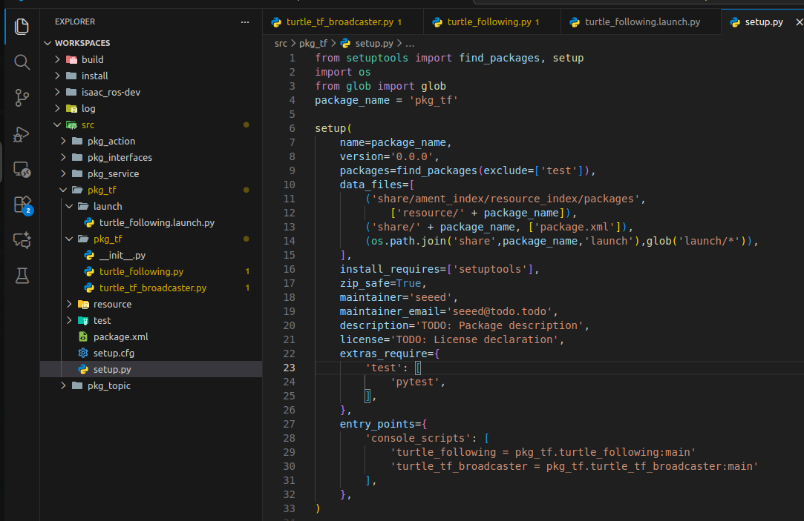

### 9、编译功能包

```bash
colcon build --packages-select pkg_tf
```

### 10、运行程序

```bash
source install/setup.bash
ros2 launch pkg_tf turtle_following.launch.py
```

```bash
ros2 run turtlesim turtle_teleop_key
```

在此终端内按键盘的上下左右键可以控制其中的一个小乌龟运动，然后另外一个小乌龟会跟着运动直到它们重合。

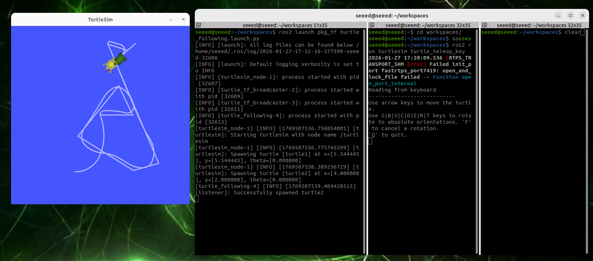

### 11、进阶内容


## 11自定义接口消息

### 11自定义接口消息(Custom Interfaces)

在ROS系统中，话题（Topic）、服务（Service）和动作（Action）这三类通信机制，都依赖于一个核心概念——通信接口。

通信的本质是多方之间的信息交换，而非单向的自说自话。要实现高效、可靠的交互，参与通信的节点必须对数据的格式和语义达成共识。为此，ROS引入了标准化的通信接口，为各类消息定义清晰、统一的数据结构，确保不同节点之间能够准确理解彼此传递的信息。

这种接口设计不仅规范了数据交换的方式，更在架构层面解耦了程序模块：开发者无需了解对方的内部实现，只需遵循接口约定，即可实现模块间的无缝协作。这既便于集成他人开发的功能组件，也方便自己的代码被复用，从而显著提升开发效率。

归根结底，通信接口是ROS“避免重复造轮子”理念的技术基石——通过标准化与解耦，推动机器人软件的模块化、复用化与生态化发展。

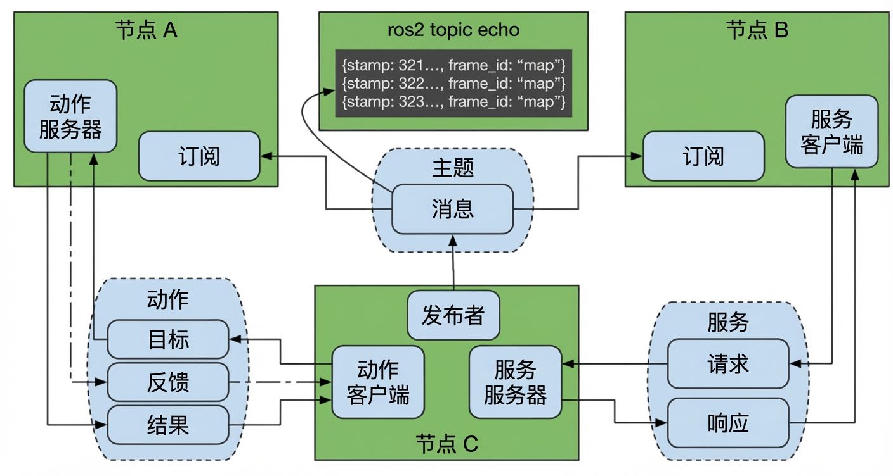

ROS有三种常用的通信机制，分别是话题、服务、动作，通过每一种通信种定义的接口，各种节点才能有机的联系到一起。

### 11.1创建自定义接口流程

主要步骤如下：

### 11.2创建动作通信自定义接口

在09动作通讯的案例中，我们已经演示过如果创建动作通讯接口的完整流程，大家可以先回去复习一下，这里就不再赘述。

### 11.3创建话题通信自定义接口

在09动作通讯中我们已经创建了自定义接口功能包，现在我们在功能包pkg_interfaces下新建msg文件夹，msg文件夹下新建Person.msg文件，文件中输入如下内容：

```bash
string name
int32 age
float64 height
```

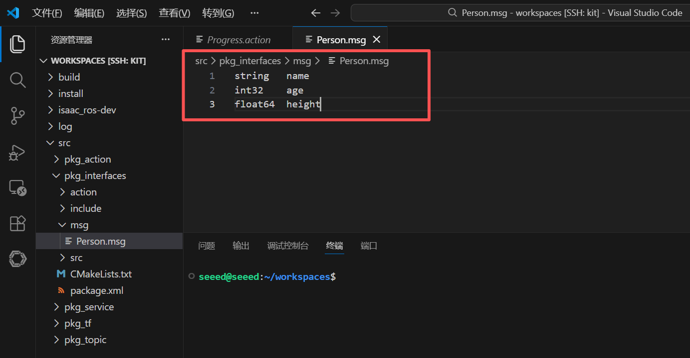

在package.xml和CMakeLists.txt中添加如下配置：

```bash
CMakeLists.txt
rosidl_generate_interfaces(${PROJECT_NAME}
"action/Progress.action"
"msg/Person.msg"
)
```

```bash
package.xml
<buildtool_depend>rosidl_default_generators</buildtool_depend>
<exec_depend>rosidl_default_runtime</exec_depend>
<depend>action_msgs</depend>
<member_of_group>rosidl_interface_packages</member_of_group>
```

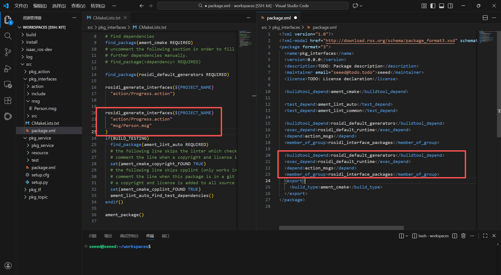

终端中进入当前工作空间，编译功能包：

```bash
cd ~/workspace
colcon build --packages-select pkg_interfaces
```

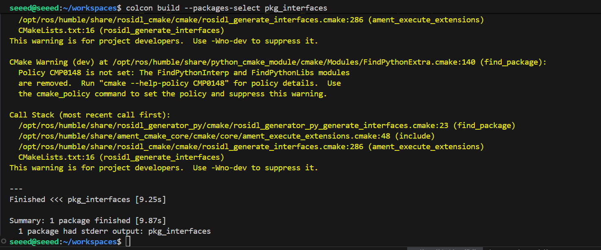

测试接口是否正常

先刷新环境变量

```bash
source install/setup.bash
```

查看接口类型

```bash
ros2 interface show pkg_interfaces/msg/Person
```

正常情况下，终端将会输出与Person.msg文件一致的内容。

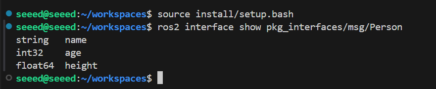

### 11.4创建服务通信自定义接口

在【ROS2动作通讯服务端实现】课程中我们已经创建了自定义接口功能包，功能包pkg_interfaces下新建srv文件夹，srv文件夹下新建Add.srv文件，文件中输入如下内容：

```bash
int32 num1
int32 num2
---
int32 sum
```

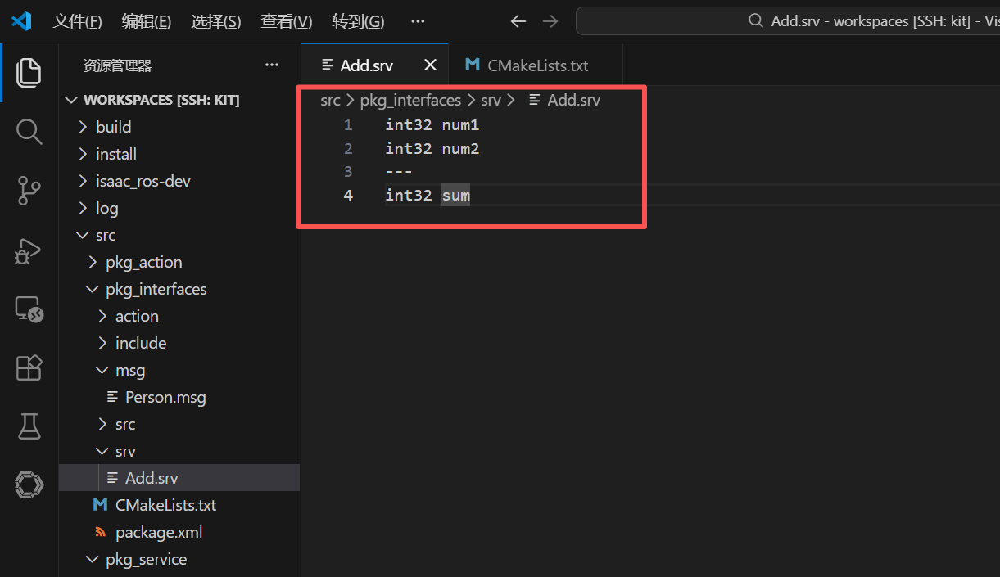

在package.xml和CMakeLists.txt中添加如下配置：

```bash
rosidl_generate_interfaces(${PROJECT_NAME}
"action/Progress.action"
"msg/Person.msg"
"srv/Add.srv"
)
```

```bash
<buildtool_depend>rosidl_default_generators</buildtool_depend>
<exec_depend>rosidl_default_runtime</exec_depend>
<depend>action_msgs</depend>
<member_of_group>rosidl_interface_packages</member_of_group>
```

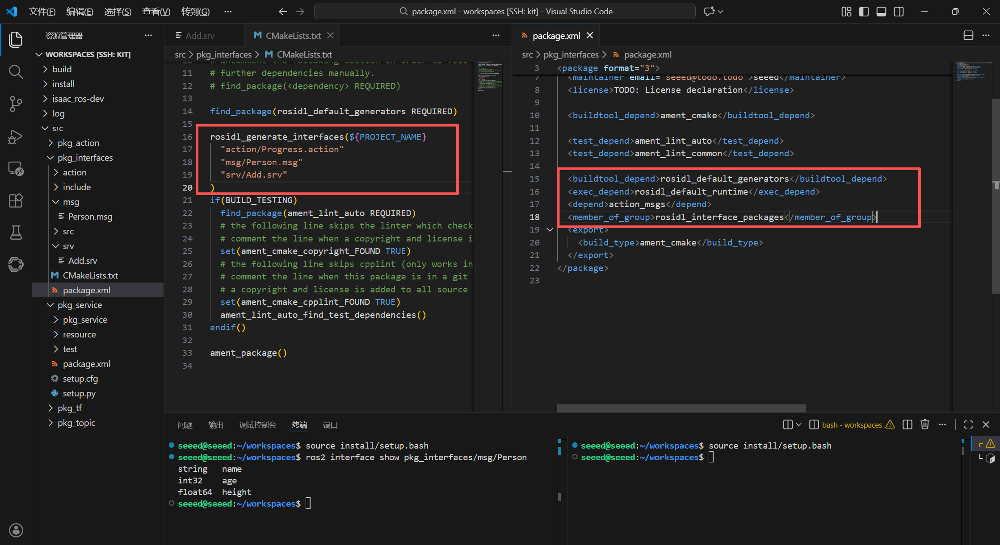

终端中进入当前工作空间，编译功能包：

```bash
cd ~/workspace
colcon build --packages-select pkg_interfaces
source install/setup.bash
```

测试

```bash
ros2 interface show pkg_interfaces/srv/Add
```

正常情况下，终端将会输出与Person.msg文件一致的内容。

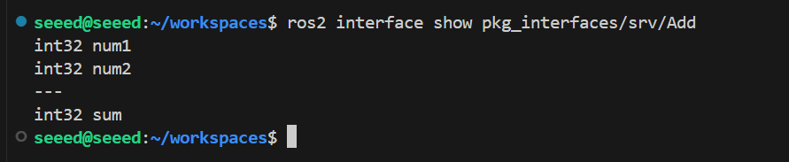

### 11.5下一步

1.12参数服务案例-学习参数服务

2.13元功能包-学习功能包

## 12参数服务案例

### 12参数服务(Parameters)

### 12.1参数概述

在ROS机器人系统中，参数扮演着类似C++全局变量的角色，为多个节点提供便捷的数据共享机制。这些参数以全局字典的形式存储于系统中——所谓"字典"，即由"键"（参数名称）与"值"（参数数据）构成的映射关系，类似于编程语言中的变量赋值（参数名=参数值），使用时只需通过名称即可访问对应数值。

参数系统具备强大的分布式特性：一旦某个节点声明或更新了参数，其他节点不仅能够实时读取该数据，还能通过监控机制即时感知数值变化，确保整个系统始终同步于最新状态。这种设计实现了跨节点的无缝数据协作，无需复杂的点对点通信即可维护全局一致性。

### 12.2小海龟例程中的参数

在小海龟的例程中，仿真器也提供了不少参数，通过这个例程，熟悉下参数的含义和命令行的使用方法。

在Jetson上启动两个终端，分别运行小海龟仿真器和键盘控制节点：

```bash
ros2 run turtlesim turtlesim_node
# 第二个终端
ros2 run turtlesim turtle_teleop_key
```

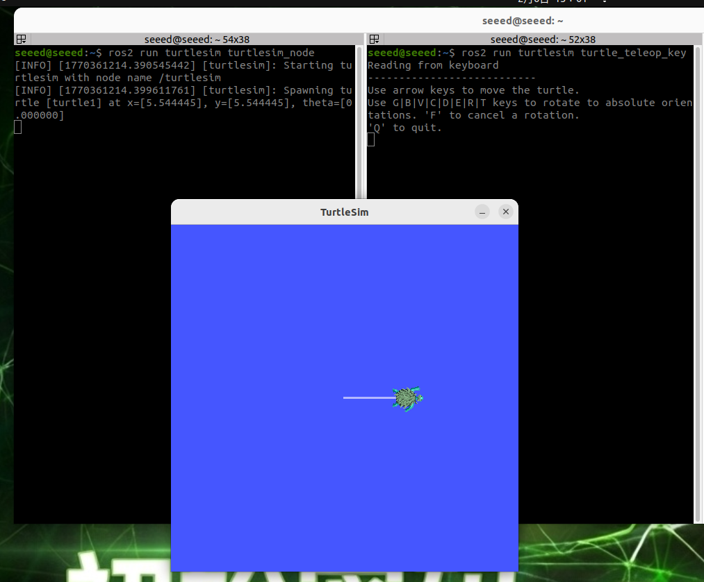

再启动一个终端，并使用如下命令查看参数列表

```bash
ros2 param list
```

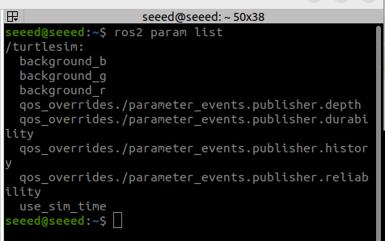

参数查询与修改

如果想要查询或者修改某个参数的值，可以在param命令后边跟get或者set子命令：

```bash
ros2 param describe turtlesim background_b # 查看某个参数的描述信息
ros2 param get turtlesim background_b # 查询某个参数的值
ros2 param set turtlesim background_b 10 # 修改某个参数的值
```

参数文件保存与加载

一个一个查询/修改参数太麻烦了，不如试一试参数文件，ROS中的参数文件使用yaml格式，可以在param命令后边跟dump子命令，将某个节点的参数都保存到文件中，或者通过load命令一次性加载某个参数文件中的所有内容：

```bash
ros2 param dump turtlesim >> turtlesim.yaml # 将某个节点的参数保存到参数文件中
ros2 param load turtlesim turtlesim.yaml # 一次性加载某一个文件中的所有参数
```

### 12.3参数案例

### 12.3.1新建功能包

在工作空间的src目录下新建功能包

```bash
ros2 pkg create pkg_param --build-type ament_python --dependencies rclpy --node-name param_demo
```

执行完上述命令，会创建pkg_param功能包，同时会创建一个param_demo的节点，并且已经配置好相关的配置文件

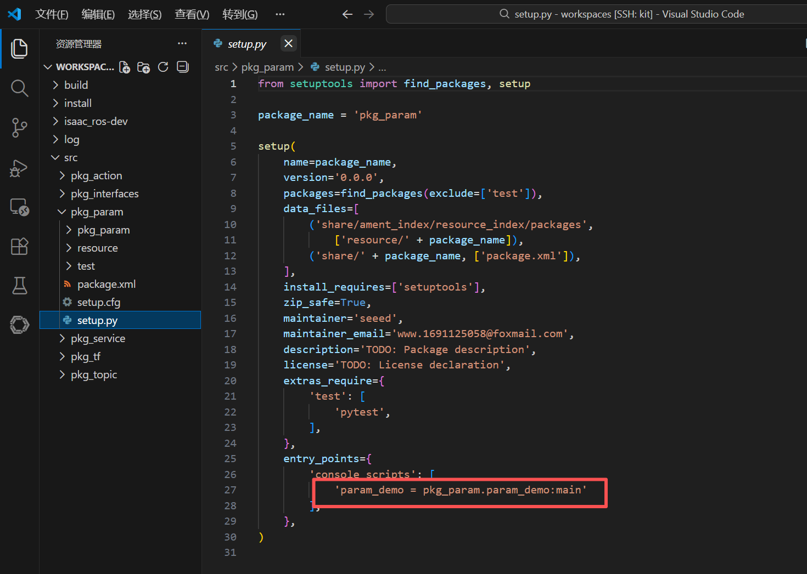

### 12.3.2代码实现

接下来编辑param_demo.py实现发布方的功能，添加如下代码：

```bash
import rclpy # ROS2 Python接口库
from rclpy.node import Node # ROS2 节点类
class ParameterNode(Node):
def __init__(self, name):
super().__init__(name) # ROS2节点父类初始化
self.timer = self.create_timer(2.0, self.timer_callback) # 创建一个定时器（单位为秒的周期，定时执行的回调函数）
self.declare_parameter('robot_name', 'muto') # 创建一个参数，并设置参数的默认值
def timer_callback(self): # 创建定时器周期执行的回调函数
robot_name_param = self.get_parameter('robot_name').get_parameter_value().string_value # 从ROS2系统中读取参数的值
self.get_logger().info('Hello %s!' % robot_name_param) # 输出日志信息，打印读取到的参数值
def main(args=None): # ROS2节点主入口main函数
rclpy.init(args=args) # ROS2 Python接口初始化
node = ParameterNode("param_declare") # 创建ROS2节点对象并进行初始化
rclpy.spin(node) # 循环等待ROS2退出
node.destroy_node() # 销毁节点对象
rclpy.shutdown() # 关闭ROS2 Python接口
```

### 12.3.3编译功能包

```bash
colcon build --packages-select pkg_param
```

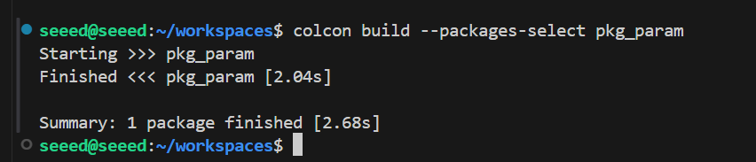

### 12.3.4运行程序

先刷新环境变量，然后运行节点

```bash
source install/setup.bash
ros2 run pkg_param param_demo
```

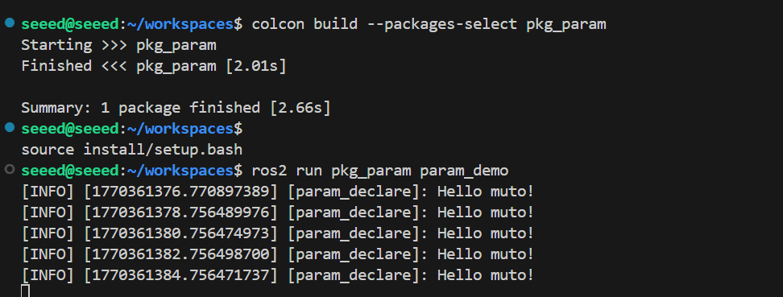

开启另一个终端，将robot_name设置为robot：

```bash
ros2 param set param_declare robot_name robot
```

终端中可以看到循环打印的日志信息，其中的muto是我们默认设置的一个参数值，参数名称是robot_name，通过命令行修改这个参数后，看到终端中也跟着变化了。

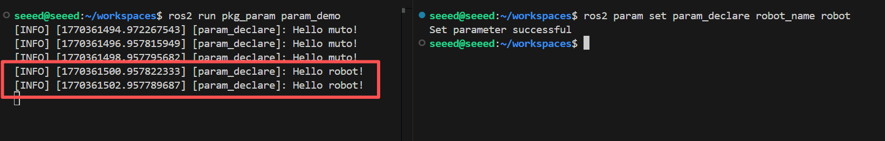

### 12.4下一步

1.13元功能包-学习元功能包

2.14分布式通讯-学习分布式通信

## 13元功能包

### 13元功能包(Metapackages)

### 13.1元功能包概述

### 13.1.1什么是元功能包

在ROS2中，一个完整的功能模块往往由多个功能包协同构成。以机器人导航为例，该模块通常包含地图服务、定位算法、路径规划、运动控制等多个子功能包。如果用户需要逐一手动安装这些分散的包，不仅效率低下，还容易因遗漏依赖导致系统无法正常运行。

为解决这一问题，ROS2引入了元功能包（Metapackage）机制。这一概念源自Linux文件管理系统，本质上是一个"虚包"——其本身不包含任何实质性代码或节点，而是通过声明依赖关系，将一组相关的功能包有机整合。可以将其理解为功能集合的"目录索引"：它清晰标示了该模块包含哪些子包，并指导包管理工具自动完成批量安装。

典型应用场景是ROS2的安装命令：

```bash
sudo apt install ros-humble-desktop
```

这里的ros-humble-desktop就是一个元功能包，它依赖了ROS2核心工具、常用库及仿真组件等数十个包，执行该命令即可一次性完成整套系统的部署。

在机器人开发领域，Navigation2是元功能包的经典实践。该仓库通过元包结构，将AMCL定位、代价地图、规划器、控制器等十余个独立导航组件封装为统一模块。开发者只需安装nav2_bringup元包，即可自动获取完整的导航能力栈，极大简化了复杂系统的部署流程。

元功能包不直接提供软件，而是依赖于其他相关的包，为完整的包组提供便捷的安装机制。

```
Plain Text
元功能包概念图：
┌─────────────────────────────────────────────────┐
│ navigation2 (元功能包) │
│ │
│ ┌──────────┐ ┌──────────┐ ┌──────────┐ │
│ │nav2_costmap│ │nav2_planner│ │nav2_controller│ │
│ └──────────┘ └──────────┘ └──────────┘ │
│ │
│ ┌──────────┐ ┌──────────┐ ┌──────────┐ │
│ │nav2_behaviors│ │ nav2_core │ │ nav2_bt_navigator│ │
│ └──────────┘ └──────────┘ └──────────┘ │
└─────────────────────────────────────────────────┘
安装流程：
sudo apt install ros-humble-navigation2
↓
自动安装所有依赖的子包
```

### 13.1.2元功能包的作用

方便用户的安装，我们只需要这一个包就可以把其他相关的软件包组织到一起安装了。

| 用途 | 说明 |
| --- | --- |
| 组织 | 将相关功能包分组 |
| 简化安装 | 一次安装多个包 |
| 依赖管理 | 统一管理依赖关系 |
| 文档化 | 清晰的项目结构 |
| 版本控制 | 统一发布和管理版本 |

### 13.2实现案例

新建一个功能包

```bash
ros2 pkg create pkg_metapackage
```

修改package.xml文件，添加执行时所依赖的包

```bash
<?xml version="1.0"?>
<?xml-model href="http://download.ros.org/schema/package_format3.xsd" schematypens="http://www.w3.org/2001/XMLSchema"?>
<package format="3">
<name>pkg_metapackage</name>
<version>0.0.0</version>
<description>TODO: Package description</description>
<maintainer email="1461190907@qq.com">root</maintainer>
<license>TODO: License declaration</license>
<buildtool_depend>ament_cmake</buildtool_depend>
<exec_depend>pkg_interfaces</exec_depend>
<exec_depend>pkg_helloworld_py</exec_depend>
<exec_depend>pkg_topic</exec_depend>
<exec_depend>pkg_service</exec_depend>
<exec_depend>pkg_action</exec_depend>
<exec_depend>pkg_param</exec_depend>
<test_depend>ament_lint_auto</test_depend>
<test_depend>ament_lint_common</test_depend>
<export>
<build_type>ament_cmake</build_type>
</export>
</package>
```

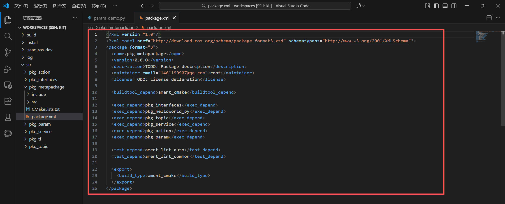

文件CMakeLists.txt内容如下

```bash
cmake_minimum_required(VERSION 3.5)
project(pkg_metapackage)
if(CMAKE_COMPILER_IS_GNUCXX OR CMAKE_CXX_COMPILER_ID MATCHES "Clang")
add_compile_options(-Wall -Wextra -Wpedantic)
endif()
find_package(ament_cmake REQUIRED)
ament_package()
```

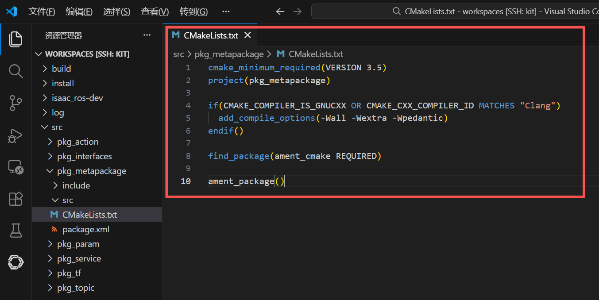

编译元功能包

```bash
colcon build --packages-select pkg_metapackage
```

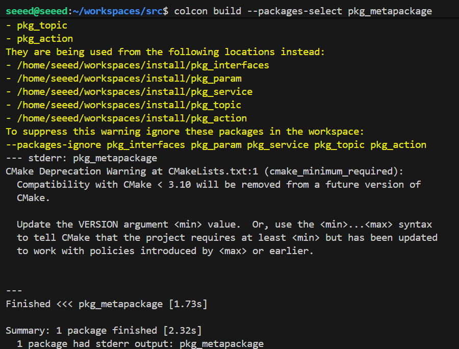

### 13.3下一步

完成元功能包学习后，您可以：

1.14分布式通讯-学习分布式通信

2.15 DDS-学习DDS中间件

#### 回顾系列：

| 章节 | 内容 |
| --- | --- |
| 04 工作区 | 工作区管理 |
| 05 功能包 | 功能包基础 |
| 12 参数服务案例 | 参数配置 |

## 14分布式通讯

### 14分布式通讯(Distributed Communication)

### 14.1分布式通信概述

ROS2作为一个强大的分布式通信框架，能够便捷地实现不同主机间的网络数据交互。其底层基于DDS (Data Distribution Service)中间件，通过ROS_DOMAIN_ID（域ID）机制来管理通信：当不同设备上的节点设置了相同的域ID且处于同一网络时，它们便可以自动发现并自由通信；反之，ID不同则相互隔离。为了简化操作，ROS2默认所有节点的域ID均为0，这意味着您无需任何额外配置，只要设备在同一网络中，即可实现开箱即用的分布式通信。这一特性在无人车编队、无人机集群和远程控制等需要多设备数据交互的场景中有着广泛而关键的应用。

### 14.1.1什么是分布式通信

ROS 2的分布式通信允许多个计算机上的节点互相通信，无需中心服务器。这是通过DDS (Data Distribution Service)实现的。

```
Plain Text
分布式通信架构：
网络交换机/路由器
│
┌─────────┼─────────┐
│ │ │
┌─────┐ ┌─────┐ ┌─────┐
│ PC1 │ │ PC2 │ │ PC3 │
│ │ │ │ │ │
│传感器│ │控制 │ │可视化│
│ 节点 │ │节点 │ │ 节点 │
└─────┘ └─────┘ └─────┘
```

### 14.1.2分布式通信的特点

| 特点 | 说明 |
| --- | --- |
| 无中心化 | 不需要 ROS Master |
| 自动发现 | 节点自动发现网络上的其他节点 |
| 跨平台 | 不同操作系统间通信 |
| 可靠传输 | 支持多种 QoS 策略 |

### 14.2 ROS_DOMAIN_ID

### 14.2.1域ID概念

ROS_DOMAIN_ID用于隔离不同的ROS 2网络。同一域ID的节点可以互相通信，不同域ID的节点彼此隔离。

```
Plain Text
域 ID 隔离示意图：
ROS_DOMAIN_ID=0 ROS_DOMAIN_ID=1
┌──────────────┐ ┌──────────────┐
│ 机器人A │ │ 机器人B │
│ │ │ │
│ 传感器节点 │ │ 传感器节点 │
│ 控制节点 │ │ 控制节点 │
└──────────────┘ └──────────────┘
互不干扰，独立运行
```

### 14.3实现

### 14.3.1默认实现

只需要将主机和从机【可以有多个】处于同一个网络中，就已经实现了分布式通讯。比如主机和从机连接同一个WiFi或者同一个路由器。

Windows中虚拟机设置网络为【桥接模式】就和主机处于同一个网络了。

测试：

1、A主机执行：

这里演示的是小车处于docker中，docker使用的网络模式是host模式，host模式简单来说就是和小车共用一个网络，所以跟在小车上执行没有区别。

```bash
ros2 run demo_nodes_py talker
```

2、B主机执行：

```bash
ros2 run demo_nodes_py listener
```

若显示如下：主机端发布的话题从机端能及时订阅到，表示已经实现了多机通讯

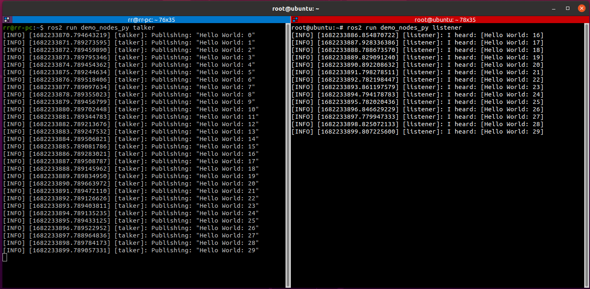

### 14.3.2分布式网络分组

假设你现在所处的网络中还有其它的机器人在使用，为了不受其它机器人的干扰，你还可以给你的机器人设置一个分组。

ROS2提供了一个DOMAIN的机制，就类似分组一样，处于同一个DOMAIN中的计算机才能通信，我们可以在主机端【小车】和从机端【虚拟机】的.bashrc中加入这样一句配置，即可将两者分配到一个小组中：

```bash
$ export ROS_DOMAIN_ID=<your_domain_id>
```

如果主机端【小车】和从机端【虚拟机】分配的ID不同，则两者无法实现通信，达到分组的目的。

### 14.3.3案例1

1、主机端【小车】执行：

这里演示的是小车处于docker中，docker使用的网络模式是host模式，host模式简单来说就是和小车共用一个网络，所以跟在小车上执行没有区别。

```bash
echo "export ROS_DOMAIN_ID=6" >> ~/.bashrc # 这里的6是ROS_DOMAIN_ID, 不一定要用6，符合ROS_DOMAIN_ID的规则即可
source ~/.bashrc
ros2 run demo_nodes_py talker
```

2、同时从机端【虚拟机】执行：

```bash
echo "export ROS_DOMAIN_ID=6" >> ~/.bashrc # 这里和主机端的值保持一致
source ~/.bashrc
ros2 run demo_nodes_py listener
```

若显示如下：主机端发布的话题从机端能及时订阅到，表示已经实现了分组的多机通讯


### 14.3.4案例2

通过分布式通信控制小海龟运动

```bash
ros2 run turtlesim turtlesim_node
```

```bash
ros2 run turtlesim turtle_teleop_key
```

### 14.4注意

在设置ROS_DOMAIN_ID的值时并不是随意的，也是有一定约束的：

### 14.5 DDS域ID值的计算规则(进阶知识)

域ID值的相关计算规则如下：

上述计算规则了解即可。

### 14.6下一步

1.15 DDS-深入学习DDS中间件

2.16时间相关API-学习时间API

## 15 DDS

### 15 DDS (Data Distribution Service)

### 15.1 DDS概述

### 15.1.1什么是DDS

DDS (Data Distribution Service)是以数据为中心的发布-订阅中间件标准，ROS 2使用DDS实现底层通信。

```
Plain Text
ROS 2 与 DDS 的关系：
┌─────────────────────────────────────────────────┐
│ ROS 2 应用层 │
│ (节点、话题、服务、动作)
│
└─────────────────────────────────────────────────┘
▲
│
┌─────────────────────────────────────────────────┐
│ RMW (ROS Middleware) │
│ 统一接口层
│
└─────────────────────────────────────────────────┘
▲
│
┌───────────────┼───────────────┐
▼ ▼ ▼
┌──────────────┐ ┌──────────────┐ ┌──────────────┐
│CycloneDDS │ │ FastDDS │ │RTI Connext │
│ │ │ │ │ │
└──────────────┘ └──────────────┘ └──────────────┘
```

### 15.1.2 DDS的核心功能

| 功能 | 说明 |
| --- | --- |
| 发现机制 | 自动发现网络上的 DDS 参与者 |
| 发布 / 订阅 | 解耦的数据传输模式 |
| QoS 策略 | 可配置的服务质量 |
| 类型系统 | 强类型数据定义 |
| 零拷贝 | 高效的数据传输 |

### 15.2通信模型

我们在前边课程中学习的话题、服务、动作，他们底层通信的具体实现过程，都是靠DDS来完成的，它相当于是ROS机器人系统中的神经网络。

DDS的核心是通信，能够实现通信的模型和软件框架非常多，这里我们列出常用的四种模型。

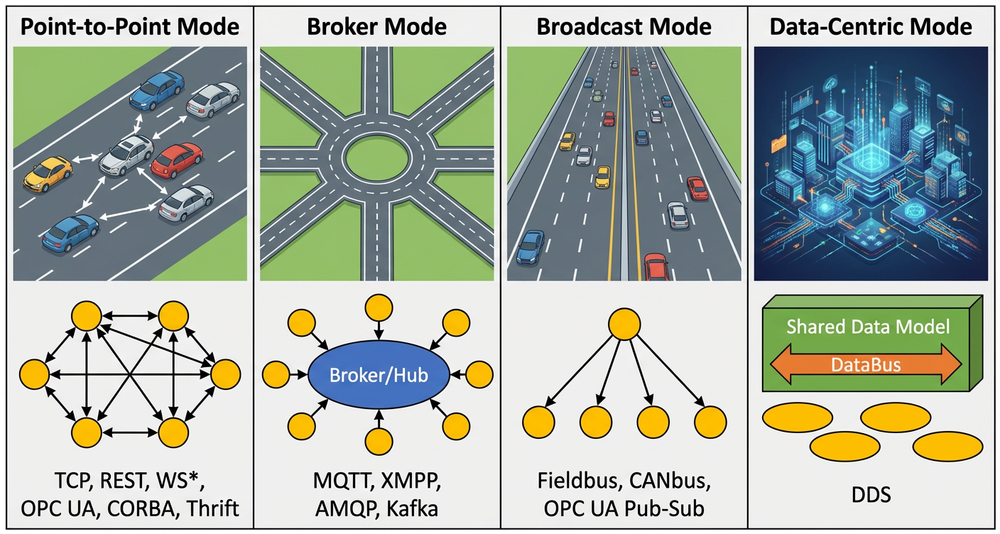

可见，在这些通信模型中，DDS的优势更加突出。

### 15.3 DDS在ROS2中的应用

DDS在ROS2系统中的位置至关重要，所有上层建设都建立在DDS之上。在这个ROS2的架构图中，蓝色和红色部分就是DDS。

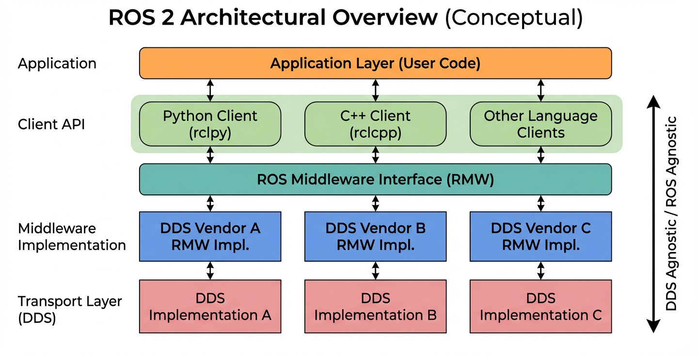

在ROS的四大组成部分中，由于DDS的加入，大大提高了分布式通信系统的综合能力，这样我们在开发机器人的过程中，就不需要纠结通信的问题，可以把更多时间放在其他部分的应用开发上。

### 15.4质量服务策略QoS

DDS中的基础结构是Domain。Domain用于把各个应用程序组织在一起完成通信。回想一下之前我们让树莓派和电脑互通时配置的DOMAIN ID，它本质上就是对全局数据空间进行分组的标识：只有处于同一个DOMAIN组内的节点，才能相互发现并通信。通过这种方式，可以有效避免无关数据占用系统资源。

DDS的另一个核心特性是服务质量策略：QoS。

QoS可以理解为一种网络传输规则：应用程序会声明自己期望的传输质量行为，而QoS机制则负责尽可能满足这些要求。它就像是数据发布者与订阅者之间达成的一份“通信合约”。

策略如下：

### 15.5.测试案例

### 15.5.1案例1—通过命令行配置DDS

```bash
ros2 topic pub /chatter std_msgs/msg/Int32 "data: 66" --qos-reliability best_effort
```

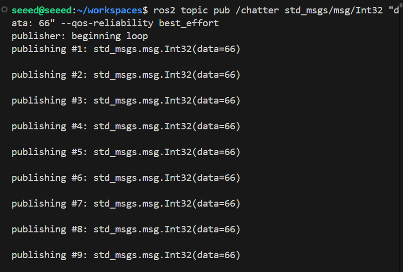

```bash
ros2 topic echo /chatter --qos-reliability reliable
```

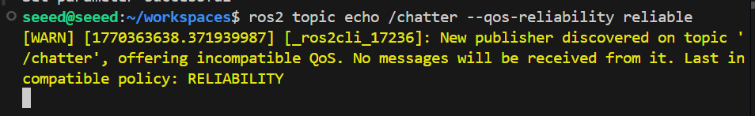

```bash
ros2 topic echo /chatter --qos-reliability best_effort
```

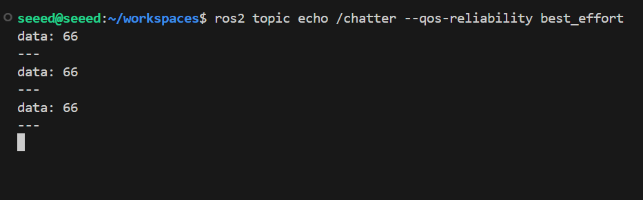

### 15.5.2案例2—编写话题节点配置Qos服务策略

```bash
ros2 pkg create learning_dds --build-type ament_python --dependencies rclpy std_msgs
```

新建一个dds_controller_pub.py文件，作为话题通信的发布方，填入以下内容：

```bash
import rclpy
from rclpy.node import Node
from std_msgs.msg import String
# 导入QoS相关类
from rclpy.qos import QoSProfile, QoSReliabilityPolicy, QoSHistoryPolicy
class ControllerPublisher(Node):
def __init__(self, name):
super().__init__(name)
# 1. 配置QoS策略：可靠传输，保留最后1条历史数据
self.qos_profile = QoSProfile(
reliability=QoSReliabilityPolicy.RELIABLE, # 可靠传输（重传丢失数据）
history=QoSHistoryPolicy.KEEP_LAST, # 保留最后N条数据
depth=1 # 保留1条历史数据
)
# 2. 创建发布者：话题名/robot_cmd，消息类型String，QoS策略
self.publisher = self.create_publisher(
String,
"/robot_cmd",
self.qos_profile
)
# 3. 创建定时器：每秒发送一次指令
self.timer = self.create_timer(1.0, self.timer_callback)
self.cmd_list = ["forward", "backward", "stop"] # 指令列表
self.cmd_index = 0 # 指令索引，循环切换
def timer_callback(self):
# 循环切换指令（前进→后退→停止→前进...）
current_cmd = self.cmd_list[self.cmd_index % 3]
# 创建消息并填充数据
msg = String()
msg.data = current_cmd
# 发布消息
self.publisher.publish(msg)
# 打印日志（显示发布的指令）
self.get_logger().info(f"发布控制指令：{msg.data}")
# 更新指令索引
self.cmd_index += 1
def main(args=None):
# 初始化ROS2
rclpy.init(args=args)
# 创建发布者节点
node = ControllerPublisher("robot_controller_pub")
# 循环运行节点
rclpy.spin(node)
# 销毁节点并关闭ROS2
node.destroy_node()
rclpy.shutdown()
if __name__ == "__main__":
main()
```

```bash
import rclpy
from rclpy.node import Node
from std_msgs.msg import String
from rclpy.qos import QoSProfile, QoSReliabilityPolicy, QoSHistoryPolicy
class RobotSubscriber(Node):
def __init__(self, name):
super().__init__(name)
# 1. 配置与发布者兼容的QoS策略
self.qos_profile = QoSProfile(
reliability=QoSReliabilityPolicy.BEST_EFFORT,
history=QoSHistoryPolicy.KEEP_LAST,
depth=1
)
# 2. 创建订阅者：话题名/robot_cmd，回调函数，QoS策略
self.subscription = self.create_subscription(
String,
"/robot_cmd",
self.cmd_callback, # 接收到数据后执行的回调函数
self.qos_profile
)
def cmd_callback(self, msg):
# 回调函数：处理接收到的指令
self.get_logger().info(f"接收控制指令：{msg.data} → 执行对应动作")
def main(args=None):
rclpy.init(args=args)
node = RobotSubscriber("robot_subscriber")
rclpy.spin(node)
node.destroy_node()
rclpy.shutdown()
if __name__ == "__main__":
main()
```

```bash
entry_points={
'console_scripts': [
# 发布者节点：命令名 = 包名.文件名:main函数
'dds_controller_pub = learning_dds.dds_controller_pub:main',
# 订阅者节点
'dds_robot_sub = learning_dds.dds_robot_sub:main',
],
},
```

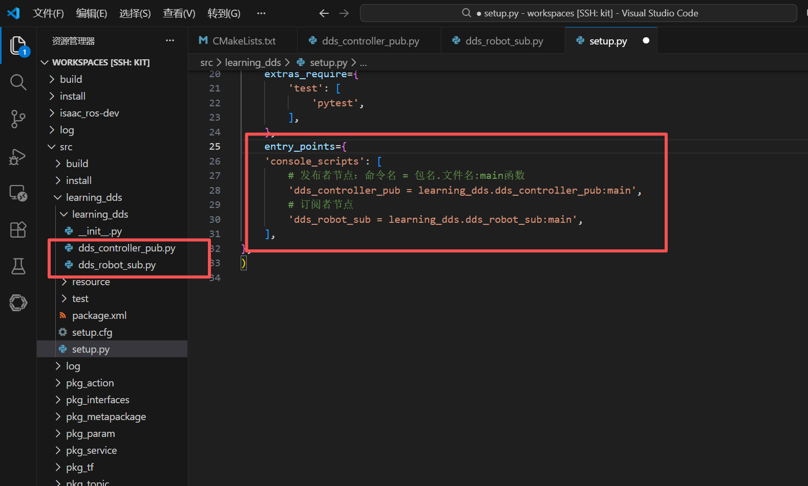

```bash
cd ~/workspaces
colcon build --packages-select learning_dds --symlink-install
```

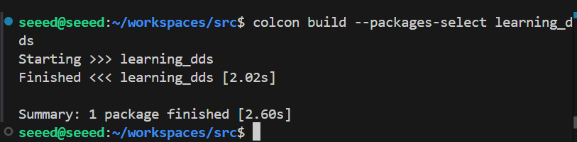

```bash
source install/setup.bash
```

```bash
ros2 run learning_dds dds_controller_pub
# 另一个终端
ros2 run learning_dds dds_robot_sub
```

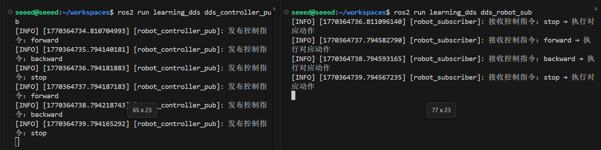

#### 机器人开发进阶：

https://fast-dds.docs.eprosima.com/en/latest/


### 15.6下一步

1.16时间相关API-学习时间API

2.17常用命令工具-学习命令行工具

## 16时间相关API

### 16时间相关API (Time APIs)

### 16.1时间概念

ros2涉及时间相关的API有Rate，Time，Duration，Time与Duration的运算等，下面分别讲解。

```bash
ros2 pkg create learning_time --build-type ament_python --dependencies rclpy
```

### 16.2 create_rate

ROS2中还提供了create_rate函数，用于控制循环执行频率的工具，其核心作用是让一段代码按照固定频率周期性执行，Rate通过控制循环的 “休眠时间” 来保证循环执行频率的稳定性。切记，Rate一般不能直接用于主线程，否则会永久阻塞回调事件，一般只用于带有多线程回调的程序或子线程中使用。

具体工作原理：

虽然Rate和Timer都能实现周期性执行，但适用场景不同：


#### 点击图片可查看完整电子表格

```bash
import rclpy
from rclpy.node import Node
import threading
class RateExampleNode(Node):
def __init__(self):
super().__init__("rate_example_node")
self.get_logger().info("Rate 示例节点启动")
def run_loop(self):
# 使用节点的create_rate()创建2Hz的Rate
rate = self.create_rate(2.0)
count = 0
try:
while rclpy.ok():
self.get_logger().info(f"循环执行 {count} 次")
count += 1
rate.sleep() # 休眠到下一个周期（0.5秒）
except KeyboardInterrupt:
self.get_logger().info("循环被中断")
def main(args=None):
rclpy.init(args=args)
node = RateExampleNode()
# 创建线程运行循环（避免阻塞主线程）
loop_thread = threading.Thread(target=node.run_loop)
loop_thread.start()
# 主线程执行spin，维持ROS 2节点运行
try:
rclpy.spin(node)
except KeyboardInterrupt:
pass
finally:
loop_thread.join() # 等待线程结束
node.destroy_node()
rclpy.shutdown()
if __name__ == "__main__":
main()
```

```bash
'rate_demo=learning_time.rate_demo:main'
```

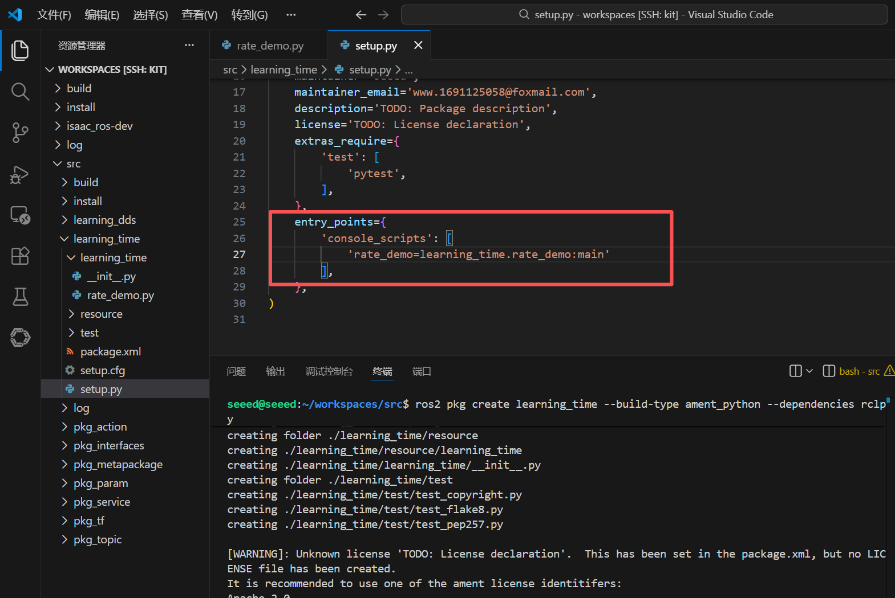

```bash
colcon build --packages-select learning_time
```

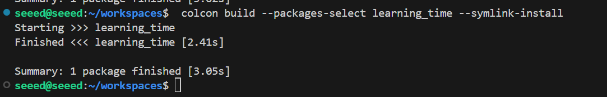

```bash
source ./install/setup.bash
ros2 run learning_time rate_demo
```

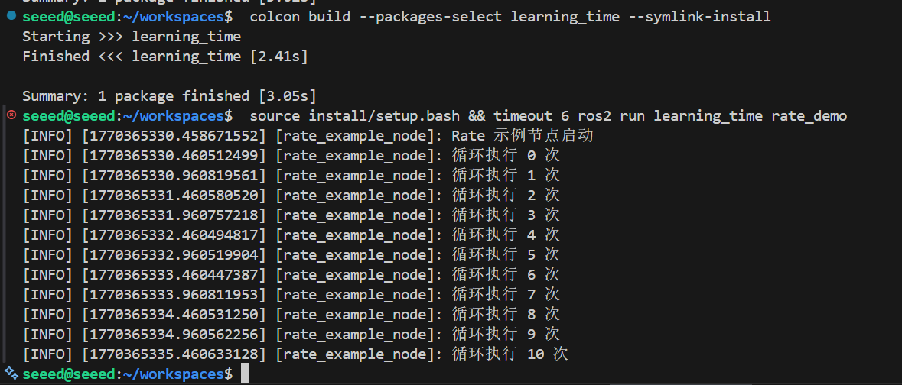

### 16.3 Timer定时器应用

```bash
import rclpy
from rclpy.node import Node
class TimerDemoNode(Node):
def __init__(self):
super().__init__('timer_demo_node')
# 计数器，用于演示定时器执行次数
self.counter = 0
# 创建定时器：每1秒执行一次callback函数
self.timer = self.create_timer(1.0, self.timer_callback)
# 创建一个更快的定时器：每0.5秒执行一次
self.fast_timer = self.create_timer(0.5, self.fast_timer_callback)
self.get_logger().info("定时器节点已启动")
def timer_callback(self):
"""1秒定时器回调函数"""
self.counter += 1
current_time = self.get_clock().now()
# 打印当前时间和计数器值
self.get_logger().info(
f"[1秒定时器] 第 {self.counter} 次执行，当前时间: {current_time.seconds_nanoseconds()}"
)
def fast_timer_callback(self):
"""0.5秒定时器回调函数"""
# 打印当前时间戳（纳秒）
self.get_logger().info(
f"[0.5秒定时器] 当前时间戳: {self.get_clock().now().nanoseconds}"
)
def main(args=None):
# 初始化ROS 2
rclpy.init(args=args)
# 创建节点
node = TimerDemoNode()
# 运行节点
rclpy.spin(node)
# 关闭ROS 2
node.destroy_node()
rclpy.shutdown()
if __name__ == '__main__':
main()
```

```bash
'Timer_demo=learning_time.Timer_demo:main'
```

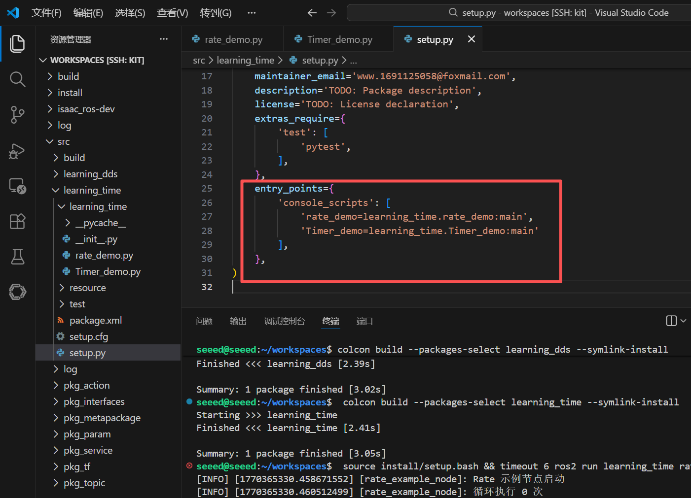

```bash
colcon build --packages-select learning_time
```

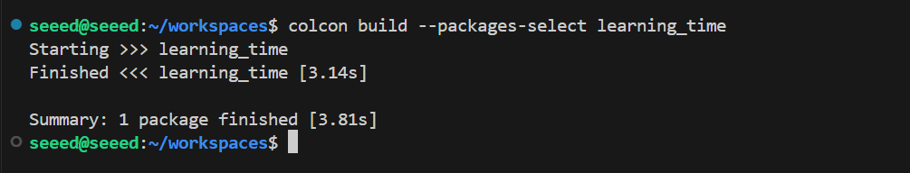

```bash
source ./install/setup.bash
ros2 run learning_time Timer_demo
```

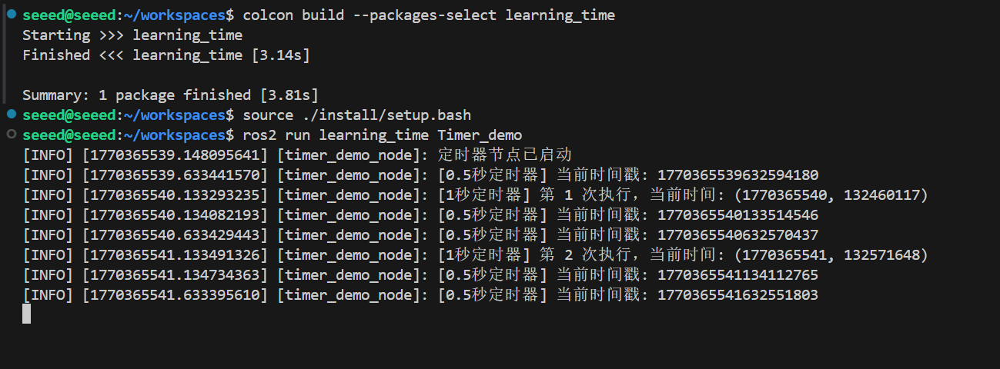

### 16.4 get_clock获取当前时刻时间

```bash
import rclpy
from rclpy.node import Node
from rclpy.time import Time
class TimeExampleNode(Node):
def __init__(self):
super().__init__("time_example_node")
# 获取节点的时钟对象（默认使用系统时钟）
self.clock = self.get_clock()
# 获取当前时间（返回Time对象）
current_time = self.clock.now()
self.get_logger().info(f"当前时间：{current_time}")
def main(args=None):
rclpy.init(args=args)
node = TimeExampleNode()
rclpy.spin_once(node) # 运行一次节点
node.destroy_node()
rclpy.shutdown()
if __name__ == "__main__":
main()
```

```bash
'get_clock_demo=learning_time.get_clock_demo:main'
```

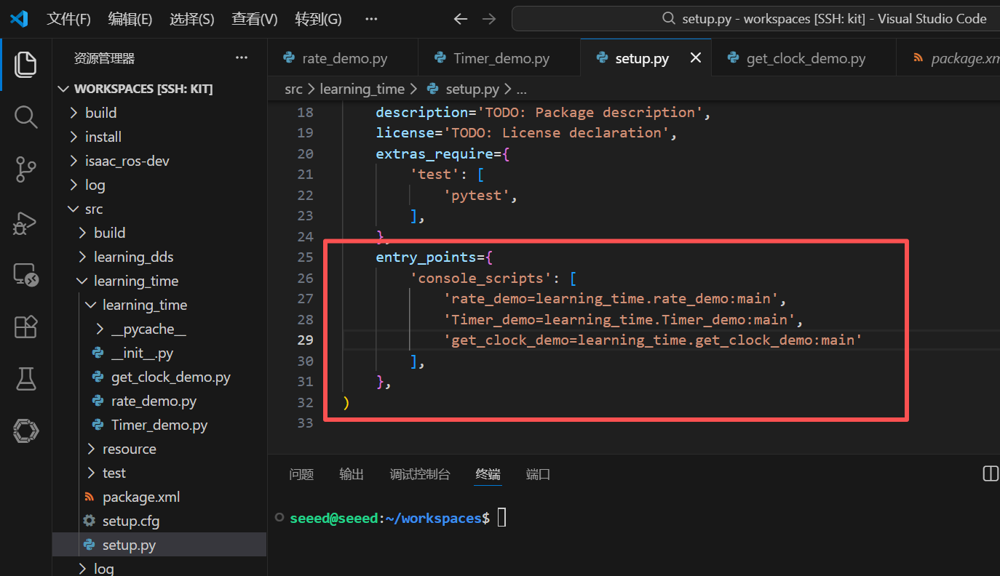

```bash
colcon build --packages-select learning_time
```

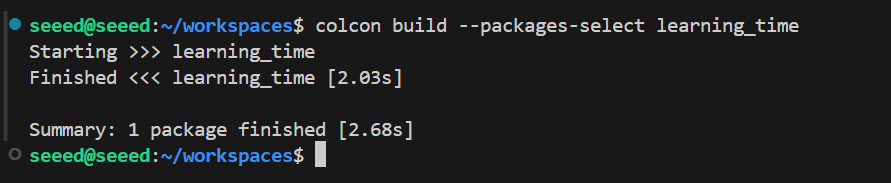

```bash
source ./install/setup.bash
ros2 run learning_time get_clock_demo
```

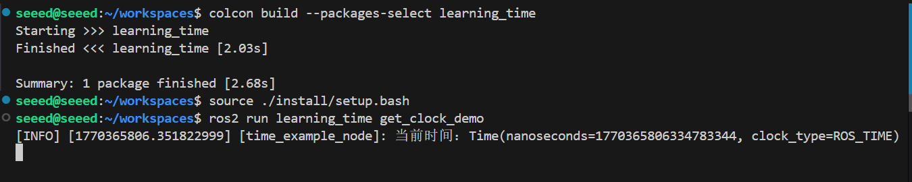

### 16.5 Time与Duration

```bash
import rclpy
from rclpy.time import Time
from rclpy.duration import Duration
def main():
rclpy.init()
node = rclpy.create_node("time_opt_node")
# time类的使用方法，创建‘时间点、时刻’
time1 = Time(seconds=10)
time2 = Time(seconds=4)
# Duration类使用方法，创建‘持续时间、一段时间’
duration1 = Duration(seconds=3)
duration2 = Duration(seconds=5)
# 时刻可以进行比较
node.get_logger().info("time1 >= time2 ? %d" % (time1 >= time2))
node.get_logger().info("time1 < time2 ? %d" % (time1 < time2))
# 时间段与时刻可以数学运算
t3 = time1 + duration1
t4 = time1 - time2
t5 = time1 - duration1
node.get_logger().info("t3 = %d" % t3.nanoseconds)
node.get_logger().info("t4 = %d" % t4.nanoseconds)
node.get_logger().info("t5 = %d" % t5.nanoseconds)
# 时间段可以进行比较
node.get_logger().info("-" * 80)
node.get_logger().info("duration1 >= duration2 ? %d" % (duration1 >= duration2))
node.get_logger().info("duration1 < duration2 ? %d" % (duration1 < duration2))
rclpy.shutdown()
if __name__ == "__main__":
main()
```

```bash
'TimeDuration_demo=learning_time.TimeDuration_demo:main'
```

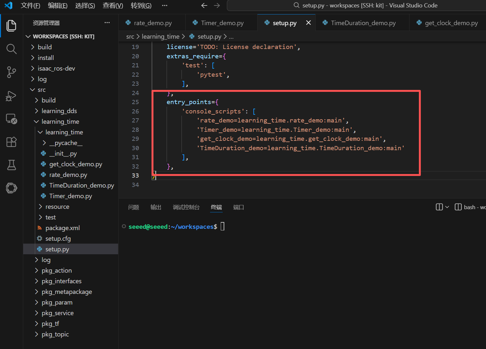

```bash
colcon build --packages-select learning_time
```

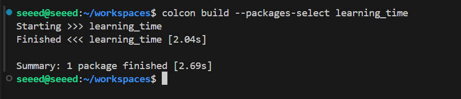

```bash
source ./install/setup.bash
ros2 run learning_time TimeDuration_demo
```

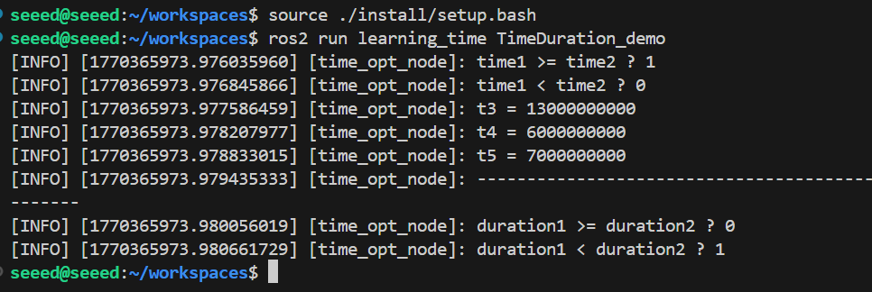

### 16.6下一步

1.17常用命令工具-学习命令行工具

2.18 RViz2使用-学习可视化
