# ROS2 Tools, Launch, and Visualization

## 17常用命令工具

### 17常用命令工具(CLI Tools)

### 17.1包管理工具ros2 pkg

### 17.1.1 ros2 pkg create

功能：创建功能包，创建时候需要指定包名、编译方式、依赖项等。

格式：

```bash
ros2 pkg create <package_name> --build-type <build-type> --dependencies <dependencies>
```

ros2命令中：

### 17.1.2 ros2 pkg list

功能：查看系统中功能包列表

格式：

```bash
ros2 pkg list
```

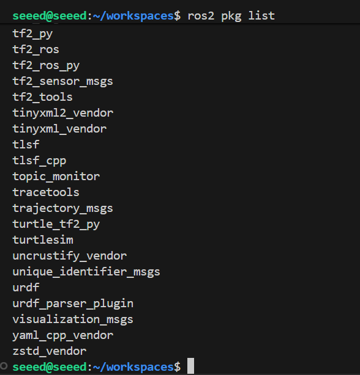

### 17.1.3 ros2 pkg executeables

功能：查看某个包内所有可执行文件

格式：

```bash
ros2 pkg executables <pkg_name>
```

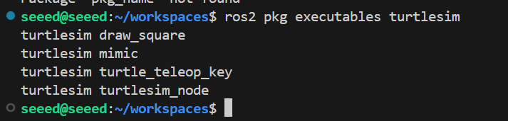

### 17.2节点运行ros2 run

功能：运行功能包节点程序

格式：

```bash
ros2 run <pkg_name> <node_name>
```

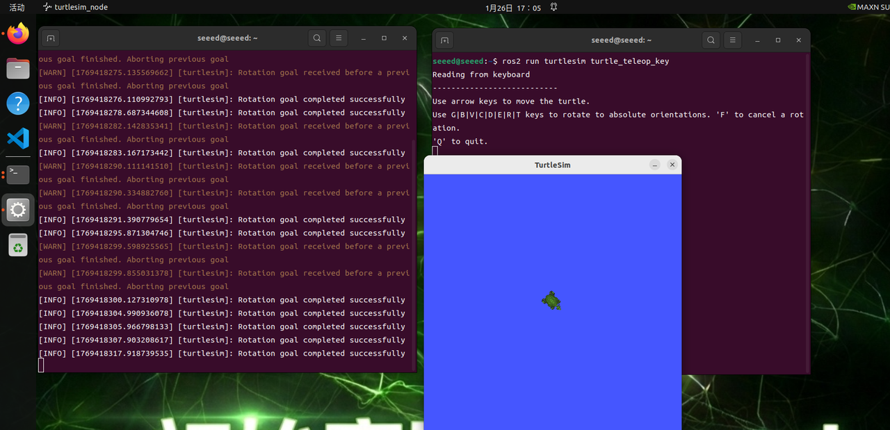

### 17.3节点相关工具ros2 node

### 17.3.1 ros2 node list

功能： 罗列出所有在当前域内节点名称

格式：

```bash
ros2 node list
```

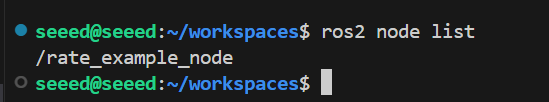

### 17.3.2 ros2 node info

功能： 查看节点详细信息，包括订阅、发布的消息，开启的服务和动作等

格式：

```bash
ros2 node info <node_name>
```

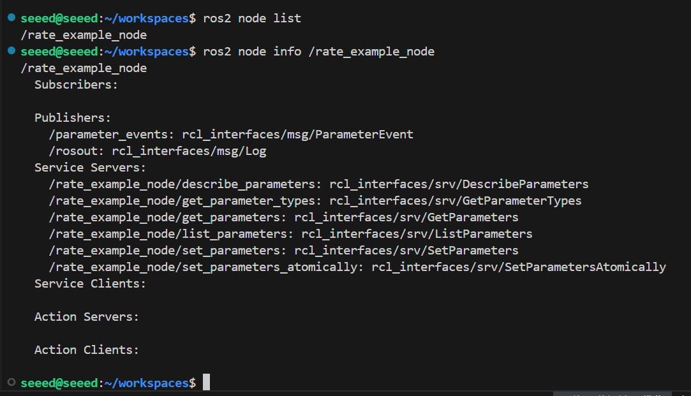

### 17.4话题相关工具ros2 topic

### 17.4.1 ros2 topic list

功能：罗列出当前域内的所有话题

格式：

```bash
ros2 topic list
```

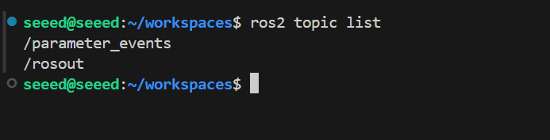

### 17.4.2 ros2 topic info

功能：显示话题消息类型，订阅者/发布者数量

格式：

```bash
ros2 topic info <topic_name>
```

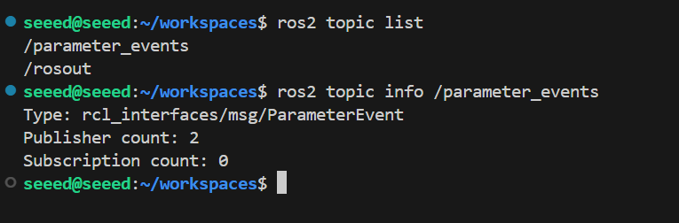

### 17.4.3 ros2 topic type

功能：查看话题的消息类型

格式：

```bash
ros2 topic type <topic_name>
```

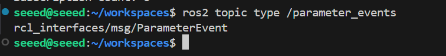

### 17.4.4 ros2 topic hz

功能：显示话题平均发布频率

格式：

```bash
ros2 topic hz <topic_name>
```

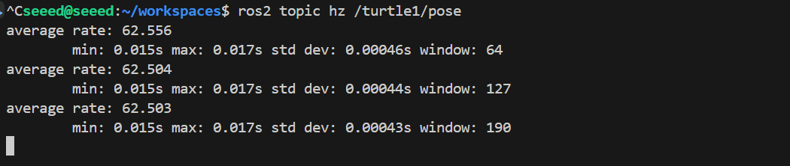

### 17.4.5 ros2 topic echo

功能：在终端打印话题消息，类似于一个订阅者

格式：

```bash
ros2 topic echo <topic_name>
```

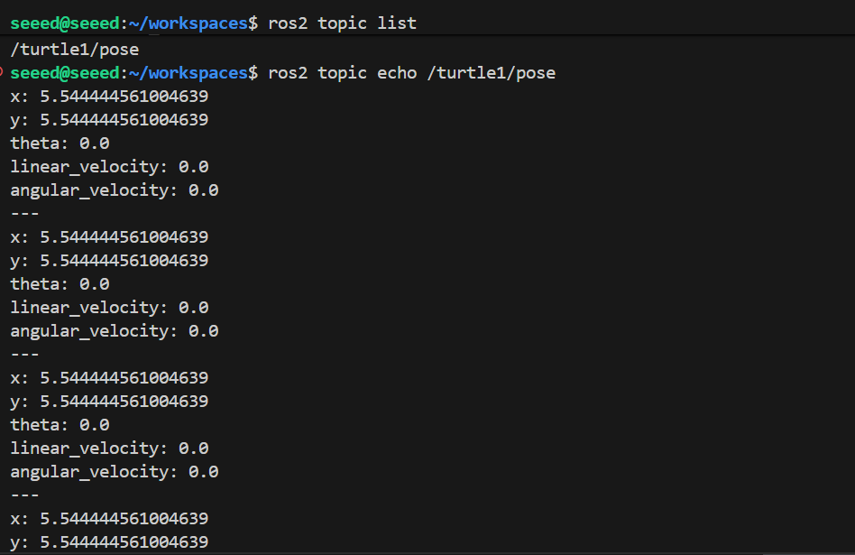

### 17.4.6 ros2 topic pub

功能：在终端发布指定话题消息

格式：

```bash
ros2 topic pub <topic_name> <message_type> <message_content>
```

默认是以1Hz的频率循环发布，可以设置以下参数，

示例：

```bash
ros2 topic pub turtle1/cmd_vel geometry_msgs/msg/Twist "{linear: {x: 0.5, y: 0.0, z: 0.0}, angular: {x: 0.0, y: 0.0, z: 0.2}}"
```

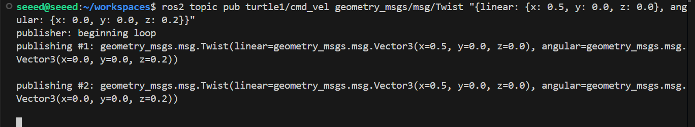

### 17.5接口相关工具ros2 interface

### 17.5.1 ros2 interface list

功能：罗列当前系统的所有接口，包括话题、服务、动作。

格式：

```bash
ros2 interface list
```

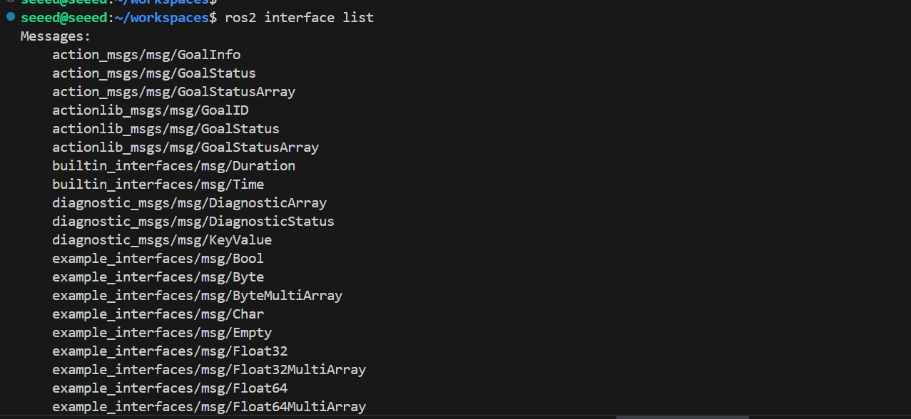

### 17.5.2 ros2 interface show

功能：显示指定接口的详细内容

格式：

```bash
ros2 interface show <interface_name>
```

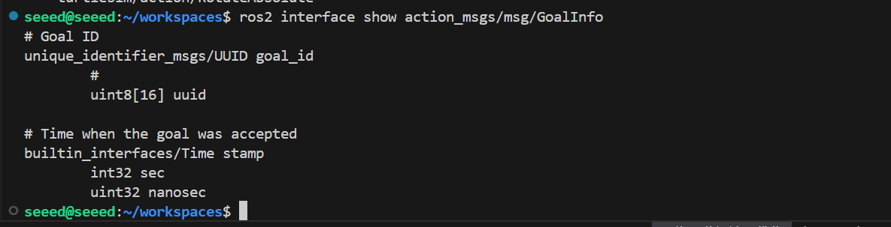

### 17.6服务相关工具ros2 service

### 17.6.1 ros2 service list

功能：罗列出当前域内所有的服务

格式：

```bash
ros2 service list
```

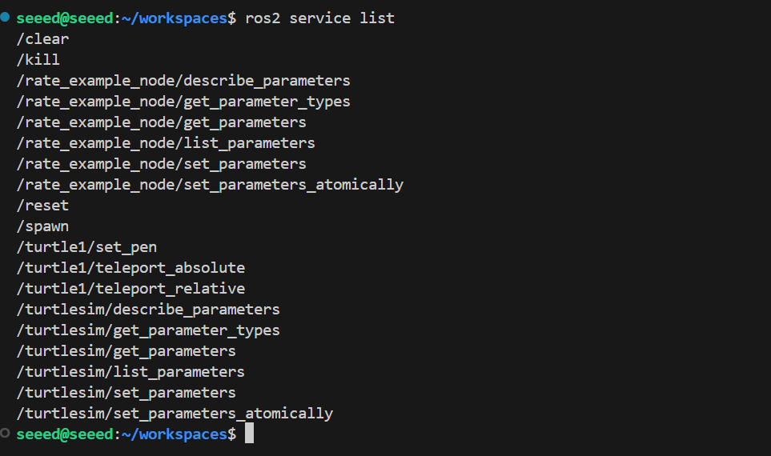

### 17.6.2 ros2 service call

功能：调用指定服务

格式：

```bash
ros2 interface call <service_name> <service_Type> <arguments>
```

例如，调用生成海龟服务

```bash
ros2 service call /spawn turtlesim/srv/Spawn "{x: 2, y: 2, theta: 0.2, name: 'turtle10'}"
```

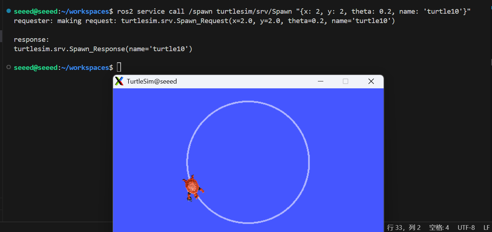

### 17.7下一步

1.18 RViz2使用-学习RViz2可视化

2.19 Rqt工具箱-学习Rqt工具

## 18 RViz2使用

### 18 RViz2使用(RViz2 Visualization)

### 18.1 RViz2概述

Rviz2是ROS 2中最常用的三维可视化工具，用于直观展示机器人系统的运行状态。它可以订阅并显示各种ROS 2话题数据，例如激光雷达点云、地图、机器人模型（URDF）、TF坐标变换、路径规划轨迹以及相机图像等，帮助开发者快速验证感知、定位、导航等功能是否正常工作。通过Rviz2，用户可以在同一个界面中实时观察机器人与环境的关系，大幅提升调试和开发效率。

### 18.2准备工作

注意：以下的安装步骤非必须，如果手中有实体机器人，设置好多机通信之后可以直接使用实机的雷达信息，可以自行选择使用实机雷达或虚拟仿真机器人；以下内容适合没有实机的用户使用。

```bash
sudo apt install ros-${ROS_DISTRO}-turtlebot3*
```

```bash
sudo apt install ros-humble-ros-gz -y
```

```bash
export TURTLEBOT3_MODEL=waffle
```

```bash
source /opt/ros/humble/setup.bash
ros2 launch turtlebot3_gazebo turtlebot3_world.launch.py
```

```
注意：Jetson上可能启动不了，本操作在X86 PC上运行
```

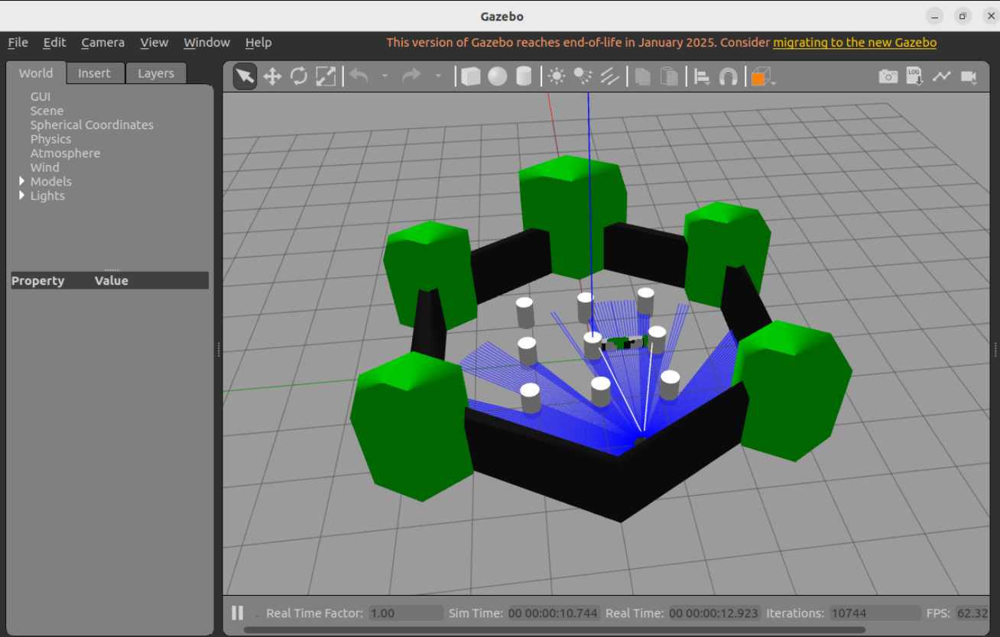

### 18.3 Rviz2启动

启动一个终端，使用如下命令即可启动：

```bash
rviz2
```

```
注意：如果是在 docker 中启动，请务必确保已经开启了 GUI 显示。
```

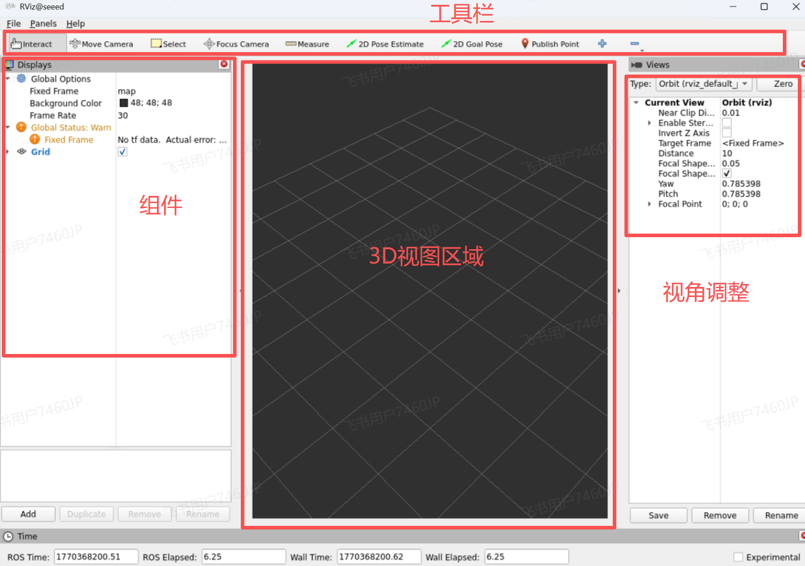

### 18.4图像数据可视化

在左侧Displays窗口中点击Add，找到Image显示项，OK确认后就可以加入显示列表啦，然后配置好该显示项订阅的图像话题，就可以顺利看到机器人的摄像头图像啦。

#### [图片下载失败]

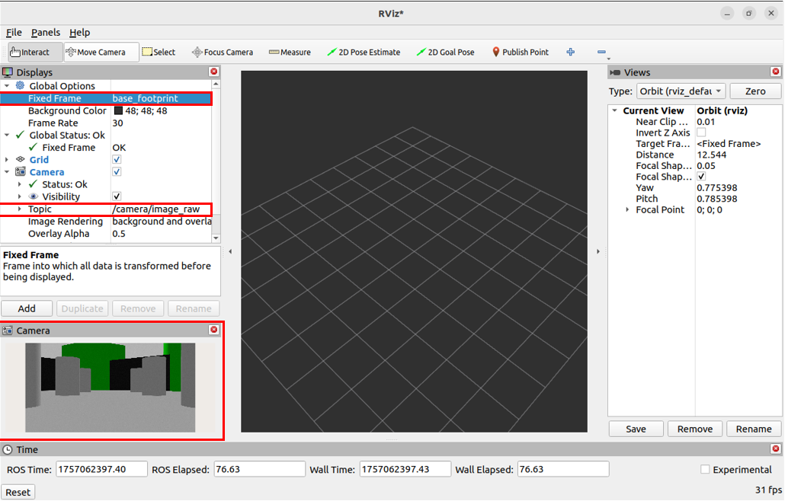

### 18.5雷达数据可视化

在左侧Displays窗口中点击Add，选择Laserscan，然后配置订阅的话题名，此时就可以看到激光点啦

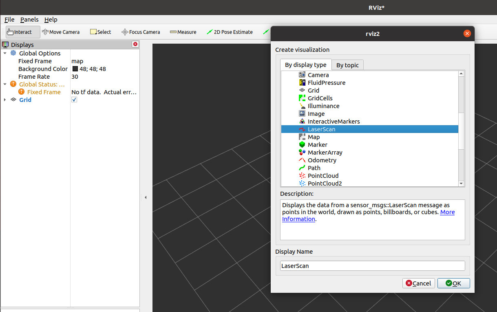

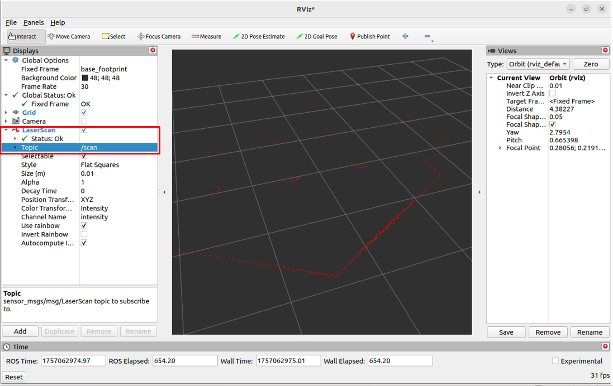

### 18.6机器人模型可视化

在左侧Displays窗口中点击Add，选择RobotModel

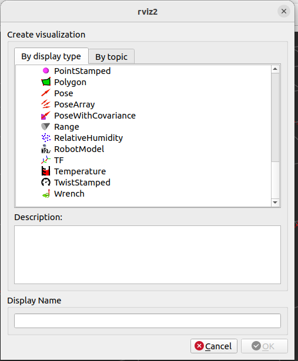

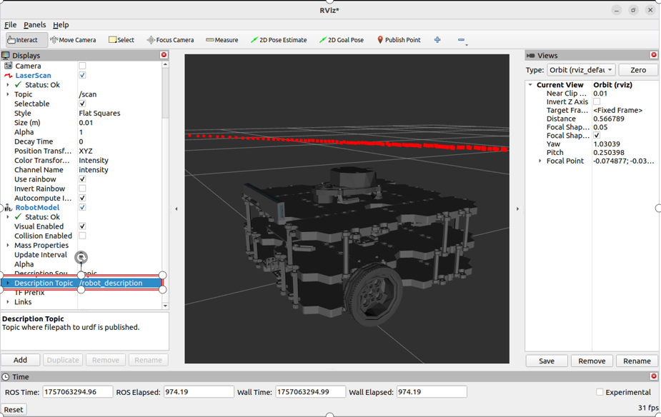

### 18.7其它数据可视化

rivz_default_plugins中列举了很多常用的数据可视化插件，大家可以一一尝试使用。

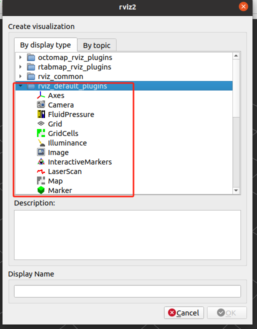

### 18.8下一步

1.19 Rqt工具箱-学习Rqt工具

2.20 Launch配置-学习Launch配置

## 19 Rqt工具箱

### 19 Rqt工具箱(Rqt Tools)

### 19.1 Rqt概述

| rqt 是 ROS 里一个基于 Qt 的 图形化工具框架 ，它通过插件化方式把很多常用功能整合到一个可视化界面中。开发者可以用 rqt 来直观地查看和调试系统，比如查看 Topic 的发布 / 订阅情况 、监控 节点与通信拓扑（ rqt_graph ） 、实时查看 日志（ rqt_console ） 、动态调参（ rqt_reconfigure ）以及绘图分析数据（ rqt_plot ）等。简单说， rqt 就像 ROS 的“多功能可视化调试工作台”，能大幅提升开发、排错和系统理解效率。 |  |
| --- | --- |

```
Plain Text
Rqt 插件生态：
┌─────────────────────────────────────────────────┐
│ Rqt 框架
│
├─────────────────────────────────────────────────┤
│ │
│ ┌─────────┐ ┌─────────┐ ┌─────────┐ │
│ │rqt_graph│ │rqt_plot │ │rqt_console│ │
│ │(节点图) │ │(数据绘图)│ │(日志查看)│ │
│ └─────────┘ └─────────┘ └─────────┘ │
│ │
│ ┌─────────┐ ┌─────────┐ ┌─────────┐ │
│ │rqt_reconfigure│ │rqt_tf_tree│ │rqt_bag│ │
│ │(参数配置)│ │(TF树) │ │(数据包) │ │
│ └─────────┘ └─────────┘ └─────────┘ │
│ │
└─────────────────────────────────────────────────┘
```

### 19.2安装

一般只要安装的是desktop版本就会默认安装rqt工具箱；如果安装ros2时不是安装的完整版本需要安装可以以如下方式安装

```bash
sudo apt install ros-${ROS_DISTRO}-rqt*
```

### 19.3启动

常用的rqt启动命令有：

```bash
# 方式1终端运行：rqt
rqt
```

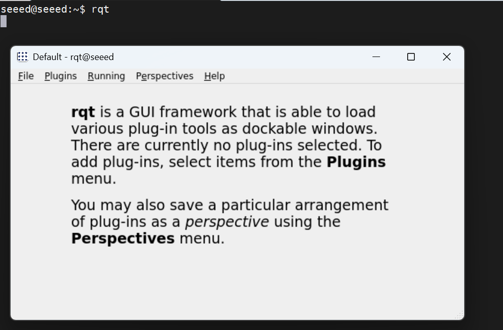

```bash
# 方式2
ros2 run rqt_gui rqt_gui
```

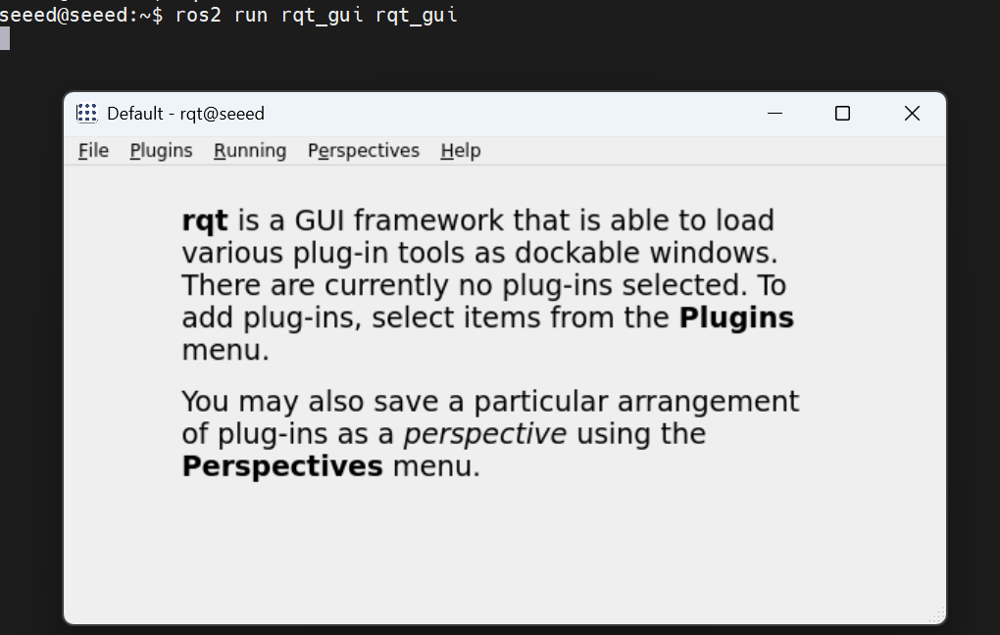

### 19.4插件使用

启动rqt之后，可以通过plugins添加所需的插件：

打开小乌龟示例来查看节点的订阅关系:

```bash
# 终端1:
ros2 run turtlesim turtlesim_node
# 终端2:
ros2 run turtlesim turtle_teleop_key
# 终端3:
rqt
```

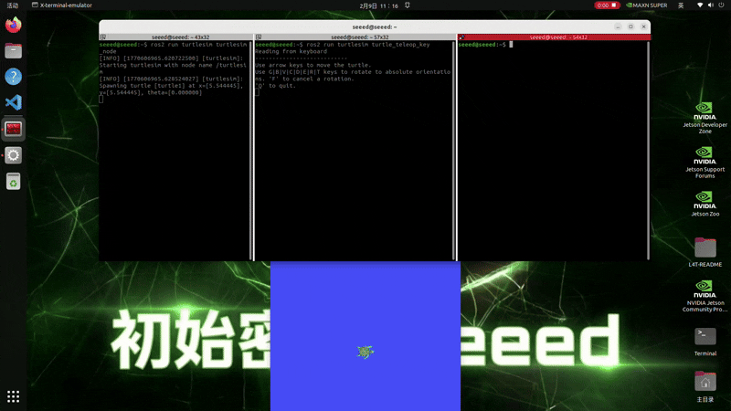

在plugins中包含了话题、服务、动作、参数、日志等等相关的插件，我们可以按需选用，方便的实现ROS2程序调试。使用示例如下。

### 19.4.1 topic插件

添加topic插件并发送速度指令控制乌龟运动。

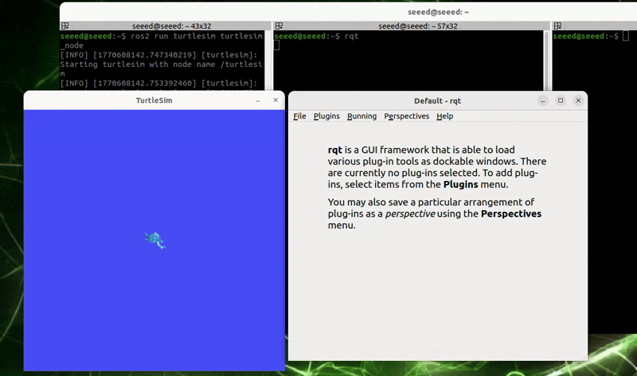

### 19.4.2 service插件

添加service插件并发送请求，在指定位置生成一只乌龟。

#### [图片下载失败]

### 19.4.3参数插件

通过参数插件动态修改乌龟窗体背景颜色。

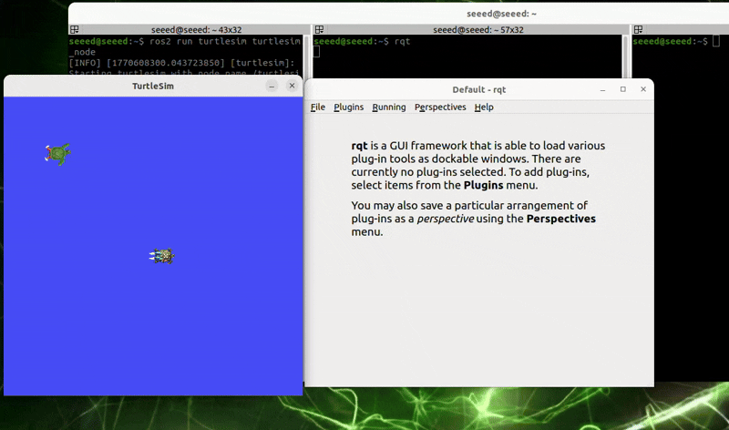

### 19.5下一步

1.20 Launch配置-学习Launch配置

2.21录制回放-学习数据包录制

## 20 Launch配置

### 20 Launch配置(Launch Files)

### 20.1 Launch概述

ROS中的Launch启动文件用于统一管理和启动多个节点/组件，本质上是一套“系统级启动脚本”。它可以用Python（最常见）、XML或YAML来编写，支持同时启动多个节点、设置参数、重映射话题、加载命名空间、配置环境变量，并且还能做更高级的逻辑控制，比如条件启动、延迟启动、按事件触发启动等。简单来说，Launch文件就是ROS 2项目里把一堆节点和配置“打包成一键启动”的核心工具，特别适合复杂机器人系统的部署和调试。

### 20.2单个Node节点的launch

### 20.2.1准备工作包

```bash
cd ~/workspaces/src
ros2 pkg create learn_launch --build-type ament_python
```

### 20.2.2新建launch文件

在功能包下新建一个launch文件夹，然后在launch文件夹内新建single_node_launch.py文件，把以下内容复制到该文件中：

```bash
from launch import LaunchDescription
from launch_ros.actions import Node
def generate_launch_description():
node = Node(
package='pkg_helloworld_py',
executable='helloworld',
output='screen'
)
return LaunchDescription([node])
```

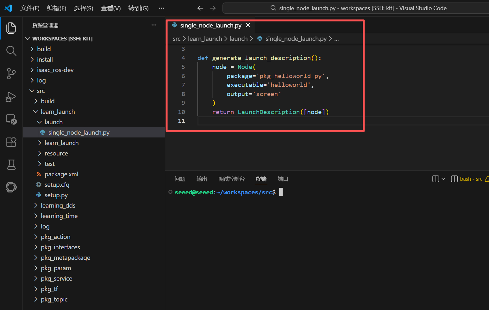

### 20.2.3配置setup.py文件

launch文件命名常以LaunchName_launch.py，其中，LaunchName自定义，_launch.py是常认为固定的。需要修改功能包下的setup.py文件，修改内容为添加launch路径下的文件，编译才能生成执行的.py文件

```bash
# 1、导入相关的头文件
import os
from glob import glob
# 2、在data_files的列表中，加上launch路径以及路径下的launch.py文件
(os.path.join('share',package_name,'launch'),glob(os.path.join('launch','*launch.py')))
```

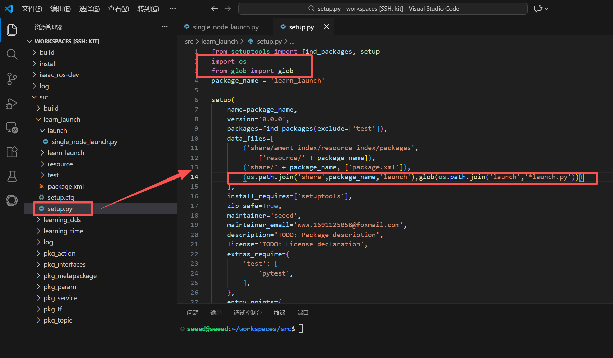

### 20.2.4编译功能包

```bash
cd ~/workspaces
colcon build --packages-select learn_launch
```

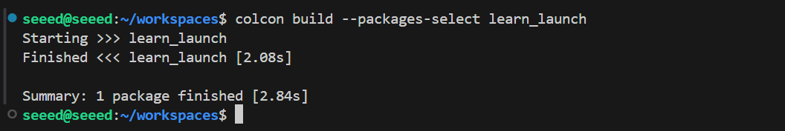

### 20.2.5运行程序

```bash
# 刷新环境变量
source install/setup.bash
ros2 launch learn_launch single_node_launch.py
```

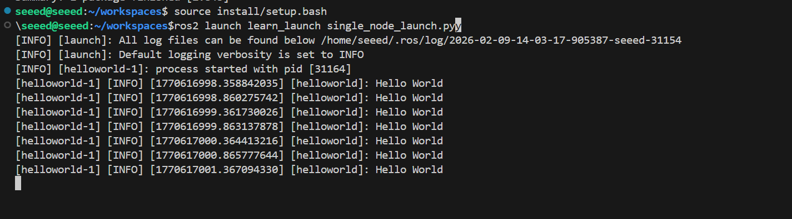

### 20.2.6源码分析

导入相关库

```bash
from launch import LaunchDescription
from launch_ros.actions import Node
```

定义一个函数generate_launch_description，并且返回一个launch_description

```bash
def generate_launch_description():
node = Node(
package='pkg_helloworld_py',
executable='helloworld',
)
return LaunchDescription([node])
```

定义了一个变量node作为一个节点启动的返回值，调用Node函数，启动重要的两个参数，package和executable。

最后调用LaunchDescription函数传入node参数执行返回。

```bash
return LaunchDescription([node])
```

### 20.3多个Node节点的launch

### 20.3.1新建launch文件

新建multi_node_launch.py文件，添加如下内容：

```bash
from launch import LaunchDescription
from launch_ros.actions import Node
def generate_launch_description():
publisher_node = Node(
package='pkg_topic',
executable='publisher_demo',
output='screen'
)
subscriber_node = Node(
package='pkg_topic',
executable='subscriber_demo',
output='screen'
)
return LaunchDescription([
publisher_node,
subscriber_node
])
```

### 20.3.2编译功能包

```bash
colcon build --packages-select learn_launch
```

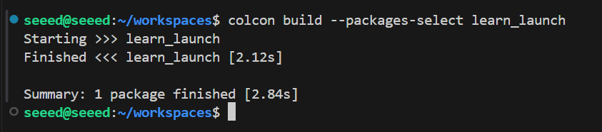

### 20.3.3运行程序

```bash
# 刷写环境变量
source install/setup.bash
ros2 launch learn_launch multi_node_launch.py
```

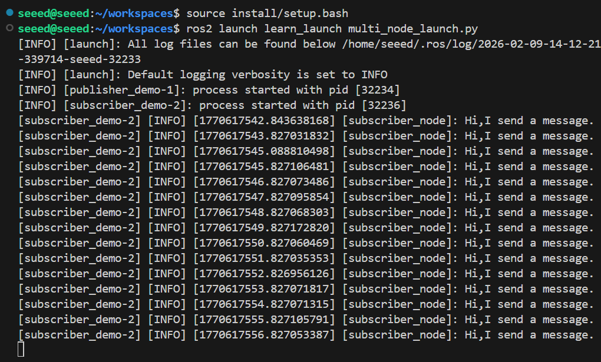

如果终端没有打印内容，可以查看哪些节点启动 来验证是否有启动成功，终端输入：

```bash
ros2 node list
```

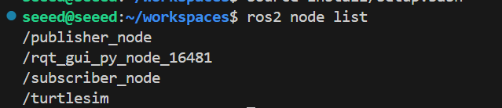

### 20.3.4源码解析

与simple_node_launch.py内容差不多，只是多了一个节点！

### 20.4话题重映射案例

### 20.4.1新建launch文件

在multi_node_launch.py同级目录下新建remap_name_launch.py文件，添加如下内容：

```bash
from launch import LaunchDescription
from launch_ros.actions import Node
def generate_launch_description():
publisher_node = Node(
package='pkg_topic',
executable='publisher_demo',
output='screen',
remappings=[("/topic_demo", "/topic_update")]
)
return LaunchDescription([
publisher_node
])
```

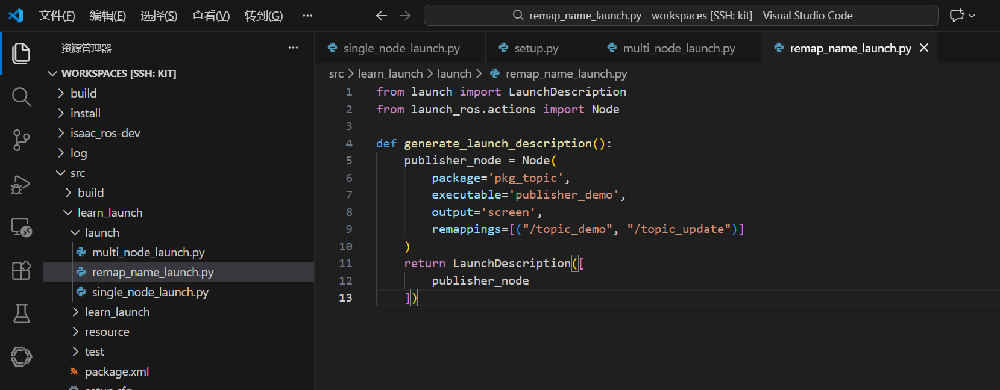

### 20.4.2编译功能包

```bash
colcon build --packages-select learn_launch
```

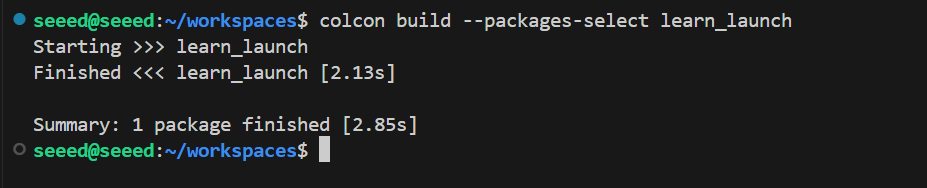

### 20.4.3运行程序

我们先看看没有重映射话题前，publisher_demo节点发布的话题是什么：

```bash
ros2 launch learn_launch multi_node_launch.py
ros2 topic list
```

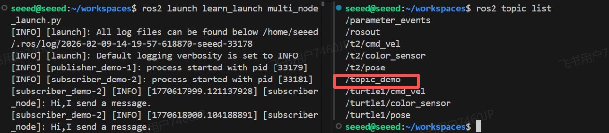

这里的话题是/topic_demo

```bash
# 刷新环境变量，运行重映射话题后的程序，看看变化：
source install/setup.bash
ros2 launch learn_launch remap_name_launch.py
ros2 topic list
```

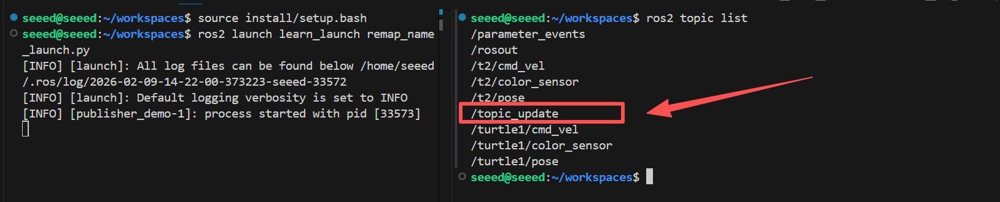

重映射了话题名称为/topic_update

### 20.4.4源码分析

主要是加了以下部分：

```bash
remappings=[("/topic_demo", "/topic_update")]
```

这里就是把原来的/topic_demo话题重映射成/topic_update

### 20.5 launch文件嵌套启动另一个launch文件

### 20.5.1新建launch文件

在multi_node_launch.py同级目录下新建include_launch.py文件，添加如下内容：

```bash
from launch import LaunchDescription
from launch_ros.actions import Node
import os
from launch.actions import IncludeLaunchDescription
from launch.launch_description_sources import PythonLaunchDescriptionSource
from ament_index_python.packages import get_package_share_directory
def generate_launch_description():
hello_launch = IncludeLaunchDescription(PythonLaunchDescriptionSource(
[os.path.join(get_package_share_directory('learn_launch'), 'launch'),
'/multi_node_launch.py']),
)
return LaunchDescription([
hello_launch
])
```

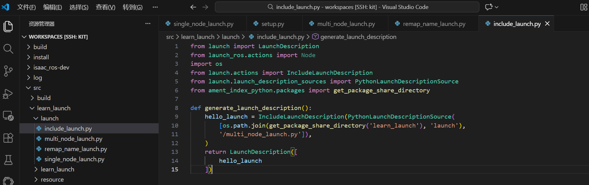

### 20.5.2编译功能包

```bash
colcon build --packages-select learn_launch
```

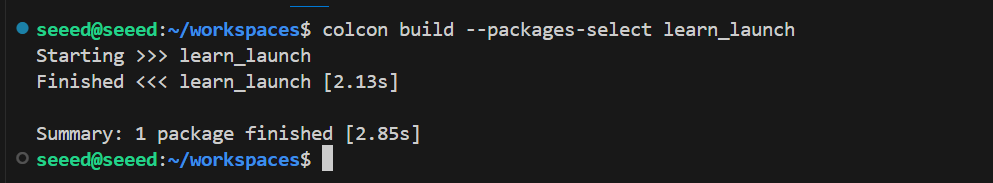

### 20.5.3运行程序

```bash
# 刷新环境变量
source install/setup.bash
ros2 launch learn_launch include_launch.py
```

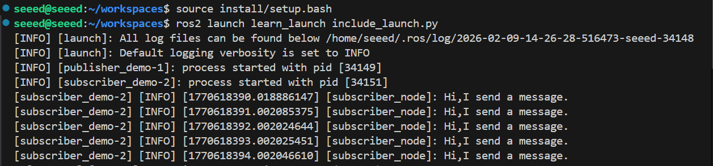

### 20.5.4源码分析

### 20.6综合launch文件示例

这个demo主要展示如何编写复杂的launch文件，程序的功能可忽略。

### 20.6.1新建launch文件

在multi_node_launch.py同级目录下新建complex_launch.py文件，添加如下内容：

```bash
complex_launch.py
import os
from ament_index_python import get_package_share_directory
from launch import LaunchDescription
from launch.actions import DeclareLaunchArgument
from launch.actions import IncludeLaunchDescription
from launch.actions import GroupAction
from launch.launch_description_sources import PythonLaunchDescriptionSource
from launch.substitutions import LaunchConfiguration
from launch.substitutions import TextSubstitution
from launch_ros.actions import Node
from launch_ros.actions import PushRosNamespace
def generate_launch_description():
# args that can be set from the command line or a default will be used
background_r_launch_arg = DeclareLaunchArgument(
"background_r", default_value=TextSubstitution(text="0")
)
background_g_launch_arg = DeclareLaunchArgument(
"background_g", default_value=TextSubstitution(text="255")
)
background_b_launch_arg = DeclareLaunchArgument(
"background_b", default_value=TextSubstitution(text="0")
)
chatter_ns_launch_arg = DeclareLaunchArgument(
"chatter_ns", default_value=TextSubstitution(text="my/chatter/ns")
)
# include another launch file
launch_include = IncludeLaunchDescription(
PythonLaunchDescriptionSource(
os.path.join(
get_package_share_directory('demo_nodes_cpp'),
'launch/topics/talker_listener.launch.py'))
)
# include another launch file in the chatter_ns namespace
launch_include_with_namespace = GroupAction(
actions=[
# push-ros-namespace to set namespace of included nodes
PushRosNamespace(LaunchConfiguration('chatter_ns')),
IncludeLaunchDescription(
PythonLaunchDescriptionSource(
os.path.join(
get_package_share_directory('demo_nodes_cpp'),
'launch/topics/talker_listener.launch.py'))
),
]
)
# start a turtlesim_node in the turtlesim1 namespace
turtlesim_node = Node(
package='turtlesim',
namespace='turtlesim1',
executable='turtlesim_node',
name='sim'
)
# start another turtlesim_node in the turtlesim2 namespace
# and use args to set parameters
turtlesim_node_with_parameters = Node(
package='turtlesim',
namespace='turtlesim2',
executable='turtlesim_node',
name='sim',
parameters=[{
"background_r": LaunchConfiguration('background_r'),
"background_g": LaunchConfiguration('background_g'),
"background_b": LaunchConfiguration('background_b'),
}]
)
# perform remap so both turtles listen to the same command topic
forward_turtlesim_commands_to_second_turtlesim_node = Node(
package='turtlesim',
executable='mimic',
name='mimic',
remappings=[
('/input/pose', '/turtlesim1/turtle1/pose'),
('/output/cmd_vel', '/turtlesim2/turtle1/cmd_vel'),
]
)
return LaunchDescription([
background_r_launch_arg,
background_g_launch_arg,
background_b_launch_arg,
chatter_ns_launch_arg,
launch_include,
launch_include_with_namespace,
turtlesim_node,
turtlesim_node_with_parameters,
forward_turtlesim_commands_to_second_turtlesim_node,
])
```

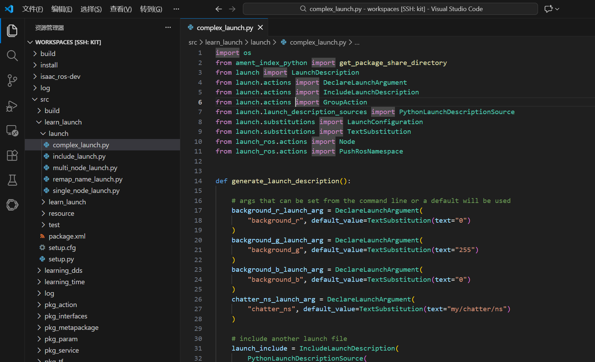

### 20.6.2编译工作空间

```bash
colcon build --packages-select learn_launch
```

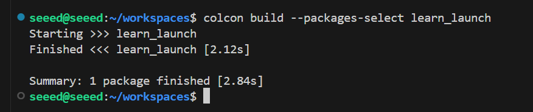

### 20.6.3运行程序

```bash
source install/setup.bash
ros2 launch learn_launch complex_launch.py
```

在Jetson上会显示两只小乌龟。

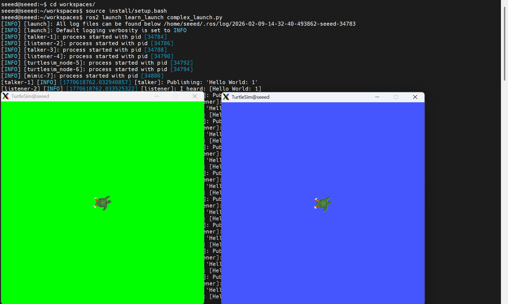

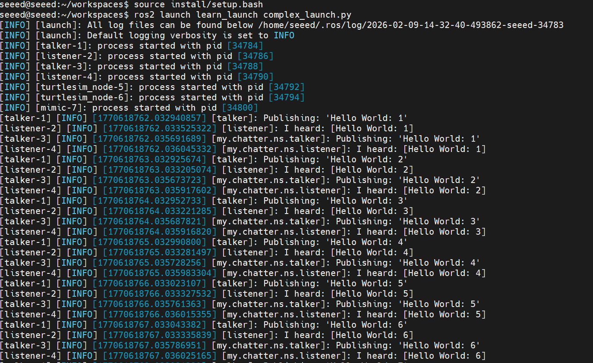

```bash
ros2 run turtlesim turtle_teleop_key --ros-args -r __ns:=/turtlesim1
```


### 20.6.4程序说明

程序主要是启动：

1、demo_nodes_cpp的talker_listener节点，

2、带命名空间的talker_listener节点

3、turtlesim1为命名空间的小乌龟1

4、turtlesim2为命名空间的小乌龟2

5、执行重映射，使两只乌龟都能听到相同的命令主题

### 20.7 xml实现

### 20.7.1新建launch文件

在complex_launch.py同级目录下新建complex_launch.xml文件，添加如下内容：

```bash
<launch>
<!-- args that can be set from the command line or a default will be used -->
<arg name="background_r" default="0"/>
<arg name="background_g" default="255"/>
<arg name="background_b" default="0"/>
<arg name="chatter_ns" default="my/chatter/ns"/>
<!-- include another launch file -->
<include file="$(find-pkg-share demo_nodes_cpp)/launch/topics/talker_listener.launch.py"/>
<!-- include another launch file in the chatter_ns namespace-->
<group>
<!-- push-ros-namespace to set namespace of included nodes -->
<push-ros-namespace namespace="$(var chatter_ns)"/>
<include file="$(find-pkg-share demo_nodes_cpp)/launch/topics/talker_listener.launch.py"/>
</group>
<!-- start a turtlesim_node in the turtlesim1 namespace -->
<node pkg="turtlesim" exec="turtlesim_node" name="sim" namespace="turtlesim1"/>
<!-- start another turtlesim_node in the turtlesim2 namespace
and use args to set parameters -->
<node pkg="turtlesim" exec="turtlesim_node" name="sim" namespace="turtlesim2">
<param name="background_r" value="$(var background_r)"/>
<param name="background_g" value="$(var background_g)"/>
<param name="background_b" value="$(var background_b)"/>
</node>
<!-- perform remap so both turtles listen to the same command topic -->
<node pkg="turtlesim" exec="mimic" name="mimic">
<remap from="/input/pose" to="/turtlesim1/turtle1/pose"/>
<remap from="/output/cmd_vel" to="/turtlesim2/turtle1/cmd_vel"/>
</node>
</launch>
```

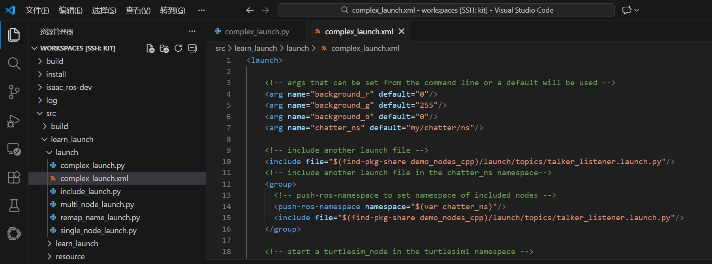

### 20.7.2 setup.py文件配置

```bash
(os.path.join('share',package_name,'launch'),glob(os.path.join('launch','*launch.xml'))),
```

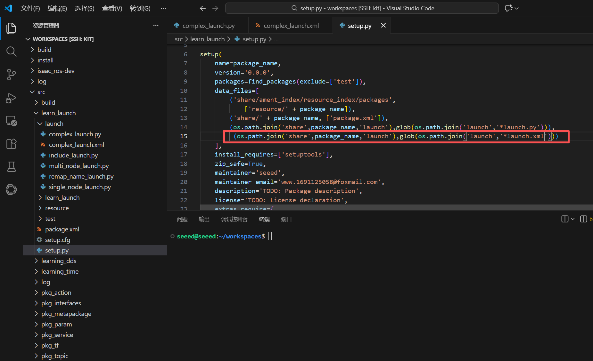

### 20.7.3编译功能包

```bash
cd ~/workspaces
colcon build --packages-select learn_launch
```

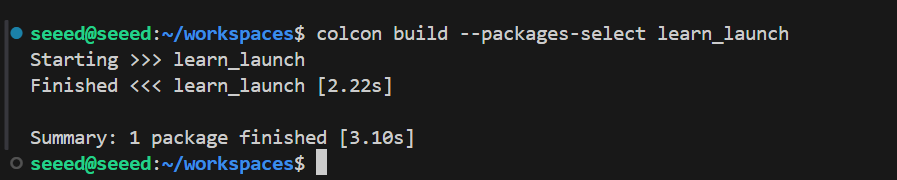

### 20.7.4运行程序

```bash
ros2 launch learn_launch complex_launch.xml
```

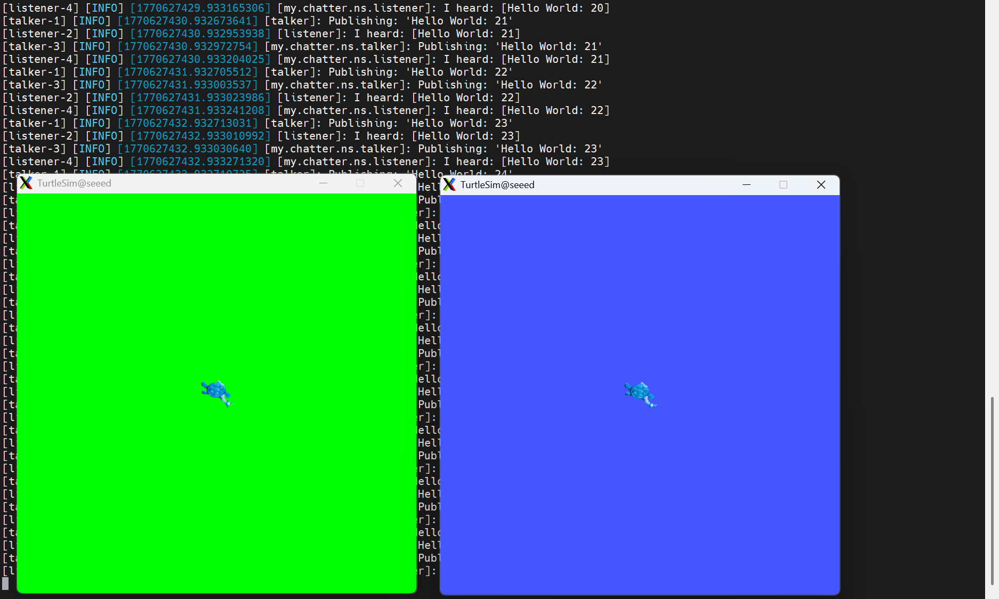

```bash
ros2 run turtlesim turtle_teleop_key --ros-args -r __ns:=/turtlesim1
```

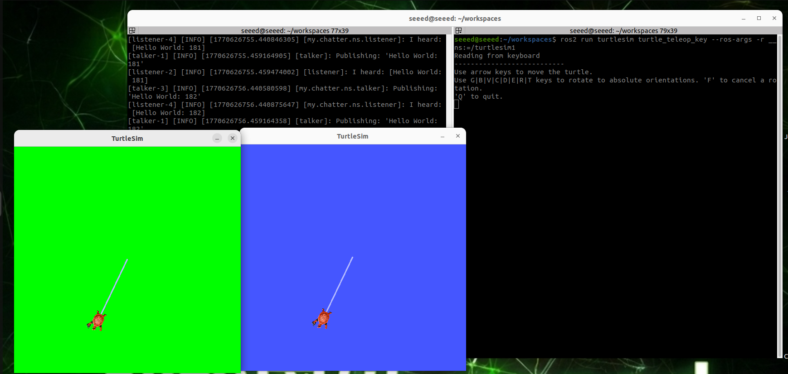

### 20.8 yaml实现

### 20.8.1新建launch文件

在complex_launch.py同级目录下新建complex_launch.yaml文件，添加如下内容：

```bash
launch:
# args that can be set from the command line or a default will be used
- arg:
name: "background_r"
default: "0"
- arg:
name: "background_g"
default: "255"
- arg:
name: "background_b"
default: "0"
- arg:
name: "chatter_ns"
default: "my/chatter/ns"
# include another launch file
- include:
file: "$(find-pkg-share demo_nodes_cpp)/launch/topics/talker_listener.launch.py"
# include another launch file in the chatter_ns namespace
- group:
- push-ros-namespace:
namespace: "$(var chatter_ns)"
- include:
file: "$(find-pkg-share demo_nodes_cpp)/launch/topics/talker_listener.launch.py"
# start a turtlesim_node in the turtlesim1 namespace
- node:
pkg: "turtlesim"
exec: "turtlesim_node"
name: "sim"
namespace: "turtlesim1"
# start another turtlesim_node in the turtlesim2 namespace and use args to set parameters
- node:
pkg: "turtlesim"
exec: "turtlesim_node"
name: "sim"
namespace: "turtlesim2"
param:
-
name: "background_r"
value: "$(var background_r)"
-
name: "background_g"
value: "$(var background_g)"
-
name: "background_b"
value: "$(var background_b)"
# perform remap so both turtles listen to the same command topic
- node:
pkg: "turtlesim"
exec: "mimic"
name: "mimic"
remap:
-
from: "/input/pose"
to: "/turtlesim1/turtle1/pose"
-
from: "/output/cmd_vel"
to: "/turtlesim2/turtle1/cmd_vel"
```

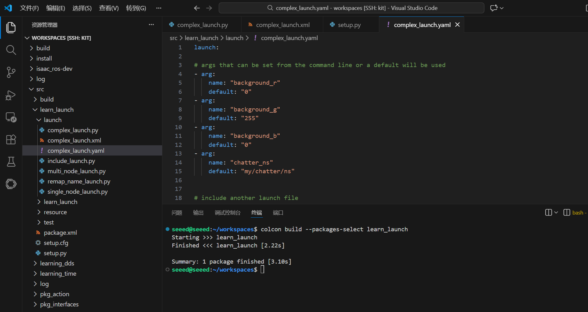

### 20.8.2配置

```bash
(os.path.join('share',package_name,'launch'),glob(os.path.join('launch','*launch.yaml'))),
```

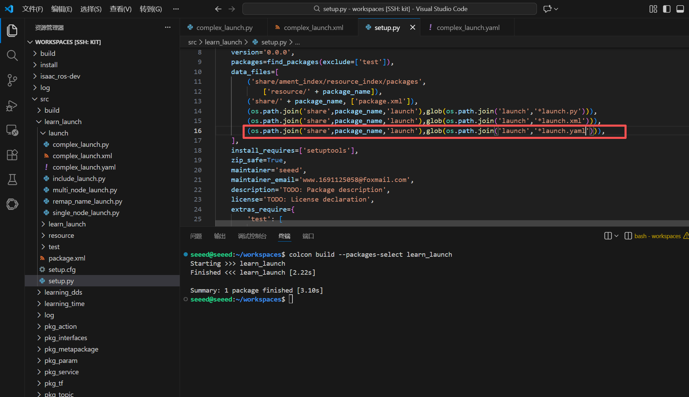

### 20.8.3编译功能包

```bash
colcon build --packages-select learn_launch
```

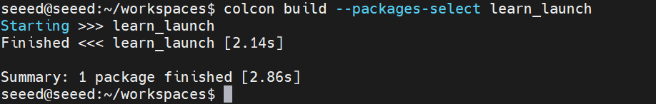

### 20.8.4运行程序

```bash
# 刷新环境变量
source install/setup.bash
ros2 launch learn_launch complex_launch.yaml
```

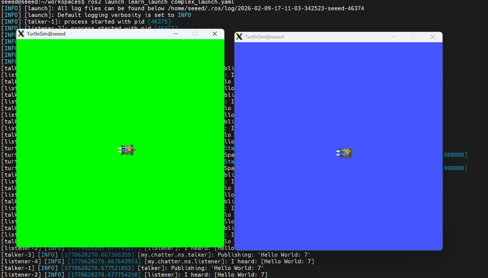

```bash
ros2 run turtlesim turtle_teleop_key --ros-args -r __ns:=/turtlesim1
```

使用键盘控制启动海龟1进行运行，海龟2会完全模仿海龟1的行为

### 20.9下一步

1.21录制回放-学习数据包录制

2.22 URDF模型-学习机器人建模

## 21录制回放

### 21录制回放(Rosbag2)

### 21.1 Rosbag2概述

ROS 2的录制回放工具主要是ros2 bag（基于rosbag2），用于把运行中的Topic数据录制成bag文件，之后再按时间顺序回放复现，方便调试、算法验证和离线分析。它支持选择性录制指定话题、设置存储格式（常见如sqlite3）、控制录制时长/分段，并且回放时还能调节播放速度、暂停、循环播放等。简单说，ros2 bag就是ROS 2里“把现场数据存下来、之后再重放”的标准工具，是做机器人开发和排错非常关键的一环。

```
Plain Text
Rosbag2 工作流程：
┌─────────────┐ 录制 ┌─────────────┐
│ 运行节点 │ ────────────► │ 数据包 │
│ (传感器数据) │ │ (.db3) │
└─────────────┘ └─────────────┘
│
│ 回放
▼
┌─────────────┐
│ 测试节点 │
│ (算法验证) │
└─────────────┘
```

### 21.2使用教程

### 21.2.1启动要录制的话题节点

如ros2 demo中的talker：

```bash
ros2 run demo_nodes_py talker
```

### 21.2.2记录

/topic-name为话题名字

```bash
# 记录单个话题
ros2 bag record /topic-name
# 记录多个话题
ros2 bag record topic-name1 topic-name2
# 记录所有话题
ros2 bag record -a
```

其它选项

-o name自定义输出文件的名字

```bash
ros2 bag record -o file-name topic-name
```

-s存储格式

目前仅支持sqllite3 ,其他还带拓展

### 21.3查看录制出话题的信息

我们在播放一个视频前，可以通过文件信息查看视频的相关信息，比如话题记录的时间，大小，类型，数量

```bash
# 假设录制的file为rosbag2_2026_02_09-17_20_58
ros2 bag info rosbag2_2026_02_09-17_20_58
```

### 21.4播放并查看

### 21.4.1播放

接着我们就可以重新播放数据，使用下面的指令可以播放数据

```bash
ros2 bag play rosbag2_2026_02_09-17_20_58
```

### 21.4.2查看

使用ros2的topic的指令来查看数据

```bash
ros2 topic echo /chatter
```

#### 21.4.3播放选项

倍速播放-r

-r选项可以修改播放速率，比如-r值，比如-r 10,就是10倍速，十倍速播放话题

```bash
ros2 bag play rosbag2_2026_02_09-17_20_58 -r 10
```

循环播放-l

单曲循环就是它了

```bash
ros2 bag play rosbag2_2026_02_09-17_20_58 -l
```

播放单个话题

```bash
ros2 bag play rosbag2_2026_02_09-17_20_58 --topics /chatter
```

### 21.5示例

### 21.5.1运行talker节点

```bash
ros2 run demo_nodes_py talker
```

### 21.5.2录制

```bash
# 记录所有话题
ros2 bag record -a
```

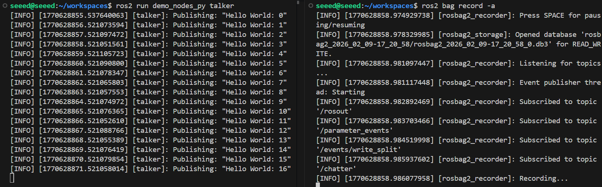

如何停止录制呢？我们直接在终端中使用Ctrl+C指令打断录制即可

接着你会在终端中发现多处一个文件夹，名字叫做rosbag2_2026_02_09-17_20_58

打开文件夹，可以看到内容

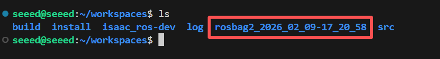

这样我们就完成了录制。

### 21.6播放并查看

这里我们循环播放

```bash
ros2 bag play rosbag2_2026_02_09-17_20_58 -l
```

开启另一个终端查看topic：

```bash
ros2 topic echo /chatter
```

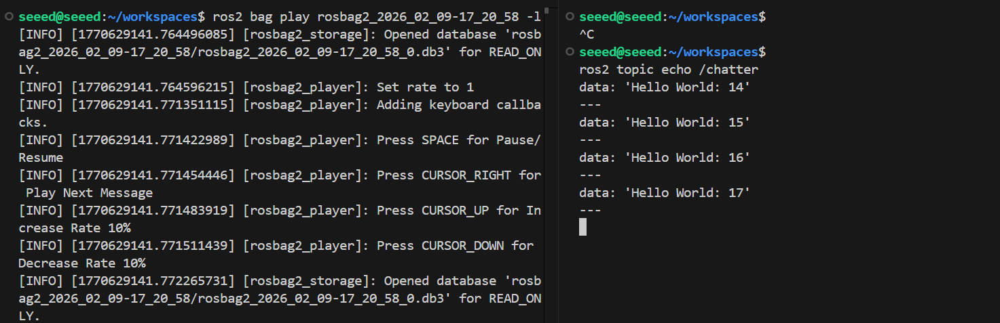

### 21.7下一步

1.22 URDF模型-学习机器人建模

2.23 Gazebo仿真-学习物理仿真
