# ROS2 Simulation and Vision

## 22 URDF模型

### 22 URDF模型(URDF Modeling)

### 22.1 URDF概述

ROS 2里的URDF（Unified Robot Description Format）是一种用XML编写的机器人模型描述文件，用来定义机器人的连杆（link）、关节（joint）、几何外形、质量惯性、坐标关系以及碰撞和可视化模型等信息。它是机器人在ROS 2中进行TF坐标发布、Gazebo/Ignition仿真、RViz可视化、运动规划（MoveIt2）等功能的基础。简单说，URDF就是ROS 2用来“告诉系统机器人长什么样、各个部件怎么连接”的标准模型文件。

### 22.1.1什么是URDF

URDF (Unified Robot Description Format)是XML格式的机器人描述文件，用于定义机器人的几何形状、关节、惯性等属性。

```
Plain Text
URDF 文件结构：
robot.urdf
├── <robot> # 根元素
│ ├── <link> # 连杆定义
│ │ ├── <visual> # 可视化
│ │ ├── <collision> # 碰撞体
│ │ └── <inertial> # 惯性
│ └── <joint> # 关节定义
│ ├── <parent> # 父连杆
│ ├── <child> # 子连杆
│ └── <origin> # 变换
```

### 22.2机器人的组成

在对机器人进行建模描述的过程中，我们首先需要熟悉机器人的整体组成与关键参数。一般来说，机器人主要由硬件结构、驱动系统、传感器系统和控制系统四大部分构成。市面上常见的各类机器人，无论是移动机器人还是机械臂，都可以按照这四个组成模块进行拆解与分析，从而为后续建模工作打下基础。

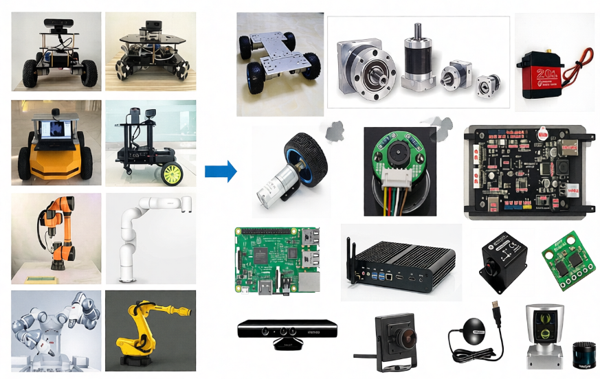

机器人建模的过程，其实就是按照类似的思路，通过建模语言，把机器人每一个部分都描述清楚，再组合起来的过程。

### 22.3 URDF语法

### 22.3.1连杆Link的描述

标签用来描述机器人某个刚体部分的外观和物理属性，外观包括尺寸、颜色、形状，物理属性包括质量、惯性矩阵、碰撞参数等。

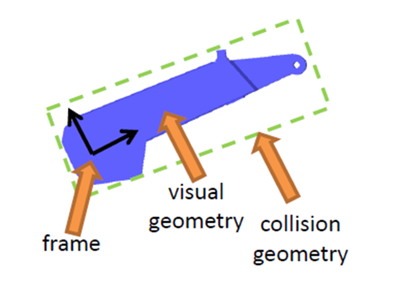

以这个机械臂连杆为例，它的link描述如下：

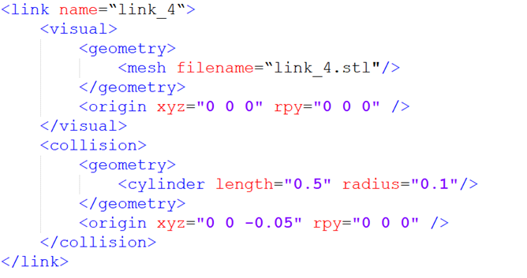

link标签中的name表示该连杆的名称，我们可以自定义，未来joint连接link的时候，会使用到这个名称。

link里边的部分用来描述机器人的外观，比如：

第二个部分，描述碰撞参数，里边的内容似乎和一样，也有和，看似相同，其实区别还是比较大的。

在这个机器人模型中，蓝色部分是通过来描述的，在实际控制过程中，这样复杂的外观在计算碰撞检测时，要求的算力较高，为了简化计算，我们将碰撞检测用的模型简化为了绿色框的圆柱体，也就是里边描述的形状。坐标系偏移也是类似，可以描述刚体质心的偏移。

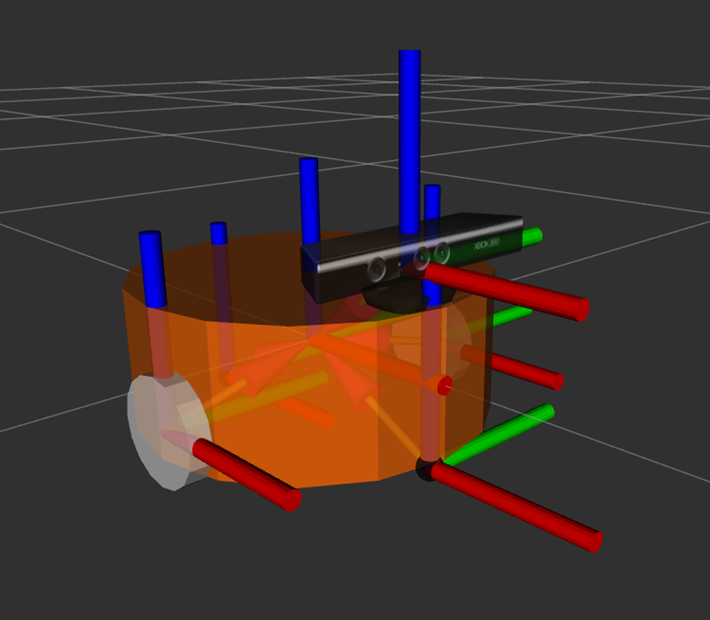

如果是移动机器人的话，link也可以用来描述小车的车体、轮子等部分。

### 22.3.2关节Joint描述

机器人模型中的刚体最终要通过关节joint连接之后，才能产生相对运动。

URDF中的关节有六种运动类型。

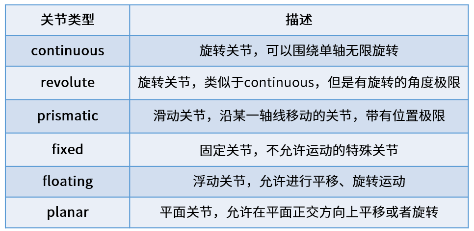

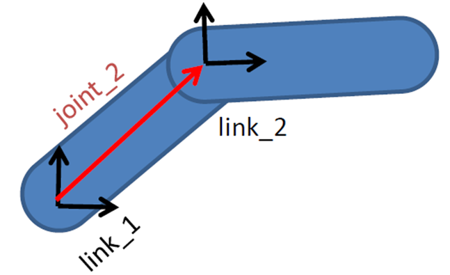

在URDF模型中，每一个link都使用这样一段xml内容描述，比如关节的名字叫什么，运动类型是哪一种。

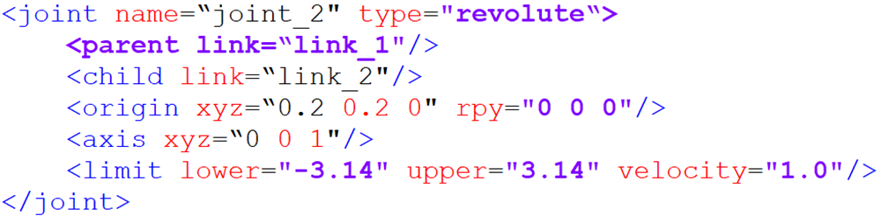

### 22.4完整机器人模型

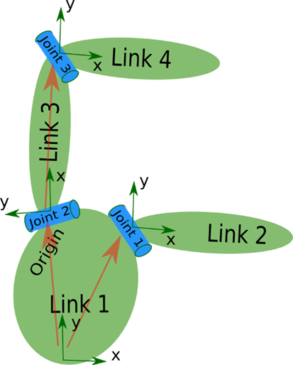

最终所有的link和joint标签完成了对机器人每个部分的描述和组合，全都放在一个robot标签中，就形成了完整的机器人模型。

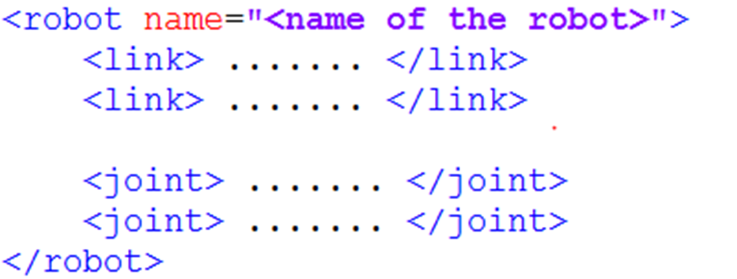

所以大家在看某一个URDF模型时，先不着急看每一块代码的细节，先来找link和joint，看下这个机器人是由哪些部分组成的，了解完全局之后，再看细节。

### 22.5导入SO-ARM机械臂

### 22.5.1克隆仓库：

```bash
cd ~/workspaces/src
git clone https://github.com/brukg/SO-100-arm.git
```

### 22.5.2编译项目

```bash
# 安装依赖
cd ..
rosdep install --from-paths src --ignore-src -r -y
# 编译功能包
colcon build --packages-select so_100_arm
```

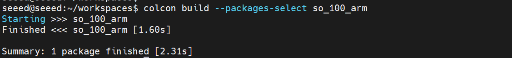

### 22.5.3在Gazebo查看机械臂

```bash
# 刷写环境变量
source install/setup.bash
ros2 launch so_100_arm rviz.launch.py
```

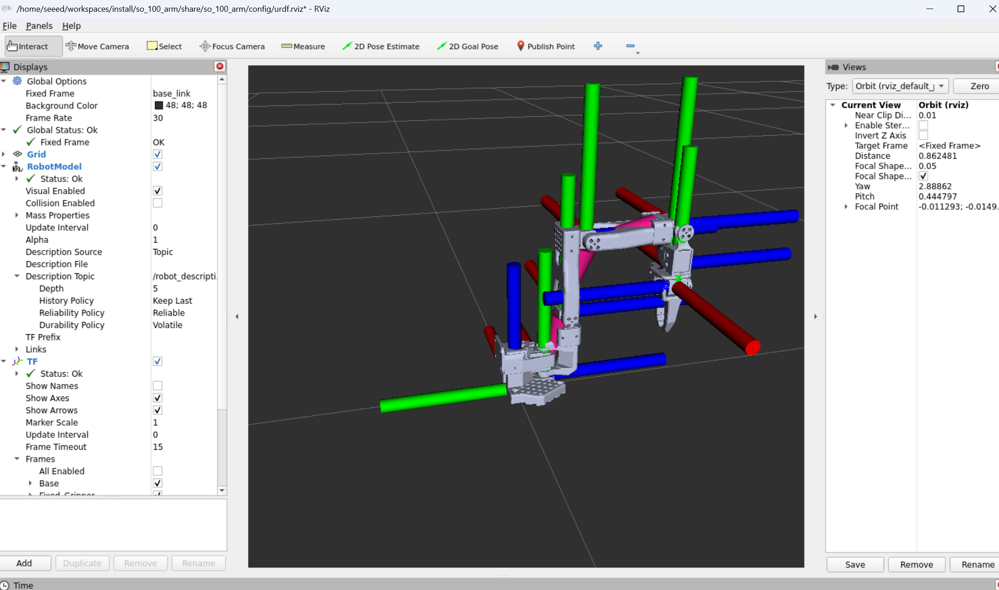

### 22.6下一步

1.23 Gazebo仿真-学习物理仿真

2.24摄像头预览-学习摄像头配置

## 23 Gazebo仿真

### 23 Gazebo仿真(Gazebo Simulation)

### 23.1 Gazebo概述

Gazebo是一款常用的机器人仿真平台，可以在电脑里搭建虚拟环境来模拟真实世界中的机器人运动、传感器数据和物理交互（比如重力、碰撞、摩擦等）。它支持导入机器人模型（URDF/SDF），并能模拟摄像头、激光雷达、IMU等多种传感器，因此经常被用于机器人算法开发、调试和测试，尤其是在ROS/ROS2生态里非常常见。通过Gazebo，开发者可以在不依赖真实硬件的情况下快速验证控制、导航、SLAM等功能，大幅降低开发成本和风险。

### 23.1.1什么是Gazebo

```
Plain Text
Gazebo 仿真架构：
┌─────────────────────────────────────────────────┐
│ Gazebo Server │
│ ┌─────────┐ ┌─────────┐ ┌─────────┐ │
│ │ 物理引擎 │ │ 渲染引擎 │ │ 传感器 │ │
│ │(ODE/Bullet)│ │(OGRE) │ │ 插件 │ │
│ └─────────┘ └─────────┘ └─────────┘ │
├─────────────────────────────────────────────────┤
│ ROS 2 接口 │
│ ┌─────────┐ ┌─────────┐ ┌─────────┐ │
│ │/cmd_vel │ │/odom │ │/scan │ │
│ └─────────┘ └─────────┘ └─────────┘ │
└─────────────────────────────────────────────────┘
```

### 23.2安装运行

```bash
sudo apt install ros-${ROS_DISTRO}-ros-gz
```

```bash
ros2 launch ros_gz_sim gz_sim.launch.py
```

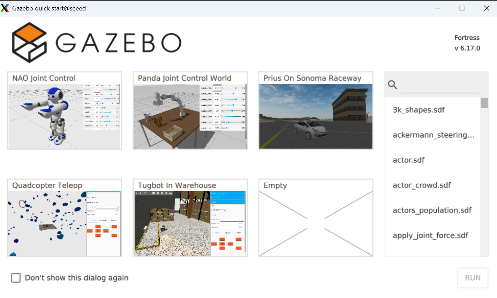

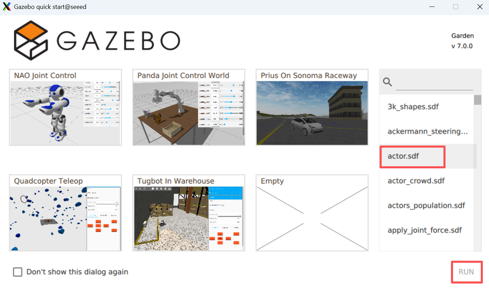

模型如下：

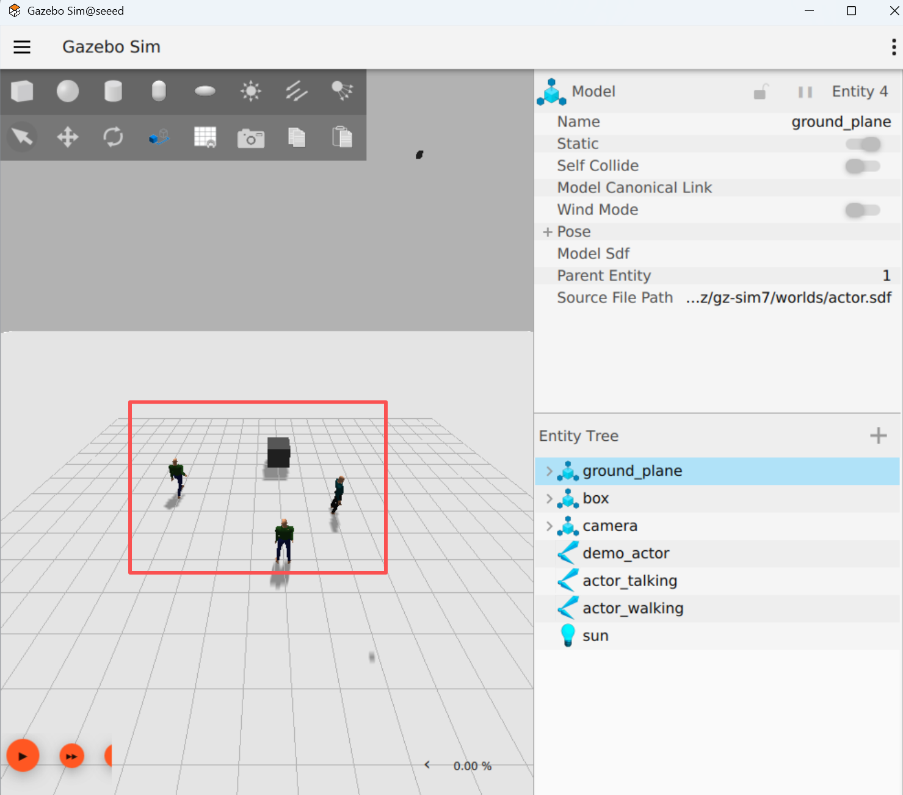

### 23.3下一步

1.24摄像头预览-学习摄像头配置

2.25摄像头校准-学习相机校准

## 24摄像头预览

### 24摄像头预览

### 24.1编译功能包

```bash
cd /opt/seeed/development_guide/12_llm_offline/seeed_ws
colcon build
source install/setup.bash
```

### 24.2启动摄像头

```
启动摄像头
```

```bash
ros2 run camera camera_usb
```

```
查看节点和话题
Bash
ros2 node list
ros2 topic list
```

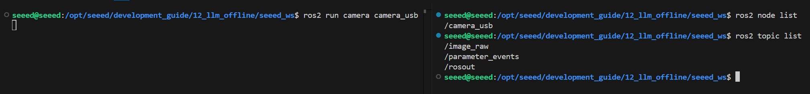

### 24.3预览画面

使用rqt查看摄像头对应的画面话题：rqt → Plugins → Visualization → Image View

```bash
rqt
```

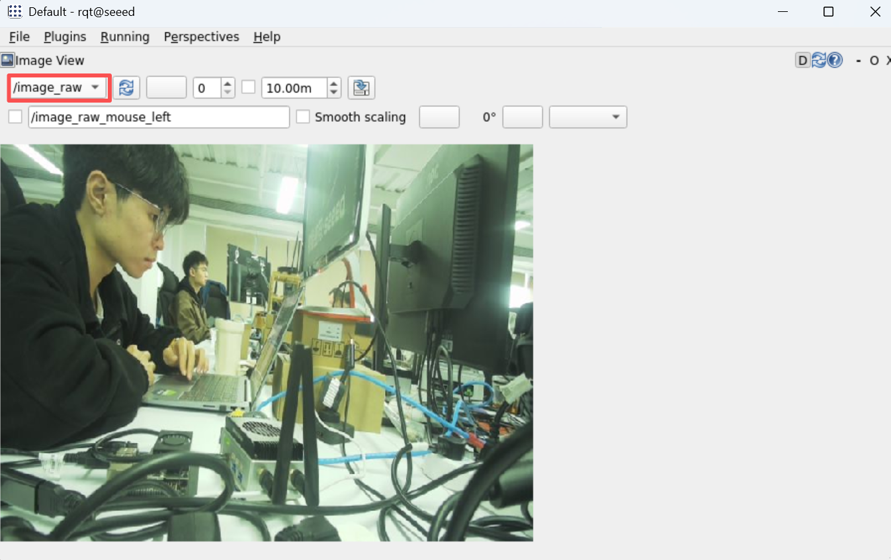

### 24.4主要代码

```bash
import rclpy
from rclpy.node import Node
from sensor_msgs.msg import Image
from cv_bridge import CvBridge
import cv2
class CameraNode(Node):
def __init__(self):
super().__init__('camera_usb')
self.publisher = self.create_publisher(Image, 'image_raw', 10)
self.bridge = CvBridge()
self.cap = cv2.VideoCapture(0)
if not self.cap.isOpened():
self.get_logger().error('Unable to open camera')
return
self.timer = self.create_timer(0.05, self.timer_callback)
def timer_callback(self):
ret, frame = self.cap.read()
if ret:
image_msg = self.bridge.cv2_to_imgmsg(frame, encoding="bgr8")
self.publisher.publish(image_msg)
else:
self.get_logger().warn('Failed to capture image')
def main(args=None):
rclpy.init(args=args)
node = CameraNode()
rclpy.spin(node)
node.cap.release()
rclpy.shutdown()
if __name__ == '__main__':
main()
```

### 24.5下一步

1.25摄像头校准-学习相机校准

2.26 AR视觉-学习AR视觉

## 25摄像头校准

### 25摄像头校准(Camera Calibration)

### 25.1相机校准概述

### 25.1.1什么是相机校准

相机校准是确定相机内参（焦距、主点、畸变系数）和外参（位置、姿态）的过程。

相机是使用透镜成像的设备，由于透镜的物理特性，会引入几何畸变。校准就是通过数学模型来描述和补偿这些畸变。

```
Plain Text
相机参数详解:
内参 (Intrinsic) - 相机固有的光学特性:
├── 焦距 (focal length: fx, fy)
│ └── 像素单位下的透镜焦距，决定视野大小
├── 主点 (principal point: cx, cy)
│ └── 光轴与图像平面的交点，通常接近图像中心
├── 畸变系数 (distortion coefficients)
│ ├── 径向畸变 (k1, k2, k3) - 桶形/枕形畸变
│ └── 切向畸变 (p1, p2) - 由于透镜装配不完美导致
外参 (Extrinsic) - 相机在世界坐标系中的位姿:
├── 旋转矩阵 (rotation matrix: 3x3)
│ └── 描述相机坐标系相对世界坐标系的旋转
└── 平移向量 (translation vector: 3x1)
└── 描述相机坐标系原点相对世界坐标系的位移
相机内参矩阵 (Camera Matrix):
[fx 0 cx]
K = [0 fy cy] (3x3 矩阵)
[0 0 1]
```

### 25.1.2为什么要校准

| 用途 | 说明 | 精度要求 |
| --- | --- | --- |
| 视觉测距 | 将像素距离转换为实际距离 | 高精度 |
| 3D 重建 | 精确的 3D 信息恢复， Structure from Motion | 高精度 |
| 相机拼接 | 多相机图像拼接，全景相机 | 中高精度 |
| 机器人导航 | 准确的环境感知，视觉里程计 | 高精度 |
| 物体检测 | 校正物体边缘，提高检测准确率 | 中精度 |
| AR/VR | 虚拟内容与现实世界的精确对齐 | 高精度 |

### 25.1.3相机畸变类型

```
Plain Text
畸变类型:
1. 径向畸变 (Radial Distortion)
┌─────────────────────────────────────┐
│ │
│ 桶形畸变 ( Barrel Distortion ) │
│ ┌─────┐ ┌──────────┐ │
│ │ ○ │ → │ ╭──────╮ │ │
│ └─────┘ │ ╰──────╯ │ │
│ └──────────┘ │
│ 直线向外弯曲 │
│ │
│ 枕形畸变 ( Pincushion Distortion )│
│ ┌──────────┐ ┌─────┐ │
│ │ ╭──────╮ │ → │ ○ │ │
│ │ ╰──────╯ │ └─────┘ │
│ └──────────┘ │
│ 直线向内弯曲 │
└─────────────────────────────────────┘
2. 切向畸变 (Tangential Distortion)
图像平面不完全平行于透镜平面导致
```

### 25.1.4校准原理

相机校准基于针孔相机模型，通过已知世界坐标点（校准板上的角点）和图像坐标点（检测到的像素位置）之间的关系，求解相机参数。

```
Plain Text
校准流程:
世界坐标 (3D) → 外参变换 → 相机坐标 (3D) → 内参投影 → 像素坐标 (2D)
[X,Y,Z,1] [R|t] [x,y,z] K [u,v,1]
重投影误差 (Reprojection Error):
校准质量指标，计算重新投影点的误差距离
值越小，校准效果越好
```

### 25.2安装校准工具

安装相机标定包

```bash
sudo apt install ros-humble-camera-calibration
```

### 25.3下载标定棋盘格

从以下地址下载标定棋盘格

棋盘格合集并打印出来。

### 25.4运行相机标定

```bash
# For 8x6 checkerboard with 25mm squares
ros2 run camera_calibration cameracalibrator --size 8x6 --square 0.025 \
--ros-args --remap image:=/camera/color/image_raw --remap camera:=/camera/color
```

```
注意：
--size 8x6 指的是内角点的数量（8×6 = 48 个角点，对应 9×7 网格）
--square 0.025 指的是方格大小，单位为米（25mm）
移动相机从不同角度捕获图像
```

从不同角度收集图像，自动计算相机参数，并将标定数据保存在工具提示中。

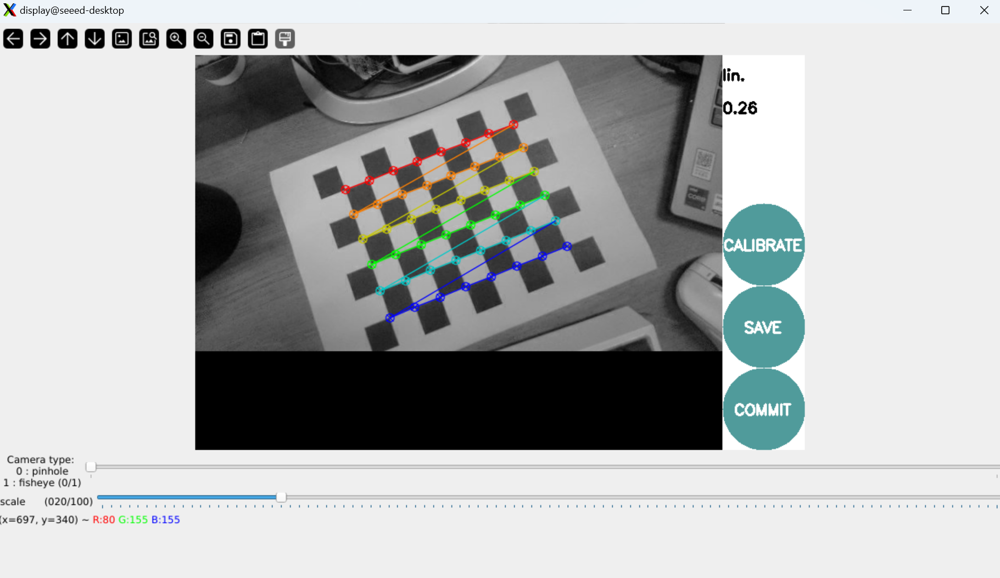

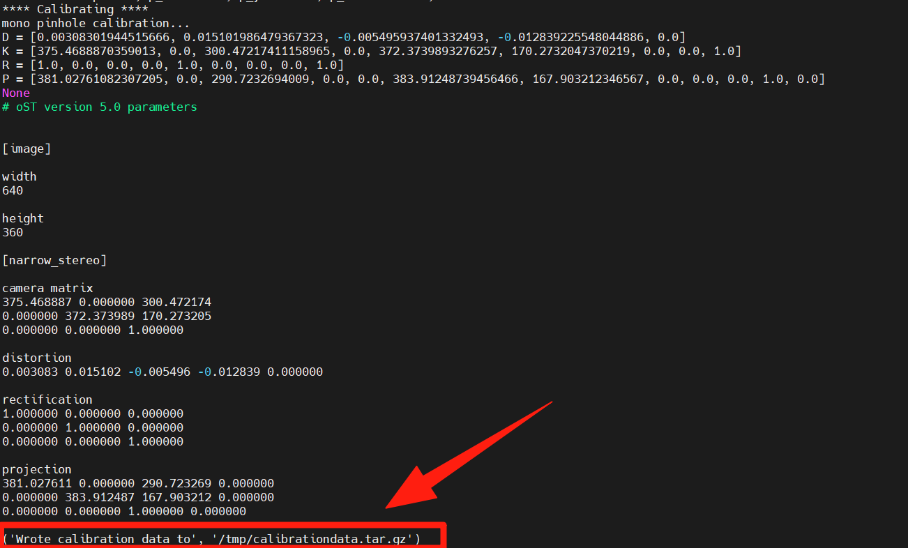

### 25.5下一步

完成相机校准学习后：

1.26 AR视觉-学习AR视觉和ArUco标记

2.24摄像头预览-深入了解相机驱动和图像处理

3.17常用命令工具-复习命令行工具

## 26 AR视觉

### 26 AR视觉(AR Vision)

### 26.1 AR视觉概述

### 26.1.1什么是AR视觉

AR (增强现实)视觉是使用ArUco标记进行位姿估计的技术。ArUco是一种二元方形标记，可以用于相机定位和姿态估计。

```
Plain Text
ArUco 标记应用：
┌─────────────────────────────────────────────────┐
│ │
│ ┌─────┐ ┌─────┐ ┌─────┐ │
│ │ ID:0│ │ ID:1│ │ ID:2│ │
│ │ │ │ │ │ │ │
│ └─────┘ └─────┘ └─────┘ │
│ │
│ 摄像头检测 ArUco 标记 → 6D 位姿估计 │
│ (位置 + 旋转) │
│
│
└─────────────────────────────────────────────────┘
```

### 26.1.2 ArUco的用途

| 用途 | 说明 |
| --- | --- |
| 机器人定位 | 室内机器人精确定位 |
| 物体抓取 | 确定目标物体的位姿 |
| AR 显示 | 在标记位置叠加虚拟内容 |
| 相机标定 | 辅助相机参数标定 |

### 26.2安装依赖

```bash
# 安装 vision_opencv
sudo apt install ros-humble-vision-opencv
# 安装 ArUco 相关包
sudo apt install ros-humble-aruco-opencv
sudo apt install ros-humble-aruco_ros
# 安装 OpenCV (带 contrib 模块)
pip3 install opencv-contrib-python
```

### 26.3运行脚本

```bash
python3 simple_AR.py
```

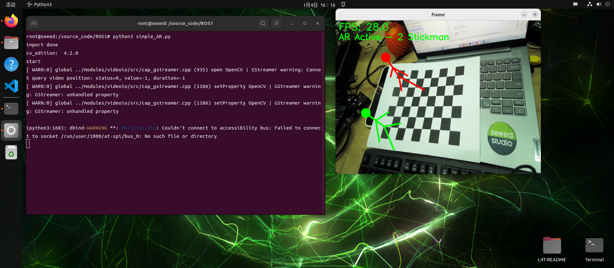

```bash
simple_AR.py 代码
# common lib
import os
import sys
import time
import cv2 as cv
import numpy as np
import yaml
print("import done")
cv_edition = cv.__version__
print("cv_edition: ",cv_edition)
def load_camera_from_ost(yaml_path: str):
with open(yaml_path, 'r') as f:
params = yaml.safe_load(f)
camera_data = params['camera_matrix']['data']
dist_data = params['distortion_coefficients']['data']
camera_matrix = np.array(camera_data, dtype=np.float32).reshape(3, 3)
dist_coeffs = np.array(dist_data, dtype=np.float32).reshape(-1, 1)
return camera_matrix, dist_coeffs
def draw_stickman(img, img_pts):
cv.line(img, tuple(img_pts[18]), tuple(img_pts[4]), (0, 0, 255), 3)
cv.line(img, tuple(img_pts[18]), tuple(img_pts[6]), (0, 0, 255), 3)
cv.line(img, tuple(img_pts[18]), tuple(img_pts[21]), (0, 0, 255), 3)
cv.line(img, tuple(img_pts[21]), tuple(img_pts[19]), (0, 0, 255), 3)
cv.line(img, tuple(img_pts[21]), tuple(img_pts[20]), (0, 0, 255), 3)
cv.line(img, tuple(img_pts[21]), tuple(img_pts[22]), (0, 0, 255), 3)
cv.circle(img, tuple(img_pts[22]), 15, (0, 0, 255), -1)
cv.line(img, tuple(img_pts[74]), tuple(img_pts[72]), (0, 255, 0), 3)
cv.line(img, tuple(img_pts[74]), tuple(img_pts[73]), (0, 255, 0), 3)
cv.line(img, tuple(img_pts[74]), tuple(img_pts[37]), (0, 255, 0), 3)
cv.line(img, tuple(img_pts[37]), tuple(img_pts[76]), (0, 255, 0), 3)
cv.line(img, tuple(img_pts[37]), tuple(img_pts[77]), (0, 255, 0), 3)
cv.line(img, tuple(img_pts[37]), tuple(img_pts[75]), (0, 255, 0), 3)
cv.circle(img, tuple(img_pts[75]), 15, (0, 255, 0), -1)
return img
def main():
print("start")
pattern_size = (8,6)
yaml_path = os.path.join(os.path.dirname(__file__), 'sources', 'ost.yaml')
camera_matrix, dist_coeffs = load_camera_from_ost(yaml_path)
object_points = np.zeros((pattern_size[0] * pattern_size[1], 3), np.float32)
object_points[:, :2] = np.mgrid[0:pattern_size[0], 0:pattern_size[1]].T.reshape(-1, 2)
axis = np.float32([
[0, 0, -1], [0, 8, -1], [5, 8, -1], [5, 0, -1],
[1, 2, -1], [1, 6, -1], [4, 2, -1], [4, 6, -1],
[1, 0, -4], [1, 8, -4], [4, 0, -4], [4, 8, -4],
[1, 2, -4], [1, 6, -4], [4, 2, -4], [4, 6, -4],
[0, 1, -4], [3, 2, -1], [2, 2, -3], [3, 2, -3],
[1, 2, -3], [2, 2, -4], [2, 2, -5], [0, 4, -4],
[2, 3, -4], [1, 3, -4], [4, 3, -5], [4, 5, -5],
[1, 2, -3], [1, 6, -3], [5, 2, -3], [5, 6, -3],
[3, 4, -5], [0, 6, -4], [5, 6, -4], [2, 8, -4],
[3, 8, -4], [2, 6, -4], [2, 0, -4], [1, 5, -4],
[3, 0, -4], [3, 2, -4], [0, 3, -4], [1, 2, -4],
[4, 2, -4], [5, 3, -4], [2, 7, -4], [3, 7, -4],
[3, 3, -1], [3, 5, -1], [1, 5, -1], [1, 3, -1],
[3, 3, -3], [3, 5, -3], [1, 5, -3], [1, 3, -3],
[1, 3, -6], [1, 5, -6], [3, 3, -4], [3, 5, -4],
[0, 0, -4], [3, 1, -4], [1, 1, -4], [0, 2, -4],
[2, 4, -4], [4, 4, -4], [0, 8, -4], [5, 8, -4],
[5, 0, -4], [0, 4, -5], [5, 4, -4], [5, 4, -5],
[2, 5, -1], [2, 7, -1], [2, 6, -3], [2, 6, -5],
[2, 5, -3], [2, 7, -3]
])
capture = cv.VideoCapture(0)
if cv_edition[0] == '3':
capture.set(cv.CAP_PROP_FOURCC, cv.VideoWriter_fourcc(*'XVID'))
else:
capture.set(cv.CAP_PROP_FOURCC, cv.VideoWriter.fourcc('M', 'J', 'P', 'G'))
capture.set(6, cv.VideoWriter_fourcc('M', 'J', 'P', 'G'))
capture.set(cv.CAP_PROP_FRAME_WIDTH, 640)
capture.set(cv.CAP_PROP_FRAME_HEIGHT, 480)
last_time = time.time()
fps = 0.0
while True:
ret, frame = capture.read()
if not ret:
break
now = time.time()
fps = 1.0 / max(1e-6, (now - last_time))
last_time = now
gray = cv.cvtColor(frame, cv.COLOR_BGR2GRAY)
retval, corners = cv.findChessboardCorners(
gray,
pattern_size,
None,
flags=cv.CALIB_CB_ADAPTIVE_THRESH + cv.CALIB_CB_NORMALIZE_IMAGE + cv.CALIB_CB_FAST_CHECK,
)
if retval:
corners = cv.cornerSubPix(
gray,
corners,
(11, 11),
(-1, -1),
(cv.TERM_CRITERIA_EPS + cv.TERM_CRITERIA_MAX_ITER, 30, 0.001),
)
retval, rvec, tvec, _inliers = cv.solvePnPRansac(
object_points,
corners,
camera_matrix,
dist_coeffs,
)
if retval:
image_points, _jacobian = cv.projectPoints(
axis,
rvec,
tvec,
camera_matrix,
dist_coeffs,
)
img_pts = np.int32(image_points).reshape(-1, 2)
frame = draw_stickman(frame, img_pts)
cv.putText(frame, "AR Active - 2 Stickman", (10, 60), cv.FONT_HERSHEY_SIMPLEX, 0.9, (0, 255, 0), 2)
else:
cv.putText(frame, "Pose estimation failed", (10, 60), cv.FONT_HERSHEY_SIMPLEX, 0.9, (0, 0, 255), 2)
else:
cv.putText(frame, "No chessboard detected", (10, 60), cv.FONT_HERSHEY_SIMPLEX, 0.9, (0, 0, 255), 2)
cv.putText(frame, f"FPS: {fps:.1f}", (10, 30), cv.FONT_HERSHEY_SIMPLEX, 1, (0, 255, 0), 2)
cv.imshow('frame', frame)
action = cv.waitKey(1) & 0xFF
if action == ord('q') or action == 113:
break
capture.release()
cv.destroyAllWindows()
if __name__ == "__main__":
main()
```

### 26.4下一步

恭喜！您已完成所有26篇ROS 2 Humble课程的学习。

#### 继续学习建议：

#### 回顾系列：

| 章节 | 内容 |
| --- | --- |
| 01 ROS2 简介 | 基础概念 |
| 02 安装 Humble | 环境搭建 |
| 06 节点 | 节点编程 |
| 07 话题通讯 | 通信机制 |
| 22 URDF 模型 | 机器人建模 |
