# Practical Applications of the Jetson Platform

## Chapter X Nvidia Isaac ROS

This chapter brings together practical Isaac ROS workflows on Jetson, including environment setup, depth perception, segmentation, detection, pose estimation, 3D mapping, and visual SLAM.

## Contents

- 01 Environment Setup
- 02 Depth Segmentation
- 03 DNN Stereo Depth
- 04 Free Space Segmentation
- 05 Image Rectification
- 06 Image Segmentation
- 07 3D Scene Reconstruction and Mapping
- 08 Object Detection
- 09 3D Pose Estimation
- 10 Visual SLAM
- Appendix: Running A-LOAM 3D SLAM on Jetson

### 01 Environmental construction

## Isaac ROS Environment

> Note: The SEED component is equipped with an environment that does not need to be built on its own.

You can run the following instructions on jetson to see if the system presets Isaac ROS:

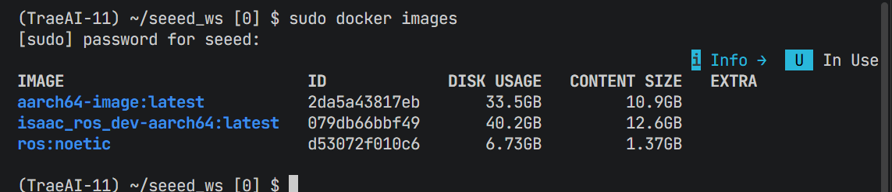

```bash

sudo docker images
```

## Isaac ROS Environmental Profile

Isaac ROS packages were developed and published by NVIDIA to develop standard robotic applications using NVIDIA Jetson and the NVIDIA acceleration on independent GPU.

Isaac ROS uses a standard ROS interface for input and output, and is therefore very easy to handle as a direct alternative to CPU ROS, which robot developers are familiar with.

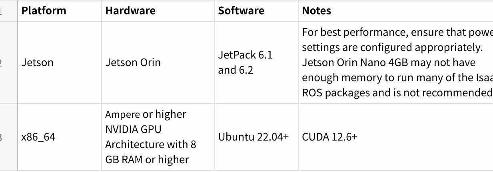

#### System requirements

Click on a picture to view the complete spreadsheet

## Matchable ROS version

All Isaac ROS packages have been designed and tested and are compatible with ROS 2 Humble.

If the use is constructed by ROS 1 Noetic, the Isaac ROS NITROS Bridge integration package can be used to obtain faster performance. (This section currently refers to ROS2 only)

The Isaac ROS package was tested only for ROS 2 Humble. Other ROS 2 versions are not yet supported.

> Note: The installation failure is normal, the installation of the environment requires a hung agent before it can be installed properly, and the method of hanging agent requires a search on the Internet.

## Quick Install

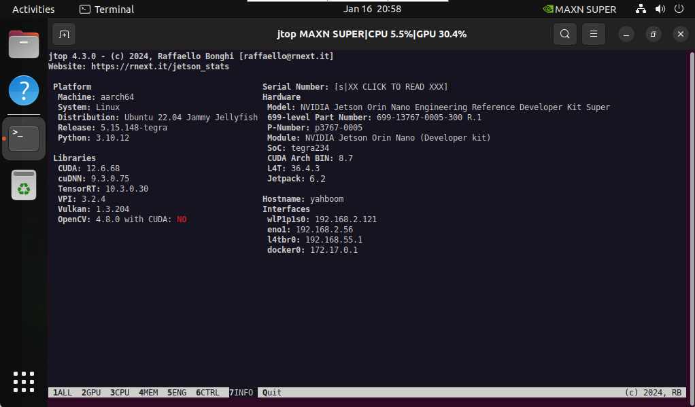

1. Confirm that your system has installed a jiertpack 6.2 system and adjusted the system power to MAXN SUPER mode

2. Installation base docker

> Installation of docker and usage to recall: 13 Install Docker and basic usage

Add Docker's official GPG key:

```bash

sudo apt-get update
sudo apt-get install ca-certificates curl gnupg
sudo install -m 0755 -d /etc/apt/keyrings
curl -fsSL https://download.docker.com/linux/ubuntu/gpg | sudo gpg --dearmor -o /etc/apt/keyrings/docker.gpg
sudo chmod a+r /etc/apt/keyrings/docker.gpg
```

Add the potential to Apt sources:

```bash

echo \
"deb [arch="$(dpkg --print-architecture)" signed-by=/etc/apt/keyrings/docker.gpg] https://download.docker.com/linux/ubuntu \
"$(. /etc/os-release && echo "$VERSION_CODENAME")" stable" | \
sudo tee /etc/apt/sources.list.d/docker.list > /dev/null
sudo apt-get update

sudo apt install docker-buildx-plugin
```

3. Add docker user group

```bash

sudo usermod -aG docker $USER
newgrp docker
```

And then Addison public APT repositiry

```
SQL

sudo apt-get update
sudo apt-get install software-properties-common
sudo apt-key adv --fetch-key https://repo.download.nvidia.com/jetson/jetson-ota-public.asc
sudo add-apt-repository 'deb https://repo.download.nvidia.com/jetson/common r36.4 main'
sudo apt-get update
sudo apt-get install -y pva-allow-2
```

5. Setting up the development environment

Cloning isaac ros common.

```bash

cd ${ISAAC_ROS_WS}/src && \
  git clone -b release-3.2 https://github.com/NVIDIA-ISAAC-ROS/isaac_ros_common.git isaac_ros_common
```

6. Launch Docker packagings using run_dev.sh scripts:

```bash

cd ${ISAAC_ROS_WS}/src/isaac_ros_common && ./scripts/run_dev.sh
```

Waiting for the docker pull to succeed set up the environment.

> Isaac ROS's docker mirror requires authentication of the NGC of NVIDIA (NVIDIA GPU Cloud), otherwise it will not be able to pull down.

> Login required for NVIDIA NGC to view api key, using: NGC API Key (not GitHub key)

Terminal login nvcr.io login

Other Organiser

Password: Your NGC API Key

# 02 Depth Segmentation

> The docker use instructions refer to:
> 13 Install Docker and Basic Use

Isaac ROS deep split official network link: https://nvidia-isaac-ros.github.io/repositories_and_packages/isaac_ros_depth_segmentation/index.html

## Overview

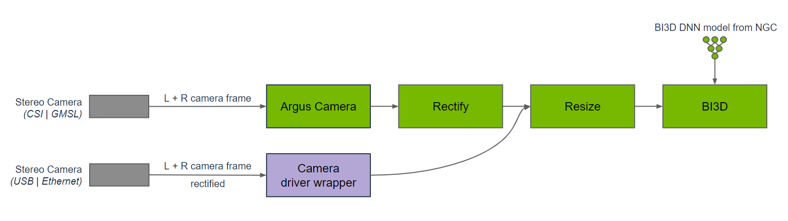

Isaac ROS Depth Segmentation provides an accelerated NVIDIA deep partition package. The isaac ros bi3d package uses an optimised Bi3D DNN model to provide a stereo Depth estimate by binaryisation and is used for depth separation. Depth partitions can be used to determine whether the barrier is located in an adjacent area and to avoid collisions with the barrier during navigation.

Bi3D is used for nodal diagrams that are deep-separated from the time synchronized input of right-and-right stereo images. Bi3D images need to be corrected and resized to fit the appropriate input resolution. The width ratio of the image needs to be maintained; Therefore, it may be necessary to trim and resize to maintain the input width ratio. The DNN code, DNN reasoning and DNN decodes are part of the Bi3D node. The reasoning is executed using TensorRT because the Bi3D DNN model is designed to optimize using TensorRT support.

Compared to other stereo visual functions, the depth segmenting predicts whether the barrier is located in an adjacent area (rather than in continuous depth) and at the same time predicts free space at a distance from the ground, which other functions usually do not provide. In addition, unlike other stereo visual functions in Isaac ROS, the depth is separated on the NVIDIA DLA (Deep Learning Accelerator), which is independent of GPU.

## Rapid experience

In order to simplify development, we mainly use Isaac ROS Dev Docker images and perform impact demonstrations on them. The demonstration does not require the installation of any camera device to simulate data streams from the camera by playing the rosebag file.

Note: If you want to be installed on your own equipment or to connect the camera to develop other features, please refer to the Isaac ROS official network to connect to the camera type specified by Yvida.

Open Terminal to Work Directory

```bash

cd ${ISAAC_ROS_WS}/src
Enter the Isaac ROS Dev Docker container
cd ${ISAAC_ROS_WS}/src/isaac_ros_common && \
./scripts/run_dev.sh
```

Run the below startup command

> Note: Taking an official example may require scientific access, ensuring that your network environment has regular access to GitHub

```bash

cd /workspaces/isaac_ros-dev/src

# Example repository (provides quickstart launches such as isaac_ros_examples.launch.py)
git clone -b release-3.2 https://github.com/NVIDIA-ISAAC-ROS/isaac_ros_examples.git

# Repository for Bi3D (Depth Segmentation / Bi3D)
git clone -b release-3.2 https://github.com/NVIDIA-ISAAC-ROS/isaac_ros_depth_segmentation.git

# Common utilities repository (run_dev, scripts, and shared dependencies/configuration)
git clone -b release-3.2 https://github.com/NVIDIA-ISAAC-ROS/isaac_ros_common.git
cd /workspaces/isaac_ros-dev

# Make sure rosdep is available (it is usually preinstalled in the dev container)
sudo apt-get update
rosdep update

# Install workspace dependencies
rosdep install --from-paths src --ignore-src -r -y

# Build
colcon build --symlink-install


ros2 launch isaac_ros_examples isaac_ros_examples.launch.py \
launch_fragments:=bi3d \
interface_specs_file:=${ISAAC_ROS_WS}/isaac_ros_assets/isaac_ros_bi3d/rosbag_quickstart_interface_specs.json \
featnet_engine_file_path:=${ISAAC_ROS_WS}/isaac_ros_assets/models/bi3d_proximity_segmentation/featnet.plan \
segnet_engine_file_path:=${ISAAC_ROS_WS}/isaac_ros_assets/models/bi3d_proximity_segmentation/segnet.plan \
max_disparity_values:=10
```

Open the second terminal and enter the container.

```bash

cd ${ISAAC_ROS_WS}/src/isaac_ros_common && \
./scripts/run_dev.sh
```

Run the following commands

```bash

ros2 bag play --loop ${ISAAC_ROS_WS}/isaac_ros_assets/isaac_ros_bi3d/bi3dnode_rosbag
```

View Run Results

Open the third terminal and enter the container.

```bash

cd ${ISAAC_ROS_WS}/src/isaac_ros_common && \
./scripts/run_dev.sh
```

Run the following commands to see the depth partition

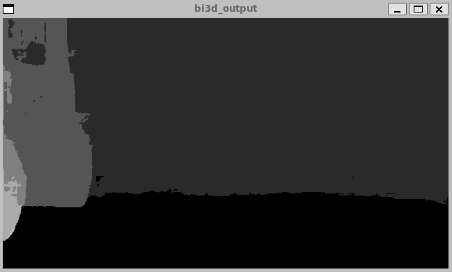

```bash

 ros2 run isaac_ros_bi3d isaac_ros_bi3d_visualizer.py --max_disparity_value 30
```

Open the fourth terminal and enter the container.

```bash

cd ${ISAAC_ROS_WS}/src/isaac_ros_common && \
./scripts/run_dev.sh
```

Run the following commands, see images

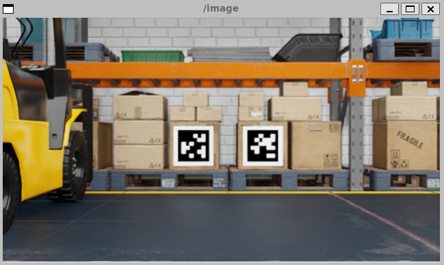

```bash

ros2 run image_view image_view --ros-args -r image:=right/image_rect
```

# 03 DNN stereo Depth

> The docker use instructions refer to:
> 13 Install Docker and Basic Use

Isaac ROS DNN Depth Network Link: https://nvidia-isaac-ros.github.io/repositories_and_packages/isaac_ros_dnn_stereo_depth/index.html

## Overview

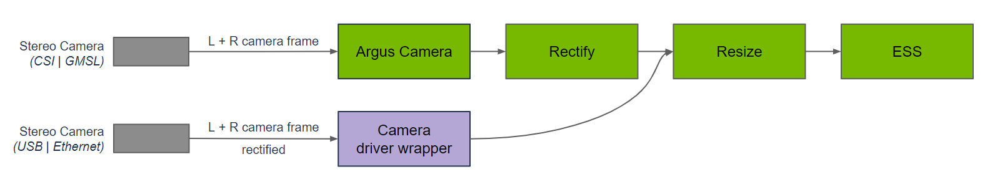

The problem of visual depth perception is common in many areas of robotics, such as estimating the attitude of the arm in an object operation, estimating the distance of static or moving targets in autonomous robotic navigation, tracking targets in delivery robots, etc. Isaac ROS DNN Stereo Decth is for two Isaac applications, Isaac Manipulator and Isaac Perceptor. In the Isaac Manipulator application, ESS is deployed as a plugin node in the Isaac ROS control package to provide a deep sense of mechanical arm movement planning and control. In this scenario, the multi-camera stereo stream of the industrial mechanical arm performing the desktop task is passed to the ESS for the corresponding depth stream. Depth currents are used to divide the relative distance of the mechanical arm from the corresponding object on the desktop; This provides a signal for collision avoidance and fine particle control. Similarly, the Isaac Perceptor application uses several Isaac ROS packages, namely Isaac ROS Nova, Isaac ROS Visual Slam, Isaac ROS Stereo Deep (ESS), Isaac ROS Nvblox and Isaac ROS Image Pipeline.

## Rapid experience

In order to simplify development, we mainly use Isaac ROS Dev Docker images and perform impact demonstrations on them. The demonstration does not require the installation of any camera device to simulate data streams from the camera by playing the rosebag file.

Note: If you want to be installed on your own equipment or to connect the camera to develop other features, please refer to the Isaac ROS official network to connect the camera with the specified model of Yveida.

Open Terminal to Work Directory

```bash

cd ${ISAAC_ROS_WS}/src
Enter the Isaac ROS Dev Docker container
cd ${ISAAC_ROS_WS}/src/isaac_ros_common && \
./scripts/run_dev.sh
```

Runs the following start-up command, of which Threshold: = 0.0 can be modified to 0.4 on start-up, with different effects.

```bash

ros2 launch isaac_ros_examples isaac_ros_examples.launch.py launch_fragments:=ess_disparity \
engine_file_path:=${ISAAC_ROS_WS:?}/isaac_ros_assets/models/dnn_stereo_disparity/dnn_stereo_disparity_v4.1.0_onnx/ess.engine \
  threshold:=0.0
```

Open the second terminal and enter the container.

```bash

cd ${ISAAC_ROS_WS}/src/isaac_ros_common && \
./scripts/run_dev.sh
```

Run the following commands

```bash

ros2 bag play -l ${ISAAC_ROS_WS}/isaac_ros_assets/isaac_ros_ess/rosbags/ess_rosbag \
  --remap /left/camera_info:=/left/camera_info_rect /right/camera_info:=/right/camera_info_rect
```

View Run Results

Open the third terminal and enter the container.

```bash

cd ${ISAAC_ROS_WS}/src/isaac_ros_common && \
./scripts/run_dev.sh
```

Run the following commands:

```bash

ros2 run isaac_ros_ess isaac_ros_ess_visualizer.py
```

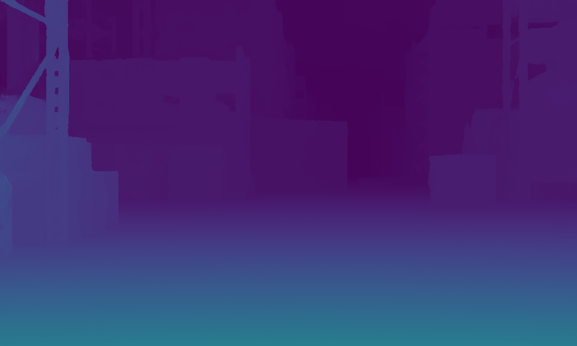

When set to 0.0, display the following results:

I don't know.

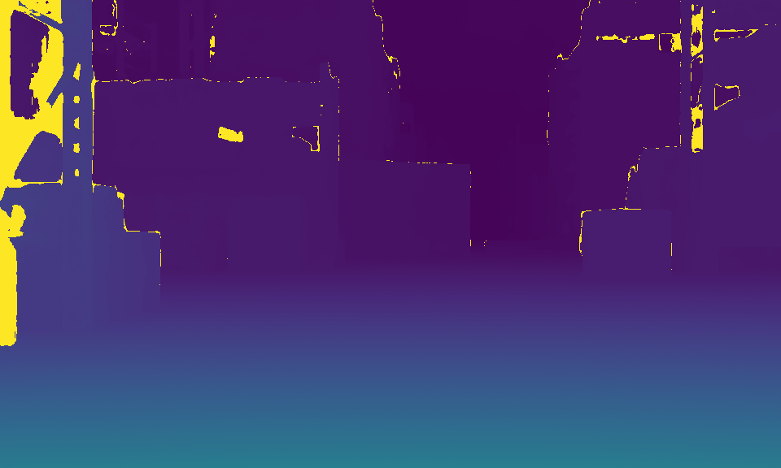

When set to 0.4, the results are shown below:

# 04 Free space segment

> The docker use instructions refer to:
> 13 Install Docker and Basic Use

Isaac ROS Free Space Division Network link: https://nvidia-isaac-ros.github.io/repositories_and_packages/isaac_ros_freespace_segmentation/index.html

## Overview

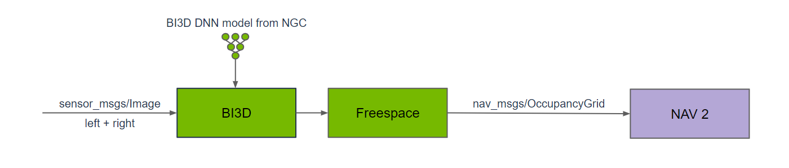

Isaac ROS free space partition contains a ROS 2 package to generate a navigational occupancy grid. Bi3D Free Space creates an occupied grid for Nav2 by handling free space masks containing robotics relative to the surface to avoid barriers in navigation. The package is accelerated by GPU and provides real-time, low-delayed results in robotic applications. Bi3D Free Space provides an additional occupancy grid source for mobile robots (ground robots).

## Rapid experience

In order to simplify development, we mainly use Isaac ROS Dev Docker images and perform impact demonstrations on them. The demonstration does not require the installation of any camera device to simulate data streams from the camera by playing the rosebag file.

Note: If you want to be installed on your own equipment or to connect the camera to develop other features, please refer to the Isaac ROS official network to connect the camera with the specified model of Yveida.

Open the terminal to work directory, Isaac ROS Dev Dock container

```bash

cd ${ISAAC_ROS_WS}/src

cd ${ISAAC_ROS_WS}/src/isaac_ros_common && \
./scripts/run_dev.sh
```

Run the command below.

```bash

ros2 launch isaac_ros_examples isaac_ros_examples.launch.py \
launch_fragments:=bi3d,bi3d_freespace \
interface_specs_file:=${ISAAC_ROS_WS}/isaac_ros_assets/isaac_ros_bi3d_freespace/rosbag_quickstart_interface_specs.json \
featnet_engine_file_path:=${ISAAC_ROS_WS}/isaac_ros_assets/models/bi3d_proximity_segmentation/featnet.plan \
segnet_engine_file_path:=${ISAAC_ROS_WS}/isaac_ros_assets/models/bi3d_proximity_segmentation/segnet.plan \
max_disparity_values:=10
```

Open the second terminal and enter the container.

```bash

cd ${ISAAC_ROS_WS}/src/isaac_ros_common && \
./scripts/run_dev.sh
```

Run the following commands

```bash

ros2 bag play -l ${ISAAC_ROS_WS}/isaac_ros_assets/isaac_ros_bi3d_freespace/quickstart.bag
```

View Run Results

Open the third terminal and enter the container.

```bash

cd ${ISAAC_ROS_WS}/src/isaac_ros_common && \
./scripts/run_dev.sh
```

Run the following commands and see the results

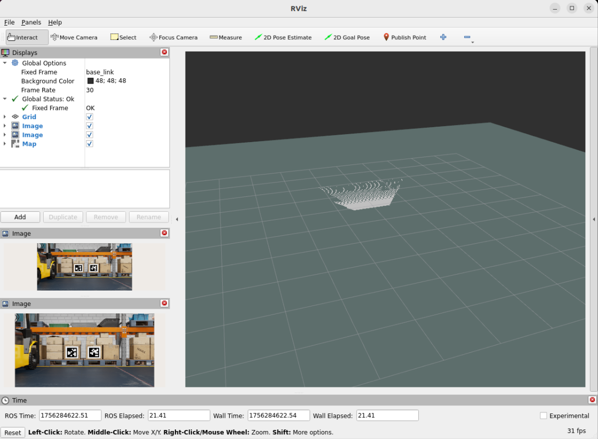

```bash

rviz2
```

# 05 Image malformation processing

> The docker use instructions refer to:
> 13 Install Docker and Basic Use

Isaac ROS image malformation processing: https://nvidia-isaac-ros.github.io/repositories_and_packages/isaac_ros_image_pipeline/index.html

## Overview

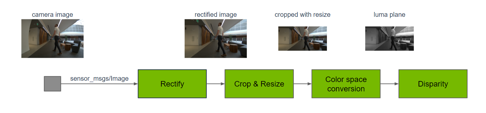

Isaac ROS image malformation processing uses the Isaac ROS image conduit, a package for image processing functions. Camera output usually requires pre-processing to meet input requirements for a variety of sensor functions. This includes tailoring, resizeing, mirroring, correcting lens malformations and colour space conversion. For stereo cameras, additional processing is required to generate a visual difference between the left and right image and the light cloud, thereby achieving a deep perception.

## Rapid experience

In order to simplify development, we mainly use Isaac ROS Dev Docker images and perform impact demonstrations on them. The demonstration does not require the installation of any camera device to simulate data streams from the camera by playing the rosebag file.

Note: If you want to be installed on your own equipment or to connect the camera to develop other features, please refer to the Isaac ROS official network to connect the camera with the specified model of Yveida.

Resize:

Open the terminal to work directory, Isaac ROS Dev Dock container

```bash

cd ${ISAAC_ROS_WS}/src

cd ${ISAAC_ROS_WS}/src/isaac_ros_common && \
./scripts/run_dev.sh
```

Run the below startup command

```bash

ros2 launch isaac_ros_examples isaac_ros_examples.launch.py launch_fragments:=resize
```

Open the second terminal and enter the container.

```bash

cd ${ISAAC_ROS_WS}/src/isaac_ros_common && \
./scripts/run_dev.sh
```

Run the following commands

```bash

ros2 bag play --loop ${ISAAC_ROS_WS}/isaac_ros_assets/isaac_ros_image_proc/quickstart --remap /hawk_0_left_rgb_image:=/image_raw /hawk_0_left_rgb_camera_info:=/camera_info
```

View Run Results

Open the third terminal and enter the container.

```bash

cd ${ISAAC_ROS_WS}/src/isaac_ros_common && \
./scripts/run_dev.sh
```

Run the following commands

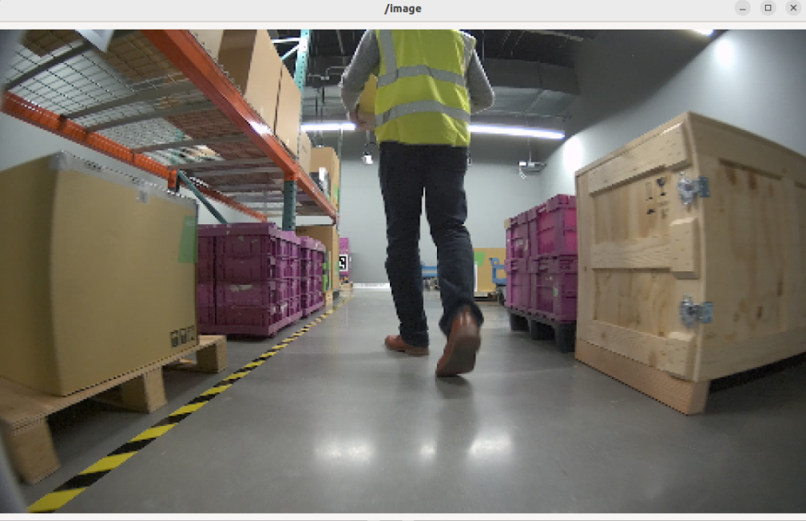

```bash

ros2 run image_view image_view --ros-args --remap image:=resize/image
```

## Color Congress:

Open Terminal to Work Directory

Note: If the container has been opened and other commands have been operated, then start the command after the first terminal enter exit exit from all docker containers.

Open the terminal to work directory and enter Isaac ROS Dev Dock container

```bash

cd ${ISAAC_ROS_WS}/src

cd ${ISAAC_ROS_WS}/src/isaac_ros_common && \
./scripts/run_dev.sh
```

Run the following start-up command:

```bash

ros2 launch isaac_ros_examples isaac_ros_examples.launch.py launch_fragments:=color_conversion interface_specs_file:=${ISAAC_ROS_WS}/isaac_ros_assets/isaac_ros_image_proc/quickstart_interface_specs.json
```

Open the second terminal and enter the container.

```bash

cd ${ISAAC_ROS_WS}/src/isaac_ros_common && \
./scripts/run_dev.sh
```

Run the following commands:

```bash

ros2 bag play --loop ${ISAAC_ROS_WS}/isaac_ros_assets/isaac_ros_image_proc/quickstart --remap /hawk_0_left_rgb_image:=/image_raw /hawk_0_left_rgb_camera_info:=/camera_info
```

View Run Results

Open the third terminal and enter the container.

```bash

cd ${ISAAC_ROS_WS}/src/isaac_ros_common && \
./scripts/run_dev.sh
```

Run the following commands

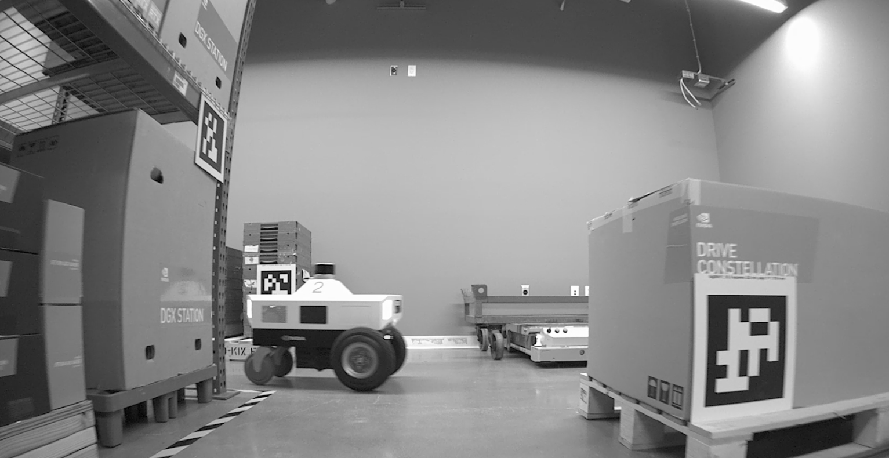

```bash

ros2 run image_view image_view --ros-args --remap image:=image_mono
```

## Crop:

Open the terminal to work directory and enter Isaac ROS Dev Dock container

```bash

cd ${ISAAC_ROS_WS}/src

cd ${ISAAC_ROS_WS}/src/isaac_ros_common && \
./scripts/run_dev.sh
```

Run the below startup command

```bash

ros2 launch isaac_ros_examples isaac_ros_examples.launch.py launch_fragments:=crop interface_specs_file:=${ISAAC_ROS_WS}/isaac_ros_assets/isaac_ros_image_proc/quickstart_interface_specs.json
```

Open the second terminal and enter the container.

```bash

cd ${ISAAC_ROS_WS}/src/isaac_ros_common && \
./scripts/run_dev.sh
```

Run the following commands

```bash

ros2 bag play --loop ${ISAAC_ROS_WS}/isaac_ros_assets/isaac_ros_image_proc/quickstart --remap /hawk_0_left_rgb_image:=/image_raw /hawk_0_left_rgb_camera_info:=/camera_info
```

View Run Results

Open the third terminal and enter the container.

```bash

cd ${ISAAC_ROS_WS}/src/isaac_ros_common && \
./scripts/run_dev.sh
```

Run the following commands

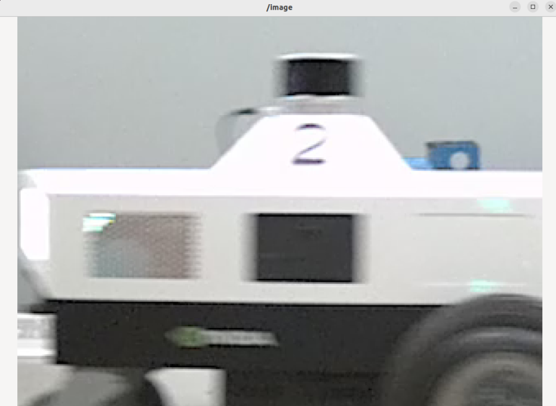

```bash

ros2 run image_view image_view --ros-args --remap image:=crop/image
```

## Recify:

Open the terminal into the work directory and enter Isaac ROS Dev Dock container

```bash

cd ${ISAAC_ROS_WS}/src

cd ${ISAAC_ROS_WS}/src/isaac_ros_common && \
./scripts/run_dev.sh
```

Run the below startup command

```bash

ros2 launch isaac_ros_examples isaac_ros_examples.launch.py launch_fragments:=rectify_mono interface_specs_file:=${ISAAC_ROS_WS}/isaac_ros_assets/isaac_ros_image_proc/quickstart_interface_specs.json
```

Open the second terminal and enter the container.

```bash

cd ${ISAAC_ROS_WS}/src/isaac_ros_common && \
./scripts/run_dev.sh
```

Run the following commands

```bash

ros2 bag play --loop ${ISAAC_ROS_WS}/isaac_ros_assets/isaac_ros_image_proc/quickstart --remap /hawk_0_left_rgb_image:=/image_raw /hawk_0_left_rgb_camera_info:=/camera_info
```

View Run Results

Open the third terminal and enter the container.

```bash

cd ${ISAAC_ROS_WS}/src/isaac_ros_common && \
./scripts/run_dev.sh
```

Run the following commands

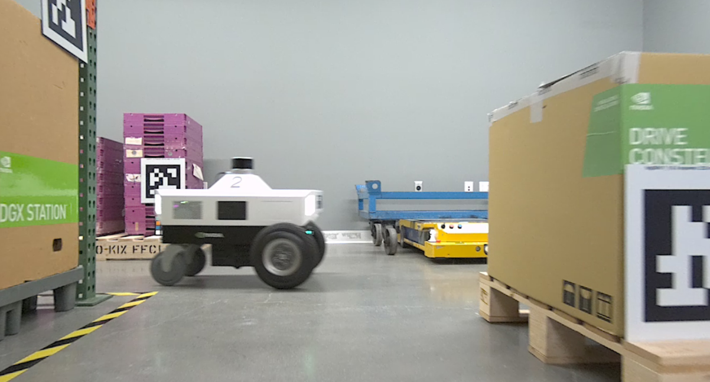

```bash

ros2 run image_view image_view --ros-args --remap image:=image_rect
```

## Flip:

Open the terminal into the work directory and enter Isaac ROS Dev Dock container

```bash

cd ${ISAAC_ROS_WS}/src

cd ${ISAAC_ROS_WS}/src/isaac_ros_common && \
./scripts/run_dev.sh
```

Run the below startup command

```bash

ros2 launch isaac_ros_examples isaac_ros_examples.launch.py launch_fragments:=flip
```

Open the second terminal and enter the container.

```bash

cd ${ISAAC_ROS_WS}/src/isaac_ros_common && \
./scripts/run_dev.sh
```

Run the following commands

```bash

ros2 bag play --loop ${ISAAC_ROS_WS}/isaac_ros_assets/isaac_ros_image_proc/quickstart --remap /hawk_0_left_rgb_image:=/image_raw /hawk_0_left_rgb_camera_info:=/camera_info
```

View Run Results

Open the third terminal and enter the container.

```bash

cd ${ISAAC_ROS_WS}/src/isaac_ros_common && \
./scripts/run_dev.sh
```

Run the following commands

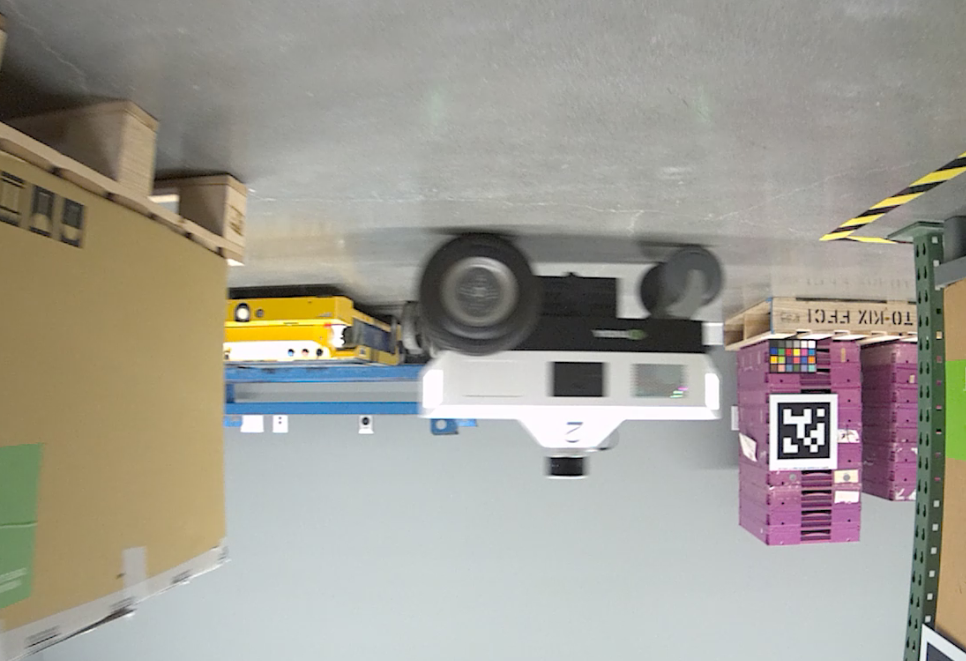

```bash

ros2 run image_view image_view --ros-args --remap image:=image_flipped
```

# 06 Image Segmentation

> The docker use instructions refer to:
> 13 Install Docker and Basic Use

Isaac ROS image split official web link: https://nvidia-isaac-ros.github.io/repositories_and_packages/isaac_ros_image_segmentation/index.html

## Overview

Isaac ROS image partition contains a ROS package for semantic image partition.

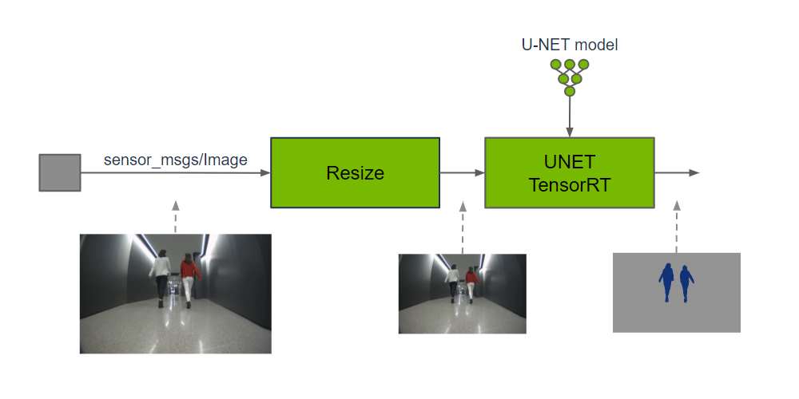

These packages provide a pixel-level classification of input images by running GPU acceleration reasoning on the DNN model. Each pixel that enters an image is projected to fall into a defined group of categories. The sensor function can use output predictions to understand the spatial position of each category in a two-dimensional image or to integrate it with the corresponding depth position in a three-dimensional scene.

## Rapid experience

In order to simplify development, we mainly use Isaac ROS Dev Docker images and perform impact demonstrations on them. The demonstration does not require the installation of any camera device to simulate data streams from the camera by playing the rosebag file.

Note: If you want to be installed on your own equipment or to connect the camera to develop other features, please refer to the Isaac ROS official network to connect to the camera type specified by Yvida.

Open the terminal into the work directory and enter Isaac ROS Dev Dock container

```bash

cd ${ISAAC_ROS_WS}/src

cd ${ISAAC_ROS_WS}/src/isaac_ros_common && \
./scripts/run_dev.sh
```

Run the below startup command

```bash

ros2 launch isaac_ros_examples isaac_ros_examples.launch.py launch_fragments:=segformer interface_specs_file:=${ISAAC_ROS_WS}/isaac_ros_assets/isaac_ros_segformer/quickstart_interface_specs.json model_name:=peoplesemsegformer model_repository_paths:=[${ISAAC_ROS_WS}/isaac_ros_assets/models]
```

Open the second terminal and enter the container.

```bash

cd ${ISAAC_ROS_WS}/src/isaac_ros_common && \
./scripts/run_dev.sh
```

Run the following commands

```bash

ros2 bag play -l isaac_ros_assets/isaac_ros_segformer/segformer_sample_data
```

View Run Results

Open the third terminal and enter the container.

```bash

cd ${ISAAC_ROS_WS}/src/isaac_ros_common && \
./scripts/run_dev.sh
```

Run the following commands and see the results

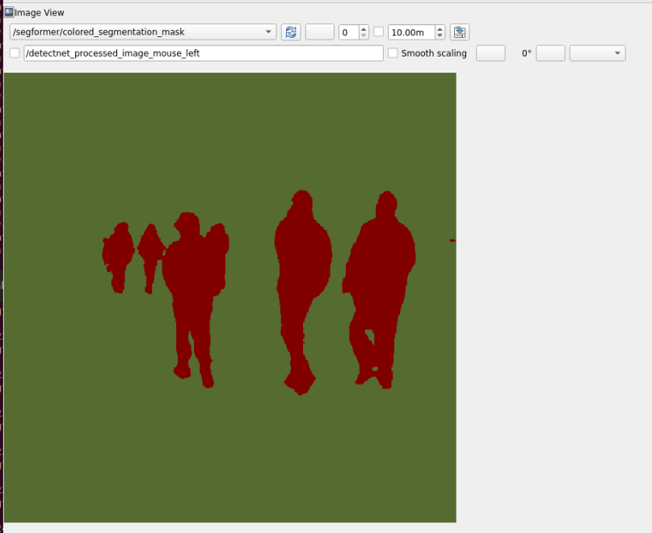

```bash

ros2 run rqt_image_view rqt_image_view /segformer/colored_segmentation_mask
```

# 07 3D scene reconstruction and mapping

> The docker use instructions refer to:
> 13 Install Docker and Basic Use

Isaac ROS 3D scene reconstruction and map network link: https://nvidia-isaac-ros.github.io/repositories_and_packages/isaac_ros_nvblox/index.html

## Overview

Isaac ROS Nvblox contains a 3D reconstruction and cost map for navigation. isaac ros nvblox handles depth and attitude data, reconstructs 3D scenes in real time and outputs 2D cost maps for Nav2. Cost maps are used for navigation planning as a visual-based solution to circumvent barriers.

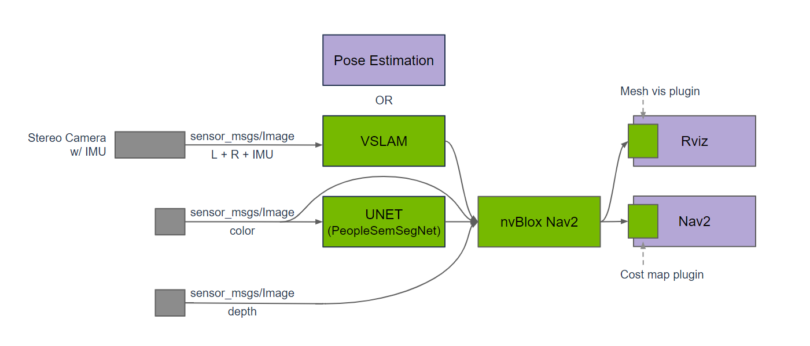

Isaac ros nvblox is designed for use in conjunction with depth cameras and/or 3D laser radars. The package is accelerated using GPU, using the C++ library nvblox independent of the bottom frame to calculate the 3D reconstruction and 2D cost maps.

## Rapid experience

In order to simplify development, we mainly use Isaac ROS Dev Docker images and perform impact demonstrations on them. The demonstration does not require the installation of any camera device to simulate data streams from the camera by playing the rosebag file.

Note: If you want to be installed on your own equipment or to connect the camera to develop other features, please refer to the Isaac ROS official network to connect to the camera type specified by Yvida.

Open the terminal into the work directory and enter Isaac ROS Dev Dock container

```bash

cd ${ISAAC_ROS_WS}/src

cd ${ISAAC_ROS_WS}/src/isaac_ros_common && \
./scripts/run_dev.sh
```

Run the below startup command

```bash

ros2 launch nvblox_examples_bringup isaac_sim_example.launch.py \
rosbag:=${ISAAC_ROS_WS}/isaac_ros_assets/isaac_ros_nvblox/quickstart \
navigation:=False
```

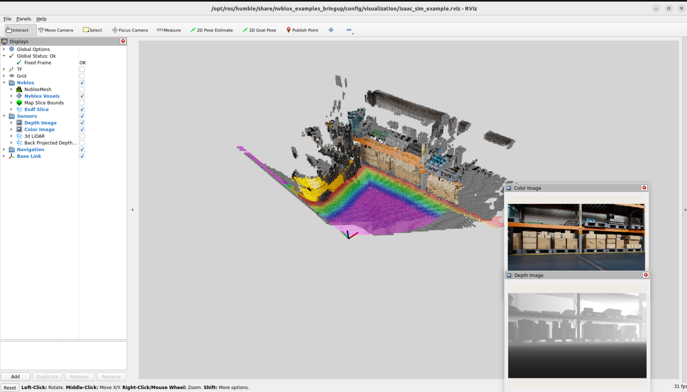

Run Results

# 08 Object Detection

> The docker use instructions refer to:
> 13 Install Docker and Basic Use

Isaac ROS Object Checker Network Link: https://nvidia-isaac-ros.github.io/repositories_and_packages/isaac_ros_object_detection/index.html

## Overview

Isaac ROS object detection includes software packages in ROS 2 to perform object detection. Isaac ros rtdetr, Isaac ros dectnet and isaac ros yolov8, respectively, provide a method for spatial classification of input images using boundary frames. The classification is implemented by the GPU acceleration model of the corresponding structure:

isac ros rtdetr: RT-DTR model

isac ros dectnet:DetectNet model

isac ros yolov8:YOLOv8 model

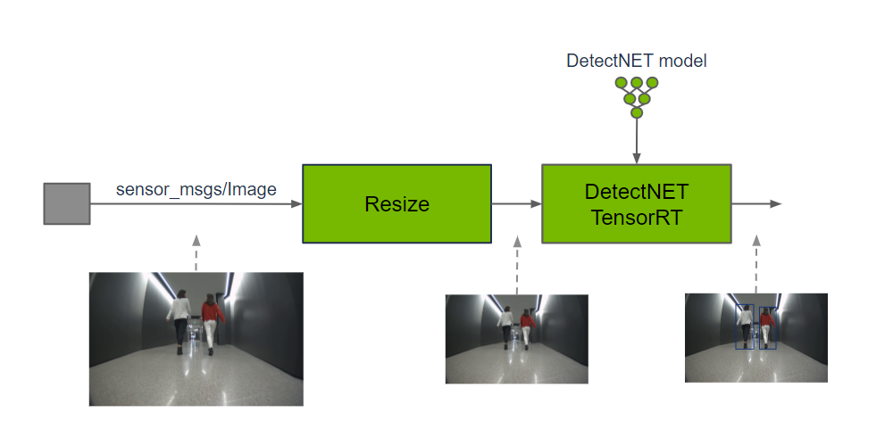

Output predictions can be used to understand the existence of objects in images and their spatial location.

## Rapid experience

In order to simplify development, we mainly use Isaac ROS Dev Docker images and perform impact demonstrations on them. The demonstration does not require the installation of any camera device to simulate data streams from the camera by playing the rosebag file.

Note: If you want to be installed on your own equipment or to connect the camera to develop other features, please refer to the Isaac ROS official network to connect to the camera type specified by Yvida.

Open the terminal into the work directory and enter Isaac ROS Dev Dock container

```bash

cd ${ISAAC_ROS_WS}/src

cd ${ISAAC_ROS_WS}/src/isaac_ros_common && \
./scripts/run_dev.sh
```

Run the below startup command

```bash

ros2 launch isaac_ros_examples isaac_ros_examples.launch.py launch_fragments:=detectnet interface_specs_file:=${ISAAC_ROS_WS}/isaac_ros_assets/isaac_ros_detectnet/quickstart_interface_specs.json
```

Open the second terminal and enter the container.

```bash

cd ${ISAAC_ROS_WS}/src/isaac_ros_common && \
./scripts/run_dev.sh
```

Run the following commands

```bash

ros2 bag play -l ${ISAAC_ROS_WS}/isaac_ros_assets/isaac_ros_detectnet/rosbags/detectnet_rosbag --remap image:=image_rect camera_info:=camera_info_rect
```

View Run Results

Open the third terminal and enter the container.

```bash

cd ${ISAAC_ROS_WS}/src/isaac_ros_common && \
./scripts/run_dev.sh
```

Run the following commands

```bash

ros2 run isaac_ros_detectnet isaac_ros_detectnet_visualizer.py --ros-args --remap image:=detectnet_encoder/resize/image
```

Open the fourth terminal and enter the container.

```bash

cd ${ISAAC_ROS_WS}/src/isaac_ros_common && \
./scripts/run_dev.sh
```

Run the following commands and see the results

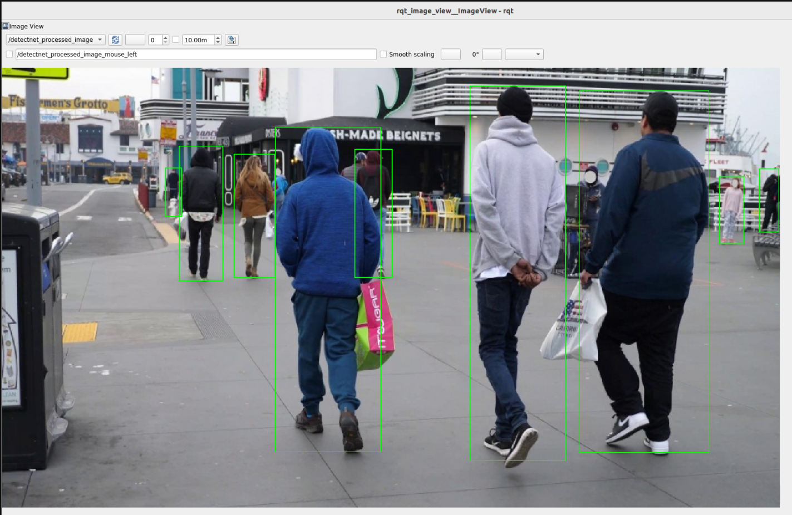

```bash

ros2 run rqt_image_view rqt_image_view /detectnet_processed_image
```

# 09 3D Pose Estimation

> The docker use instructions refer to:
> 13 Install Docker and Basic Use

Isaac ROS 3D attitude estimation official network link: https://nvidia-isaac-ros.github.io/repositories_and_packages/isaac_ros_pose_estimation/isaac_ros_centerpose/index.html

## Overview

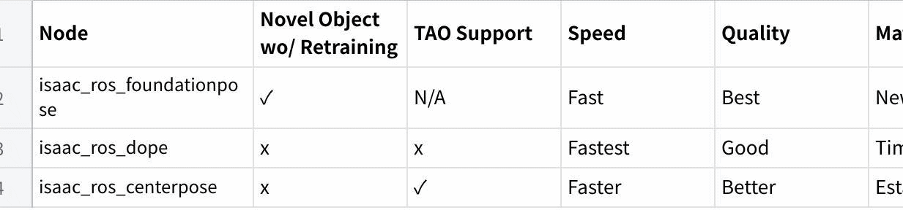

Isaac ROS Posture is estimated to contain three ROS 2 packages for predicting the object's attitude. Please refer to the table below to understand their differences:

Click on a picture to view the complete spreadsheet

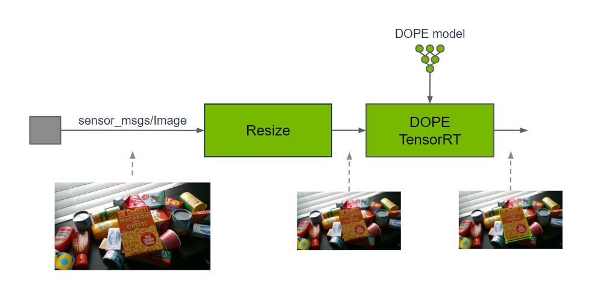

These packages use GPU to accelerate DNN reasoning to estimate the object's attitude. The sensor function can use output predictions to integrate with the corresponding depth, thus providing the 3D attitude and distance of the object for navigation or operation.

## Rapid experience

In order to simplify development, we mainly use Isaac ROS Dev Docker images and perform impact demonstrations on them. The demonstration does not require the installation of any camera device to simulate data streams from the camera by playing the rosebag file.

Note: If you want to be installed on your own equipment or to connect the camera to develop other features, please refer to the Isaac ROS official network to connect to the camera type specified by Yvida.

Open the terminal into the work directory and enter Isaac ROS Dev Dock container

```bash

cd ${ISAAC_ROS_WS}/src

cd ${ISAAC_ROS_WS}/src/isaac_ros_common && \
./scripts/run_dev.sh
```

Run the below startup command

```bash

ros2 launch isaac_ros_examples isaac_ros_examples.launch.py launch_fragments:=centerpose,centerpose_visualizer interface_specs_file:=${ISAAC_ROS_WS}/isaac_ros_assets/isaac_ros_centerpose/quickstart_interface_specs.json model_name:=centerpose_shoe model_repository_paths:=[${ISAAC_ROS_WS}/isaac_ros_assets/models]
```

Open the second terminal and enter the container.

```bash

cd ${ISAAC_ROS_WS}/src/isaac_ros_common && \
./scripts/run_dev.sh
```

Run the following commands

```bash

ros2 bag play -l ${ISAAC_ROS_WS}/isaac_ros_assets/isaac_ros_centerpose/quickstart.bag
```

View Run Results

Open the third terminal and enter the container.

```bash

cd ${ISAAC_ROS_WS}/src/isaac_ros_common && \
./scripts/run_dev.sh
```

Run the following commands and see the results

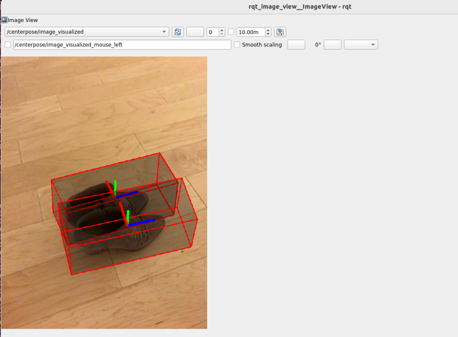

```bash

ros2 run rqt_image_view rqt_image_view /centerpose/image_visualized
```

# 10 Visual SLAM

> The docker use instructions refer to:
> 13 Install Docker and Basic Use

Isaac ROS Visual SLAM Network Link: https://nvidia-isaac-ros.github.io/repositories_and_packages/isaac_ros_visual_slam/index.html

## Overview

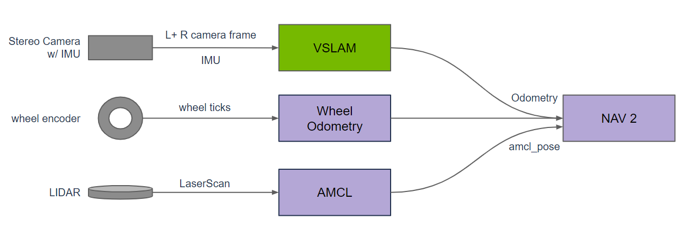

Isaac ROS Vision SLAM provides a high-performance, first-class ROS 2 software package for VSLAM. The package uses one or more stereo cameras and optional IMUs to estimate the mileage and uses it as a navigation input. It uses GPU acceleration to provide real-time, low-delayed results in robotic applications. VSLAM provides an additional mileage source for mobile robots (ground) and can serve as the main mileage source for drones.

## Rapid experience

In order to simplify development, we mainly use Isaac ROS Dev Docker images and perform impact demonstrations on them. The demonstration does not require the installation of any camera device to simulate data streams from the camera by playing the rosebag file.

Note: If you want to be installed on your own equipment or to connect the camera to develop other features, please refer to the Isaac ROS official network to connect to the camera type specified by Yvida.

Open the terminal into the work directory and enter Isaac ROS Dev Dock container

```bash

cd ${ISAAC_ROS_WS}/src

cd ${ISAAC_ROS_WS}/src/isaac_ros_common && \
./scripts/run_dev.sh
```

Run the below startup command

```bash

rviz2 -d $(ros2 pkg prefix isaac_ros_visual_slam --share)/rviz/default.cfg.rviz
```

Open the second terminal and enter the container.

```bash

cd ${ISAAC_ROS_WS}/src/isaac_ros_common && \
./scripts/run_dev.sh
```

Run the following commands

```bash

ros2 launch isaac_ros_examples isaac_ros_examples.launch.py launch_fragments:=visual_slam \
interface_specs_file:=${ISAAC_ROS_WS}/isaac_ros_assets/isaac_ros_visual_slam/quickstart_interface_specs.json \
rectified_images:=false
```

View Run Results

Open the third terminal and enter the container.

```bash

cd ${ISAAC_ROS_WS}/src/isaac_ros_common && \
./scripts/run_dev.sh
```

Runs the following command, as shown in rviz2. If no image appears, you can run this command again.

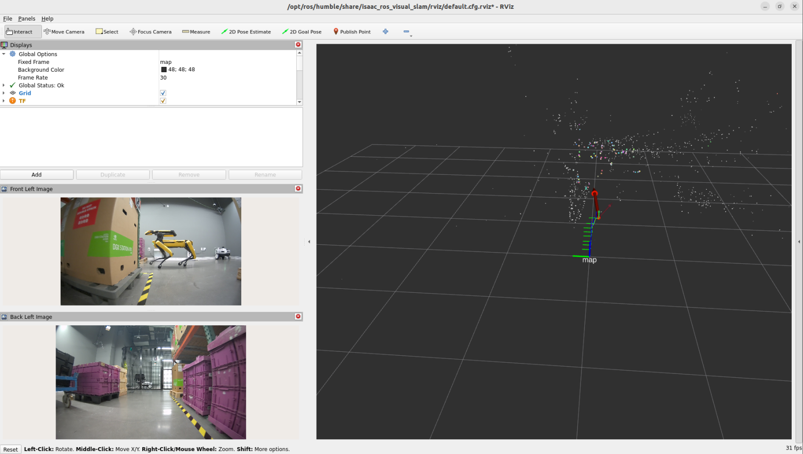

```bash

ros2 bag play ${ISAAC_ROS_WS}/isaac_ros_assets/isaac_ros_visual_slam/quickstart_bag --remap  \
/front_stereo_camera/left/image_raw:=/left/image_rect \
/front_stereo_camera/left/camera_info:=/left/camera_info_rect \
/front_stereo_camera/right/image_raw:=/right/image_rect \
/front_stereo_camera/right/camera_info:=/right/camera_info_rect \
/back_stereo_camera/left/image_raw:=/rear_left/image_rect \
/back_stereo_camera/left/camera_info:=/rear_left/camera_info_rect \
/back_stereo_camera/right/image_raw:=/rear_right/image_rect \
/back_stereo_camera/right/camera_info:=/rear_right/camera_info_rect
```

### 01 How to Run A-LOAM 3D SLAM on Jetson

## A-LOAM Profile

A-LOAM is advanced by the original LOAM algorithms proposed by J. Zhang and S. Singh. The main features of A-LOAM include:

Real-time laser radar mileage and construction maps.

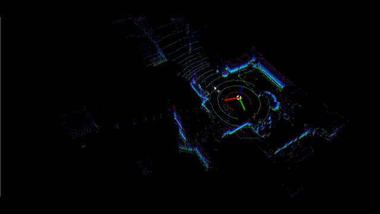

Simplify the code structure using Eigen and Céres Solver.

High performance and robustness in many environments.

A-LOAM can be used for various applications such as autopilot, robotics and 3D construction maps.

This document provides detailed steps to set and run the A-LOAM (Advanced LOAM) algorithm using the RoboSense RS32 LiDAR sensor on the reComputer Jetson series. A-LOAM is an advanced achievement for LOAM, using Eigen and Céres Solver to achieve efficient real-time mapping and positioning.

### Precondition

Nvidia Jetson Orin Nano Super Kit

RoboSense RS32 Lidar

> The following is only tested on Ubuntu 20.04 and ROS Noetic. Please refer to 8.01.01 ROS1 Profile to complete the ROS environment settings.

> Please refer to the SDK where RoboSense RS32 Lidar is installed.

## Start Use

### Environment Settings

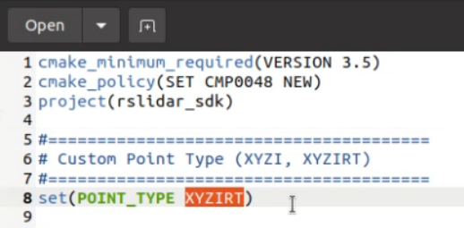

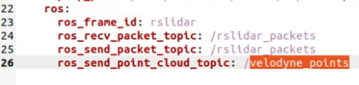

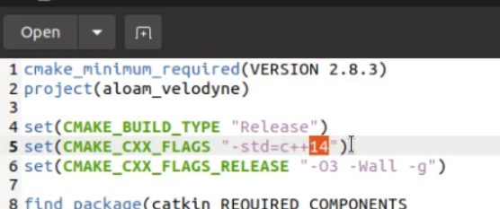

Implement the following steps in the Jetson terminal.

Step 1: Install gflags, google-glog, suitesparse and cxsparse3.

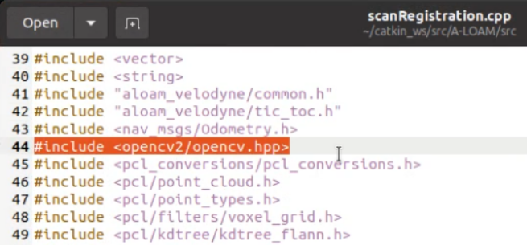

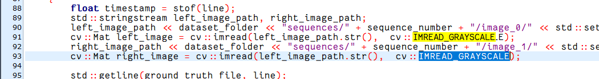

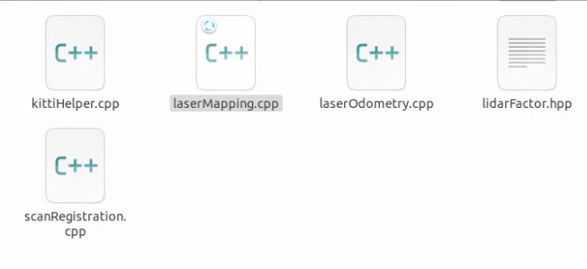

```bash
sudo apt-get install libgflags-dev libgoogle-glog-dev
sudo apt-get install libsuitesparse-dev libcxsparse3 libcxsparse-dev
```

Step 2: Install PCL.

```bash
sudo apt install libpcl-dev
```

Step 3: Install Ceres.

```bash
wget ceres-solver.org/ceres-solver-1.14.0.tar.gz
tar xvf ceres-solver-1.14.0.tar.gz
cd ceres-solver-1.14.0
mkdir build
cd build
cmake ..
make -j4
sudo make install
```

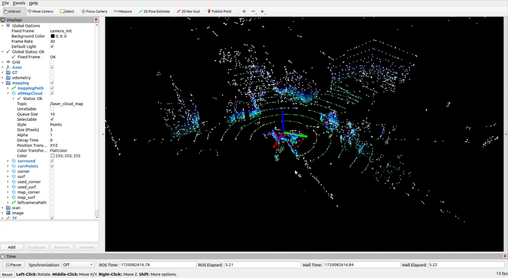
